# 动作系统

<cite>
**本文档中引用的文件**  
- [action.rs](file://src/core/action.rs)
- [command.rs](file://src/core/action/command.rs)
- [attack_reset.rs](file://src/core/action/attack_reset.rs)
- [buff.rs](file://src/core/action/buff.rs)
- [damage.rs](file://src/core/action/damage.rs)
- [dash.rs](file://src/core/action/dash.rs)
- [particle.rs](file://src/core/action/particle.rs)
- [animation.rs](file://src/core/action/animation.rs)
- [attack_auto.rs](file://src/core/attack_auto.rs)
- [run.rs](file://src/core/run.rs)
- [movement.rs](file://src/core/movement.rs)
- [attack.rs](file://src/core/attack.rs)
- [skin/particle.rs](file://src/core/skin/particle.rs)
- [damage.rs](file://src/core/damage.rs)
- [ui.rs](file://src/core/ui.rs)
- [base/state.rs](file://src/core/base/state.rs)
</cite>

## 目录
1. [简介](#简介)
2. [动作系统架构](#动作系统架构)
3. [CommandAction事件驱动机制](#commandaction事件驱动机制)
4. [核心动作系统分析](#核心动作系统分析)
5. [动作系统集成与执行流程](#动作系统集成与执行流程)
6. [性能优化策略](#性能优化策略)
7. [常见问题与调试建议](#常见问题与调试建议)
8. [结论](#结论)

## 简介
本文档深入解析基于Bevy ECS框架的动作系统设计与实现。该系统采用事件驱动架构，通过CommandAction机制在不同系统间传递行为指令，实现了攻击重置、伤害计算、位移（Dash）、增益/减益（Buff）等游戏动作的高效处理。文档将详细阐述动作命令的构造、分发与处理流程，以及动作系统与其他模块的集成方式。

## 动作系统架构
动作系统采用模块化设计，位于src/core/action/目录下，包含多个专门处理特定动作类型的模块。系统通过Bevy的观察者模式（Observer Pattern）实现事件驱动，确保动作指令能够高效地在不同系统间传递和执行。

```mermaid
graph TB
subgraph "动作系统模块"
A[CommandAction] --> B[攻击重置]
A --> C[伤害计算]
A --> D[位移(Dash)]
A --> E[增益/减益(Buff)]
A --> F[粒子效果]
A --> G[动画播放]
end
subgraph "核心系统"
H[动作插件] --> I[事件分发]
I --> J[动作处理]
end
A --> H
B --> J
C --> J
D --> J
E --> J
F --> J
G --> J
```

**图源**  
- [action.rs](file://src/core/action.rs#L1-L97)

**本节来源**  
- [action.rs](file://src/core/action.rs#L1-L97)

## CommandAction事件驱动机制
CommandAction是动作系统的核心事件，负责在系统间传递行为指令。该机制通过EntityEvent特性实现，确保事件能够被正确地分发和处理。

### CommandAction结构
CommandAction事件包含两个关键字段：entity（执行动作的实体）和action（具体动作指令）。动作指令通过Action枚举类型定义，支持多种游戏行为。

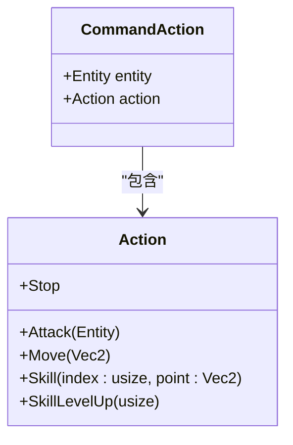

**图源**  
- [action.rs](file://src/core/action.rs#L43-L56)

### 事件分发流程
当CommandAction事件被触发时，on_command_action系统会根据动作类型分发相应的命令事件。这种设计实现了动作指令的统一入口和分发机制。

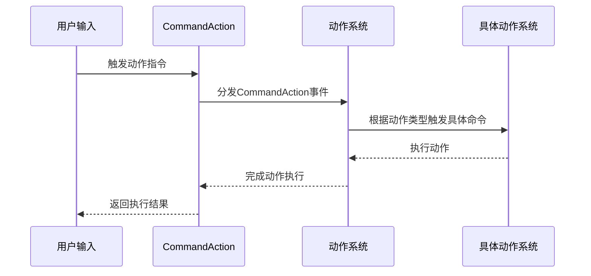

**图源**  
- [action.rs](file://src/core/action.rs#L58-L95)

**本节来源**  
- [action.rs](file://src/core/action.rs#L43-L96)

## 核心动作系统分析
### 攻击重置系统
攻击重置系统通过ActionAttackReset动作实现，当触发时会重置实体的攻击状态并重新开始攻击。

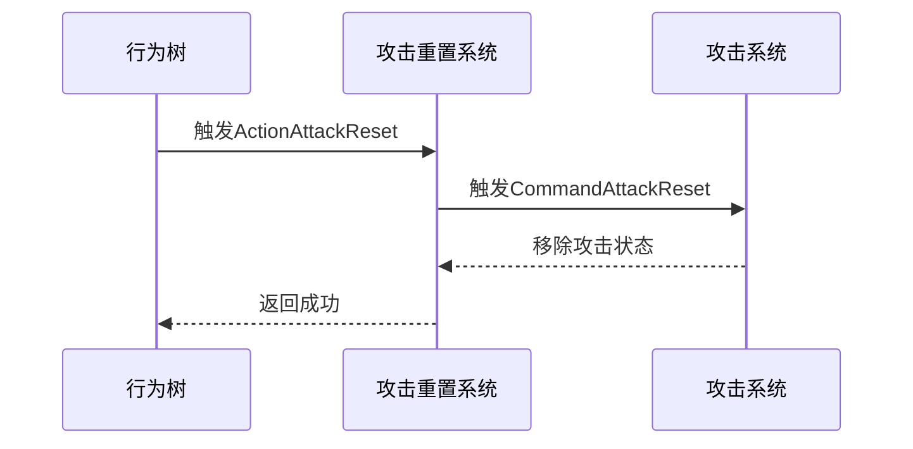

**图源**  
- [attack_reset.rs](file://src/core/action/attack_reset.rs#L6-L20)

### 伤害计算系统
伤害计算系统通过ActionDamage动作实现，负责处理攻击伤害的计算和应用。

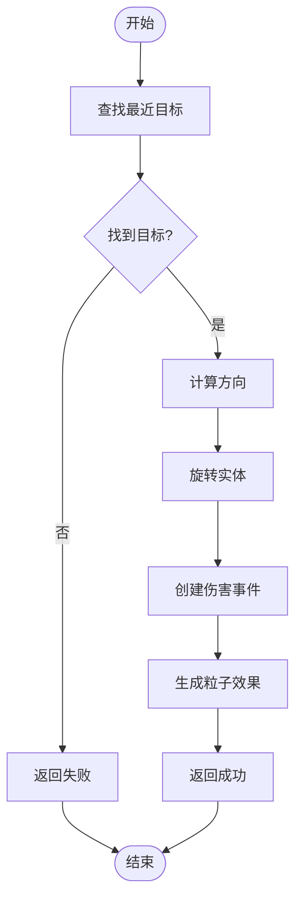

**图源**  
- [damage.rs](file://src/core/action/damage.rs#L8-L64)

### 位移(Dash)系统
位移系统通过ActionDash枚举实现，支持固定距离和指向性位移两种模式。

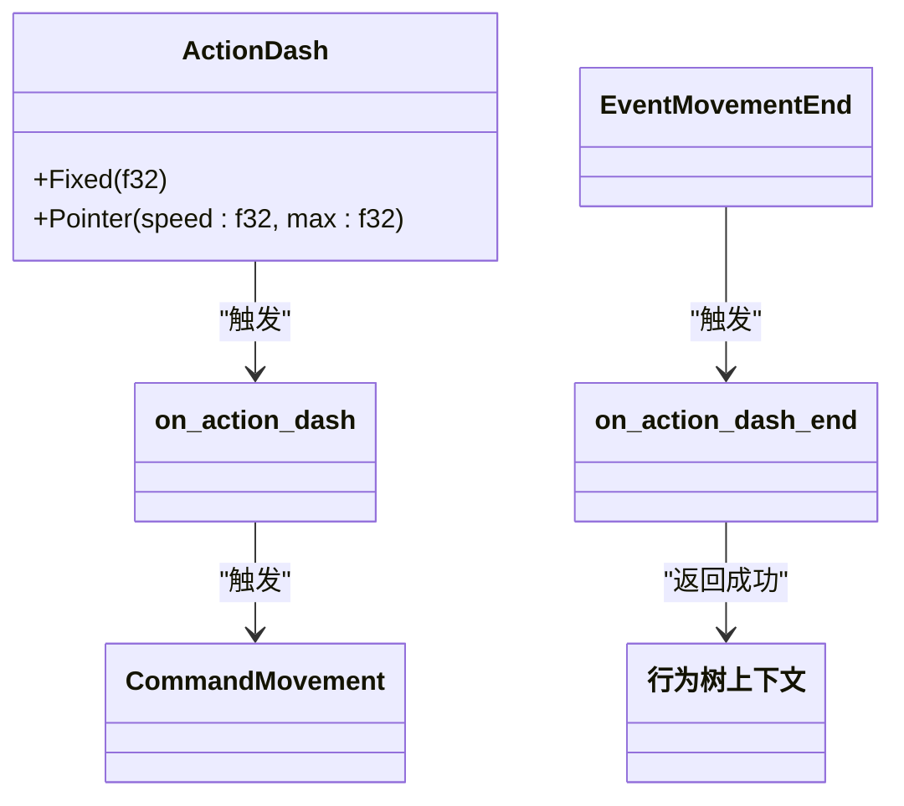

**图源**  
- [dash.rs](file://src/core/action/dash.rs#L9-L73)

### 增益/减益(Buff)系统
Buff系统通过ActionBuffSpawn动作实现，使用函数指针模式动态应用Buff效果。

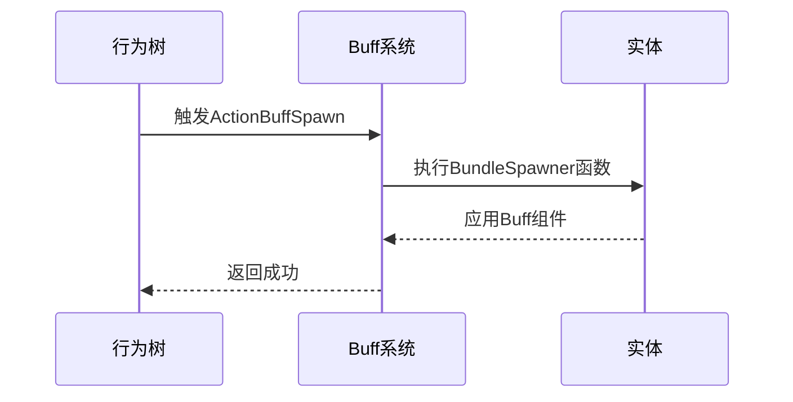

**图源**  
- [buff.rs](file://src/core/action/buff.rs#L8-L21)

### 粒子效果系统
粒子效果系统通过ActionParticleSpawn和ActionParticleDespawn动作实现，控制角色皮肤相关粒子的生成和销毁。

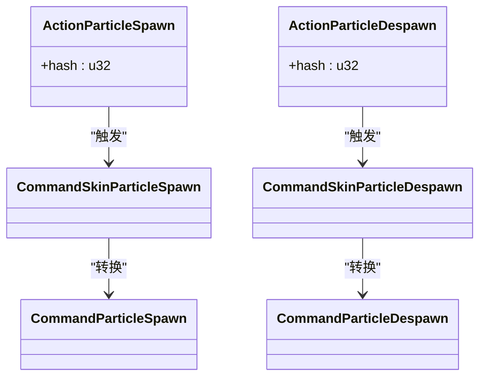

**图源**  
- [particle.rs](file://src/core/action/particle.rs#L6-L44)
- [skin/particle.rs](file://src/core/skin/particle.rs#L7-L98)

### 动画播放系统
动画播放系统通过ActionAnimationPlay动作实现，控制角色动画的播放。

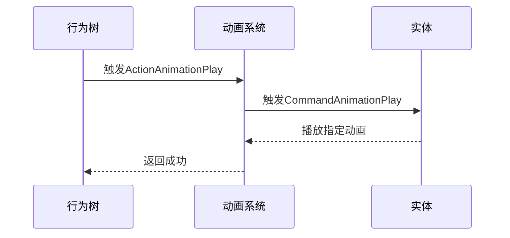

**图源**  
- [animation.rs](file://src/core/action/animation.rs#L6-L26)

**本节来源**  
- [attack_reset.rs](file://src/core/action/attack_reset.rs#L6-L20)
- [damage.rs](file://src/core/action/damage.rs#L8-L64)
- [dash.rs](file://src/core/action/dash.rs#L9-L73)
- [buff.rs](file://src/core/action/buff.rs#L8-L21)
- [particle.rs](file://src/core/action/particle.rs#L6-L44)
- [animation.rs](file://src/core/action/animation.rs#L6-L26)

## 动作系统集成与执行流程
### 与其他模块的集成
动作系统与多个核心模块紧密集成，形成完整的游戏行为处理链。

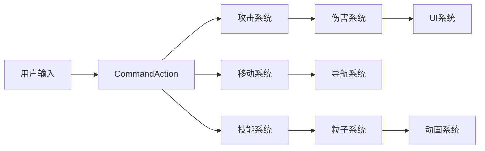

**图源**  
- [action.rs](file://src/core/action.rs#L27-L40)
- [attack_auto.rs](file://src/core/attack_auto.rs#L11-L17)
- [run.rs](file://src/core/run.rs#L8-L15)

### 执行顺序分析
动作系统在游戏循环中的执行顺序经过精心设计，确保各系统按正确顺序处理事件。

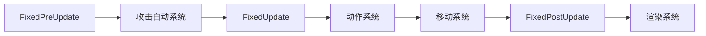

**图源**  
- [attack_auto.rs](file://src/core/attack_auto.rs#L16)
- [run.rs](file://src/core/run.rs#L10)
- [movement.rs](file://src/core/movement.rs#L24-L31)

### 状态管理集成
动作系统与状态管理系统集成，确保实体状态的正确更新。

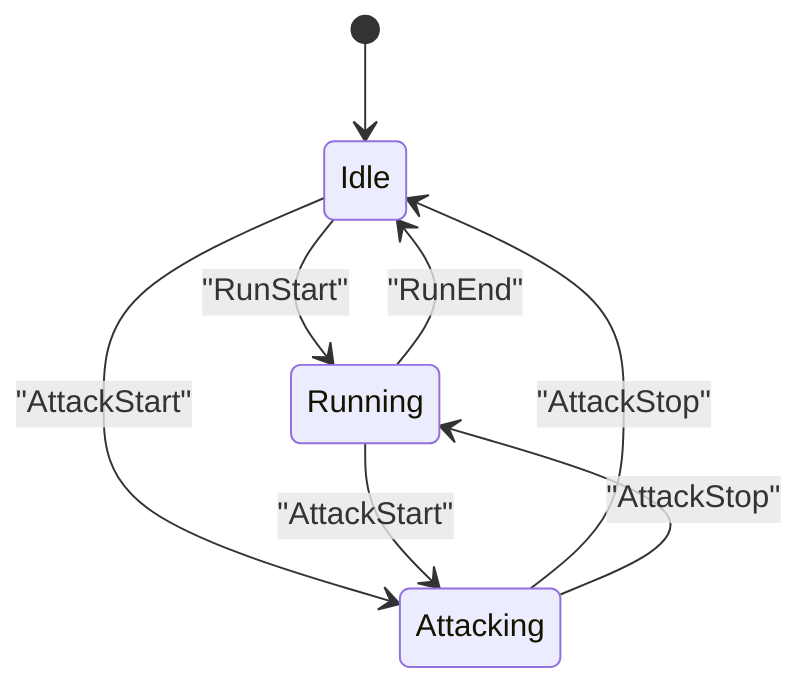

**图源**  
- [base/state.rs](file://src/core/base/state.rs#L16-L52)

**本节来源**  
- [action.rs](file://src/core/action.rs#L27-L40)
- [attack_auto.rs](file://src/core/attack_auto.rs#L11-L17)
- [run.rs](file://src/core/run.rs#L8-L15)
- [movement.rs](file://src/core/movement.rs#L24-L31)
- [base/state.rs](file://src/core/base/state.rs#L16-L52)

## 性能优化策略
### 事件驱动优化
采用Bevy的观察者模式替代传统的查询系统，显著提升事件处理性能。

### 批量处理
通过RequestBuffer和FinalDecision机制实现命令的批量处理和优先级管理。

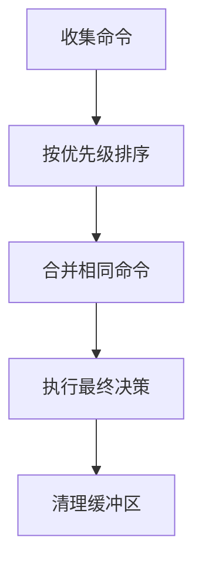

**图源**  
- [movement.rs](file://src/core/movement.rs#L248-L300)

### 资源预加载
粒子效果系统采用资源预加载机制，避免运行时资源查找开销。

### 计算优化
伤害计算系统使用平方距离比较替代开方运算，提升性能。

```rust
// 优化前
let distance = pos.distance(target_pos);
if distance < required_range { ... }

// 优化后
let dist_sq = pos.distance_squared(target_pos);
let required_range_sq = required_range * required_range;
if dist_sq < required_range_sq { ... }
```

**本节来源**  
- [movement.rs](file://src/core/movement.rs#L248-L300)
- [attack_auto.rs](file://src/core/attack_auto.rs#L135-L138)

## 常见问题与调试建议
### 动作冲突
当多个系统同时尝试控制同一实体时可能发生动作冲突。

**解决方案**：
- 使用优先级系统管理动作冲突
- 确保高优先级动作能够中断低优先级动作
- 在on_command_action中正确处理动作优先级

### 命令丢失
在网络同步或快速连续输入情况下可能出现命令丢失。

**解决方案**：
- 实现命令缓冲机制
- 使用RequestBuffer确保命令不被遗漏
- 添加命令去重逻辑

### 调试技巧
- 启用NavigationDebug查看寻路过程
- 使用EventMovementEnd事件监控移动完成状态
- 通过FinalDecision组件检查最终执行的命令

**本节来源**  
- [movement.rs](file://src/core/movement.rs#L248-L300)
- [navigation.rs](file://src/core/navigation/navigation.rs)
- [debug.rs](file://src/core/debug.rs)

## 结论
基于Bevy ECS的动作系统通过CommandAction事件驱动机制，实现了高效、灵活的游戏行为处理。系统采用模块化设计，各动作类型独立处理，便于扩展和维护。通过与攻击、移动、技能等系统的紧密集成，形成了完整的游戏行为处理链。性能优化策略确保了系统在高并发场景下的稳定运行。该设计模式为复杂游戏逻辑的实现提供了可靠的基础设施。