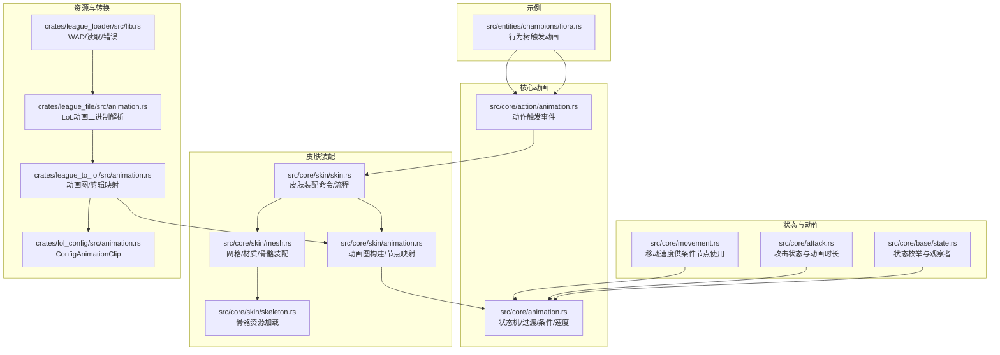
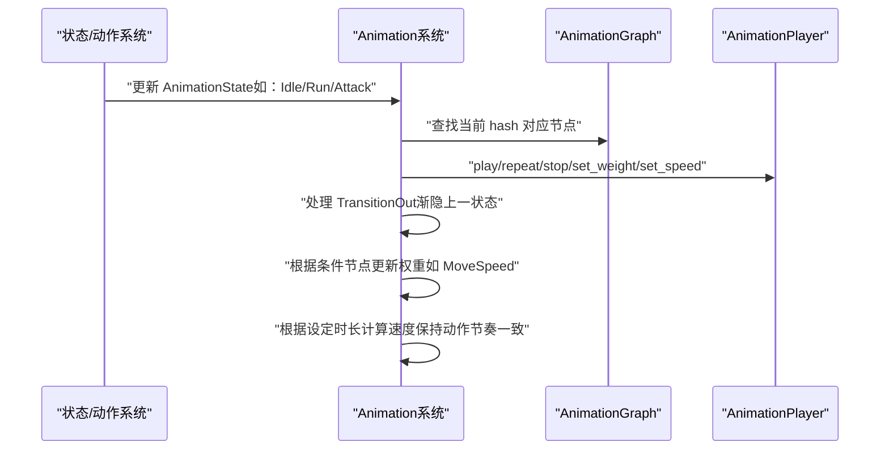
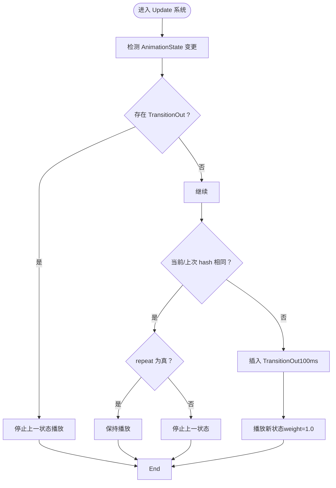
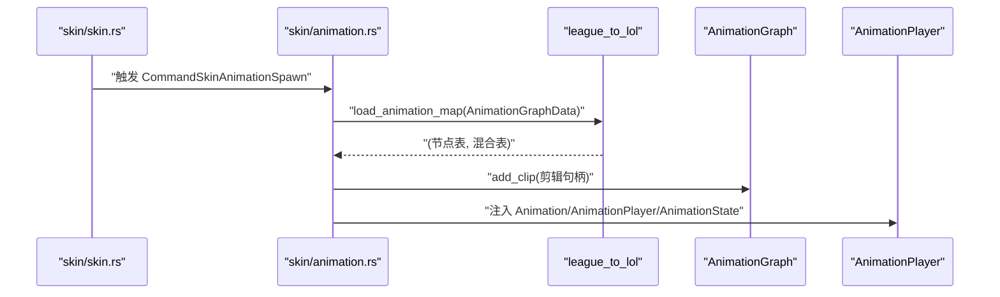
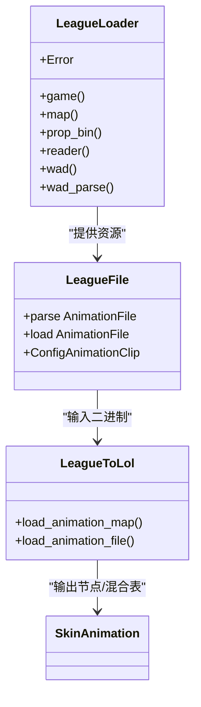
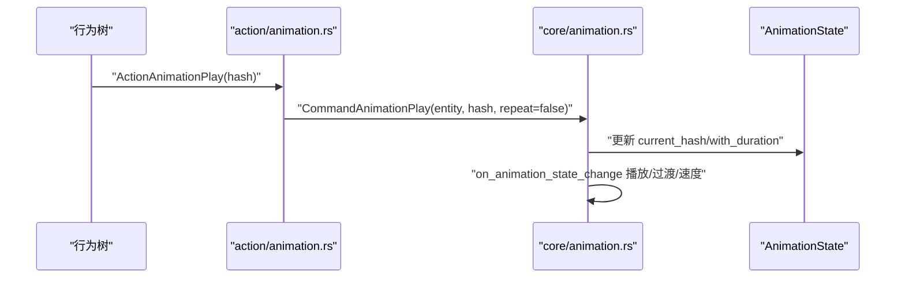
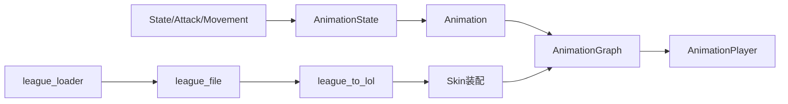

# 动画系统

<cite>
**本文引用的文件**
- [src/core/animation.rs](file://src/core/animation.rs)
- [src/core/skin/animation.rs](file://src/core/skin/animation.rs)
- [src/core/skin/skin.rs](file://src/core/skin/skin.rs)
- [src/core/skin/mesh.rs](file://src/core/skin/mesh.rs)
- [src/core/skin/skeleton.rs](file://src/core/skin/skeleton.rs)
- [src/core/action/animation.rs](file://src/core/action/animation.rs)
- [src/core/base/state.rs](file://src/core/base/state.rs)
- [src/core/attack.rs](file://src/core/attack.rs)
- [src/core/movement.rs](file://src/core/movement.rs)
- [crates/league_file/src/animation.rs](file://crates/league_file/src/animation.rs)
- [crates/league_to_lol/src/animation.rs](file://crates/league_to_lol/src/animation.rs)
- [crates/lol_config/src/animation.rs](file://crates/lol_config/src/animation.rs)
- [crates/league_loader/src/lib.rs](file://crates/league_loader/src/lib.rs)
- [src/entities/champions/fiora.rs](file://src/entities/champions/fiora.rs)
</cite>

## 目录
1. [简介](#简介)
2. [项目结构](#项目结构)
3. [核心组件](#核心组件)
4. [架构总览](#架构总览)
5. [详细组件分析](#详细组件分析)
6. [依赖关系分析](#依赖关系分析)
7. [性能考量](#性能考量)
8. [故障排查指南](#故障排查指南)
9. [结论](#结论)
10. [附录](#附录)

## 简介
本文件系统性介绍动画系统的集成与控制机制，重点覆盖以下方面：
- animation.rs 如何驱动角色模型的动画状态机，包括动画播放、切换与混合的实现原理
- 皮肤模块中的动画处理（skin/animation.rs）如何与资源加载器（league_loader）协作，加载并应用 LoL 原版动画数据
- 动作系统如何触发特定动画（如攻击、移动），并通过事件机制同步状态
- 动画资源绑定、状态过渡配置和性能优化的实践指南
- 针对动画不同步、播放异常等问题的诊断方法

## 项目结构
动画系统由“核心动画逻辑”“皮肤装配管线”“动作与状态联动”“资源加载与转换”四部分组成，围绕 Bevy 的 ECS 与 AnimationGraph 进行组织。

图表来源
- [src/core/animation.rs](file://src/core/animation.rs#L1-L514)
- [src/core/skin/animation.rs](file://src/core/skin/animation.rs#L1-L188)
- [src/core/skin/skin.rs](file://src/core/skin/skin.rs#L1-L74)
- [src/core/skin/mesh.rs](file://src/core/skin/mesh.rs#L1-L77)
- [src/core/skin/skeleton.rs](file://src/core/skin/skeleton.rs#L1-L48)
- [src/core/action/animation.rs](file://src/core/action/animation.rs#L1-L27)
- [src/core/base/state.rs](file://src/core/base/state.rs#L1-L53)
- [src/core/attack.rs](file://src/core/attack.rs#L1-L442)
- [src/core/movement.rs](file://src/core/movement.rs#L1-L445)
- [crates/league_loader/src/lib.rs](file://crates/league_loader/src/lib.rs#L1-L27)
- [crates/league_file/src/animation.rs](file://crates/league_file/src/animation.rs#L1-L485)
- [crates/league_to_lol/src/animation.rs](file://crates/league_to_lol/src/animation.rs#L1-L228)
- [crates/lol_config/src/animation.rs](file://crates/lol_config/src/animation.rs#L1-L13)
- [src/entities/champions/fiora.rs](file://src/entities/champions/fiora.rs#L1-L159)

章节来源
- [src/core/animation.rs](file://src/core/animation.rs#L1-L514)
- [src/core/skin/animation.rs](file://src/core/skin/animation.rs#L1-L188)
- [src/core/skin/skin.rs](file://src/core/skin/skin.rs#L1-L74)
- [src/core/skin/mesh.rs](file://src/core/skin/mesh.rs#L1-L77)
- [src/core/skin/skeleton.rs](file://src/core/skin/skeleton.rs#L1-L48)
- [src/core/action/animation.rs](file://src/core/action/animation.rs#L1-L27)
- [src/core/base/state.rs](file://src/core/base/state.rs#L1-L53)
- [src/core/attack.rs](file://src/core/attack.rs#L1-L442)
- [src/core/movement.rs](file://src/core/movement.rs#L1-L445)
- [crates/league_loader/src/lib.rs](file://crates/league_loader/src/lib.rs#L1-L27)
- [crates/league_file/src/animation.rs](file://crates/league_file/src/animation.rs#L1-L485)
- [crates/league_to_lol/src/animation.rs](file://crates/league_to_lol/src/animation.rs#L1-L228)
- [crates/lol_config/src/animation.rs](file://crates/lol_config/src/animation.rs#L1-L13)
- [src/entities/champions/fiora.rs](file://src/entities/champions/fiora.rs#L1-L159)

## 核心组件
- 动画状态机与播放控制：在核心层维护 Animation、AnimationState、AnimationTransitionOut 等组件，通过系统驱动播放、重复、停止、权重与速度。
- 条件与混合：支持 ConditionFloat、Selector、Sequence、ConditionBool 等节点，按参数值动态选择分支或按概率选择剪辑。
- 皮肤装配：从皮肤资源键加载皮肤属性，再依次装配骨骼、网格、材质与动画图。
- 资源加载与转换：league_loader 提供 WAD/读取能力；league_file 解析 LoL 动画二进制；league_to_lol 将动画图与剪辑映射为可运行的 AnimationGraph。

章节来源
- [src/core/animation.rs](file://src/core/animation.rs#L1-L514)
- [src/core/skin/animation.rs](file://src/core/skin/animation.rs#L1-L188)
- [crates/league_file/src/animation.rs](file://crates/league_file/src/animation.rs#L1-L485)
- [crates/league_to_lol/src/animation.rs](file://crates/league_to_lol/src/animation.rs#L1-L228)

## 架构总览
动画系统以“状态驱动 + 节点图 + 资源转换”的方式工作：
- 状态驱动：State、Attack、Movement 等组件变化触发 AnimationState 更新，进而驱动 Animation 系统播放/过渡。
- 节点图：skin/animation.rs 将 LoL 动画图数据映射为 AnimationGraph 节点，支持剪辑、条件、选择器、序列器等。
- 资源转换：league_to_lol 将 AnimationGraphData 映射为节点表与混合表；league_file 解析 r3d2canm/r3d2anmd，生成 ConfigAnimationClip。

图表来源
- [src/core/animation.rs](file://src/core/animation.rs#L285-L514)
- [src/core/skin/animation.rs](file://src/core/skin/animation.rs#L45-L188)

## 详细组件分析

### 核心动画状态机（animation.rs）
- 状态与事件
  - AnimationState：记录当前/上次动画 hash、是否循环、持续时长
  - CommandAnimationPlay：外部触发播放指定 hash 的动画
  - AnimationTransitionOut：过渡期的权重与持续时间
- 节点与混合
  - AnimationNode：支持 Clip、ConditionFloat、Selector、Sequence、ConditionBool
  - BlendData：用于节点间混合（由 league_to_lol 转换）
- 播放与过渡
  - on_state_change：基于 State/Attack 更新 AnimationState
  - on_animation_state_change：处理播放、重复、过渡
  - update_transition_out：按时间线性衰减上一状态权重
  - update_condition_animation：根据 Movement.speed 选择条件节点权重
  - apply_animation_speed：根据剪辑时长与设定时长计算播放速度

图表来源
- [src/core/animation.rs](file://src/core/animation.rs#L325-L395)

章节来源
- [src/core/animation.rs](file://src/core/animation.rs#L1-L514)

### 皮肤动画装配（skin/animation.rs）
- 装配流程
  - on_command_skin_animation_spawn：根据 Skin.key 加载 SkinCharacterDataProperties，触发 Loading
  - update_skin_animation_spawn：加载 AnimationGraphData，调用 league_to_lol::load_animation_map，构建 AnimationGraph 并注入 Animation、AnimationPlayer、AnimationState
  - build_animation_nodes：将 EnumClipData 映射为 AnimationGraph 节点，支持 AtomicClip、ConditionFloat、Selector、Sequencer、ConditionBool；并内置 Attack 选择器
- 资源绑定
  - 通过 AssetServer 加载动画剪辑文件路径
  - 通过 AnimationGraph.add_clip 注入剪辑
  - 通过 hash_to_node 建立 hash 到节点索引的映射

图表来源
- [src/core/skin/skin.rs](file://src/core/skin/skin.rs#L28-L73)
- [src/core/skin/animation.rs](file://src/core/skin/animation.rs#L22-L86)
- [crates/league_to_lol/src/animation.rs](file://crates/league_to_lol/src/animation.rs#L1-L32)

章节来源
- [src/core/skin/animation.rs](file://src/core/skin/animation.rs#L1-L188)
- [src/core/skin/skin.rs](file://src/core/skin/skin.rs#L1-L74)
- [crates/league_to_lol/src/animation.rs](file://crates/league_to_lol/src/animation.rs#L1-L228)

### 资源加载与转换（league_loader、league_file、league_to_lol）
- league_loader：导出游戏/地图/WAD/读取等模块，提供统一错误类型
- league_file：解析 LoL 动画二进制格式（压缩/非压缩），输出 ConfigAnimationClip（fps、duration、joint_hashes、transforms）
- league_to_lol：将 AnimationGraphData 转换为节点表与混合表；将 AnimationFile 转换为 ConfigAnimationClip

图表来源
- [crates/league_loader/src/lib.rs](file://crates/league_loader/src/lib.rs#L1-L27)
- [crates/league_file/src/animation.rs](file://crates/league_file/src/animation.rs#L1-L485)
- [crates/league_to_lol/src/animation.rs](file://crates/league_to_lol/src/animation.rs#L1-L228)

章节来源
- [crates/league_loader/src/lib.rs](file://crates/league_loader/src/lib.rs#L1-L27)
- [crates/league_file/src/animation.rs](file://crates/league_file/src/animation.rs#L1-L485)
- [crates/league_to_lol/src/animation.rs](file://crates/league_to_lol/src/animation.rs#L1-L228)
- [crates/lol_config/src/animation.rs](file://crates/lol_config/src/animation.rs#L1-L13)

### 动作系统与事件联动（action/animation.rs）
- 行为树触发：示例中通过行为树触发 ActionAnimationPlay，内部将触发 CommandAnimationPlay，最终由 Animation 系统更新 AnimationState 并播放对应动画
- 与攻击联动：Attack 提供 animation_duration，用于在攻击状态下设置 AnimationState 的持续时长，确保动画节奏与攻击周期一致

图表来源
- [src/core/action/animation.rs](file://src/core/action/animation.rs#L1-L27)
- [src/core/animation.rs](file://src/core/animation.rs#L285-L366)
- [src/core/attack.rs](file://src/core/attack.rs#L162-L169)

章节来源
- [src/core/action/animation.rs](file://src/core/action/animation.rs#L1-L27)
- [src/core/attack.rs](file://src/core/attack.rs#L1-L442)
- [src/entities/champions/fiora.rs](file://src/entities/champions/fiora.rs#L1-L159)

### 状态与条件（state.rs、movement.rs、attack.rs）
- State：Idle/Running/Attacking 三种状态，分别映射到不同的动画 hash
- Movement：提供 speed，作为 ConditionFloat 的参数，驱动移动速度条件节点
- Attack：提供 animation_duration，用于在攻击时设置 AnimationState 的持续时长，保证动画与攻击节奏一致

章节来源
- [src/core/base/state.rs](file://src/core/base/state.rs#L1-L53)
- [src/core/movement.rs](file://src/core/movement.rs#L1-L445)
- [src/core/attack.rs](file://src/core/attack.rs#L1-L442)

## 依赖关系分析
- 组件耦合
  - AnimationState 与 Animation 通过系统解耦，仅通过 ECS 变更触发
  - Animation 与 AnimationGraph/AnimationPlayer 通过 Bevy Animation API 协作
- 外部依赖
  - league_loader 提供资源访问接口
  - league_file 解析二进制动画数据
  - league_to_lol 负责数据结构转换
- 潜在环依赖
  - 当前模块划分清晰，未见直接循环依赖

图表来源
- [src/core/animation.rs](file://src/core/animation.rs#L1-L514)
- [src/core/skin/animation.rs](file://src/core/skin/animation.rs#L1-L188)
- [crates/league_loader/src/lib.rs](file://crates/league_loader/src/lib.rs#L1-L27)
- [crates/league_file/src/animation.rs](file://crates/league_file/src/animation.rs#L1-L485)
- [crates/league_to_lol/src/animation.rs](file://crates/league_to_lol/src/animation.rs#L1-L228)

章节来源
- [src/core/animation.rs](file://src/core/animation.rs#L1-L514)
- [src/core/skin/animation.rs](file://src/core/skin/animation.rs#L1-L188)
- [crates/league_loader/src/lib.rs](file://crates/league_loader/src/lib.rs#L1-L27)
- [crates/league_file/src/animation.rs](file://crates/league_file/src/animation.rs#L1-L485)
- [crates/league_to_lol/src/animation.rs](file://crates/league_to_lol/src/animation.rs#L1-L228)

## 性能考量
- 资源加载
  - 使用 AssetServer 异步加载动画剪辑与动画图，避免阻塞主线程
  - 在 update_skin_animation_spawn 中集中构建 AnimationGraph，减少重复创建
- 播放控制
  - 通过 apply_animation_speed 将剪辑时长与设定时长对齐，避免手动调节速度导致的卡顿感
  - TransitionOut 使用短时长（100ms）线性衰减，降低视觉突兀
- 条件节点
  - ConditionFloat 仅在需要时更新权重，避免频繁写入
- 批量操作
  - Animation.play/repeat/stop/set_weight/set_speed 都按节点集合批量执行，减少系统调用次数

章节来源
- [src/core/animation.rs](file://src/core/animation.rs#L368-L514)
- [src/core/skin/animation.rs](file://src/core/skin/animation.rs#L45-L188)

## 故障排查指南
- 动画不同步
  - 检查 AnimationState 的 current_duration 是否正确设置（如 Attack.animation_duration）
  - 确认 apply_animation_speed 已根据剪辑时长计算速度
  - 排查 TransitionOut 是否过早移除或权重未按比例衰减
- 播放异常（卡住/不播放）
  - 确认 AnimationGraph 节点已成功 add_clip，且 hash_to_node 映射正确
  - 检查 Selector/Sequence 是否正确初始化 current_index
  - 确保 AnimationPlayer 已注入 Animation 与 AnimationGraphHandle
- 条件节点无效
  - 确认 Movement 组件存在且 speed 更新正常
  - 检查 ConditionFloat 的 updater 是否为 MoveSpeedParametricUpdater
- 资源加载失败
  - 检查 SkinCharacterDataProperties 的 key 是否正确
  - 确认 league_loader 能读取到 WAD/文件路径
  - 检查 league_file 解析版本与格式是否匹配

章节来源
- [src/core/animation.rs](file://src/core/animation.rs#L285-L514)
- [src/core/skin/animation.rs](file://src/core/skin/animation.rs#L45-L188)
- [crates/league_loader/src/lib.rs](file://crates/league_loader/src/lib.rs#L1-L27)
- [crates/league_file/src/animation.rs](file://crates/league_file/src/animation.rs#L1-L485)

## 结论
该动画系统通过“状态驱动 + 节点图 + 资源转换”的分层设计，实现了 LoL 原版动画数据在 Bevy 中的高效复用与可控扩展。核心层负责状态机与播放控制，皮肤层负责装配与节点映射，动作层通过事件与状态联动触发具体动画，资源层提供稳定的数据解析与转换。配合条件节点与速度/权重控制，系统能够实现流畅的动画切换与混合，满足战斗节奏与表现需求。

## 附录
- 实践建议
  - 动画资源绑定：在 skin/animation.rs 中统一管理节点映射，避免散落的硬编码
  - 状态过渡配置：合理设置 TransitionOut 持续时间与权重衰减，提升观感一致性
  - 性能优化：批量操作 AnimationPlayer，延迟加载动画图，避免频繁重建
  - 诊断方法：优先检查 AnimationState 的 current_duration 与 AnimationGraph 的节点映射