# 技能系统

<cite>
**本文档引用的文件**
- [fiora_passive.rs](file://src/abilities/fiora_passive.rs)
- [fiora_e.rs](file://src/abilities/fiora_e.rs)
- [fiora_r.rs](file://src/abilities/fiora_r.rs)
- [fiora.rs](file://src/entities/champions/fiora.rs)
- [skill.rs](file://src/core/skill.rs)
- [action.rs](file://src/core/action.rs)
- [animation.rs](file://src/core/animation.rs)
- [cooldown.rs](file://src/core/cooldown.rs)
- [damage.rs](file://src/core/damage.rs)
- [particle.rs](file://src/core/particle.rs)
- [state.rs](file://src/core/base/state.rs)
- [buff.rs](file://src/core/base/buff.rs)
- [ui/skill.rs](file://src/core/ui/skill.rs)
</cite>

## 目录
1. [技能系统架构概述](#技能系统架构概述)
2. [核心组件分析](#核心组件分析)
3. [技能类型实现详解](#技能类型实现详解)
4. [技能与动作系统交互机制](#技能与动作系统交互机制)
5. [技能配置与自定义开发](#技能配置与自定义开发)
6. [常见问题与解决方案](#常见问题与解决方案)
7. [总结](#总结)

## 技能系统架构概述

本技能系统基于Bevy ECS架构设计，采用模块化插件系统，实现了技能冷却管理、施放逻辑、状态维护等核心功能。系统通过统一的接口注册机制，支持不同类型的技能（主动技能、被动技能、大招等）注册并响应玩家或AI指令。

技能系统的核心架构包括：
- **技能注册与管理**：通过`Skill`组件和`Skills`关系组件管理角色的技能集合
- **冷却系统**：基于`CoolDown`组件和`PluginCooldown`插件实现技能冷却计时
- **行为树执行**：使用`bevy_behave`库实现技能效果的行为树驱动
- **事件驱动机制**：通过Bevy的事件系统实现技能施放、升级等操作的触发与响应

系统通过`PluginSkill`插件初始化技能相关组件和系统，并注册技能施放、升级等事件的监听器。

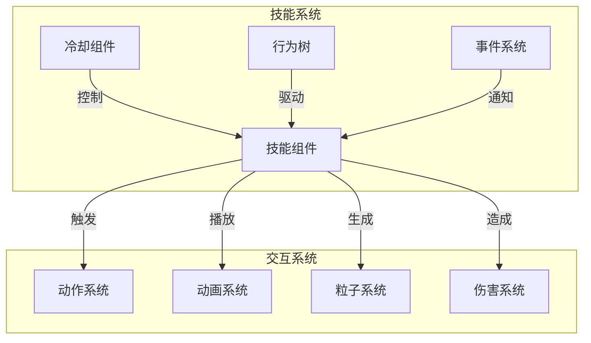

**图示来源**
- [skill.rs](file://src/core/skill.rs)
- [action.rs](file://src/core/action.rs)
- [animation.rs](file://src/core/animation.rs)
- [particle.rs](file://src/core/particle.rs)
- [damage.rs](file://src/core/damage.rs)

## 核心组件分析

### 技能组件结构

技能系统的核心组件包括`Skill`、`CoolDown`、`Skills`等，它们共同构成了技能的基础数据结构。

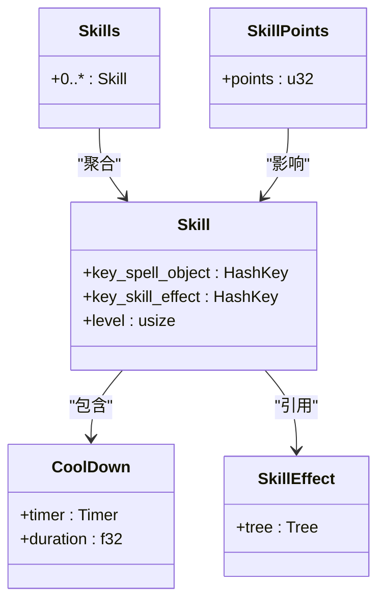

**图示来源**
- [skill.rs](file://src/core/skill.rs#L50-L72)
- [fiora.rs](file://src/entities/champions/fiora.rs#L137-L155)

### 技能事件系统

技能系统通过事件驱动机制实现技能的施放和升级操作，主要包括`CommandSkillStart`和`CommandSkillLevelUp`两个核心事件。

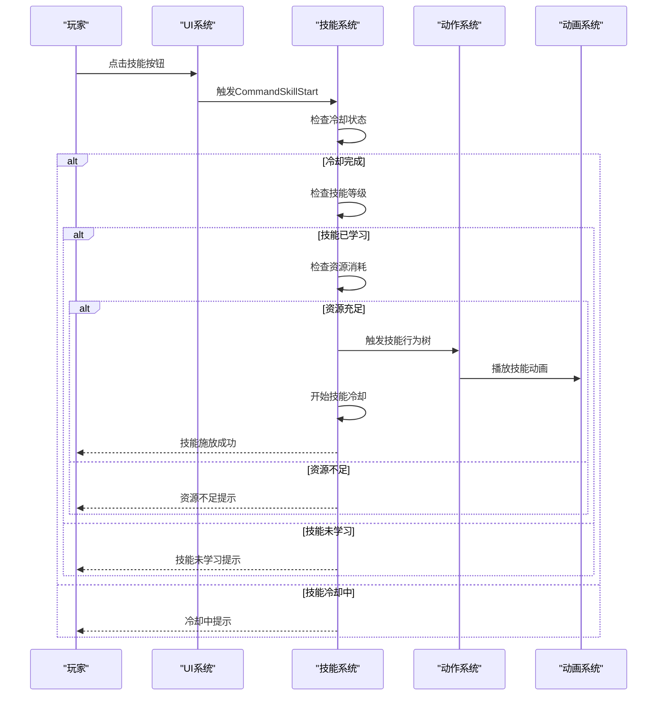

**图示来源**
- [skill.rs](file://src/core/skill.rs#L94-L177)
- [action.rs](file://src/core/action.rs#L43-L96)
- [animation.rs](file://src/core/animation.rs#L50-L56)

## 技能类型实现详解

### 菲奥娜被动技能实现

菲奥娜的被动技能通过`PluginFioraPassive`插件实现，主要功能包括破绽生成、破绽移除和破绽命中处理。

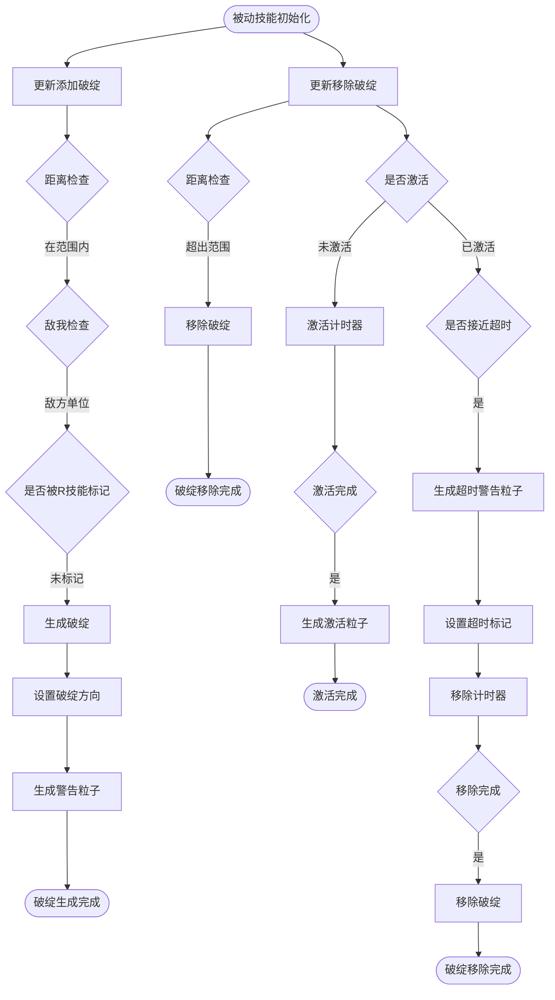

**图示来源**
- [fiora_passive.rs](file://src/abilities/fiora_passive.rs#L24-L231)
- [fiora.rs](file://src/entities/champions/fiora.rs#L137-L145)

### 菲奥娜E技能实现

菲奥娜的E技能通过`PluginFioraE`插件实现，主要功能是攻击重置和攻击速度加成。

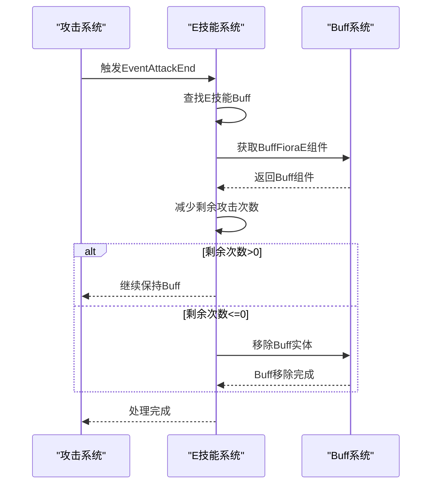

**图示来源**
- [fiora_e.rs](file://src/abilities/fiora_e.rs#L8-L42)
- [fiora.rs](file://src/entities/champions/fiora.rs#L86-L95)

### 菲奥娜R技能实现

菲奥娜的R技能通过`PluginFioraR`插件实现，主要功能包括破绽标记、破绽命中处理和治疗光环触发。

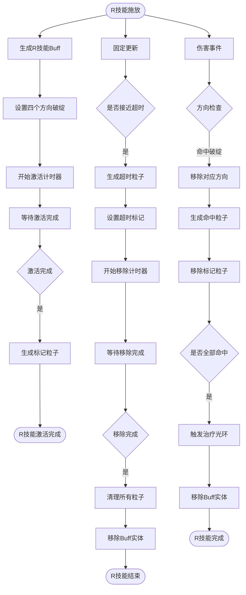

**图示来源**
- [fiora_r.rs](file://src/abilities/fiora_r.rs#L19-L200)
- [fiora.rs](file://src/entities/champions/fiora.rs#L113-L118)

## 技能与动作系统交互机制

### 命令分发机制

技能系统通过命令系统与动作系统、动画系统等进行交互，实现技能效果的执行。

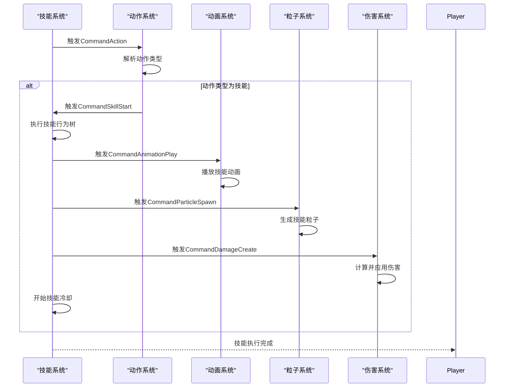

**图示来源**
- [action.rs](file://src/core/action.rs#L43-L96)
- [animation.rs](file://src/core/animation.rs#L50-L56)
- [particle.rs](file://src/core/particle.rs#L116-L126)
- [damage.rs](file://src/core/damage.rs#L38-L47)

### 状态变更机制

技能施放会触发角色状态的变更，系统通过状态组件和事件系统实现状态管理。

```mermaid
stateDiagram-v2
[*] --> Idle
Idle --> Running : "移动指令"
Running --> Idle : "移动结束"
Idle --> Attacking : "攻击指令"
Attacking --> Idle : "攻击结束"
Idle --> Casting : "技能施放"
Casting --> Idle : "技能完成"
Casting --> Interrupted : "技能中断"
Interrupted --> Idle : "恢复空闲"
classDef default fill : #ECEFF1,stroke : #37474F,stroke-width : 2px;
classDef active fill : #FFCC80,stroke : #EF6C00,stroke-width : 3px;
class Casting,Interrupted active
```

**图示来源**
- [state.rs](file://src/core/base/state.rs#L16-L22)
- [animation.rs](file://src/core/animation.rs#L285-L306)
- [action.rs](file://src/core/action.rs#L61-L89)

## 技能配置与自定义开发

### 技能配置方法

技能配置主要通过在角色插件中注册技能效果和初始化技能组件来实现。

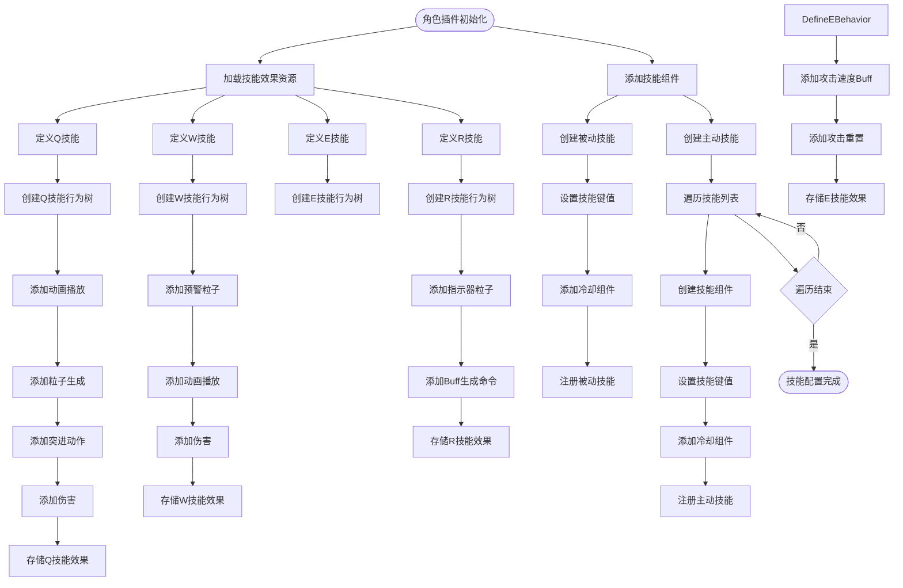

**图示来源**
- [fiora.rs](file://src/entities/champions/fiora.rs#L33-L157)
- [hwei.rs](file://src/entities/champions/hwei.rs#L26-L119)

### 自定义技能开发指南

开发自定义技能需要遵循以下步骤：

1. **创建技能插件**：实现`Plugin` trait，注册必要的系统和事件监听器
2. **定义技能组件**：创建技能特有的组件，用于存储技能状态
3. **实现技能逻辑**：编写技能的核心逻辑函数
4. **注册技能效果**：在角色插件中注册技能的行为树效果
5. **初始化技能组件**：在角色初始化时添加技能组件

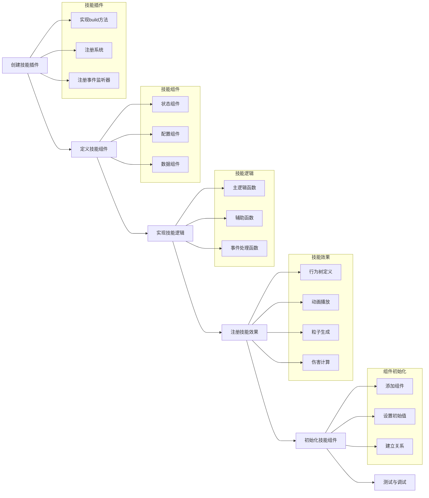

**图示来源**
- [fiora_passive.rs](file://src/abilities/fiora_passive.rs#L21-L31)
- [fiora_e.rs](file://src/abilities/fiora_e.rs#L6-L11)
- [fiora_r.rs](file://src/abilities/fiora_r.rs#L16-L23)
- [fiora.rs](file://src/entities/champions/fiora.rs#L21-L25)

## 常见问题与解决方案

### 技能冷却异常

技能冷却异常通常由以下原因引起：

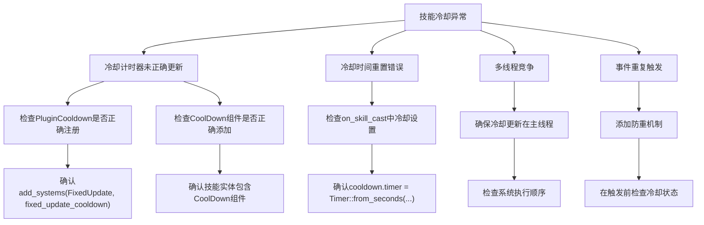

**图示来源**
- [cooldown.rs](file://src/core/cooldown.rs#L8-L18)
- [skill.rs](file://src/core/skill.rs#L171-L176)
- [fiora_passive.rs](file://src/abilities/fiora_passive.rs#L27-L28)

### 技能中断问题

技能中断问题的解决方案：

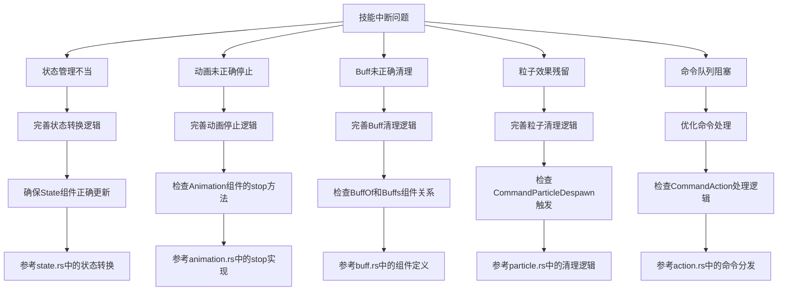

**图示来源**
- [state.rs](file://src/core/base/state.rs)
- [animation.rs](file://src/core/animation.rs#L220-L232)
- [buff.rs](file://src/core/base/buff.rs)
- [particle.rs](file://src/core/particle.rs#L297-L315)
- [action.rs](file://src/core/action.rs#L58-L96)

## 总结

本文档详细解析了技能系统的架构与实现，涵盖了技能冷却管理、施放逻辑、状态维护等核心功能。通过分析菲奥娜的被动、E技能和R技能的具体实现，展示了不同技能类型如何通过统一接口注册并响应玩家或AI指令。

技能系统与动作系统、动画系统之间的交互机制通过命令分发与状态变更实现，确保了技能效果的正确执行。文档还提供了技能配置方法和自定义技能开发指南，并分析了技能施放过程中的常见问题如冷却异常、技能中断等的解决方案。

系统设计遵循模块化原则，各组件职责清晰，便于扩展和维护。通过Bevy ECS架构和事件驱动机制，实现了高效、灵活的技能系统。

**文档来源**
- [fiora_passive.rs](file://src/abilities/fiora_passive.rs)
- [fiora_e.rs](file://src/abilities/fiora_e.rs)
- [fiora_r.rs](file://src/abilities/fiora_r.rs)
- [fiora.rs](file://src/entities/champions/fiora.rs)
- [skill.rs](file://src/core/skill.rs)
- [action.rs](file://src/core/action.rs)
- [animation.rs](file://src/core/animation.rs)
- [cooldown.rs](file://src/core/cooldown.rs)
- [damage.rs](file://src/core/damage.rs)
- [particle.rs](file://src/core/particle.rs)
- [state.rs](file://src/core/base/state.rs)
- [buff.rs](file://src/core/base/buff.rs)
- [ui/skill.rs](file://src/core/ui/skill.rs)