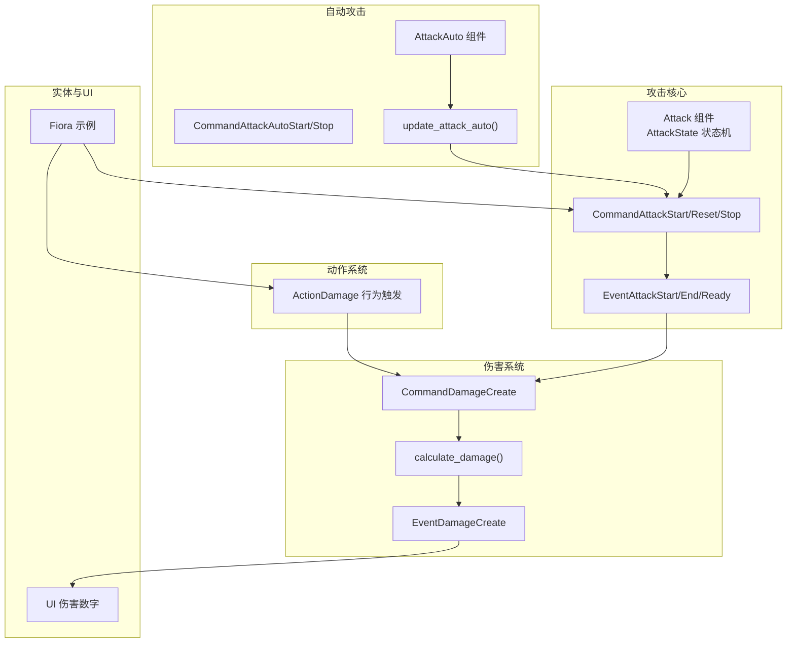
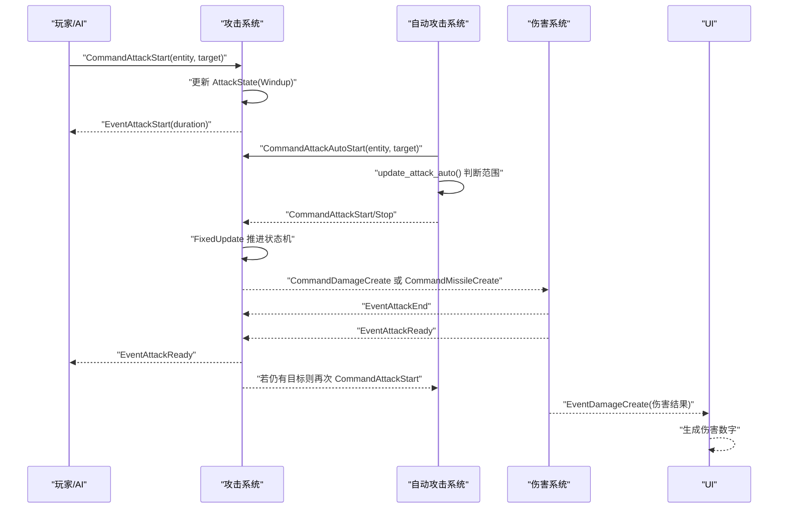
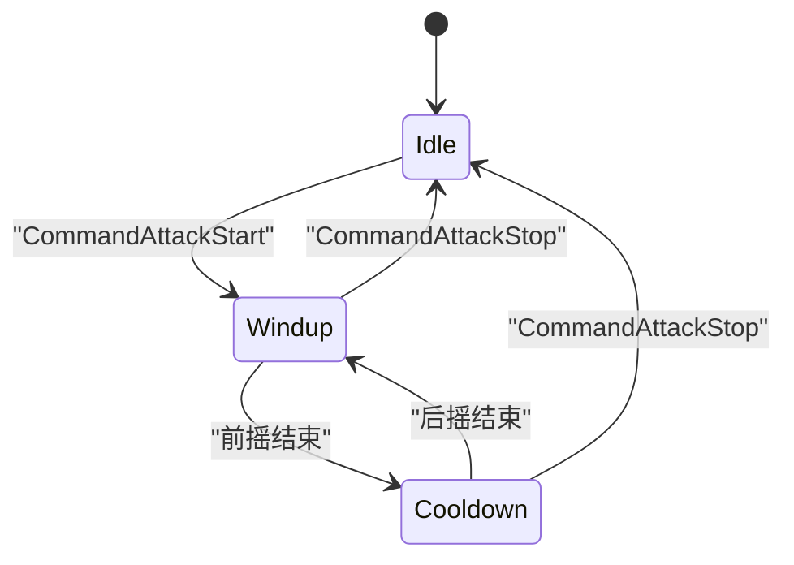
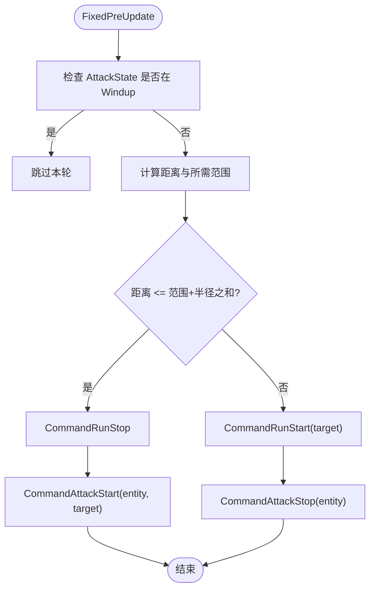
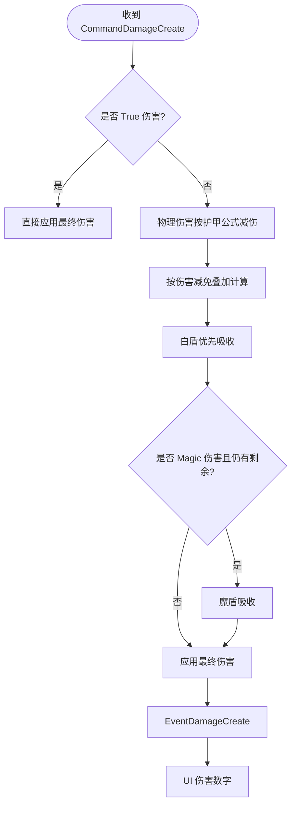
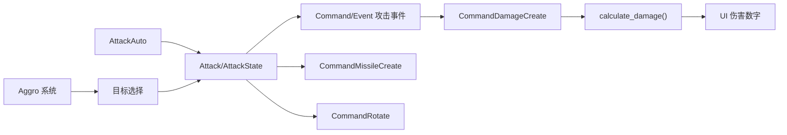

# 攻击系统

<cite>
**本文引用的文件列表**
- [attack.rs](file://src/core/attack.rs)
- [attack_auto.rs](file://src/core/attack_auto.rs)
- [damage.rs](file://src/core/damage.rs)
- [action/damage.rs](file://src/core/action/damage.rs)
- [fiora.rs](file://src/entities/champions/fiora.rs)
- [bounding.rs](file://src/core/base/bounding.rs)
- [aggro.rs](file://src/core/aggro.rs)
- [ui.rs](file://src/core/ui.rs)
- [cooldown.rs](file://src/core/cooldown.rs)
- [attack.test.rs](file://tests/attack.rs)
</cite>

## 目录
1. [简介](#简介)
2. [项目结构](#项目结构)
3. [核心组件](#核心组件)
4. [架构总览](#架构总览)
5. [详细组件分析](#详细组件分析)
6. [依赖关系分析](#依赖关系分析)
7. [性能考量](#性能考量)
8. [故障排查指南](#故障排查指南)
9. [结论](#结论)
10. [附录](#附录)

## 简介
本文件全面解析攻击系统的实现机制，覆盖普通攻击与自动攻击（attack_auto.rs）的逻辑差异；详细说明攻击判定、目标选择、伤害计算（damage.rs）以及攻击冷却的处理流程；结合Fiora和防御塔等实体的具体实现，展示攻击组件如何与动作系统和技能系统协同工作；提供攻击事件从触发到命中反馈的完整数据流分析，包括攻击范围检测、命中判定和伤害应用；并给出配置参数说明、常见问题排查方法与性能优化建议（如减少每帧攻击检测开销）。

## 项目结构
攻击系统主要由以下模块构成：
- 攻击核心：定义攻击组件、状态机、事件与系统（attack.rs）
- 自动攻击：基于范围与目标的自动启停逻辑（attack_auto.rs）
- 伤害系统：伤害计算、减免、护盾与事件（damage.rs）
- 动作系统中的伤害：通过行为树触发的伤害动作（action/damage.rs）
- 实体示例：Fiora的技能与攻击联动（fiora.rs）
- 辅助组件：包围球（Bounding）、仇恨系统（Aggro）、UI伤害数字（UI）

图表来源
- [attack.rs](file://src/core/attack.rs#L1-L120)
- [attack_auto.rs](file://src/core/attack_auto.rs#L1-L155)
- [damage.rs](file://src/core/damage.rs#L1-L120)
- [action/damage.rs](file://src/core/action/damage.rs#L1-L65)
- [fiora.rs](file://src/entities/champions/fiora.rs#L1-L159)
- [ui.rs](file://src/core/ui.rs#L352-L399)

章节来源
- [attack.rs](file://src/core/attack.rs#L1-L120)
- [attack_auto.rs](file://src/core/attack_auto.rs#L1-L155)
- [damage.rs](file://src/core/damage.rs#L1-L120)
- [action/damage.rs](file://src/core/action/damage.rs#L1-L65)
- [fiora.rs](file://src/entities/champions/fiora.rs#L1-L159)
- [ui.rs](file://src/core/ui.rs#L352-L399)

## 核心组件
- 攻击组件（Attack）：包含攻击范围、基础攻速、额外攻速、攻速上限、前摇配置与修正系数、攻击导弹键等。
- 攻击状态机（AttackState）：Windup/Cooldown 两态，记录目标与结束时间。
- 攻击事件：CommandAttackStart/Reset/Stop、EventAttackStart/End/Ready。
- 自动攻击组件（AttackAuto）：记录自动攻击目标。
- 伤害系统：Damage、Armor、白盾/魔盾、伤害减免、伤害事件与伤害计算函数。
- 动作系统中的伤害：ActionDamage 行为触发，内部进行最近敌方目标选择与伤害施加。

章节来源
- [attack.rs](file://src/core/attack.rs#L26-L120)
- [attack.rs](file://src/core/attack.rs#L56-L111)
- [attack_auto.rs](file://src/core/attack_auto.rs#L20-L35)
- [damage.rs](file://src/core/damage.rs#L19-L110)
- [action/damage.rs](file://src/core/action/damage.rs#L1-L65)

## 架构总览
攻击系统采用“事件驱动 + ECS 系统”的设计：
- 观察者监听命令事件（CommandAttackStart/Reset/Stop、CommandAttackAutoStart/Stop），驱动状态机与旋转。
- FixedUpdate 中推进状态机：前摇结束触发伤害或导弹，后摇结束恢复Ready并可能自动发起下一次攻击。
- 自动攻击系统在 FixedPreUpdate 中根据范围与目标状态决定是否启动/停止攻击。
- 伤害系统在收到伤害事件后执行伤害计算、应用护盾与减免，并广播伤害结果事件供UI消费。

图表来源
- [attack.rs](file://src/core/attack.rs#L197-L442)
- [attack_auto.rs](file://src/core/attack_auto.rs#L65-L155)
- [damage.rs](file://src/core/damage.rs#L291-L360)
- [ui.rs](file://src/core/ui.rs#L352-L399)

## 详细组件分析

### 普通攻击（Attack）与状态机
- 组件字段：range、base_attack_speed、bonus_attack_speed、attack_speed_cap、windup_config、windup_modifier、spell_key。
- 状态机：Windup（目标、结束时间）与 Cooldown（结束时间）。状态转换由 FixedUpdate 推进。
- 前摇/后摇计算：根据现代/老式公式与攻速上限、修正系数综合计算。
- 事件链：CommandAttackStart -> EventAttackStart -> 前摇结束 -> EventAttackEnd -> 后摇结束 -> EventAttackReady -> 可能的下一次 CommandAttackStart。

图表来源
- [attack.rs](file://src/core/attack.rs#L56-L111)
- [attack.rs](file://src/core/attack.rs#L361-L430)

章节来源
- [attack.rs](file://src/core/attack.rs#L26-L120)
- [attack.rs](file://src/core/attack.rs#L197-L442)

### 自动攻击（AttackAuto）
- 组件：AttackAuto{ target }。
- 启动：CommandAttackAutoStart 计算自身与目标的包围球半径与攻击范围，判断是否在射程内；不在射程内则触发移动与停止攻击。
- 运行：update_attack_auto 每帧检查自身状态（前摇中跳过），动态判断射程并触发 CommandAttackStart/Stop。
- 停止：CommandAttackAutoStop 移除 AttackAuto 并触发 CommandAttackStop。

图表来源
- [attack_auto.rs](file://src/core/attack_auto.rs#L65-L155)
- [bounding.rs](file://src/core/base/bounding.rs#L1-L9)

章节来源
- [attack_auto.rs](file://src/core/attack_auto.rs#L1-L155)
- [bounding.rs](file://src/core/base/bounding.rs#L1-L9)

### 伤害计算（damage.rs）
- 伤害类型：Physical/Magic/True。
- 计算顺序：真实伤害不减防；物理伤害先按护甲公式减伤；再叠加伤害减免（乘法叠加）；最后按优先级吸收白盾、魔盾。
- 事件：CommandDamageCreate -> calculate_damage -> EventDamageCreate -> UI 显示伤害数字。
- 护盾清理：耗尽后自动移除组件；伤害减免随时间衰减并清理过期效果。

图表来源
- [damage.rs](file://src/core/damage.rs#L215-L289)
- [damage.rs](file://src/core/damage.rs#L291-L360)
- [ui.rs](file://src/core/ui.rs#L352-L399)

章节来源
- [damage.rs](file://src/core/damage.rs#L19-L110)
- [damage.rs](file://src/core/damage.rs#L215-L289)
- [damage.rs](file://src/core/damage.rs#L291-L360)
- [ui.rs](file://src/core/ui.rs#L352-L399)

### 动作系统中的伤害（ActionDamage）
- 通过行为树触发 ActionDamage，内部遍历敌方单位，选择最近目标，旋转朝向并施加伤害。
- 该路径与普通攻击路径不同，它不依赖 Attack/AttackState，而是直接创建伤害事件。

章节来源
- [action/damage.rs](file://src/core/action/damage.rs#L1-L65)

### 与实体（如Fiora）的协同
- Fiora 的技能加载与行为树中包含 ActionDamage，用于特定技能的伤害施加。
- 攻击速度增益可通过 Buff（AttackBuff）影响 Attack 组件，从而影响前摇/后摇时间与总攻击间隔。
- 攻击重置（ActionAttackReset）会触发攻击状态重置，使攻击在冷却后重新进入前摇。

章节来源
- [fiora.rs](file://src/entities/champions/fiora.rs#L1-L159)
- [attack.rs](file://src/core/attack.rs#L112-L170)

## 依赖关系分析
- 攻击系统依赖：
  - 时间资源（Fixed 时间步长）推进状态机。
  - 组件：Transform、Bounding、Attack、AttackState、Damage、Armor、白盾/魔盾、伤害减免。
  - 事件：CommandAttack*/EventAttack*、CommandDamageCreate、EventDamageCreate。
- 自动攻击依赖：
  - Bounding 与 Transform 计算射程。
  - Attack.range 与双方半径比较。
- 伤害系统依赖：
  - Health、Armor、白盾/魔盾、伤害减免组件。
  - 事件驱动的伤害计算与UI反馈。
- 仇恨系统（Aggro）：
  - 与攻击目标选择相关，仇恨值与距离共同决定最优目标。

图表来源
- [attack.rs](file://src/core/attack.rs#L197-L442)
- [attack_auto.rs](file://src/core/attack_auto.rs#L65-L155)
- [damage.rs](file://src/core/damage.rs#L215-L360)
- [aggro.rs](file://src/core/aggro.rs#L53-L99)

章节来源
- [attack.rs](file://src/core/attack.rs#L197-L442)
- [attack_auto.rs](file://src/core/attack_auto.rs#L65-L155)
- [damage.rs](file://src/core/damage.rs#L215-L360)
- [aggro.rs](file://src/core/aggro.rs#L53-L99)

## 性能考量
- 自动攻击检测优化：
  - 使用距离平方比较避免开方运算，降低每帧计算成本。
  - 主查询一次性获取自身 Transform/Bounding，减少多次 get 调用。
- 攻击状态推进：
  - FixedUpdate 中仅对有 AttackState 的实体推进，避免对非攻击实体的无谓遍历。
- 伤害系统：
  - 伤害减免与护盾清理在 FixedUpdate 中批量处理，避免每帧重复昂贵操作。
- 目标选择：
  - 自动攻击仅在必要时触发移动/停止，减少不必要的命令队列。
- 建议：
  - 将攻击范围检测与目标选择合并到单次查询，避免重复查询 Transform/Bounding。
  - 对大量小兵/炮塔的攻击检测，可考虑分层或区域裁剪策略（如网格/空间分区）以进一步降低开销。

章节来源
- [attack_auto.rs](file://src/core/attack_auto.rs#L85-L155)
- [attack.rs](file://src/core/attack.rs#L361-L430)
- [damage.rs](file://src/core/damage.rs#L362-L427)

## 故障排查指南
- 攻击目标丢失
  - 现象：攻击目标死亡或目标实体不存在导致攻击状态被移除。
  - 排查：检查 EventDead 观察者是否正确移除 Windup 目标；确认目标实体生命周期。
  - 参考：[attack.rs](file://src/core/attack.rs#L344-L359)
- 伤害异常
  - 现象：伤害数值与预期不符。
  - 排查：核对伤害类型、护甲、白盾/魔盾、伤害减免叠加顺序；检查真实伤害是否绕过防御。
  - 参考：[damage.rs](file://src/core/damage.rs#L215-L289)
- 攻击冷却未触发
  - 现象：后摇结束后未发出 EventAttackReady。
  - 排查：确认 FixedUpdate 中状态推进逻辑；检查是否有其他组件阻塞事件传播。
  - 参考：[attack.rs](file://src/core/attack.rs#L361-L430)
- 自动攻击不生效
  - 现象：进入射程后未自动攻击。
  - 排查：确认 AttackAuto 组件存在；检查 update_attack_auto 是否被调用；确认前摇中跳过逻辑。
  - 参考：[attack_auto.rs](file://src/core/attack_auto.rs#L85-L155)
- 攻速上限与修正系数
  - 现象：攻速超过上限或前摇修正无效。
  - 排查：核对 Attack.attack_speed_cap、bonus_attack_speed 与 windup_modifier 的计算。
  - 参考：[attack.rs](file://src/core/attack.rs#L152-L195)
- 行为树伤害未触发
  - 现象：ActionDamage 未找到目标或未施加伤害。
  - 排查：确认敌方队伍与 Transform 查询；检查最近目标选择逻辑。
  - 参考：[action/damage.rs](file://src/core/action/damage.rs#L1-L65)

章节来源
- [attack.rs](file://src/core/attack.rs#L344-L430)
- [attack_auto.rs](file://src/core/attack_auto.rs#L85-L155)
- [damage.rs](file://src/core/damage.rs#L215-L289)
- [action/damage.rs](file://src/core/action/damage.rs#L1-L65)

## 结论
攻击系统通过清晰的事件驱动与状态机设计，实现了普通攻击与自动攻击的差异化控制；伤害系统提供了严谨的伤害计算与反馈链路；与动作/技能系统的集成使得实体（如Fiora）能够灵活地在不同场景下施加伤害。通过距离平方比较、批量系统与组件清理等手段，系统在保证正确性的同时兼顾了性能。针对常见问题的排查路径与优化建议有助于稳定运行与扩展。

## 附录

### 配置参数说明
- Attack 组件
  - range：攻击范围
  - base_attack_speed：基础每秒攻击次数
  - bonus_attack_speed：额外攻速加成
  - attack_speed_cap：攻速上限（默认2.5）
  - windup_config：前摇配置（Legacy/Modern）
  - windup_modifier：前摇修正系数
  - spell_key：攻击导弹键（可选）
- AttackState
  - status：Windup/Cooldown
  - target：当前攻击目标
- AttackAuto
  - target：自动攻击目标
- Damage、Armor、白盾/魔盾、伤害减免
  - Damage：伤害数值
  - Armor：护甲
  - WhiteShield/MagicShield：护盾值与最大值
  - DamageReductions：伤害减免列表（百分比、类型、持续时间）

章节来源
- [attack.rs](file://src/core/attack.rs#L26-L120)
- [attack_auto.rs](file://src/core/attack_auto.rs#L20-L35)
- [damage.rs](file://src/core/damage.rs#L19-L110)

### 攻击事件数据流（从触发到命中反馈）
- 普通攻击：CommandAttackStart -> EventAttackStart -> 前摇结束 -> EventAttackEnd -> 后摇结束 -> EventAttackReady -> 可能的下一次 CommandAttackStart -> CommandDamageCreate -> EventDamageCreate -> UI 伤害数字。
- 自动攻击：CommandAttackAutoStart -> update_attack_auto -> CommandAttackStart/Stop -> 同上。
- 行为树伤害：ActionDamage -> CommandDamageCreate -> EventDamageCreate -> UI 伤害数字。

章节来源
- [attack.rs](file://src/core/attack.rs#L197-L442)
- [attack_auto.rs](file://src/core/attack_auto.rs#L65-L155)
- [action/damage.rs](file://src/core/action/damage.rs#L1-L65)
- [damage.rs](file://src/core/damage.rs#L291-L360)
- [ui.rs](file://src/core/ui.rs#L352-L399)