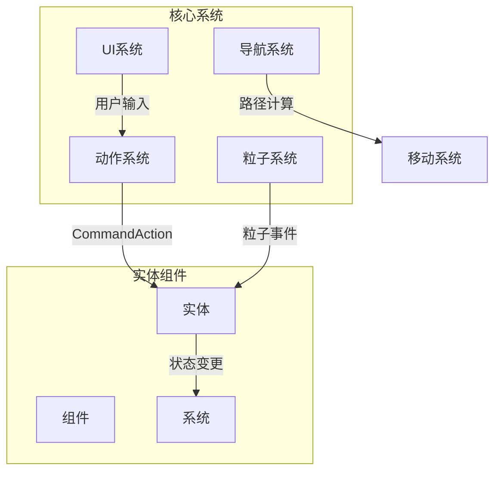
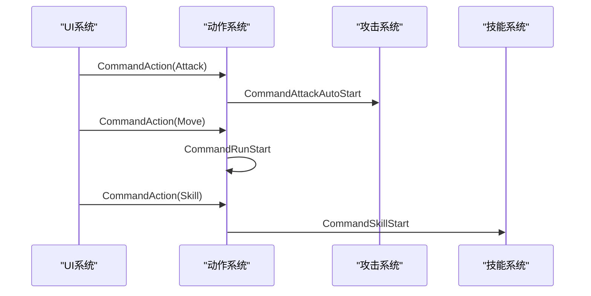
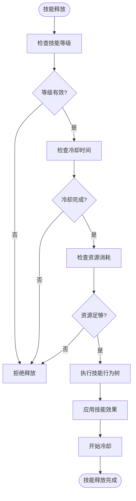
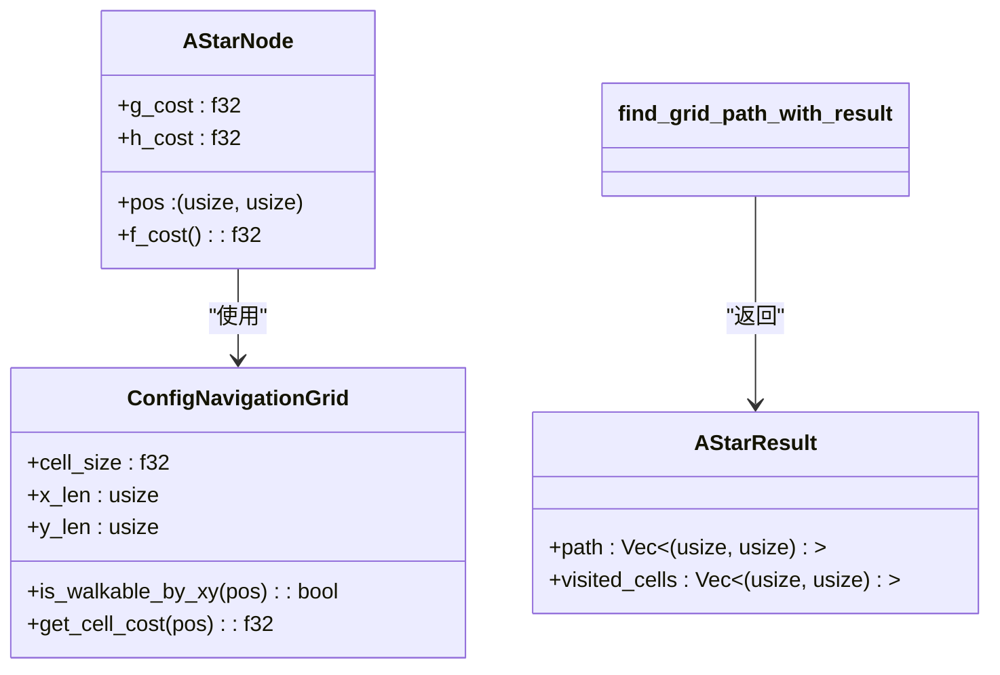
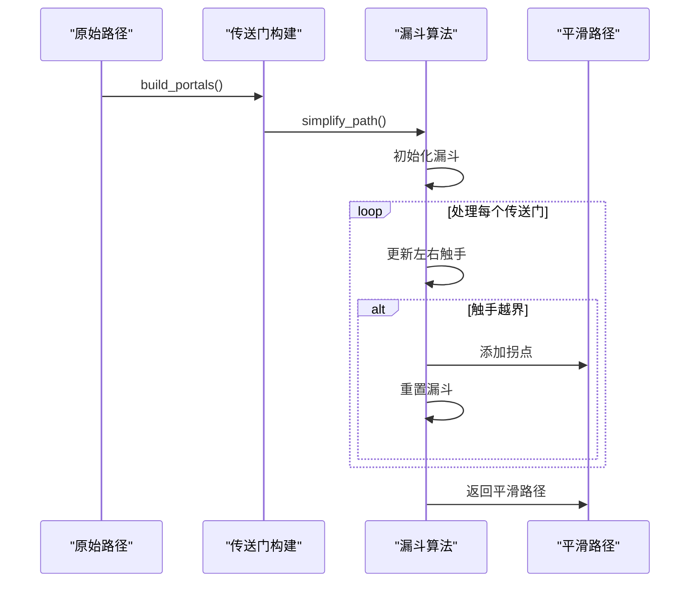
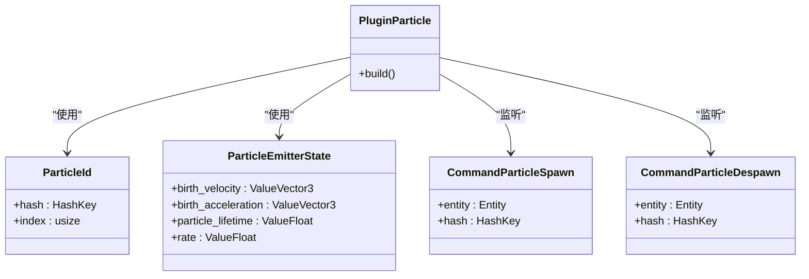
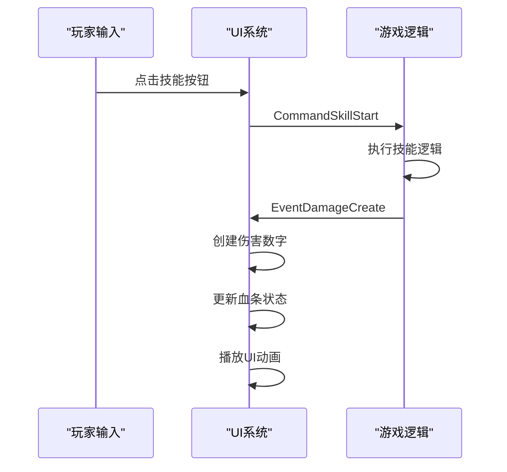
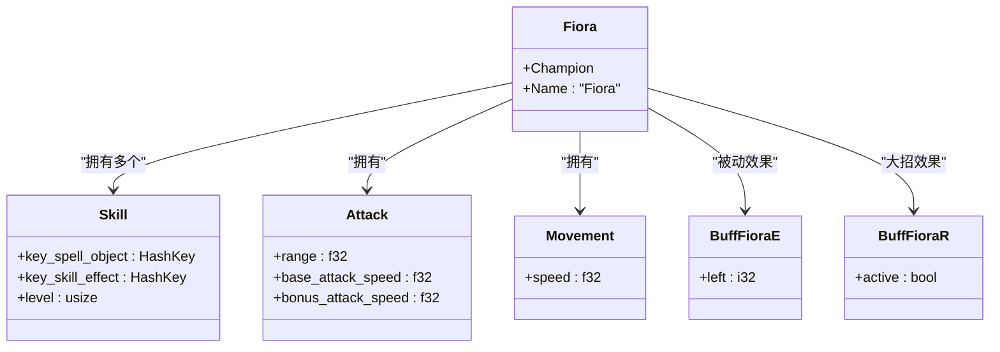

# 游戏逻辑系统

<cite>
**本文档引用文件**   
- [action.rs](file://src/core/action.rs)
- [attack.rs](file://src/core/attack.rs)
- [movement.rs](file://src/core/movement.rs)
- [skill.rs](file://src/core/skill.rs)
- [astar.rs](file://src/core/navigation/astar.rs)
- [smoother.rs](file://src/core/navigation/smoother.rs)
- [particle.rs](file://src/core/particle.rs)
- [ui.rs](file://src/core/ui.rs)
- [fiora.rs](file://src/entities/champions/fiora.rs)
- [turret.rs](file://src/entities/turret.rs)
- [lib.rs](file://src/lib.rs)
- [main.rs](file://src/main.rs)
</cite>

## 目录
1. [系统架构概述](#系统架构概述)
2. [动作系统设计](#动作系统设计)
3. [导航系统实现](#导航系统实现)
4. [粒子系统分层设计](#粒子系统分层设计)
5. [UI交互逻辑](#ui交互逻辑)
6. [实体组件分析](#实体组件分析)
7. [系统执行顺序](#系统执行顺序)

## 系统架构概述

本游戏逻辑系统基于Bevy ECS架构构建，采用模块化设计，通过事件驱动机制实现各系统间的解耦与协作。系统核心由动作、导航、粒子、UI等子系统组成，通过CommandAction事件触发实体状态变更。



**图示来源**
- [lib.rs](file://src/lib.rs#L1-L59)
- [main.rs](file://src/main.rs#L1-L115)

## 动作系统设计

动作系统通过CommandAction事件驱动机制实现攻击、移动、技能释放等行为。系统定义了Action枚举类型，包含Attack、Move、Stop、Skill等动作类型，通过on_command_action函数将命令转换为具体的游戏事件。



**图示来源**
- [action.rs](file://src/core/action.rs#L1-L97)
- [action/command.rs](file://src/core/action/command.rs#L1-L63)

### 攻击系统

攻击系统实现了完整的攻击状态机，包含前摇、后摇等阶段。系统通过Attack组件定义攻击属性，包括攻击范围、攻速、前摇时间等，并通过AttackState组件管理当前攻击状态。

**动作系统来源**
- [attack.rs](file://src/core/attack.rs#L1-L442)
- [action/damage.rs](file://src/core/action/damage.rs#L1-L65)

### 技能释放系统

技能系统采用行为树（BehaveTree）实现技能效果的编排。每个技能对应一个SkillEffect资源，通过CommandSkillStart事件触发技能执行，系统会检查技能等级、冷却时间、资源消耗等条件。



**图示来源**
- [skill.rs](file://src/core/skill.rs#L1-L248)
- [action.rs](file://src/core/action.rs#L1-L97)

## 导航系统实现

导航系统基于A*寻路算法实现，结合路径平滑处理，为单位移动提供高效的路径规划能力。系统通过ConfigNavigationGrid配置导航网格，支持动态障碍物排除。

### A*寻路算法

A*算法实现采用双向搜索优化，通过启发式函数估算从起点到终点的最小成本。算法考虑了单元格大小、对角线移动成本等因素，并支持动态障碍物成本计算。



**图示来源**
- [astar.rs](file://src/core/navigation/astar.rs#L1-L299)
- [navigation.rs](file://src/core/navigation/navigation.rs)

### 路径平滑处理

路径平滑处理采用漏斗算法（Funnel Algorithm）对A*生成的网格路径进行优化，消除不必要的转折点，生成更自然的移动路径。算法通过构建传送门（Portal）序列，逐步收缩漏斗范围，找到最优路径。



**图示来源**
- [smoother.rs](file://src/core/navigation/smoother.rs#L1-L183)
- [movement.rs](file://src/core/movement.rs#L1-L445)

## 粒子系统分层设计

粒子系统采用分层设计，支持多种粒子类型，包括网格粒子、蒙皮粒子、环境粒子等。系统通过CommandParticleSpawn/Despawn事件控制粒子的生命周期，并提供高效的粒子更新机制。

### 粒子系统架构

粒子系统由发射器（Emitter）、粒子（Particle）、材质（Material）等模块组成，通过插件机制集成到Bevy渲染管线中。



**图示来源**
- [particle.rs](file://src/core/particle.rs#L1-L317)
- [emitter.rs](file://src/core/particle/emitter.rs)
- [particle/quad.rs](file://src/core/particle/particle/quad.rs)

### 性能优化策略

粒子系统通过以下策略优化性能：
1. 批量更新：在PostUpdate阶段统一更新所有粒子状态
2. 资源复用：通过ParticleMesh资源缓存网格句柄
3. 层次化材质：为不同粒子类型提供专用材质插件

**粒子系统来源**
- [particle.rs](file://src/core/particle.rs#L1-L317)
- [particle/utils.rs](file://src/core/particle/utils.rs)

## UI交互逻辑

UI系统响应玩家输入并驱动游戏状态变更，通过事件监听机制实现UI元素与游戏逻辑的解耦。系统支持血条、伤害数字、技能按钮等UI元素的动态更新。

### UI事件流

UI系统通过CommandUpdateUIElement等命令事件实现UI元素的动态更新，通过EventDamageCreate事件创建伤害数字效果。



**图示来源**
- [ui.rs](file://src/core/ui.rs#L1-L532)
- [ui/skill.rs](file://src/core/ui/skill.rs)
- [ui/button.rs](file://src/core/ui/button.rs)

## 实体组件分析

通过具体实体的组件构成，可以深入理解ECS系统间的数据流转与调用关系。以Fiora和防御塔为例，展示不同实体的组件组合与行为差异。

### Fiora组件构成

Fiora作为英雄单位，具有复杂的组件组合，包括技能、攻击、移动、动画等系统组件。



**图示来源**
- [fiora.rs](file://src/entities/champions/fiora.rs#L1-L159)
- [champion.rs](file://src/entities/champion.rs)

### 防御塔组件构成

防御塔作为防御建筑，具有相对简单的组件组合，主要包含仇恨、攻击和血条系统。

```mermaid
classDiagram
class Turret {
+Aggro{range : 1000.0}
+HealthBar{bar_type : Turret}
}
class Aggro {
+range : f32
}
class HealthBar {
+bar_type : HealthBarType
}
class Attack {
+range : f32
+base_attack_speed : f32
}
Turret --> Aggro : "包含"
Turret --> HealthBar : "包含"
Turret --> Attack : "包含"
```

**图示来源**
- [turret.rs](file://src/entities/turret.rs#L1-L34)
- [aggro.rs](file://src/core/aggro.rs)

## 系统执行顺序

在典型游戏循环中，系统按照特定顺序执行，确保逻辑的正确性和一致性。系统执行顺序通过Bevy的调度器（Scheduler）进行管理。

```mermaid
flowchart TD
Start([游戏循环开始]) --> Startup["Startup系统"]
Startup --> FixedUpdate["FixedUpdate系统"]
FixedUpdate --> Update["Update系统"]
Update --> PostUpdate["PostUpdate系统"]
subgraph "FixedUpdate"
FixedUpdate --> Skill["技能系统"]
FixedUpdate --> Attack["攻击系统"]
FixedUpdate --> Movement["移动系统"]
end
subgraph "Update"
Update --> UI["UI系统"]
Update --> Input["输入系统"]
end
subgraph "PostUpdate"
PostUpdate --> Particle["粒子系统"]
PostUpdate --> Transform["变换系统"]
end
PostUpdate --> End([游戏循环结束])
```

**系统执行来源**
- [main.rs](file://src/main.rs#L56-L114)
- [lib.rs](file://src/lib.rs#L1-L59)
- [movement.rs](file://src/core/movement.rs#L1-L445)