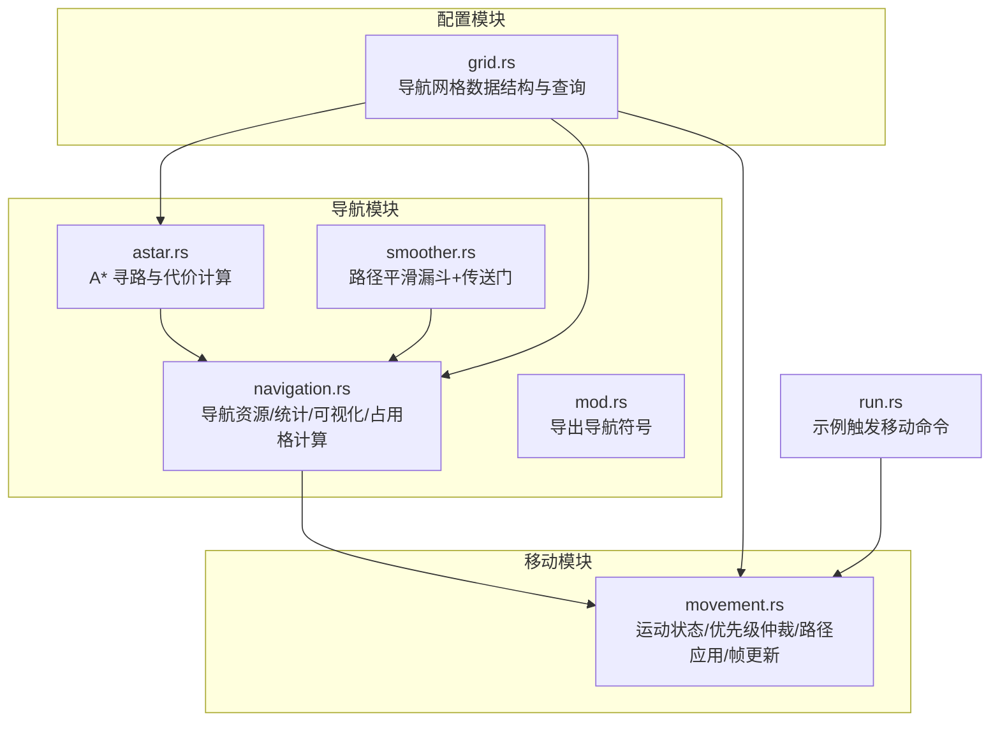
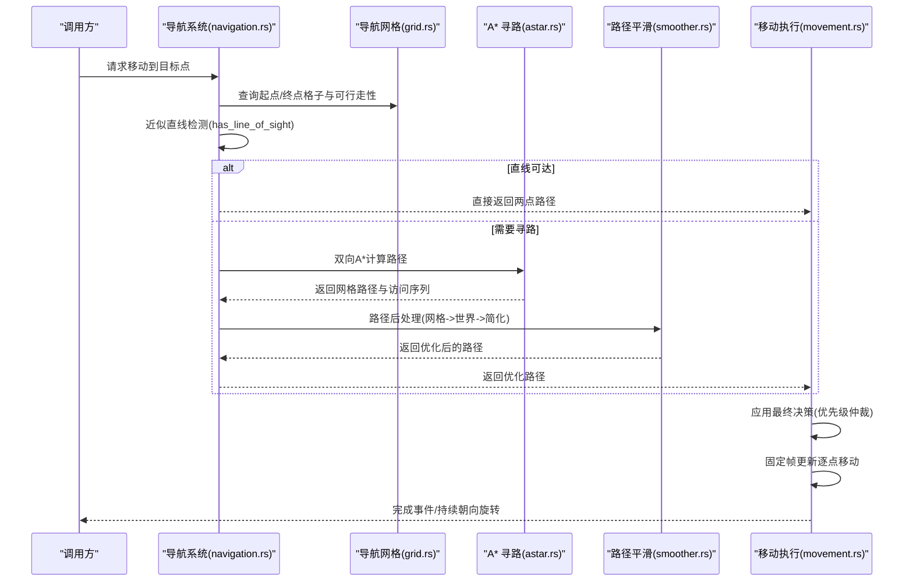
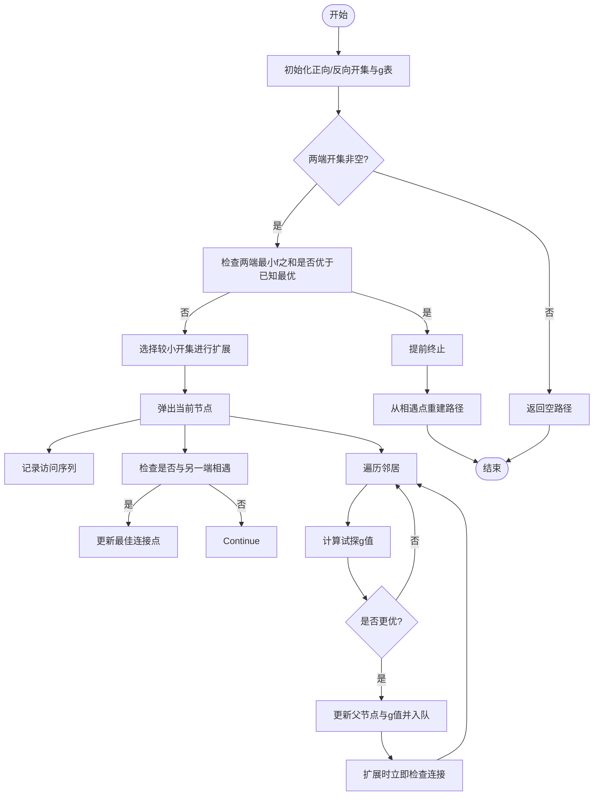
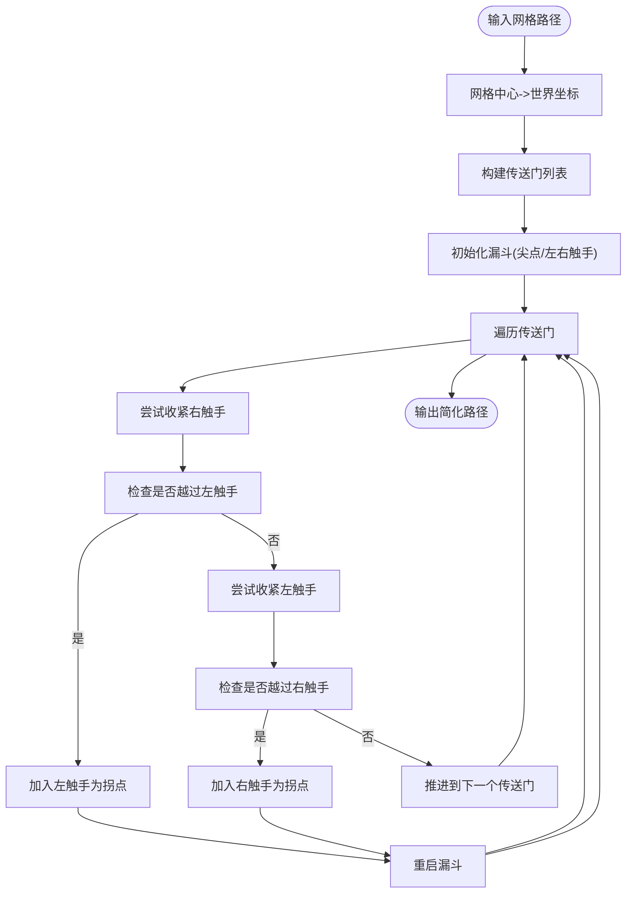
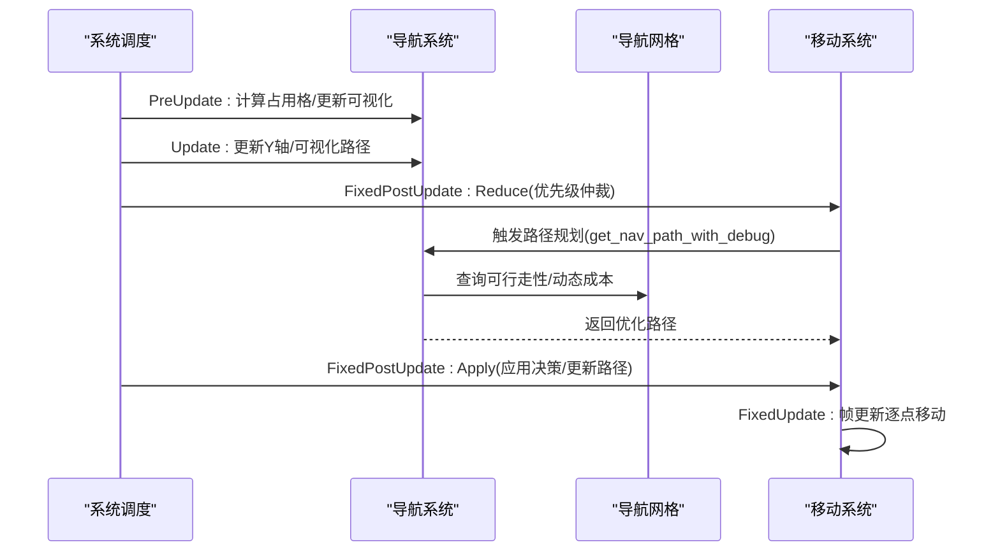
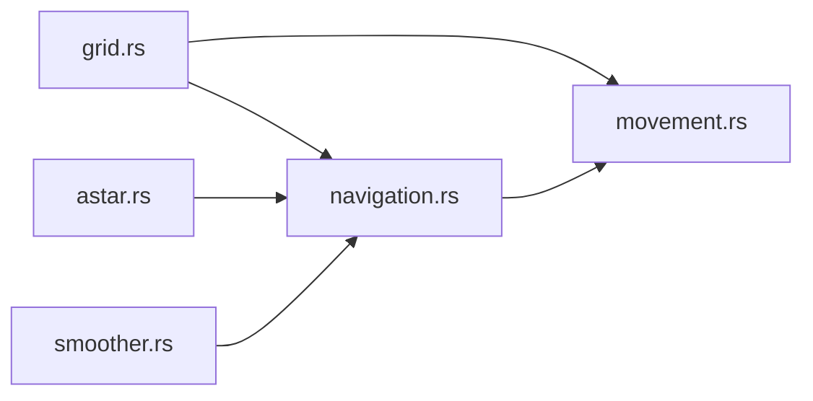

# 移动与导航系统

<cite>
**本文引用的文件**
- [astar.rs](file://src/core/navigation/astar.rs)
- [smoother.rs](file://src/core/navigation/smoother.rs)
- [navigation.rs](file://src/core/navigation/navigation.rs)
- [movement.rs](file://src/core/movement.rs)
- [grid.rs](file://crates/lol_config/src/grid.rs)
- [mod.rs](file://src/core/navigation/mod.rs)
- [research_nav.rs](file://examples/research_nav.rs)
- [run.rs](file://src/core/run.rs)
</cite>

## 目录
1. [简介](#简介)
2. [项目结构](#项目结构)
3. [核心组件](#核心组件)
4. [架构总览](#架构总览)
5. [详细组件分析](#详细组件分析)
6. [依赖关系分析](#依赖关系分析)
7. [性能考量](#性能考量)
8. [故障排查指南](#故障排查指南)
9. [结论](#结论)
10. [附录](#附录)

## 简介
本文件系统性解析移动与导航系统的整体架构，重点聚焦以下方面：
- A* 寻路算法在游戏网格上的实现细节：节点生成、双向搜索、启发式与代价计算、惰性删除与早期收敛策略。
- 路径平滑算法：漏斗+传送门的路径简化流程，支持对角线移动的边界处理。
- 导航系统与移动执行逻辑的集成：从目标点到实际位移的转换过程，以及与 Bevy ECS 系统调度的配合。
- 典型使用场景与调试工具：如何启用可视化、统计计时、定位路径卡顿与寻路失败问题。

## 项目结构
移动与导航系统位于核心模块中，采用按功能分层的组织方式：
- 导航模块：A* 寻路、路径平滑、导航资源与可视化
- 移动模块：运动状态、优先级仲裁、路径应用与帧更新
- 配置模块：导航网格数据结构与查询接口

图表来源
- [astar.rs](file://src/core/navigation/astar.rs#L1-L299)
- [smoother.rs](file://src/core/navigation/smoother.rs#L1-L183)
- [navigation.rs](file://src/core/navigation/navigation.rs#L1-L695)
- [movement.rs](file://src/core/movement.rs#L1-L445)
- [grid.rs](file://crates/lol_config/src/grid.rs#L1-L152)
- [mod.rs](file://src/core/navigation/mod.rs#L1-L8)
- [run.rs](file://src/core/run.rs#L68-L94)

章节来源
- [mod.rs](file://src/core/navigation/mod.rs#L1-L8)

## 核心组件
- 导航网格（ConfigNavigationGrid）：提供网格尺寸、行列数、静态可行走性、高度采样、动态障碍成本与排除集合等能力。
- A* 寻路（find_grid_path/find_grid_path_with_result）：双向 A*，支持八邻域、惰性删除、启发式优化与早期收敛。
- 路径平滑（post_process_path/optimize_path/simplify_path）：先将网格路径转为世界坐标，再通过直线段裁剪与漏斗算法简化。
- 导航资源与统计（NavigationStats/NavigationDebug）：记录寻路耗时、最近可达格子查找次数、占用格数量等；支持可视化调试。
- 移动执行（Movement/MovementState/CommandMovement）：优先级仲裁、路径应用、帧更新驱动单位移动；支持路径重规划与旋转朝向。

章节来源
- [grid.rs](file://crates/lol_config/src/grid.rs#L1-L152)
- [astar.rs](file://src/core/navigation/astar.rs#L1-L299)
- [smoother.rs](file://src/core/navigation/smoother.rs#L1-L183)
- [navigation.rs](file://src/core/navigation/navigation.rs#L1-L695)
- [movement.rs](file://src/core/movement.rs#L1-L445)

## 架构总览
系统围绕“导航网格 + 导航计算 + 移动执行”的流水线展开，ECS 系统按阶段有序执行，确保路径计算与移动更新的正确时序。

图表来源
- [navigation.rs](file://src/core/navigation/navigation.rs#L96-L200)
- [astar.rs](file://src/core/navigation/astar.rs#L57-L216)
- [smoother.rs](file://src/core/navigation/smoother.rs#L80-L183)
- [movement.rs](file://src/core/movement.rs#L303-L438)
- [grid.rs](file://crates/lol_config/src/grid.rs#L105-L128)

## 详细组件分析

### A* 寻路算法（astar.rs）
- 节点与代价
  - 节点包含网格坐标与 g/h/f 成本，比较器按 f 值降序，便于堆顶弹出最优。
  - 距离代价：对角线按近似长度计算，直连按单元尺寸计算。
  - 实际移动代价：基础代价 + 目标格的动态障碍成本（来自网格资源）。
  - 启发式：欧氏距离乘以轻微修正项，保证可接受性。
- 双向搜索与收敛
  - 正向/反向各维护开集与 g 值映射，惰性删除：若当前 g 值大于已记录 g 值则跳过。
  - 两端相遇时记录最佳连接点，提前终止条件：两端最小 f 之和超过已知最优即停止。
  - 扩展策略：平衡两端开集规模，优先扩展较小的一端，加速收敛。
- 结果重建
  - 从相遇点分别回溯到起点与终点，拼接得到完整路径。
- 复杂度与优化
  - 时间复杂度近似 O(B^d)，其中 B 为分支因子，d 为路径深度；双向搜索显著降低分支因子。
  - 空间复杂度 O(B^d/2)；通过惰性删除避免重复入队。
  - 早期收敛与平衡扩展减少无效探索，迭代上限防止极端情况卡死。

图表来源
- [astar.rs](file://src/core/navigation/astar.rs#L57-L216)
- [astar.rs](file://src/core/navigation/astar.rs#L218-L242)
- [astar.rs](file://src/core/navigation/astar.rs#L244-L299)

章节来源
- [astar.rs](file://src/core/navigation/astar.rs#L1-L299)

### 路径平滑算法（smoother.rs）
- 网格到世界坐标
  - 将网格单元中心映射为世界坐标，形成路径点序列。
- 传送门构建
  - 将相邻路径点投影到旋转坐标系，依据移动方向生成左右两个顶点，形成“传送门”。
  - 支持水平/垂直/对角线移动，对角线情况下传送门退化为同一顶点，保证漏斗算法稳定。
- 漏斗简化
  - 维护尖点与左右触手，沿传送门链推进，当新传送门越界时，将触手端点加入简化路径并重启漏斗。
  - 最终添加终点，再转回期望输出格式。
- 复杂度
  - 线性时间 O(n)，空间 O(n)。

图表来源
- [smoother.rs](file://src/core/navigation/smoother.rs#L1-L183)

章节来源
- [smoother.rs](file://src/core/navigation/smoother.rs#L1-L183)

### 导航系统与移动执行集成（navigation.rs 与 movement.rs）
- 导航系统职责
  - 提供插件注册、统计资源、调试资源与可视化系统。
  - 计算占用格成本（多实体包围半径内按距离衰减），并支持排除自身格子参与寻路。
  - 路径规划：起点/终点最近可达格子替换、直线可达快速路径、A* 计算与路径后处理。
  - 可视化：绘制障碍物、访问格、路径单元格与未优化/优化路径线段。
- 移动执行职责
  - 优先级仲裁：合并请求缓冲，按优先级与动作类型决定最终决策。
  - 路径应用：首次规划或目标变化/路径被阻塞时触发重新规划；将二维路径插值为三维路径并记录路径查找信息。
  - 帧更新：固定帧循环按目标点逐步移动，保持朝向与速度，完成时触发结束事件并清理状态。
- 调度与时序
  - 导航系统在 PreUpdate/Update/Late 注册可视化与占用格计算；移动系统在 FixedPostUpdate 的特定阶段执行仲裁与应用。
  - 通过资源与事件在系统间传递状态，避免耦合。

图表来源
- [navigation.rs](file://src/core/navigation/navigation.rs#L1-L69)
- [navigation.rs](file://src/core/navigation/navigation.rs#L464-L551)
- [navigation.rs](file://src/core/navigation/navigation.rs#L552-L695)
- [movement.rs](file://src/core/movement.rs#L1-L60)
- [movement.rs](file://src/core/movement.rs#L248-L301)
- [movement.rs](file://src/core/movement.rs#L303-L438)

章节来源
- [navigation.rs](file://src/core/navigation/navigation.rs#L1-L695)
- [movement.rs](file://src/core/movement.rs#L1-L445)

## 依赖关系分析
- 模块依赖
  - navigation.rs 依赖 astar.rs 与 smoother.rs 的导出符号，同时依赖 lol_config::ConfigNavigationGrid。
  - movement.rs 依赖 navigation 的路径规划函数与网格工具函数，依赖 lol_config::ConfigNavigationGrid。
  - grid.rs 提供导航网格资源与查询方法，被 navigation 与 movement 共同使用。
- 关键耦合点
  - 导航网格的 occupied_cells/exclude_cells 是动态障碍与自排除的关键。
  - MovementState.path 与 MovementState.pathfind 用于重规划判定与路径复用。
- 循环依赖
  - 未发现循环依赖；模块职责清晰，接口单向依赖。

图表来源
- [grid.rs](file://crates/lol_config/src/grid.rs#L1-L152)
- [navigation.rs](file://src/core/navigation/navigation.rs#L1-L695)
- [movement.rs](file://src/core/movement.rs#L1-L445)
- [astar.rs](file://src/core/navigation/astar.rs#L1-L299)
- [smoother.rs](file://src/core/navigation/smoother.rs#L1-L183)

章节来源
- [grid.rs](file://crates/lol_config/src/grid.rs#L1-L152)
- [navigation.rs](file://src/core/navigation/navigation.rs#L1-L695)
- [movement.rs](file://src/core/movement.rs#L1-L445)

## 性能考量
- 导航网格
  - 单次占用格计算复杂度与实体数量与包围半径相关；建议仅在必要时更新（如 PreUpdate 或实体位置变化时）。
  - exclude_cells 用于排除自身格子，避免自遮挡导致的寻路异常。
- A* 寻路
  - 双向搜索与惰性删除显著降低搜索规模；启发式修正项确保可接受性但不破坏最优性。
  - 迭代上限可防止极端情况卡死；建议结合统计资源监控平均迭代次数。
- 路径平滑
  - 线性时间复杂度，适合实时运行；对角线处理保证稳定性。
- 移动执行
  - FixedPostUpdate 的阶段性执行避免了帧内状态竞争；帧更新按速度与时间步长线性推进，保证稳定性。
- 调度
  - 将可视化与占用格计算放在 Update/Late，避免与核心移动逻辑冲突；优先级仲裁与路径应用分离，提升可维护性。

[本节为通用性能讨论，无需列出具体文件来源]

## 故障排查指南
- 路径卡顿
  - 检查 NavigationStats 中 get_nav_path_time 与 calculate_occupied_grid_cells_time，确认是否存在频繁占用格计算。
  - 若存在大量实体，考虑扩大更新频率或减少包围半径影响范围。
- 寻路失败
  - 检查起点/终点最近可达格子替换逻辑，确认是否因起点/终点不可达而返回 None。
  - 查看 visited_cells/path_cells 可视化，确认是否被大量动态障碍包围。
  - 检查 exclude_cells 是否正确排除自身格子，避免自遮挡。
- 路径被阻塞
  - Movement 系统会在路径被阻塞时触发重规划；确认 is_path_blocked 与 check_path_* 统计是否正常。
- 可视化调试
  - 启用 NavigationDebug，观察障碍物、访问格、路径单元格与未优化/优化路径线段。
  - 示例程序可通过按键或命令开启可视化开关。

章节来源
- [navigation.rs](file://src/core/navigation/navigation.rs#L1-L69)
- [navigation.rs](file://src/core/navigation/navigation.rs#L464-L551)
- [navigation.rs](file://src/core/navigation/navigation.rs#L552-L695)
- [movement.rs](file://src/core/movement.rs#L303-L438)

## 结论
该系统通过“网格 + 双向 A* + 路径平滑 + ECS 调度”的组合，实现了高效、可调试、可扩展的移动与导航能力。A* 在对角线支持与惰性删除方面做了针对性优化；路径平滑保证了自然的移动轨迹；移动执行与导航系统通过资源与事件解耦协作，满足实时性与可维护性的双重需求。

[本节为总结性内容，无需列出具体文件来源]

## 附录

### 典型使用场景
- 示例加载导航网格
  - 通过示例程序加载英雄联盟地图导航网格，验证网格可用性与加载耗时。
- 触发移动命令
  - 示例代码通过触发移动命令，将目标点封装为路径规划请求，交由移动系统处理。

章节来源
- [research_nav.rs](file://examples/research_nav.rs#L1-L21)
- [run.rs](file://src/core/run.rs#L68-L94)