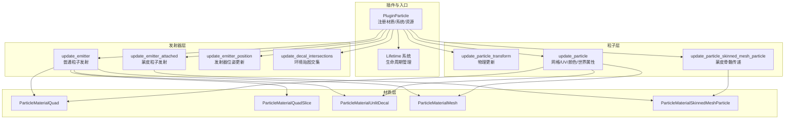
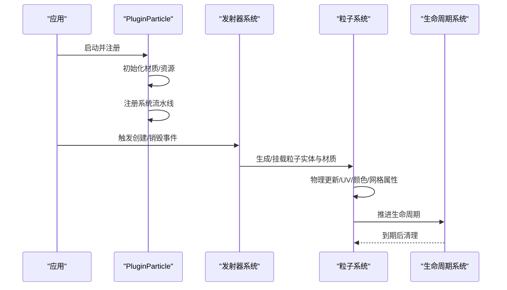
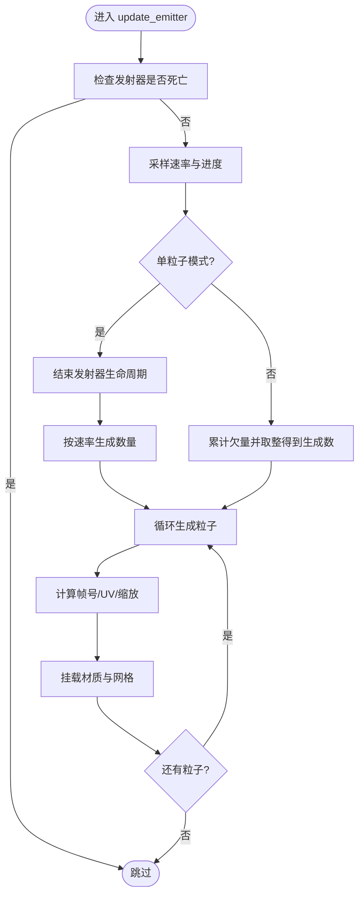
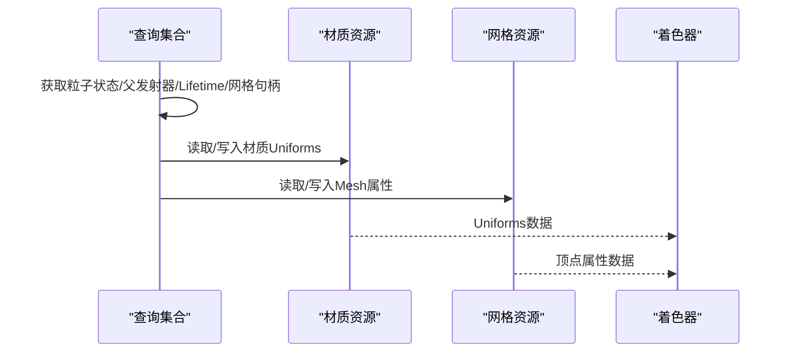
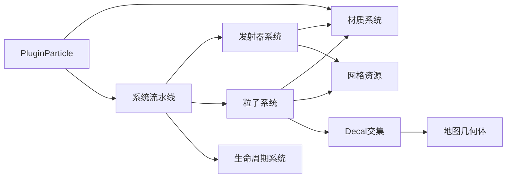

# 粒子系统

<cite>
**本文引用的文件列表**
- [src/core/particle.rs](file://src/core/particle.rs)
- [src/core/particle/emitter.rs](file://src/core/particle/emitter.rs)
- [src/core/particle/particle.rs](file://src/core/particle/particle.rs)
- [src/core/particle/utils.rs](file://src/core/particle/utils.rs)
- [src/core/particle/particle/quad.rs](file://src/core/particle/particle/quad.rs)
- [src/core/particle/particle/mesh.rs](file://src/core/particle/particle/mesh.rs)
- [src/core/particle/particle/quad_slice.rs](file://src/core/particle/particle/quad_slice.rs)
- [src/core/particle/skinned_mesh/particle.rs](file://src/core/particle/skinned_mesh/particle.rs)
- [src/core/particle/environment/unlit_decal.rs](file://src/core/particle/environment/unlit_decal.rs)
- [src/core/lifetime.rs](file://src/core/lifetime.rs)
- [src/lib.rs](file://src/lib.rs)
</cite>

## 目录
1. [引言](#引言)
2. [项目结构](#项目结构)
3. [核心组件](#核心组件)
4. [架构总览](#架构总览)
5. [详细组件分析](#详细组件分析)
6. [依赖关系分析](#依赖关系分析)
7. [性能考量](#性能考量)
8. [故障排查指南](#故障排查指南)
9. [结论](#结论)
10. [附录](#附录)

## 引言
本文件面向希望深入理解并高效使用该粒子系统的开发者，围绕以下目标展开：
- 全面解析粒子系统的分层架构与高性能实现
- 详细说明粒子发射器（emitter.rs）的生命周期管理、发射参数配置与粒子生成机制
- 阐述网格粒子、蒙皮粒子（skinned_mesh/particle.rs）和环境贴图（unlit_decal.rs）等不同类型粒子的渲染原理与使用场景
- 结合particle.rs和utils.rs，讲解粒子更新系统如何在每帧高效处理大量粒子的状态变化
- 提供粒子效果的创建、绑定与优化指南，包括内存管理、批处理策略和常见性能瓶颈的规避方法

## 项目结构
粒子系统位于核心模块中，采用“插件化 + 分层”的组织方式：
- 插件入口：在粒子模块内注册材质、系统与资源，并在应用启动时统一装配
- 发射器层：负责发射参数采样、粒子生成、材质挂载与环境贴图交集更新
- 粒子层：负责每帧状态更新（位置/缩放/UV/颜色）、网格属性更新与蒙皮骨骼传递
- 材质层：定义顶点/像素常量、纹理绑定与混合模式，支持多类型粒子材质
- 工具层：提供随机性与曲线采样、概率表、黑像素纹理等通用能力

图表来源
- [src/core/particle.rs](file://src/core/particle.rs#L42-L87)
- [src/core/particle/emitter.rs](file://src/core/particle/emitter.rs#L50-L98)
- [src/core/particle/emitter.rs](file://src/core/particle/emitter.rs#L333-L466)
- [src/core/particle/emitter.rs](file://src/core/particle/emitter.rs#L468-L612)
- [src/core/particle/emitter.rs](file://src/core/particle/emitter.rs#L622-L667)
- [src/core/particle/particle.rs](file://src/core/particle/particle.rs#L31-L181)
- [src/core/particle/particle.rs](file://src/core/particle/particle.rs#L183-L205)
- [src/core/particle/particle.rs](file://src/core/particle/particle.rs#L207-L287)
- [src/core/particle/particle/quad.rs](file://src/core/particle/particle/quad.rs#L90-L209)
- [src/core/particle/particle/mesh.rs](file://src/core/particle/particle/mesh.rs#L58-L149)
- [src/core/particle/particle/quad_slice.rs](file://src/core/particle/particle/quad_slice.rs#L21-L99)
- [src/core/particle/skinned_mesh/particle.rs](file://src/core/particle/skinned_mesh/particle.rs#L56-L150)
- [src/core/particle/environment/unlit_decal.rs](file://src/core/particle/environment/unlit_decal.rs#L52-L133)
- [src/core/lifetime.rs](file://src/core/lifetime.rs#L84-L111)

章节来源
- [src/core/particle.rs](file://src/core/particle.rs#L42-L87)
- [src/lib.rs](file://src/lib.rs#L15-L59)

## 核心组件
- 插件与装配
  - 注册五种粒子材质（四边形、切片四边形、网格、未光照贴花、蒙皮粒子）
  - 初始化材质资源并注册系统流水线
  - 生命周期系统独立运行，确保实体按策略清理
- 发射器状态与参数
  - 使用随机采样器对速率、寿命、颜色、缩放、速度、加速度、UV偏移/滚动等参数进行时间维度采样
  - 支持单粒子一次性发射与连续发射两种模式
- 粒子状态
  - 记录出生时的UV偏移、滚动速率、颜色、缩放、速度、加速度与帧号
  - 每帧根据发射器颜色曲线与生命周期进度合成当前颜色
- 材质与渲染
  - 通过Uniforms传递世界矩阵、UV变换、骨骼数组、颜色因子等
  - 根据混合模式设置渲染状态，支持透明叠加

章节来源
- [src/core/particle.rs](file://src/core/particle.rs#L42-L87)
- [src/core/particle/utils.rs](file://src/core/particle/utils.rs#L25-L123)
- [src/core/particle/particle.rs](file://src/core/particle/particle.rs#L19-L30)
- [src/core/lifetime.rs](file://src/core/lifetime.rs#L13-L82)

## 架构总览
粒子系统采用“事件驱动 + ECS 查询”的两阶段设计：
- 事件阶段：接收“创建/销毁”命令，构建发射器与初始粒子
- 更新阶段：在PostUpdate流水线中按顺序执行发射器位姿、发射、交集、物理、材质更新与网格属性同步

图表来源
- [src/core/particle.rs](file://src/core/particle.rs#L42-L87)
- [src/core/particle/emitter.rs](file://src/core/particle/emitter.rs#L333-L466)
- [src/core/particle/particle.rs](file://src/core/particle/particle.rs#L31-L181)
- [src/core/lifetime.rs](file://src/core/lifetime.rs#L84-L111)

## 详细组件分析

### 发射器（emitter.rs）
- 生命周期管理
  - 发射器实体携带Lifetime，支持“定时+无子实体”模式，到期自动清理
  - 单粒子模式下会立即结束发射器生命周期
- 参数配置与采样
  - 速率、粒子寿命、颜色、缩放、速度、加速度、UV偏移/滚动均来自StochasticSampler
  - 采样基于时间进度progress，支持曲线与概率表
- 粒子生成机制
  - 连续发射：rate × delta + 剩余欠量，取整得到本次生成数量
  - 单粒子：一次性生成指定数量并结束发射器
  - 生成时计算粒子初态（位置/旋转/缩放/UV），并挂载对应材质与网格
- 不同类型粒子的渲染路径
  - 四边形/相机朝向四边形：使用Quad或CameraUnitQuad材质
  - 切片技术：使用QuadSlice材质，支持UV切片范围
  - 平面投影贴花：使用UnlitDecal材质，支持Y方向投影范围
  - 网格粒子：加载外部网格并使用Mesh材质
  - 蒙皮粒子：使用SkinnedMeshParticle材质，配合阴影皮肤实体
- 环境贴图交集
  - Decal与地图几何体进行包围盒相交检测，动态生成Decal几何体以匹配可见地形

图表来源
- [src/core/particle/emitter.rs](file://src/core/particle/emitter.rs#L333-L466)
- [src/core/particle/emitter.rs](file://src/core/particle/emitter.rs#L215-L331)

章节来源
- [src/core/particle/emitter.rs](file://src/core/particle/emitter.rs#L50-L98)
- [src/core/particle/emitter.rs](file://src/core/particle/emitter.rs#L333-L466)
- [src/core/particle/emitter.rs](file://src/core/particle/emitter.rs#L468-L612)
- [src/core/particle/emitter.rs](file://src/core/particle/emitter.rs#L622-L667)

### 粒子更新（particle.rs）
- 物理更新（位置/缩放）
  - 每帧更新速度与位移，缩放按发射器曲线与出生缩放合成
- 网格属性更新（UV/颜色/世界位置）
  - 计算世界矩阵，设置Decal材质UV变换矩阵
  - 计算网格粒子UV变换矩阵与颜色查找UV，写入自定义顶点属性
  - 将每个顶点的世界位置与颜色写入Mesh属性，供着色器使用
- 蒙皮粒子更新
  - 从SkinnedMesh获取骨骼矩阵并乘以逆绑定矩阵，传入材质Uniforms
  - 计算UV滚动与颜色因子，写入材质Uniforms

图表来源
- [src/core/particle/particle.rs](file://src/core/particle/particle.rs#L31-L181)
- [src/core/particle/particle.rs](file://src/core/particle/particle.rs#L207-L287)

章节来源
- [src/core/particle/particle.rs](file://src/core/particle/particle.rs#L31-L181)
- [src/core/particle/particle.rs](file://src/core/particle/particle.rs#L183-L205)
- [src/core/particle/particle.rs](file://src/core/particle/particle.rs#L207-L287)

### 材质与渲染（quad/mesh/quad_slice/skinned_mesh/unlit_decal）
- 统一的材质接口
  - 通过AsBindGroup定义Uniforms与纹理绑定
  - MaterialPath提供顶点/片段着色器路径
  - Material::alpha_mode与specialize根据blend_mode设置混合状态
- 四边形/切片四边形
  - Quad/QuadSlice材质支持UV帧动画与多通道纹理
  - QuadSlice额外支持切片范围控制
- 网格粒子
  - Mesh材质传递世界矩阵与UV变换，支持颜色查找UV
- 未光照贴花
  - UnlitDecal材质传递Decal世界到UV矩阵，支持Y方向投影范围
- 蒙皮粒子
  - SkinnedMeshParticle材质传递骨骼数组与UV滚动，支持颜色查找UV

章节来源
- [src/core/particle/particle/quad.rs](file://src/core/particle/particle/quad.rs#L90-L209)
- [src/core/particle/particle/quad_slice.rs](file://src/core/particle/particle/quad_slice.rs#L21-L99)
- [src/core/particle/particle/mesh.rs](file://src/core/particle/particle/mesh.rs#L58-L149)
- [src/core/particle/skinned_mesh/particle.rs](file://src/core/particle/skinned_mesh/particle.rs#L56-L150)
- [src/core/particle/environment/unlit_decal.rs](file://src/core/particle/environment/unlit_decal.rs#L52-L133)

### 工具与随机采样（utils.rs）
- 随机采样器
  - Sampler支持常量与曲线两种模式，Curve基于不均匀采样曲线
  - StochasticSampler在基础值上按概率表分量相乘，实现多维随机扰动
- 黑像素纹理
  - 创建1x1像素的黑像素图像作为默认占位纹理，减少空纹理分支判断成本

章节来源
- [src/core/particle/utils.rs](file://src/core/particle/utils.rs#L1-L33)
- [src/core/particle/utils.rs](file://src/core/particle/utils.rs#L25-L123)
- [src/core/particle/utils.rs](file://src/core/particle/utils.rs#L164-L334)

### 生命周期系统（lifetime.rs）
- 生命周期组件
  - 支持定时器与“定时+无子实体”两种模式
  - 提供进度、剩余时间、是否存活/死亡等查询
- 清理策略
  - 定时模式：到期直接删除
  - 定时+无子实体：若无子实体则删除

章节来源
- [src/core/lifetime.rs](file://src/core/lifetime.rs#L13-L82)
- [src/core/lifetime.rs](file://src/core/lifetime.rs#L84-L111)

## 依赖关系分析
- 插件装配
  - PluginParticle在应用启动时注册所有材质与系统，确保渲染管线与更新顺序正确
- 系统耦合
  - 发射器系统依赖材质与网格资源；粒子系统依赖材质与网格资源；Decal交集依赖地图几何体
- 生命周期耦合
  - 所有粒子实体均受Lifetime系统影响，到期后由系统清理，避免泄漏

图表来源
- [src/core/particle.rs](file://src/core/particle.rs#L42-L87)
- [src/core/particle/emitter.rs](file://src/core/particle/emitter.rs#L622-L667)
- [src/core/lifetime.rs](file://src/core/lifetime.rs#L84-L111)

章节来源
- [src/core/particle.rs](file://src/core/particle.rs#L42-L87)
- [src/core/particle/emitter.rs](file://src/core/particle/emitter.rs#L622-L667)
- [src/core/lifetime.rs](file://src/core/lifetime.rs#L84-L111)

## 性能考量
- 时间步长与欠量累积
  - 连续发射使用“速率×delta+欠量”的整数取整策略，避免小数误差导致漏发
- 材质与网格缓存
  - 材质通过MaterialPlugin统一注册，Bevy内部进行批处理与管线复用
  - 网格与纹理通过资源缓存加载，减少重复创建
- 动态Decal几何体
  - Decal仅在与地图几何体相交时生成，避免对不可见Decal进行渲染
- 骨骼数组上限
  - 蒙皮粒子最多传递68个骨骼矩阵，超出部分截断，避免Uniforms过大
- 属性写入优化
  - 粒子系统直接写入Mesh顶点属性，避免额外拷贝与中间缓冲
- 混合模式
  - 透明叠加通过BlendState配置，避免不必要的深度测试与剔除

章节来源
- [src/core/particle/emitter.rs](file://src/core/particle/emitter.rs#L372-L392)
- [src/core/particle/particle.rs](file://src/core/particle/particle.rs#L269-L287)
- [src/core/particle/particle/quad.rs](file://src/core/particle/particle/quad.rs#L161-L209)
- [src/core/particle/environment/unlit_decal.rs](file://src/core/particle/environment/unlit_decal.rs#L107-L133)

## 故障排查指南
- 粒子不显示
  - 检查材质是否正确注册与初始化
  - 检查BlendMode是否与期望一致（透明/不透明）
  - 检查UV帧动画是否正确写入Mesh属性
- 粒子不运动
  - 检查update_particle_transform是否执行
  - 检查发射器颜色/缩放曲线是否为零
- Decal不出现
  - 检查update_decal_intersections是否执行
  - 检查地图几何体包围盒与Decal包围盒是否有重叠
- 内存泄漏
  - 检查Lifetime系统是否正常清理到期实体
  - 检查是否存在未触发销毁事件导致的残留发射器

章节来源
- [src/core/particle.rs](file://src/core/particle.rs#L42-L87)
- [src/core/particle/emitter.rs](file://src/core/particle/emitter.rs#L622-L667)
- [src/core/lifetime.rs](file://src/core/lifetime.rs#L84-L111)

## 结论
该粒子系统通过清晰的分层设计与高效的ECS流水线实现了高吞吐量的粒子生成与渲染：
- 发射器层负责参数采样与实体生成，材质层负责渲染细节，粒子层负责状态与网格属性更新
- 通过随机采样器、欠量累积、Decal交集与骨骼数组等手段，在保证视觉质量的同时兼顾性能
- 建议在实际项目中结合事件驱动创建/销毁、材质批处理与资源缓存策略，进一步提升大规模粒子场景的稳定性与帧率表现

## 附录
- 创建与绑定流程
  - 通过CommandParticleSpawn事件创建发射器，系统根据VFX定义数据填充ParticleId与ParticleEmitterState
  - 在PostUpdate流水线中，发射器系统生成粒子并挂载材质；粒子系统随后更新状态与网格属性
- 优化建议
  - 控制每帧生成数量，避免瞬时爆发
  - 复用材质与网格，减少资源切换
  - 使用合适的BlendMode，避免过度透明混合
  - 对蒙皮粒子限制骨骼数量，避免Uniforms超限