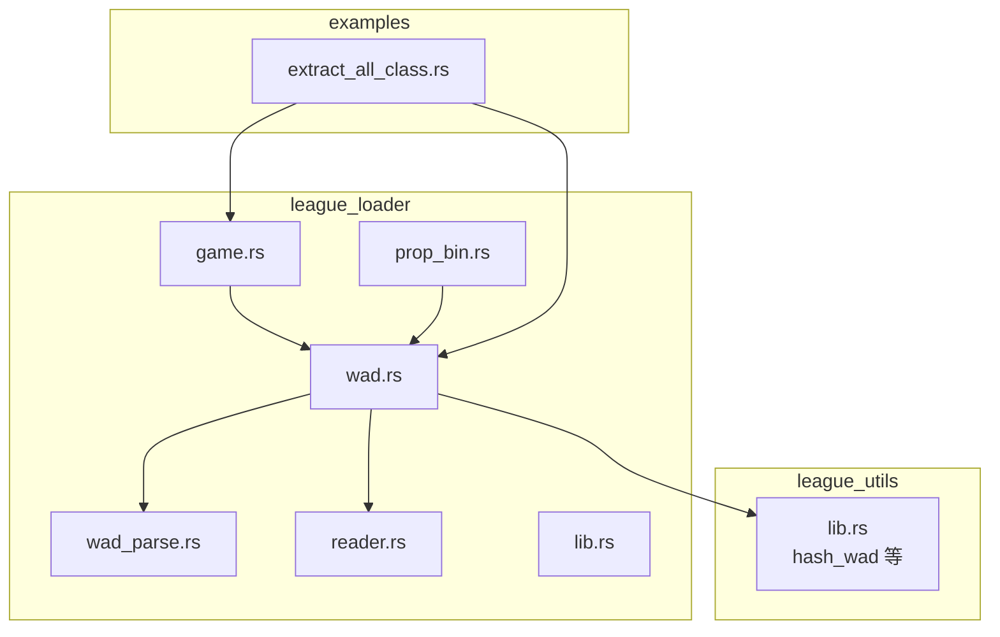
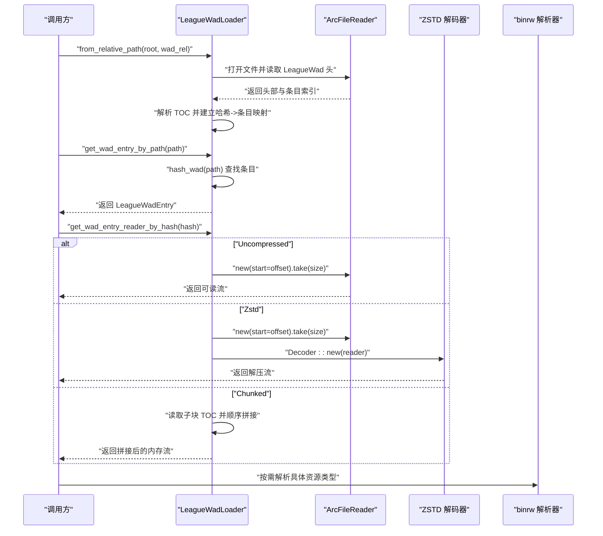
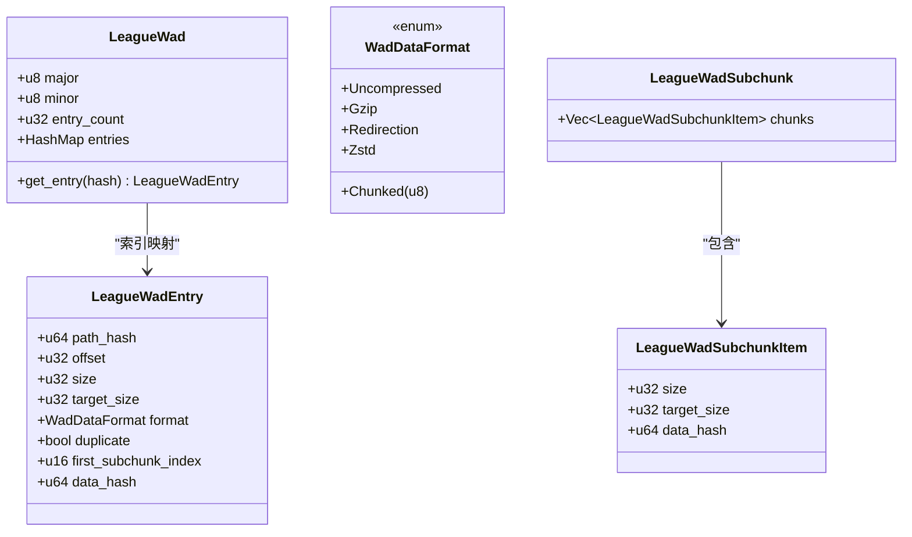
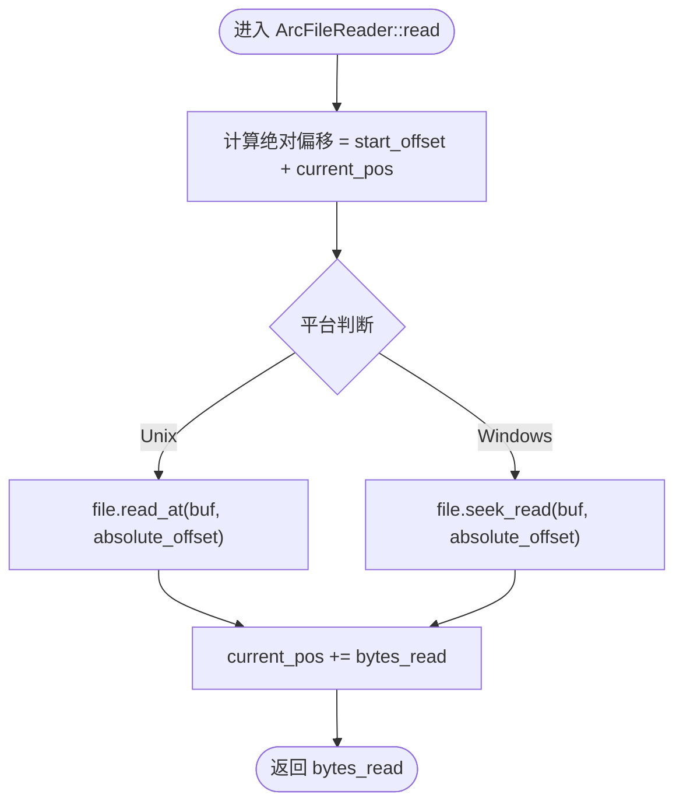
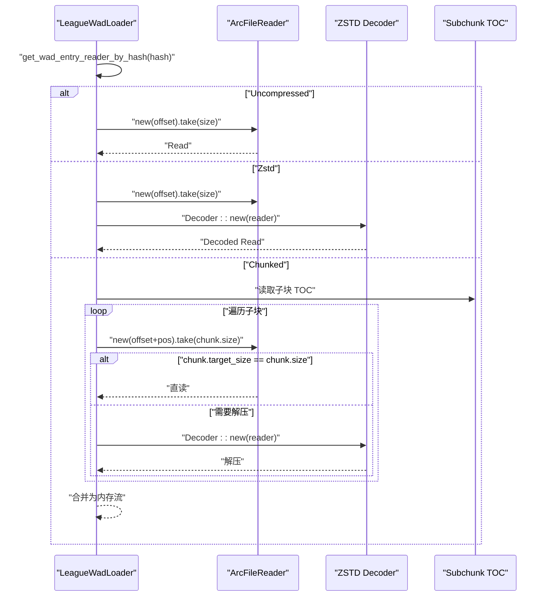
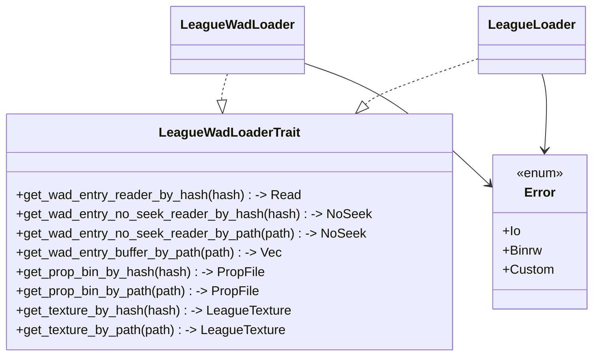
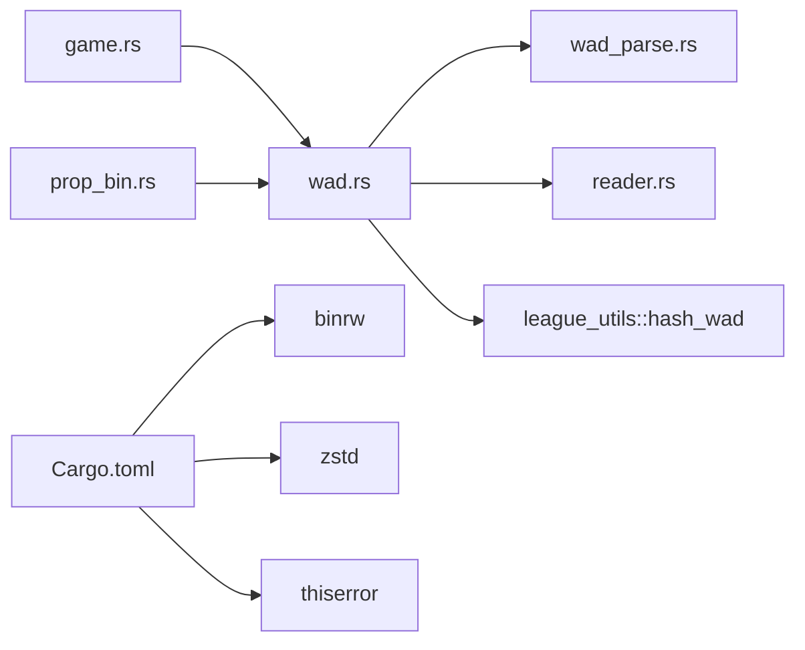

# 资源加载

<cite>
**本文引用的文件列表**
- [wad.rs](file://crates/league_loader/src/wad.rs)
- [wad_parse.rs](file://crates/league_loader/src/wad_parse.rs)
- [reader.rs](file://crates/league_loader/src/reader.rs)
- [lib.rs](file://crates/league_loader/src/lib.rs)
- [game.rs](file://crates/league_loader/src/game.rs)
- [prop_bin.rs](file://crates/league_loader/src/prop_bin.rs)
- [Cargo.toml](file://crates/league_loader/Cargo.toml)
- [utils.rs](file://crates/league_utils/src/lib.rs)
- [extract_all_class.rs](file://examples/extract_all_class.rs)
- [utils.rs](file://crates/league_to_lol/src/utils.rs)
</cite>

## 目录
1. [简介](#简介)
2. [项目结构](#项目结构)
3. [核心组件](#核心组件)
4. [架构总览](#架构总览)
5. [详细组件分析](#详细组件分析)
6. [依赖关系分析](#依赖关系分析)
7. [性能考量](#性能考量)
8. [故障排查指南](#故障排查指南)
9. [结论](#结论)
10. [附录](#附录)

## 简介
本技术文档聚焦 LoL 资源加载模块，系统性阐述 WAD（Web Archive Data）容器格式的底层读取机制，涵盖：
- WAD 文件头与条目索引表（TOC）的解析与定位
- 数据块偏移计算与资源定位逻辑
- 基于 binrw 的二进制流读取封装，支持小端字节序与高效缓冲读取
- 从 WAD 打开到特定资源条目提取的完整流程（含公共 API）
- 错误处理机制：损坏的 WAD 头、缺失条目、I/O 异常等
- 性能优化策略：异步加载支持、资源缓存预热机制
- 结合 examples 中的实际调用示例说明最佳实践

## 项目结构
资源加载模块位于 crates/league_loader，围绕 WAD 解析、二进制读取器与公共 API 展开；同时通过 league_utils 提供路径哈希工具，examples 提供使用示例。

图表来源
- [wad.rs](file://crates/league_loader/src/wad.rs#L1-L147)
- [wad_parse.rs](file://crates/league_loader/src/wad_parse.rs#L1-L101)
- [reader.rs](file://crates/league_loader/src/reader.rs#L1-L64)
- [lib.rs](file://crates/league_loader/src/lib.rs#L1-L27)
- [game.rs](file://crates/league_loader/src/game.rs#L1-L96)
- [prop_bin.rs](file://crates/league_loader/src/prop_bin.rs#L1-L58)
- [utils.rs](file://crates/league_utils/src/lib.rs#L27-L31)
- [extract_all_class.rs](file://examples/extract_all_class.rs#L199-L246)

章节来源
- [Cargo.toml](file://crates/league_loader/Cargo.toml#L1-L14)

## 核心组件
- WAD 解析与索引：通过 binrw 定义 LeagueWad、LeagueWadEntry、WadDataFormat 及子块结构，构建路径哈希到条目的映射。
- 二进制读取器：ArcFileReader 封装文件句柄与偏移，提供按绝对偏移读取与受限寻址能力。
- 加载器：LeagueWadLoader 实现条目读取、ZSTD 解压、分块读取与子块 TOC 解析。
- 公共 API：LeagueWadLoaderTrait 提供按路径/哈希读取、NoSeek 包装、缓冲读取与属性/纹理解析。
- 组合加载器：LeagueLoader 支持多 WAD 扫描与聚合查询。

章节来源
- [wad_parse.rs](file://crates/league_loader/src/wad_parse.rs#L1-L101)
- [reader.rs](file://crates/league_loader/src/reader.rs#L1-L64)
- [wad.rs](file://crates/league_loader/src/wad.rs#L1-L147)
- [prop_bin.rs](file://crates/league_loader/src/prop_bin.rs#L1-L58)
- [game.rs](file://crates/league_loader/src/game.rs#L1-L96)

## 架构总览
下图展示了从 WAD 文件打开到资源提取的关键交互流程。

图表来源
- [wad.rs](file://crates/league_loader/src/wad.rs#L21-L146)
- [wad_parse.rs](file://crates/league_loader/src/wad_parse.rs#L1-L101)
- [reader.rs](file://crates/league_loader/src/reader.rs#L1-L64)
- [utils.rs](file://crates/league_utils/src/lib.rs#L27-L31)

## 详细组件分析

### WAD 解析与条目索引（wad_parse.rs）
- LeagueWad：以“RW”魔数、小端字节序读取主次版本号与条目计数，随后读取固定数量的 LeagueWadEntry 并转换为 HashMap<u64, LeagueWadEntry>，键为路径哈希。
- LeagueWadEntry：包含路径哈希、数据偏移、压缩后大小、目标解压大小、数据格式、是否重复、首个子块索引与数据哈希。
- WadDataFormat：枚举支持 Uncompressed、Gzip、Redirection、Zstd 与 Chunked(n)。其中 Chunked 通过低 4 位表示子块数量，高 4 位用于扩展。
- LeagueWadSubchunk/Item：记录每个子块的压缩大小、目标大小与数据哈希，用于分块读取与校验。

图表来源
- [wad_parse.rs](file://crates/league_loader/src/wad_parse.rs#L1-L101)

章节来源
- [wad_parse.rs](file://crates/league_loader/src/wad_parse.rs#L1-L101)

### 二进制流读取封装（reader.rs）
- ArcFileReader：持有 Arc<File> 与起始偏移，提供 Read 实现，内部根据平台选择 read_at 或 seek_read 进行绝对偏移读取；仅支持相对/起始位置寻址，不支持从末尾开始的 SeekFrom::End。
- 优点：避免重复打开文件句柄，减少锁竞争；通过 take(size) 限制读取范围，避免越界。

图表来源
- [reader.rs](file://crates/league_loader/src/reader.rs#L1-L64)

章节来源
- [reader.rs](file://crates/league_loader/src/reader.rs#L1-L64)

### 加载器与资源定位（wad.rs）
- LeagueWadLoader.from_relative_path：组合根目录与相对路径，打开文件并读取 LeagueWad 头；同时尝试解析同名 .subchunktoc 子块 TOC。
- 条目查找：get_wad_entry_by_path 使用 hash_wad 计算路径哈希；get_wad_entry_by_hash 直接使用哈希。
- 数据读取：
  - Uncompressed：直接返回 ArcFileReader.take(size) 的只读流。
  - Zstd：对 ArcFileReader.take(size) 的片段进行 ZSTD 解压。
  - Chunked：读取子块 TOC，按顺序读取各子块，若子块目标大小等于压缩大小则直读，否则解压，最终合并为一个内存流。
- NoSeek 包装：通过 binrw::io::NoSeek 对 Reader 进行包装，便于后续 binrw::BinRead 解析。

图表来源
- [wad.rs](file://crates/league_loader/src/wad.rs#L59-L146)
- [wad_parse.rs](file://crates/league_loader/src/wad_parse.rs#L84-L101)

章节来源
- [wad.rs](file://crates/league_loader/src/wad.rs#L1-L147)

### 公共 API 与组合加载器（prop_bin.rs、game.rs、lib.rs）
- LeagueWadLoaderTrait：统一的按路径/哈希读取接口，提供 NoSeek 包装、缓冲读取、属性文件与纹理解析等便捷方法。
- LeagueLoader：扫描指定根目录下的 .wad.client 文件，批量加载多个 WAD；提供跨 WAD 查询与聚合迭代条目。
- 错误模型：Error 枚举统一承载 Io、Binrw、Custom 等错误类型，便于上层捕获与传播。

图表来源
- [prop_bin.rs](file://crates/league_loader/src/prop_bin.rs#L1-L58)
- [game.rs](file://crates/league_loader/src/game.rs#L1-L96)
- [lib.rs](file://crates/league_loader/src/lib.rs#L15-L27)

章节来源
- [prop_bin.rs](file://crates/league_loader/src/prop_bin.rs#L1-L58)
- [game.rs](file://crates/league_loader/src/game.rs#L1-L96)
- [lib.rs](file://crates/league_loader/src/lib.rs#L15-L27)

### 路径哈希与工具（utils.rs）
- hash_wad：对输入字符串转小写后进行 XxHash64 计算，作为 WAD 条目索引的键。
- 在 wad.rs 中用于路径到哈希的转换，确保大小写不敏感的查找。

章节来源
- [utils.rs](file://crates/league_utils/src/lib.rs#L27-L31)
- [wad.rs](file://crates/league_loader/src/wad.rs#L83-L89)

## 依赖关系分析
- 依赖关系概览
  - league_loader 依赖 binrw、zstd、league_utils、league_file、league_property、lol_config、thiserror。
  - 通过 binrw 解析 WAD 头与条目；通过 zstd 解压数据；通过 league_utils 提供哈希工具；通过 league_file/league_property 提供资源类型解析。
- 模块耦合
  - wad.rs 与 wad_parse.rs 高内聚，前者负责运行时读取与解压，后者负责静态结构定义。
  - reader.rs 与 wad.rs 解耦，通过 ArcFileReader 抽象出绝对偏移读取。
  - game.rs 与 prop_bin.rs 通过 Trait 接口解耦，便于扩展不同加载策略。

图表来源
- [Cargo.toml](file://crates/league_loader/Cargo.toml#L1-L14)
- [wad.rs](file://crates/league_loader/src/wad.rs#L1-L147)
- [wad_parse.rs](file://crates/league_loader/src/wad_parse.rs#L1-L101)
- [reader.rs](file://crates/league_loader/src/reader.rs#L1-L64)
- [utils.rs](file://crates/league_utils/src/lib.rs#L27-L31)
- [prop_bin.rs](file://crates/league_loader/src/prop_bin.rs#L1-L58)
- [game.rs](file://crates/league_loader/src/game.rs#L1-L96)

## 性能考量
- 异步加载支持
  - 示例中提供 save_wad_entry_to_file 异步写入，可借鉴其思路在业务侧引入异步 I/O 与并发任务队列，避免阻塞主线程。
  - 通过 NoSeek 包装与缓冲读取，减少中间拷贝与重复解析成本。
- 资源缓存预热机制
  - 可在应用启动阶段预热常用资源（如纹理、属性文件），利用 get_wad_entry_buffer_by_path 获取字节缓存，降低首次访问延迟。
  - 对于高频访问的条目，可在内存中维护 LRU 缓存，命中则直接返回，未命中再触发磁盘读取。
- 分块读取优化
  - Chunked 格式按子块顺序读取，避免一次性解压整个大文件；可根据需要实现子块级缓存与并行解压。
- I/O 优化
  - 使用 ArcFileReader 的 take(size) 限制读取范围，减少不必要的系统调用。
  - 在 Unix 上使用 read_at，Windows 上使用 seek_read，均避免额外的 seek 操作，提高随机读性能。

章节来源
- [utils.rs](file://crates/league_to_lol/src/utils.rs#L66-L75)
- [wad.rs](file://crates/league_loader/src/wad.rs#L91-L127)

## 故障排查指南
- 损坏的 WAD 头/无效格式
  - binrw::Error 会通过 Error::Binrw 传播；检查 WAD 魔数与版本字段是否匹配。
- 缺失条目
  - get_entry 返回 NotFound 错误；确认路径大小写与 hash_wad 是否一致。
- I/O 异常
  - 打开文件、读取失败等由 Error::Io 传播；检查文件权限、路径拼接与磁盘可用空间。
- 不支持的数据格式
  - Gzip/Redirection 格式在实现中直接 panic；应提前检查条目格式或在上层拦截。
- 寻址错误
  - ArcFileReader 不支持 SeekFrom::End；若需要从末尾开始读取，需先计算绝对偏移。

章节来源
- [lib.rs](file://crates/league_loader/src/lib.rs#L15-L27)
- [wad_parse.rs](file://crates/league_loader/src/wad_parse.rs#L73-L82)
- [wad.rs](file://crates/league_loader/src/wad.rs#L130-L146)
- [reader.rs](file://crates/league_loader/src/reader.rs#L40-L64)

## 结论
该模块以 binrw 为核心完成 WAD 头与条目索引的解析，结合 ArcFileReader 提供高效的绝对偏移读取，并通过 ZSTD 解压与分块读取满足多样化的资源格式需求。公共 API 通过 Trait 抽象，既支持单 WAD 加载器也支持多 WAD 聚合加载。配合异步与缓存策略，可在保证正确性的前提下显著提升资源加载性能。

## 附录
- 实际调用示例
  - examples/extract_all_class.rs 展示了遍历所有 WAD 条目并生成任务队列的模式，适合大规模资源提取场景。
  - league_to_lol/src/utils.rs 提供 save_wad_entry_to_file 异步写入示例，可作为异步加载与缓存预热的参考。

章节来源
- [extract_all_class.rs](file://examples/extract_all_class.rs#L199-L246)
- [utils.rs](file://crates/league_to_lol/src/utils.rs#L66-L75)