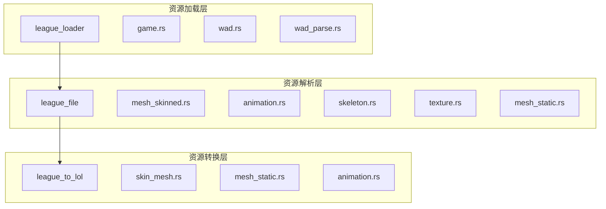
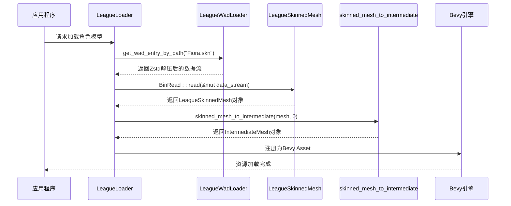
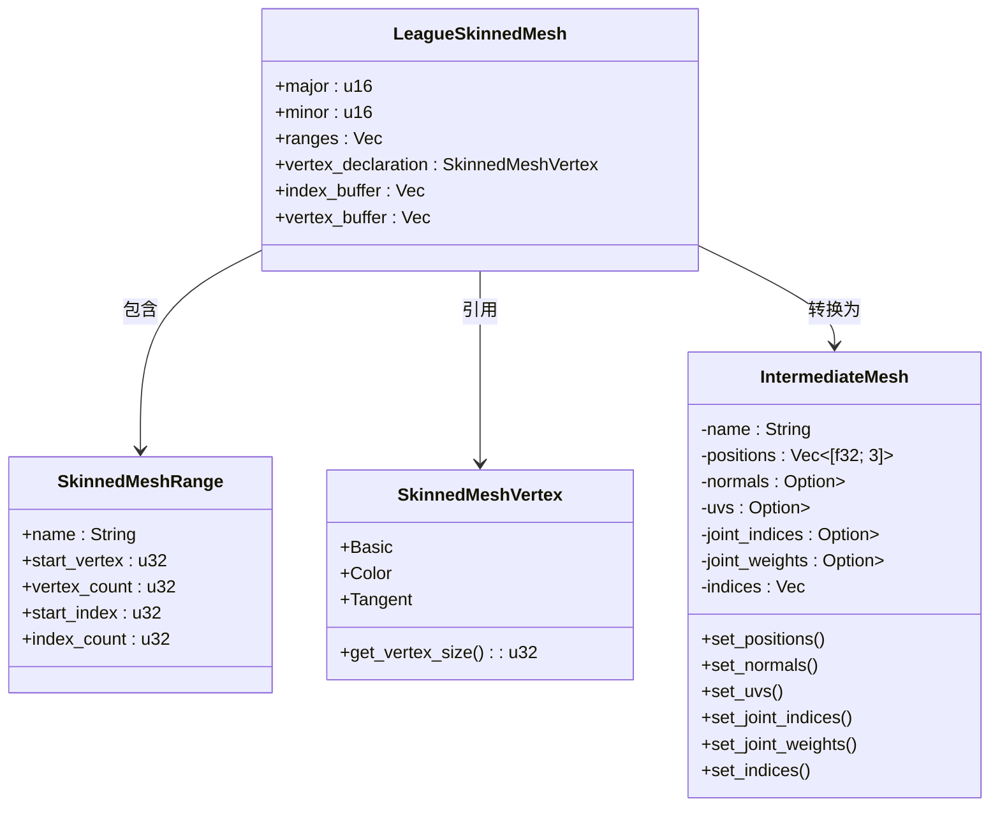
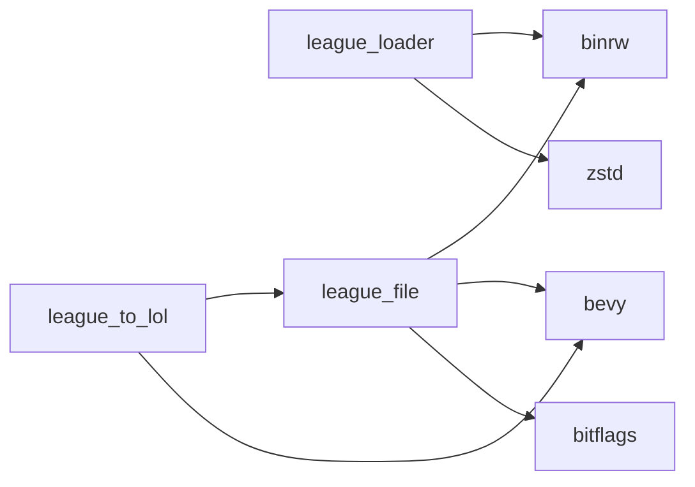

# 资源系统

<cite>
**本文档中引用的文件**  
- [wad.rs](file://crates/league_loader/src/wad.rs#L1-L147)
- [wad_parse.rs](file://crates/league_loader/src/wad_parse.rs#L1-L101)
- [lib.rs](file://crates/league_loader/src/lib.rs#L1-L27)
- [mesh_skinned.rs](file://crates/league_file/src/mesh_skinned.rs#L1-L119)
- [animation.rs](file://crates/league_file/src/animation.rs#L1-L485)
- [skeleton.rs](file://crates/league_file/src/skeleton.rs#L1-L341)
- [texture.rs](file://crates/league_file/src/texture.rs#L1-L135)
- [mesh_static.rs](file://crates/league_file/src/mesh_static.rs#L1-L182)
- [skin_mesh.rs](file://crates/league_to_lol/src/skin_mesh.rs#L1-L145)
- [mesh_static.rs](file://crates/league_to_lol/src/mesh_static.rs#L1-L99)
- [animation.rs](file://crates/league_to_lol/src/animation.rs#L1-L228)
- [game.rs](file://crates/league_loader/src/game.rs#L1-L97)
</cite>

## 目录
1. [简介](#简介)
2. [项目结构](#项目结构)
3. [核心组件](#核心组件)
4. [架构概述](#架构概述)
5. [详细组件分析](#详细组件分析)
6. [依赖分析](#依赖分析)
7. [性能考虑](#性能考虑)
8. [故障排除指南](#故障排除指南)
9. [结论](#结论)

## 简介
本文档详细阐述了《英雄联盟》游戏资源系统的实现机制，重点聚焦于`.skn`、`.skl`、`.anm`、`.tex`、`.mapgeo`等核心资源文件的加载、解析与转换流程。系统通过`league_loader` crate提供的WAD文件读取机制，结合`binrw`库进行结构化解析，最终将原始LoL数据结构转换为Bevy引擎可识别的格式。文档深入分析了从文件加载到Bevy Asset系统注册的完整调用链，涵盖了资源生命周期管理、错误处理策略和缓存优化手段。

## 项目结构
资源系统由多个Rust crate构成，形成了清晰的分层架构。`league_loader`负责底层的WAD文件读取和资源提取，`league_file`定义了各种资源文件的二进制数据结构，`league_to_lol`则负责将这些原始数据转换为引擎可用的中间格式。

**图源**
- [wad.rs](file://crates/league_loader/src/wad.rs#L1-L147)
- [mesh_skinned.rs](file://crates/league_file/src/mesh_skinned.rs#L1-L119)
- [skin_mesh.rs](file://crates/league_to_lol/src/skin_mesh.rs#L1-L145)

**本节来源**
- [wad.rs](file://crates/league_loader/src/wad.rs#L1-L147)
- [mesh_skinned.rs](file://crates/league_file/src/mesh_skinned.rs#L1-L119)
- [skin_mesh.rs](file://crates/league_to_lol/src/skin_mesh.rs#L1-L145)

## 核心组件
系统的核心组件包括WAD文件加载器、资源解析器和数据转换器。`LeagueWadLoader`是WAD文件的主加载器，它能够处理压缩（Zstd）和分块（Chunked）等多种数据格式。`league_file` crate中的各个模块（如`mesh_skinned.rs`、`animation.rs`）利用`binrw`库的声明式解析特性，将二进制流精确地映射为Rust数据结构。最后，`league_to_lol`中的转换函数将这些结构化的数据映射到Bevy引擎的`Mesh`、`AnimationClip`等资产类型。

**本节来源**
- [wad.rs](file://crates/league_loader/src/wad.rs#L1-L147)
- [mesh_skinned.rs](file://crates/league_file/src/mesh_skinned.rs#L1-L119)
- [skin_mesh.rs](file://crates/league_to_lol/src/skin_mesh.rs#L1-L145)

## 架构概述
整个资源系统遵循“加载-解析-转换”的三阶段处理流程。首先，`league_loader`从WAD文件中提取出原始的二进制数据流。接着，`league_file`利用`binrw`库的`#[binread]`宏，根据预定义的结构体布局，将二进制流解析为内存中的Rust对象。最后，`league_to_lol`模块执行转换逻辑，将这些对象适配为Bevy引擎所需的格式，例如将`LeagueSkinnedMesh`转换为包含顶点、法线、UV、骨骼索引和权重的`IntermediateMesh`。

**图源**
- [wad.rs](file://crates/league_loader/src/wad.rs#L1-L147)
- [mesh_skinned.rs](file://crates/league_file/src/mesh_skinned.rs#L1-L119)
- [skin_mesh.rs](file://crates/league_to_lol/src/skin_mesh.rs#L1-L145)

## 详细组件分析
### WAD文件加载机制
`league_loader` crate的核心是`LeagueWadLoader`，它负责处理《英雄联盟》特有的WAD打包文件。该加载器支持多种数据格式，包括未压缩、Zstd压缩和分块存储。对于`.subchunktoc`文件，它会预先加载子块信息，以便在读取分块资源时能够正确地拼接数据流。

**本节来源**
- [wad.rs](file://crates/league_loader/src/wad.rs#L1-L147)
- [wad_parse.rs](file://crates/league_loader/src/wad_parse.rs#L1-L101)

### 骨骼网格解析与转换
`LeagueSkinnedMesh`结构体定义了`.skn`文件的二进制布局，包含了顶点缓冲区、索引缓冲区、子网格范围（`SkinnedMeshRange`）和顶点声明（`SkinnedMeshVertex`）。`skinned_mesh_to_intermediate`函数负责解析这些数据，根据顶点大小和类型提取位置、法线、UV、骨骼索引、权重、颜色和切线等属性，并为每个子网格生成独立的`IntermediateMesh`。

**图源**
- [mesh_skinned.rs](file://crates/league_file/src/mesh_skinned.rs#L1-L119)
- [skin_mesh.rs](file://crates/league_to_lol/src/skin_mesh.rs#L1-L145)

### 动画数据解析
`.anm`文件的解析逻辑在`animation.rs`中实现，支持压缩（`CompressedAnimationAsset`）和未压缩（`UncompressedAnimationAsset`）两种格式。解析器会根据版本号选择相应的数据结构，并通过`decompress_quat`、`decompress_vector3`等函数将压缩的动画关键帧数据还原为`Quat`和`Vec3`。`load_animation_file`函数将解析后的数据转换为`ConfigAnimationClip`，其中包含按关节哈希分组的平移、旋转和缩放关键帧序列。

**本节来源**
- [animation.rs](file://crates/league_file/src/animation.rs#L1-L485)
- [animation.rs](file://crates/league_to_lol/src/animation.rs#L1-L228)

### 静态网格与材质
`LeagueMeshStatic`结构体用于解析`.scb`等静态网格文件。它通过`StaticMeshFaceDisk`这一中间结构来正确处理文件中分离存储的UV坐标（先X后Y）和填充字符串。`mesh_static_to_bevy_mesh`函数将面数据展开，将全局顶点索引转换为局部索引，并将BGRA格式的顶点颜色转换为Bevy使用的RGBA格式。

**本节来源**
- [mesh_static.rs](file://crates/league_file/src/mesh_static.rs#L1-L182)
- [mesh_static.rs](file://crates/league_to_lol/src/mesh_static.rs#L1-L99)

## 依赖分析
系统依赖于`binrw`库进行二进制数据的声明式解析，这极大地简化了复杂文件格式的处理。`bevy`引擎的`Asset`和`TypePath`特性被用于标记可序列化的资源类型。`zstd`库用于解压WAD文件中的Zstd压缩数据。`bitflags`库用于处理包含多个标志位的整数字段。

**图源**
- [wad.rs](file://crates/league_loader/src/wad.rs#L1-L147)
- [mesh_skinned.rs](file://crates/league_file/src/mesh_skinned.rs#L1-L119)
- [skin_mesh.rs](file://crates/league_to_lol/src/skin_mesh.rs#L1-L145)

**本节来源**
- [wad.rs](file://crates/league_loader/src/wad.rs#L1-L147)
- [mesh_skinned.rs](file://crates/league_file/src/mesh_skinned.rs#L1-L119)
- [skin_mesh.rs](file://crates/league_to_lol/src/skin_mesh.rs#L1-L145)

## 性能考虑
系统通过多种方式优化性能。首先，使用`Arc<File>`允许多个加载器共享同一个文件句柄，减少了I/O开销。其次，在解析顶点数据时，预先计算`Vec`的容量，避免了多次内存分配。对于动画数据，系统使用调色板（palette）技术，将重复的`Vec3`和`Quat`值存储在单独的数组中，动画帧只存储索引，从而大幅减小了内存占用。此外，`LeagueWadLoader`会缓存`subchunk`信息，避免了重复读取。

## 故障排除指南
常见的错误包括文件路径哈希不匹配、WAD条目未找到、二进制解析失败等。系统通过`thiserror::Error`提供了清晰的错误类型，如`Error::Io`、`Error::Binrw`和`Error::Custom`。在调试时，应首先检查WAD文件路径是否正确，然后确认资源文件的哈希值是否与代码中计算的一致。对于解析错误，需要检查`#[br(assert(...))]`断言条件是否满足，以及`#[br(map = ...)]`转换函数是否能正确处理输入数据。

**本节来源**
- [lib.rs](file://crates/league_loader/src/lib.rs#L1-L27)
- [wad.rs](file://crates/league_loader/src/wad.rs#L1-L147)
- [mesh_skinned.rs](file://crates/league_file/src/mesh_skinned.rs#L1-L119)

## 结论
该资源系统通过模块化的设计，实现了对《英雄联盟》复杂资源格式的高效加载和解析。`league_loader`提供了稳健的底层文件访问能力，`league_file`利用`binrw`实现了精确的二进制解析，而`league_to_lol`则完成了向Bevy引擎的适配。整个系统具备良好的扩展性和可维护性，为在Bevy引擎中重现《英雄联盟》的视觉效果奠定了坚实的基础。