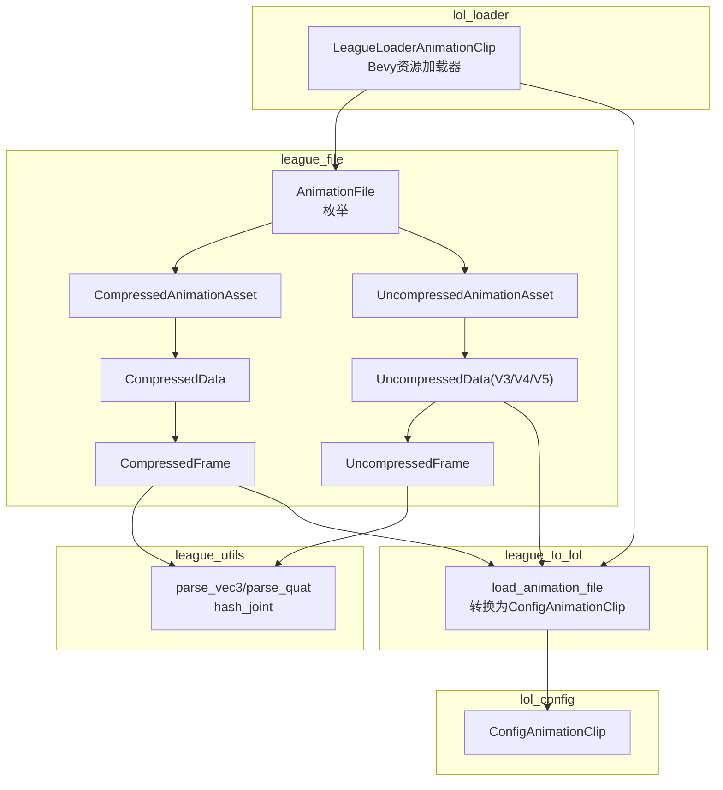
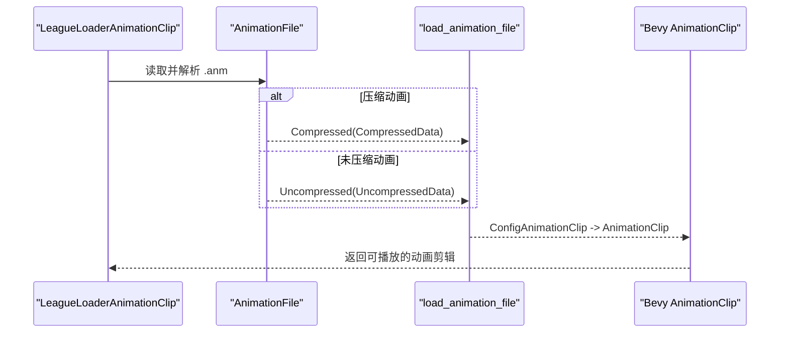
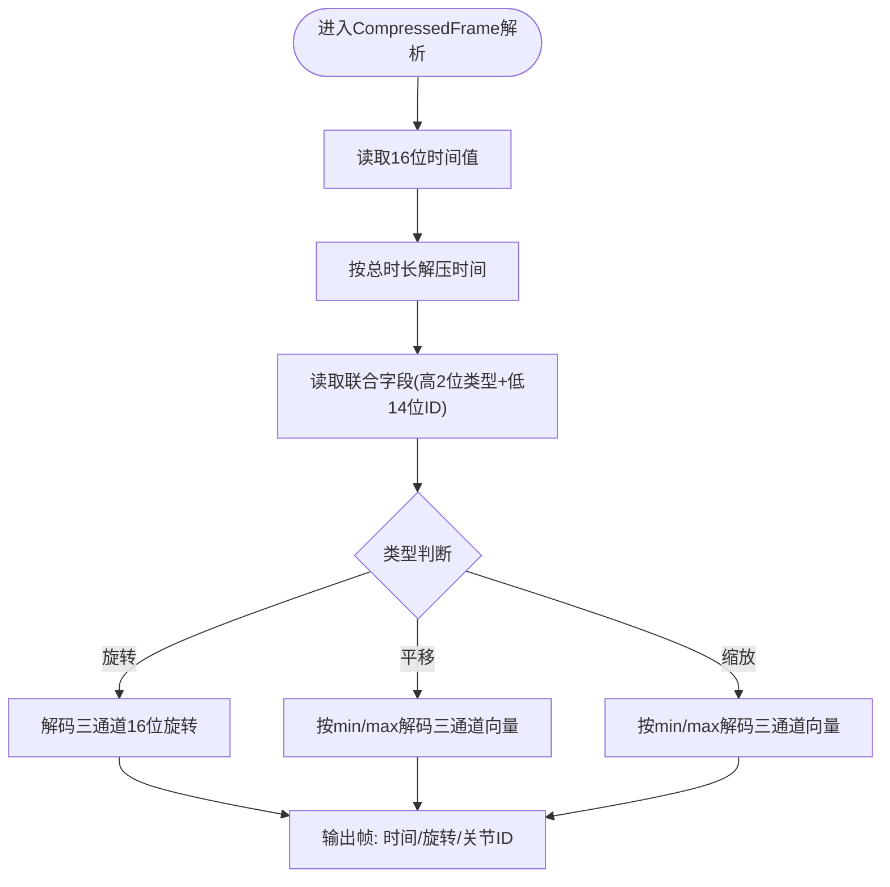
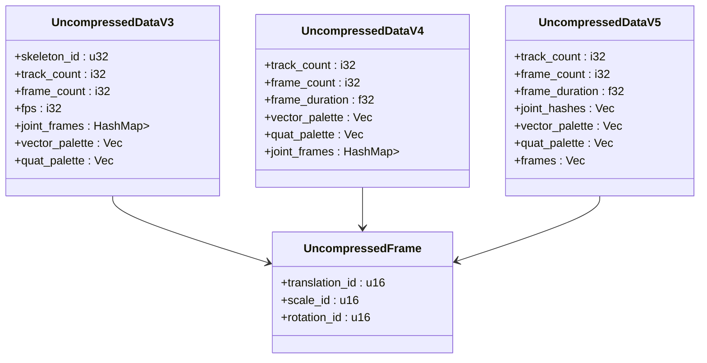
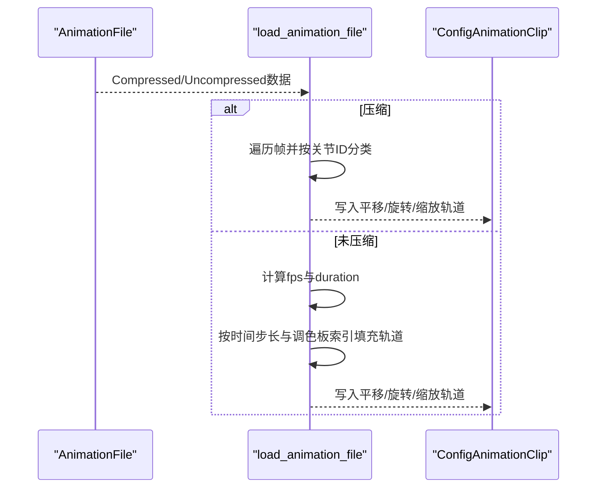
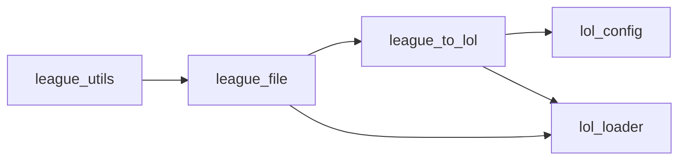

# 动画文件解析

<cite>
**本文引用的文件**
- [crates/league_file/src/animation.rs](file://crates/league_file/src/animation.rs)
- [crates/league_to_lol/src/animation.rs](file://crates/league_to_lol/src/animation.rs)
- [crates/lol_config/src/animation.rs](file://crates/lol_config/src/animation.rs)
- [crates/lol_loader/src/lib.rs](file://crates/lol_loader/src/lib.rs)
- [crates/league_utils/src/lib.rs](file://crates/league_utils/src/lib.rs)
</cite>

## 目录
1. [简介](#简介)
2. [项目结构](#项目结构)
3. [核心组件](#核心组件)
4. [架构总览](#架构总览)
5. [详细组件分析](#详细组件分析)
6. [依赖关系分析](#依赖关系分析)
7. [性能考量](#性能考量)
8. [故障排查指南](#故障排查指南)
9. [结论](#结论)
10. [附录](#附录)

## 简介
本文件面向开发者，系统化梳理 `.anm` 动画文件在本仓库中的解析与转换流程，覆盖两类格式：压缩（Compressed）与未压缩（Uncompressed）。重点说明：
- 使用魔数区分压缩与未压缩两类动画文件
- 压缩动画的帧结构与位打包策略，以及解压函数如何从16位压缩数据还原为浮点值
- 未压缩动画的版本演进（V3/V4/V5），尤其是V5的调色板索引方案
- 将解析结果转换为引擎友好的配置对象，并构建按时间排序的关键帧轨道

## 项目结构
围绕动画文件解析与转换，涉及以下模块：
- league_file：定义 .anm 文件的二进制结构、版本与解码逻辑
- league_to_lol：将 league_file 的解析结果映射为引擎可用的配置对象
- lol_config：定义引擎侧的动画配置数据模型
- lol_loader：Bevy 资源加载器，负责读取 .anm 并生成 AnimationClip
- league_utils：通用工具函数（向量/四元数解析、哈希等）

图表来源
- [crates/league_file/src/animation.rs](file://crates/league_file/src/animation.rs#L1-L120)
- [crates/league_file/src/animation.rs](file://crates/league_file/src/animation.rs#L203-L345)
- [crates/league_to_lol/src/animation.rs](file://crates/league_to_lol/src/animation.rs#L34-L228)
- [crates/lol_config/src/animation.rs](file://crates/lol_config/src/animation.rs#L1-L13)
- [crates/lol_loader/src/lib.rs](file://crates/lol_loader/src/lib.rs#L333-L398)
- [crates/league_utils/src/lib.rs](file://crates/league_utils/src/lib.rs#L1-L25)

章节来源
- [crates/league_file/src/animation.rs](file://crates/league_file/src/animation.rs#L1-L120)
- [crates/league_to_lol/src/animation.rs](file://crates/league_to_lol/src/animation.rs#L34-L228)
- [crates/lol_config/src/animation.rs](file://crates/lol_config/src/animation.rs#L1-L13)
- [crates/lol_loader/src/lib.rs](file://crates/lol_loader/src/lib.rs#L333-L398)
- [crates/league_utils/src/lib.rs](file://crates/league_utils/src/lib.rs#L1-L25)

## 核心组件
- AnimationFile 枚举：通过魔数区分压缩与未压缩两类动画文件
- CompressedAnimationAsset/CompressedData/CompressedFrame：压缩动画的数据结构与解压策略
- UncompressedAnimationAsset/UncompressedData(V3/V4/V5)/UncompressedFrame：未压缩动画的数据结构与版本差异
- load_animation_file：统一的解析与转换入口，输出 ConfigAnimationClip
- ConfigAnimationClip：引擎侧动画配置对象
- LeagueLoaderAnimationClip：Bevy 加载器，将 .anm 转换为 AnimationClip

章节来源
- [crates/league_file/src/animation.rs](file://crates/league_file/src/animation.rs#L1-L120)
- [crates/league_file/src/animation.rs](file://crates/league_file/src/animation.rs#L203-L345)
- [crates/league_to_lol/src/animation.rs](file://crates/league_to_lol/src/animation.rs#L34-L228)
- [crates/lol_config/src/animation.rs](file://crates/lol_config/src/animation.rs#L1-L13)
- [crates/lol_loader/src/lib.rs](file://crates/lol_loader/src/lib.rs#L333-L398)

## 架构总览
下图展示从 .anm 文件到引擎 AnimationClip 的端到端流程。

图表来源
- [crates/lol_loader/src/lib.rs](file://crates/lol_loader/src/lib.rs#L343-L398)
- [crates/league_file/src/animation.rs](file://crates/league_file/src/animation.rs#L1-L120)
- [crates/league_to_lol/src/animation.rs](file://crates/league_to_lol/src/animation.rs#L34-L228)

## 详细组件分析

### 1) 魔数与格式识别
- 压缩动画：魔数为固定字节序列，用于标识压缩版本
- 未压缩动画：魔数为另一组固定字节序列，用于标识未压缩版本
- 通过枚举分支在解析时自动分流到对应的数据结构

章节来源
- [crates/league_file/src/animation.rs](file://crates/league_file/src/animation.rs#L14-L19)

### 2) 压缩动画解析策略
- 版本约束：仅接受1~3版本；其他版本将触发断言失败
- 关键上下文参数：translation_min/max、scale_min/max、duration
- 帧结构 CompressedFrame：
  - 时间解压：将16位时间值线性映射到总时长
  - 数据类型：高2位表示变换类型（旋转/平移/缩放）
  - 关节点ID：低14位表示关节索引
  - 向量/缩放解压：基于min/max区间进行线性插值
  - 旋转解压：采用三通道16位打包+最大分量选择的解码策略

图表来源
- [crates/league_file/src/animation.rs](file://crates/league_file/src/animation.rs#L117-L148)
- [crates/league_file/src/animation.rs](file://crates/league_file/src/animation.rs#L449-L485)

章节来源
- [crates/league_file/src/animation.rs](file://crates/league_file/src/animation.rs#L32-L45)
- [crates/league_file/src/animation.rs](file://crates/league_file/src/animation.rs#L117-L148)
- [crates/league_file/src/animation.rs](file://crates/league_file/src/animation.rs#L449-L485)

### 3) 未压缩动画版本演进
- V3：以轨道为单位存储关键帧，使用全局调色板索引
- V4：引入帧持续时间，帧索引按时间步长线性分布
- V5：引入向量/四元调色板，帧按“时间×关节”的二维布局存储，便于直接索引

图表来源
- [crates/league_file/src/animation.rs](file://crates/league_file/src/animation.rs#L225-L345)

章节来源
- [crates/league_file/src/animation.rs](file://crates/league_file/src/animation.rs#L225-L345)

### 4) 解析到引擎配置的转换流程
- 压缩动画：遍历所有帧，按关节ID写入平移/旋转/缩放轨道
- 未压缩动画：
  - V3：按帧索引线性计算时间，从调色板索引取值
  - V4：按帧索引乘以帧持续时间计算时间
  - V5：按时间×关节顺序访问帧，再从调色板索引取值
- 输出 ConfigAnimationClip，包含帧率、时长、关节哈希列表及三条轨道

图表来源
- [crates/league_to_lol/src/animation.rs](file://crates/league_to_lol/src/animation.rs#L34-L228)
- [crates/lol_config/src/animation.rs](file://crates/lol_config/src/animation.rs#L1-L13)

章节来源
- [crates/league_to_lol/src/animation.rs](file://crates/league_to_lol/src/animation.rs#L34-L228)
- [crates/lol_config/src/animation.rs](file://crates/lol_config/src/animation.rs#L1-L13)

### 5) Bevy 加载器集成
- LeagueLoaderAnimationClip 读取 .anm 字节流，解析为 AnimationFile
- 调用 load_animation_file 得到 ConfigAnimationClip
- 将三条轨道分别添加到 AnimationClip 的曲线中，目标为关节哈希对应的 UUID

章节来源
- [crates/lol_loader/src/lib.rs](file://crates/lol_loader/src/lib.rs#L343-L398)

## 依赖关系分析
- league_file 依赖 league_utils 提供的向量/四元数解析与关节哈希函数
- league_to_lol 依赖 league_file 的解析结果与 lol_config 的配置模型
- lol_loader 依赖 league_file 的解析结果与 league_to_lol 的转换函数

图表来源
- [crates/league_file/src/animation.rs](file://crates/league_file/src/animation.rs#L1-L120)
- [crates/league_to_lol/src/animation.rs](file://crates/league_to_lol/src/animation.rs#L34-L228)
- [crates/lol_config/src/animation.rs](file://crates/lol_config/src/animation.rs#L1-L13)
- [crates/lol_loader/src/lib.rs](file://crates/lol_loader/src/lib.rs#L333-L398)
- [crates/league_utils/src/lib.rs](file://crates/league_utils/src/lib.rs#L1-L25)

章节来源
- [crates/league_file/src/animation.rs](file://crates/league_file/src/animation.rs#L1-L120)
- [crates/league_to_lol/src/animation.rs](file://crates/league_to_lol/src/animation.rs#L34-L228)
- [crates/lol_config/src/animation.rs](file://crates/lol_config/src/animation.rs#L1-L13)
- [crates/lol_loader/src/lib.rs](file://crates/lol_loader/src/lib.rs#L333-L398)
- [crates/league_utils/src/lib.rs](file://crates/league_utils/src/lib.rs#L1-L25)

## 性能考量
- 压缩动画采用16位量化与调色板索引，显著降低存储体积，解压成本低
- 未压缩动画V5采用连续内存布局，按时间×关节顺序访问，缓存友好
- 轨道构建阶段避免重复拷贝，尽量复用已有的向量/四元数组
- Bevy 曲线构建仅在关键帧数量≥2时创建，减少运行时开销

## 故障排查指南
- 版本不支持：压缩动画仅支持1~3版本，其他版本会触发断言失败
  - 参考路径：[crates/league_file/src/animation.rs](file://crates/league_file/src/animation.rs#L32-L45)
- 关节索引越界：压缩动画转换时若关节ID超出范围会触发异常
  - 参考路径：[crates/league_to_lol/src/animation.rs](file://crates/league_to_lol/src/animation.rs#L44-L53)
- V5轨道数量校验：V5中关节哈希数量必须等于轨道数量，否则断言失败
  - 参考路径：[crates/league_to_lol/src/animation.rs](file://crates/league_to_lol/src/animation.rs#L180-L185)
- 二进制读取错误：Bevy 加载器捕获 binrw 错误并向上抛出
  - 参考路径：[crates/lol_loader/src/lib.rs](file://crates/lol_loader/src/lib.rs#L333-L398)

章节来源
- [crates/league_file/src/animation.rs](file://crates/league_file/src/animation.rs#L32-L45)
- [crates/league_to_lol/src/animation.rs](file://crates/league_to_lol/src/animation.rs#L44-L53)
- [crates/league_to_lol/src/animation.rs](file://crates/league_to_lol/src/animation.rs#L180-L185)
- [crates/lol_loader/src/lib.rs](file://crates/lol_loader/src/lib.rs#L333-L398)

## 结论
本仓库对 .anm 动画文件提供了完整的解析与转换链路：通过魔数快速识别格式，借助压缩/未压缩的不同策略高效还原关键帧，最终统一输出为引擎友好的配置对象。V5版本进一步优化了存储与访问模式，适合大规模角色动画管线。建议在实际工程中：
- 明确 .anm 版本与格式，确保解析分支正确
- 在转换阶段严格校验索引与数量，避免运行期崩溃
- 利用调色板索引与连续布局，提升加载与播放性能

## 附录

### A. 关键帧索引与时间计算要点
- 压缩动画：时间由16位线性映射至总时长；关节ID来自联合字段低14位
  - 参考路径：[crates/league_file/src/animation.rs](file://crates/league_file/src/animation.rs#L117-L148)
- 未压缩动画V3：按帧索引除以fps计算时间
  - 参考路径：[crates/league_to_lol/src/animation.rs](file://crates/league_to_lol/src/animation.rs#L79-L84)
- 未压缩动画V4/V5：按帧索引乘以帧持续时间计算时间
  - 参考路径：[crates/league_to_lol/src/animation.rs](file://crates/league_to_lol/src/animation.rs#L124-L129)

### B. 调色板与解码函数
- 向量/缩放解码：基于min/max区间进行线性插值
  - 参考路径：[crates/league_file/src/animation.rs](file://crates/league_file/src/animation.rs#L453-L461)
- 旋转解码：三通道16位打包+最大分量选择，恢复四元数
  - 参考路径：[crates/league_file/src/animation.rs](file://crates/league_file/src/animation.rs#L463-L485)

### C. 关节哈希与工具函数
- 关节名称哈希：用于将字符串关节名映射为u32键
  - 参考路径：[crates/league_utils/src/lib.rs](file://crates/league_utils/src/lib.rs#L45-L56)
- 向量/四元解析：将原始数组解析为引擎向量/四元数
  - 参考路径：[crates/league_utils/src/lib.rs](file://crates/league_utils/src/lib.rs#L11-L25)