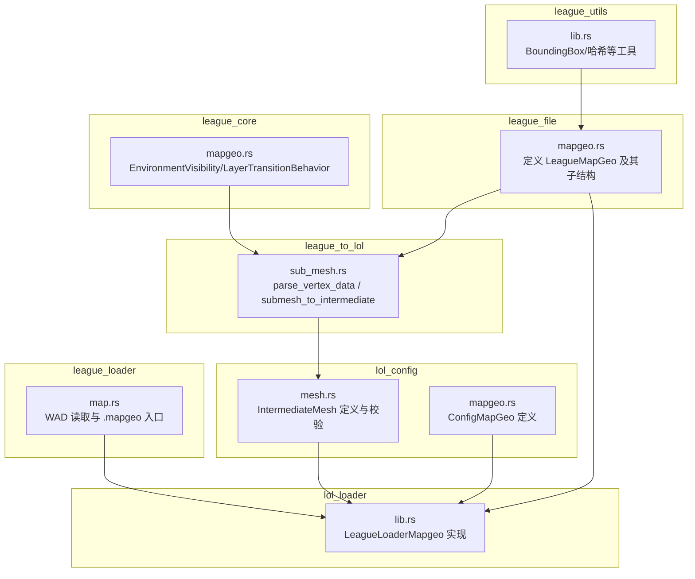
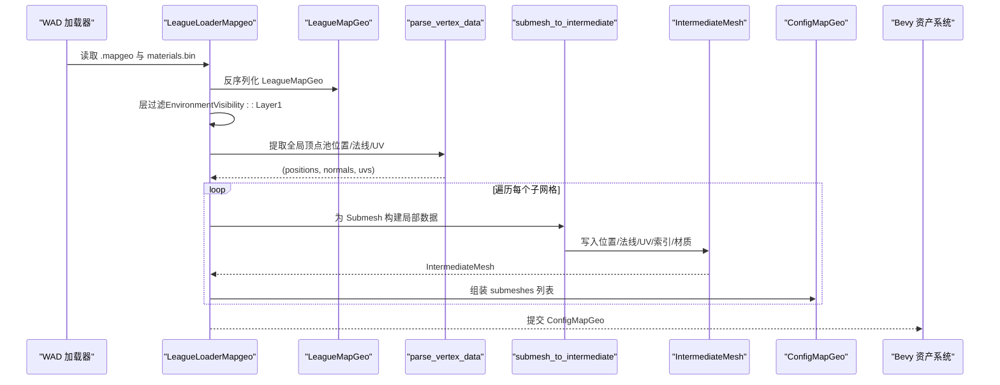
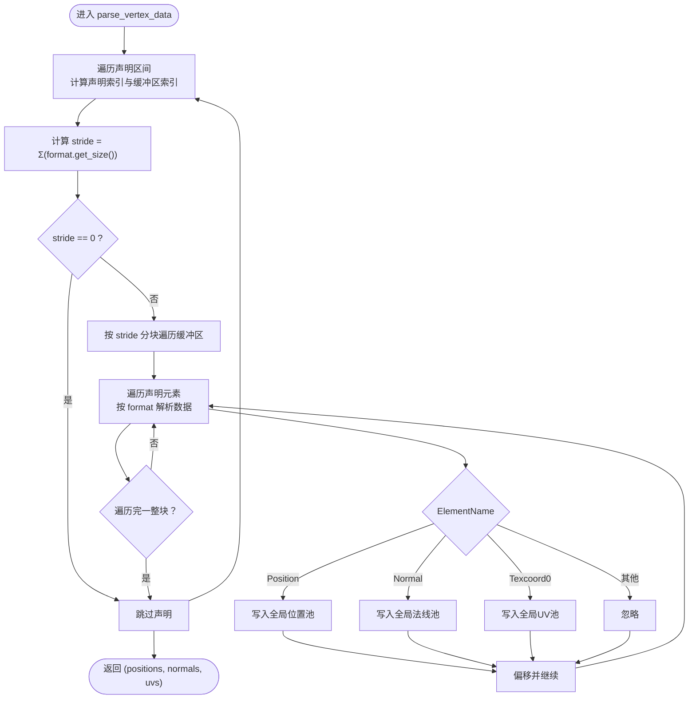
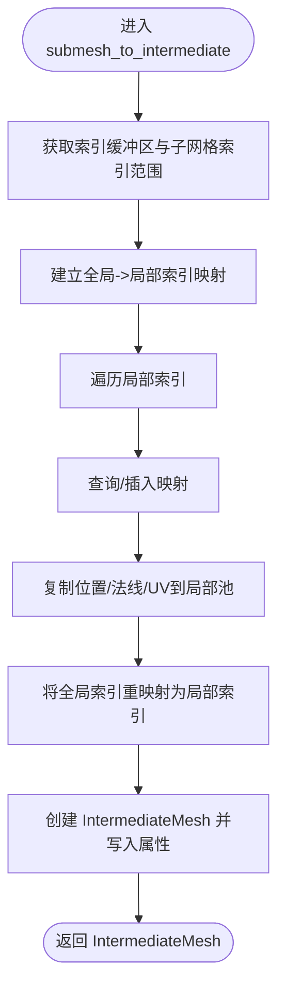
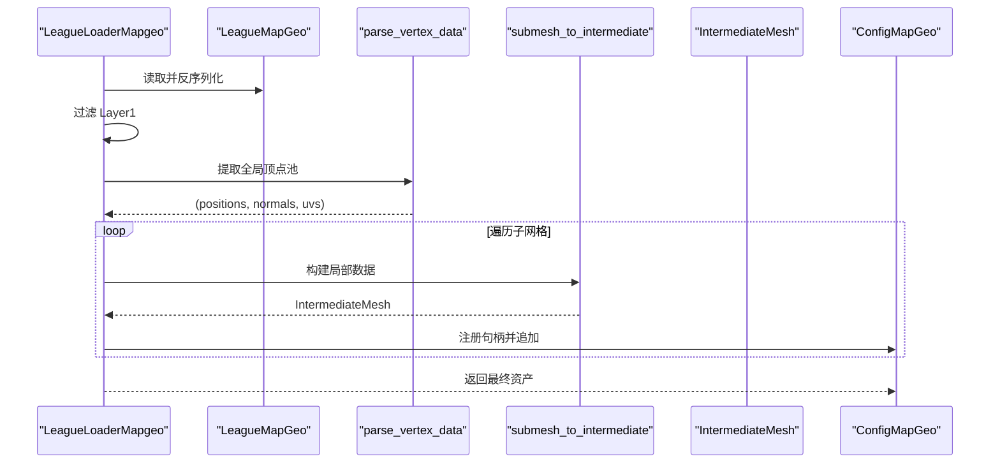
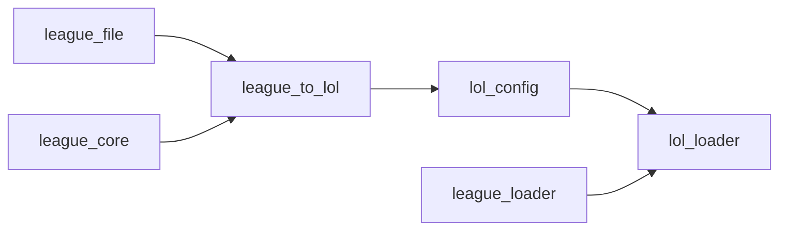

# 地图几何解析

<cite>
**本文引用的文件**
- [crates/league_file/src/mapgeo.rs](file://crates/league_file/src/mapgeo.rs)
- [crates/league_core/src/mapgeo.rs](file://crates/league_core/src/mapgeo.rs)
- [crates/league_to_lol/src/sub_mesh.rs](file://crates/league_to_lol/src/sub_mesh.rs)
- [crates/lol_config/src/mesh.rs](file://crates/lol_config/src/mesh.rs)
- [crates/lol_config/src/mapgeo.rs](file://crates/lol_config/src/mapgeo.rs)
- [crates/league_loader/src/map.rs](file://crates/league_loader/src/map.rs)
- [crates/lol_loader/src/lib.rs](file://crates/lol_loader/src/lib.rs)
- [crates/league_utils/src/lib.rs](file://crates/league_utils/src/lib.rs)
</cite>

## 目录
1. [简介](#简介)
2. [项目结构](#项目结构)
3. [核心组件](#核心组件)
4. [架构总览](#架构总览)
5. [详细组件分析](#详细组件分析)
6. [依赖关系分析](#依赖关系分析)
7. [性能考量](#性能考量)
8. [故障排查指南](#故障排查指南)
9. [结论](#结论)

## 简介
本文件面向地图几何（MapGeo）文件解析的深度技术文档，聚焦于“.mapgeo”文件的复杂场景加载与处理流程。文档系统性阐述以下要点：
- LeagueMapGeo 结构体如何组织多个 meshes、vertex_buffers、index_buffers 和 vertex_declarations；
- VertexDeclaration 如何定义顶点属性（位置、法线、UV）的布局，ElementName 与 ElementFormat 如何共同决定属性的语义与数据类型；
- LeagueMapGeoMesh 如何通过 vertex_buffer_indexes 关联到具体顶点缓冲区，并通过 submeshes 定义渲染批次；
- 在 league_to_lol 中，parse_vertex_data 与 submesh_to_intermediate 如何遍历所有顶点声明与缓冲区，提取全局顶点位置、法线与 UV 数据池，并为每个子网格（Submesh）创建独立的 IntermediateMesh；
- 在 lol_loader 中，LeagueLoaderMapgeo 资产加载器如何利用上述中间结构，结合 environment_visibility 等标志位进行过滤，最终生成 Bevy 引擎可用的 ConfigMapGeo 资产；
- 提供处理复杂顶点布局与子网格分离的流程图与序列图，帮助读者快速掌握关键实现路径。

## 项目结构
围绕 MapGeo 文件解析的关键模块分布如下：
- league_file：定义 .mapgeo 的二进制结构与枚举（如 ElementName、ElementFormat、VertexDeclaration、VertexBuffer、IndexBuffer、LeagueMapGeoMesh、Submesh 等），并使用 binrw 进行高效反序列化。
- league_core：提供环境可见性与层过渡行为等核心枚举与位掩码。
- league_to_lol：实现从 LeagueMapGeo 到中间结构 IntermediateMesh 的转换逻辑，包括全局顶点池提取与子网格拆分。
- lol_config：定义中间结构 IntermediateMesh 以及最终输出的 ConfigMapGeo，负责数据校验与转换为 Bevy Mesh。
- lol_loader：Bevy 资产加载器，负责读取 .mapgeo 并按层过滤后生成 ConfigMapGeo。
- league_loader：WAD 加载与 .mapgeo 入口读取辅助工具。
- league_utils：通用工具（如 BoundingBox、字符串哈希等）。

图表来源
- [crates/league_file/src/mapgeo.rs](file://crates/league_file/src/mapgeo.rs#L1-L342)
- [crates/league_core/src/mapgeo.rs](file://crates/league_core/src/mapgeo.rs#L1-L36)
- [crates/league_to_lol/src/sub_mesh.rs](file://crates/league_to_lol/src/sub_mesh.rs#L1-L151)
- [crates/lol_config/src/mesh.rs](file://crates/lol_config/src/mesh.rs#L1-L310)
- [crates/lol_config/src/mapgeo.rs](file://crates/lol_config/src/mapgeo.rs#L1-L8)
- [crates/lol_loader/src/lib.rs](file://crates/lol_loader/src/lib.rs#L1-L502)
- [crates/league_loader/src/map.rs](file://crates/league_loader/src/map.rs#L1-L53)
- [crates/league_utils/src/lib.rs](file://crates/league_utils/src/lib.rs#L1-L143)

章节来源
- [crates/league_file/src/mapgeo.rs](file://crates/league_file/src/mapgeo.rs#L1-L342)
- [crates/league_core/src/mapgeo.rs](file://crates/league_core/src/mapgeo.rs#L1-L36)
- [crates/league_to_lol/src/sub_mesh.rs](file://crates/league_to_lol/src/sub_mesh.rs#L1-L151)
- [crates/lol_config/src/mesh.rs](file://crates/lol_config/src/mesh.rs#L1-L310)
- [crates/lol_config/src/mapgeo.rs](file://crates/lol_config/src/mapgeo.rs#L1-L8)
- [crates/lol_loader/src/lib.rs](file://crates/lol_loader/src/lib.rs#L1-L502)
- [crates/league_loader/src/map.rs](file://crates/league_loader/src/map.rs#L1-L53)
- [crates/league_utils/src/lib.rs](file://crates/league_utils/src/lib.rs#L1-L143)

## 核心组件
- LeagueMapGeo：顶层容器，包含采样器、顶点声明、顶点缓冲区、索引缓冲区、网格数组、场景图、平面反射器等。
- VertexDeclaration / VertexElement：定义顶点布局，元素由 ElementName（语义）与 ElementFormat（数据类型）组成。
- VertexBuffer / IndexBuffer：承载原始顶点与索引数据，附带环境可见性标志。
- LeagueMapGeoMesh：描述单个网格，包含顶点声明索引基址、顶点缓冲区索引映射、索引缓冲区 ID、子网格数组、包围盒、质量过滤、层过渡行为等。
- Submesh：描述渲染批次，包含材质名、起始索引、索引数量、最小/最大顶点索引等。
- IntermediateMesh：中间结构，统一管理位置、法线、UV、索引、材质信息等，提供校验与转换为 Bevy Mesh 的能力。
- ConfigMapGeo：最终资产，包含若干（Bevy Mesh 句柄, 材质名, AABB）三元组。

章节来源
- [crates/league_file/src/mapgeo.rs](file://crates/league_file/src/mapgeo.rs#L1-L342)
- [crates/lol_config/src/mesh.rs](file://crates/lol_config/src/mesh.rs#L1-L310)
- [crates/lol_config/src/mapgeo.rs](file://crates/lol_config/src/mapgeo.rs#L1-L8)

## 架构总览
下图展示了从 .mapgeo 文件到 Bevy 资产的完整流程，包括 WAD 读取、层过滤、顶点池提取、子网格拆分与中间结构校验。

图表来源
- [crates/league_loader/src/map.rs](file://crates/league_loader/src/map.rs#L1-L53)
- [crates/lol_loader/src/lib.rs](file://crates/lol_loader/src/lib.rs#L130-L193)
- [crates/league_to_lol/src/sub_mesh.rs](file://crates/league_to_lol/src/sub_mesh.rs#L1-L151)
- [crates/lol_config/src/mesh.rs](file://crates/lol_config/src/mesh.rs#L263-L310)
- [crates/lol_config/src/mapgeo.rs](file://crates/lol_config/src/mapgeo.rs#L1-L8)

## 详细组件分析

### 1) LeagueMapGeo 与子结构组织
- LeagueMapGeo 以“块头 + 多个数组”的形式组织资源，数组长度由计数字段指定，便于批量反序列化。
- vertex_declarations 描述顶点布局；vertex_buffers/index_buffers 存放原始数据；meshes 描述网格集合。
- 每个 mesh 通过 vertex_declaration_index_base 与 vertex_buffer_indexes 将声明与缓冲区关联起来，形成“声明-缓冲区”对。

章节来源
- [crates/league_file/src/mapgeo.rs](file://crates/league_file/src/mapgeo.rs#L1-L120)
- [crates/league_file/src/mapgeo.rs](file://crates/league_file/src/mapgeo.rs#L223-L272)

### 2) 顶点声明与数据类型：ElementName 与 ElementFormat
- ElementName：定义属性语义，如 Position、Normal、Texcoord0 等。
- ElementFormat：定义数据类型与字节宽度，例如 Float32、Packed8888、Packed161616 等。
- VertexDeclaration.elements 有序排列，每个元素携带 name 与 format；通过 format.get_size() 可计算单个顶点的步长（stride）。

章节来源
- [crates/league_file/src/mapgeo.rs](file://crates/league_file/src/mapgeo.rs#L116-L222)
- [crates/league_file/src/mapgeo.rs](file://crates/league_file/src/mapgeo.rs#L160-L222)

### 3) LeagueMapGeoMesh 的索引与子网格
- mesh.vertex_buffer_indexes 与 vertex_declarations 对应，指示该网格使用的顶点缓冲区索引。
- mesh.index_buffer_id 指向全局索引缓冲区，子网格通过 start_index 与 submesh_index_count 指定局部索引范围。
- submeshes 定义渲染批次，包含材质名、索引范围与顶点范围，用于后续拆分为独立的中间网格。

章节来源
- [crates/league_file/src/mapgeo.rs](file://crates/league_file/src/mapgeo.rs#L223-L287)

### 4) 全局顶点池提取：parse_vertex_data
- 该函数遍历 mesh 的声明区间，根据 vertex_declaration_index_base 与 vertex_buffer_indexes 获取对应的声明与缓冲区。
- 计算 stride 后按块遍历缓冲区，逐元素解析位置、法线与 UV（Texcoord0），填充全局 positions/normals/uvs。
- 仅当 stride > 0 时才处理，避免无效声明。

图表来源
- [crates/league_to_lol/src/sub_mesh.rs](file://crates/league_to_lol/src/sub_mesh.rs#L80-L151)

章节来源
- [crates/league_to_lol/src/sub_mesh.rs](file://crates/league_to_lol/src/sub_mesh.rs#L80-L151)

### 5) 子网格拆分与中间结构：submesh_to_intermediate
- 该函数基于子网格的索引范围，从全局索引池中提取局部索引。
- 使用全局到局部的映射，仅保留子网格实际使用的顶点，重建局部 positions/normals/uvs。
- 将局部索引重映射为连续索引，构建 IntermediateMesh，并设置材质信息。

图表来源
- [crates/league_to_lol/src/sub_mesh.rs](file://crates/league_to_lol/src/sub_mesh.rs#L1-L78)

章节来源
- [crates/league_to_lol/src/sub_mesh.rs](file://crates/league_to_lol/src/sub_mesh.rs#L1-L78)

### 6) 中间结构与最终资产：IntermediateMesh 与 ConfigMapGeo
- IntermediateMesh 提供统一的数据容器，包含位置、法线、UV、索引、材质信息等，并提供 validate 校验（长度一致性、索引边界、三角形数量约束等）。
- IntermediateMesh 可转换为 Bevy Mesh，插入 POSITION/NORMAL/UV/COLOR/TANGENT/JOINT_INDEX/JOINT_WEIGHT 等属性。
- ConfigMapGeo 保存若干（Mesh 句柄, 材质名, AABB）三元组，供运行时渲染与 UI 绑定使用。

章节来源
- [crates/lol_config/src/mesh.rs](file://crates/lol_config/src/mesh.rs#L1-L310)
- [crates/lol_config/src/mapgeo.rs](file://crates/lol_config/src/mapgeo.rs#L1-L8)

### 7) 资产加载器：LeagueLoaderMapgeo
- 读取 .mapgeo 与 materials.bin，按 Layer1 过滤（EnvironmentVisibility::Layer1）。
- 对每个网格调用 parse_vertex_data 提取全局顶点池，再对每个子网格调用 submesh_to_intermediate 生成中间网格。
- 将中间网格转换为 Bevy Mesh 并注册句柄，组装 ConfigMapGeo 返回。

图表来源
- [crates/lol_loader/src/lib.rs](file://crates/lol_loader/src/lib.rs#L130-L193)
- [crates/league_to_lol/src/sub_mesh.rs](file://crates/league_to_lol/src/sub_mesh.rs#L1-L151)

章节来源
- [crates/lol_loader/src/lib.rs](file://crates/lol_loader/src/lib.rs#L130-L193)

### 8) 复杂顶点布局与子网格分离的代码示例路径
- 全局顶点池提取：参见 [crates/league_to_lol/src/sub_mesh.rs](file://crates/league_to_lol/src/sub_mesh.rs#L80-L151)
- 子网格拆分与局部索引重映射：参见 [crates/league_to_lol/src/sub_mesh.rs](file://crates/league_to_lol/src/sub_mesh.rs#L1-L78)
- 中间结构校验与转换为 Bevy Mesh：参见 [crates/lol_config/src/mesh.rs](file://crates/lol_config/src/mesh.rs#L190-L310)
- 资产加载器主流程：参见 [crates/lol_loader/src/lib.rs](file://crates/lol_loader/src/lib.rs#L139-L188)

章节来源
- [crates/league_to_lol/src/sub_mesh.rs](file://crates/league_to_lol/src/sub_mesh.rs#L1-L151)
- [crates/lol_config/src/mesh.rs](file://crates/lol_config/src/mesh.rs#L190-L310)
- [crates/lol_loader/src/lib.rs](file://crates/lol_loader/src/lib.rs#L139-L188)

## 依赖关系分析
- league_file 与 league_core：前者定义 .mapgeo 结构与枚举，后者提供环境可见性与层过渡行为。
- league_to_lol：依赖 league_file 的结构与 league_core 的枚举，实现 parse_vertex_data 与 submesh_to_intermediate。
- lol_config：定义 IntermediateMesh 与 ConfigMapGeo，承接 league_to_lol 的中间结果并提供校验与转换。
- lol_loader：依赖 league_file、league_to_lol、lol_config，完成 .mapgeo 的资产加载与层过滤。
- league_loader：提供 WAD 读取与 .mapgeo 入口，辅助 lol_loader 定位与解压 .mapgeo。

图表来源
- [crates/league_file/src/mapgeo.rs](file://crates/league_file/src/mapgeo.rs#L1-L342)
- [crates/league_core/src/mapgeo.rs](file://crates/league_core/src/mapgeo.rs#L1-L36)
- [crates/league_to_lol/src/sub_mesh.rs](file://crates/league_to_lol/src/sub_mesh.rs#L1-L151)
- [crates/lol_config/src/mesh.rs](file://crates/lol_config/src/mesh.rs#L1-L310)
- [crates/lol_loader/src/lib.rs](file://crates/lol_loader/src/lib.rs#L1-L502)
- [crates/league_loader/src/map.rs](file://crates/league_loader/src/map.rs#L1-L53)

章节来源
- [crates/league_file/src/mapgeo.rs](file://crates/league_file/src/mapgeo.rs#L1-L342)
- [crates/league_core/src/mapgeo.rs](file://crates/league_core/src/mapgeo.rs#L1-L36)
- [crates/league_to_lol/src/sub_mesh.rs](file://crates/league_to_lol/src/sub_mesh.rs#L1-L151)
- [crates/lol_config/src/mesh.rs](file://crates/lol_config/src/mesh.rs#L1-L310)
- [crates/lol_loader/src/lib.rs](file://crates/lol_loader/src/lib.rs#L1-L502)
- [crates/league_loader/src/map.rs](file://crates/league_loader/src/map.rs#L1-L53)

## 性能考量
- 步长计算与按块遍历：parse_vertex_data 通过 format.get_size() 计算 stride 并按块遍历，减少重复计算与内存拷贝。
- 局部索引重映射：submesh_to_intermediate 使用 HashMap 建立全局->局部映射，避免重复顶点，降低中间网格体积。
- 预分配策略：在 parse_vertex_data 中未预分配容量，可简化实现；若顶点规模较大，可在已知顶点数时预估容量以减少扩容成本。
- 层过滤：在 lol_loader 中按 Layer1 过滤，减少不必要的子网格处理与资产注册。

[本节为通用性能建议，不直接分析具体文件]

## 故障排查指南
- 索引越界：IntermediateMesh.validate 会检查索引是否超出顶点数量，若报错需检查子网格索引范围与全局索引映射。
- 三角形数量异常：validate 会确保索引数量为 3 的倍数，否则需确认索引数据来源与拆分逻辑。
- 顶点属性长度不一致：validate 会逐一核对 positions/normals/uvs/colors/tangents/joint_indices/joint_weights 的长度，不一致会导致错误。
- 层过滤导致无子网格：若 EnvironmentVisibility 不包含 Layer1，lol_loader 将跳过该网格，需确认目标层设置。

章节来源
- [crates/lol_config/src/mesh.rs](file://crates/lol_config/src/mesh.rs#L190-L260)
- [crates/lol_loader/src/lib.rs](file://crates/lol_loader/src/lib.rs#L152-L188)

## 结论
本文件系统梳理了 .mapgeo 文件的解析与转换链路，从 LeagueMapGeo 的结构组织，到 VertexDeclaration/ElementName/ElementFormat 的布局定义，再到 parse_vertex_data 与 submesh_to_intermediate 的全局池提取与子网格拆分，最终在 lol_loader 中完成层过滤与资产生成。IntermediateMesh 提供了严格的校验与转换能力，确保中间数据与最终 Bevy Mesh 的一致性。通过上述流程，复杂场景的地图几何得以稳定、高效地接入 Bevy 渲染管线。