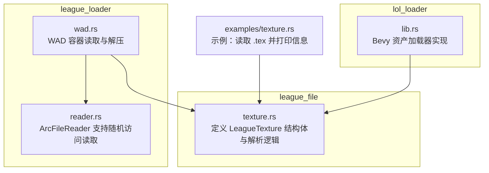
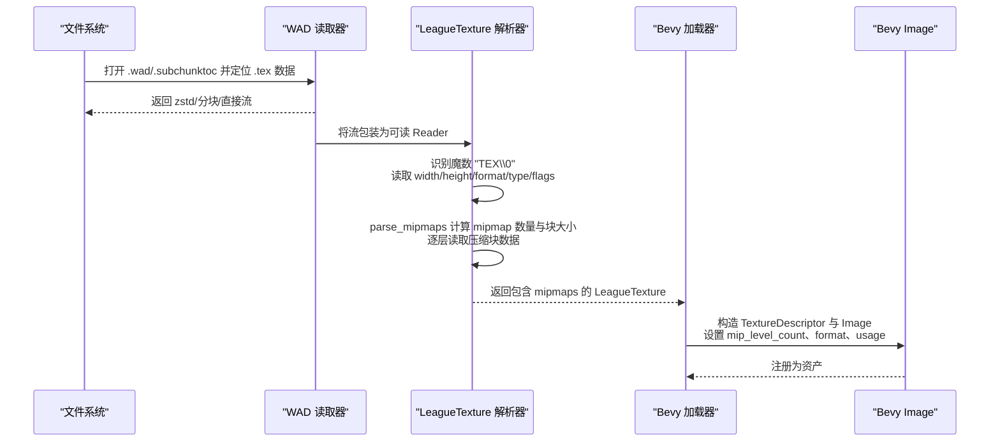
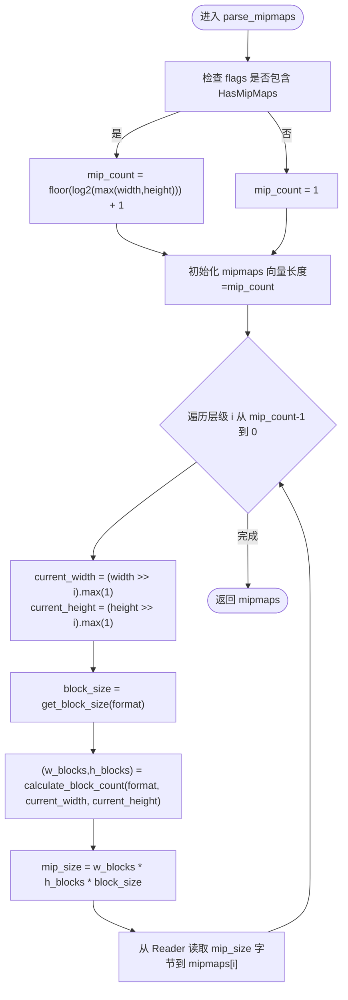
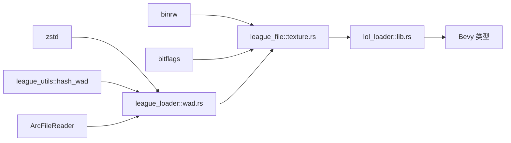

# 纹理文件解析

<cite>
**本文引用的文件**
- [crates/league_file/src/texture.rs](file://crates/league_file/src/texture.rs)
- [examples/texture.rs](file://examples/texture.rs)
- [crates/lol_loader/src/lib.rs](file://crates/lol_loader/src/lib.rs)
- [crates/league_loader/src/wad.rs](file://crates/league_loader/src/wad.rs)
- [crates/league_loader/src/reader.rs](file://crates/league_loader/src/reader.rs)
</cite>

## 目录
1. [简介](#简介)
2. [项目结构](#项目结构)
3. [核心组件](#核心组件)
4. [架构总览](#架构总览)
5. [详细组件分析](#详细组件分析)
6. [依赖关系分析](#依赖关系分析)
7. [性能考量](#性能考量)
8. [故障排查指南](#故障排查指南)
9. [结论](#结论)
10. [附录](#附录)

## 简介
本文件聚焦于 League 游戏资源中 .tex 纹理文件的解析技术细节，围绕以下目标展开：
- 解释如何通过魔数“TEX\0”识别 .tex 文件；
- 阐述关键元数据字段：宽度、高度、格式（如 BC1、BC3、BGRA8）、资源类型（2D、Cube 等）与标志位（是否含 mipmap）；
- 深入解析 parse_mipmaps 如何依据格式计算每个 mipmap 层的块数量与大小，并正确读取压缩纹理数据块（BC1/BC3 的 8/16 字节块）；
- 说明 calculate_block_count 对非 4 的倍数尺寸的处理策略；
- 描述 mipmaps 向量按从最小层级到最大层级的顺序存储；
- 提供从文件读取到生成包含原始压缩数据的 mipmaps 的完整流程示例，并说明如何将结果转换为 Bevy 引擎的 Image 资源。

## 项目结构
与纹理解析直接相关的核心模块位于以下路径：
- 文本解析与二进制读取：crates/league_file/src/texture.rs
- 示例用法：examples/texture.rs
- Bevy 加载器：crates/lol_loader/src/lib.rs
- WAD 容器读取与解压：crates/league_loader/src/wad.rs、crates/league_loader/src/reader.rs

图表来源
- [crates/league_file/src/texture.rs](file://crates/league_file/src/texture.rs#L1-L135)
- [examples/texture.rs](file://examples/texture.rs#L1-L19)
- [crates/lol_loader/src/lib.rs](file://crates/lol_loader/src/lib.rs#L252-L331)
- [crates/league_loader/src/wad.rs](file://crates/league_loader/src/wad.rs#L1-L147)
- [crates/league_loader/src/reader.rs](file://crates/league_loader/src/reader.rs#L1-L64)

章节来源
- [crates/league_file/src/texture.rs](file://crates/league_file/src/texture.rs#L1-L135)
- [examples/texture.rs](file://examples/texture.rs#L1-L19)
- [crates/lol_loader/src/lib.rs](file://crates/lol_loader/src/lib.rs#L252-L331)
- [crates/league_loader/src/wad.rs](file://crates/league_loader/src/wad.rs#L1-L147)
- [crates/league_loader/src/reader.rs](file://crates/league_loader/src/reader.rs#L1-L64)

## 核心组件
- LeagueTexture：.tex 文件的根结构，包含魔数识别、尺寸、格式、资源类型、标志位，以及通过自定义解析器读取的 mipmaps。
- LeagueTextureFormat：枚举了支持的纹理格式（ETC1、ETC2/EAC、BC1、BC3、BGRA8）。
- LeagueTextureType：枚举了资源类型（Texture、Cube、Surface、Volume）。
- LeagueTextureFlags：位标志，HasMipMaps 表示是否包含 mipmap。
- parse_mipmaps：自定义解析器，负责根据 flags 计算 mipmap 数量，逐层读取压缩块数据。
- calculate_block_count：根据格式与当前尺寸计算每层的块数量（对 BC1/BC3 和 ETC1/ETC2 使用 4x4 块，BGRA8 使用像素块）。
- get_block_size：返回每块字节数（BC1=8、BC3=16、ETC1/ETC2=8、BGRA8=4）。

章节来源
- [crates/league_file/src/texture.rs](file://crates/league_file/src/texture.rs#L6-L135)

## 架构总览
下图展示了从文件输入到 Bevy Image 资源的端到端流程，包括 .tex 解析与 WAD 容器读取。

图表来源
- [crates/league_loader/src/wad.rs](file://crates/league_loader/src/wad.rs#L1-L147)
- [crates/league_file/src/texture.rs](file://crates/league_file/src/texture.rs#L6-L135)
- [crates/lol_loader/src/lib.rs](file://crates/lol_loader/src/lib.rs#L252-L331)

## 详细组件分析

### LeagueTexture 结构体与魔数识别
- 魔数识别：使用 binrw 的 #[br(magic = b"TEX\0")] 在文件开头校验魔数，确保是 .tex 文件。
- 关键字段：
  - width/height：纹理宽高（u16）。
  - format：通过映射函数将内部 u8 映射为 LeagueTextureFormat（支持 ETC1、ETC2/EAC、BC1、BC3、BGRA8）。
  - resource_type：枚举类型（Texture、Cube、Surface、Volume）。
  - flags：LeagueTextureFlags，HasMipMaps 指示是否包含 mipmap。
  - mipmaps：通过 parse_mipmaps 自定义解析器读取为 Vec<Vec<u8>>，按层级存储压缩数据。

章节来源
- [crates/league_file/src/texture.rs](file://crates/league_file/src/texture.rs#L6-L34)

### LeagueTextureFlags 与 HasMipMaps
- HasMipMaps 位标志用于判断是否需要解析多级 mipmap。
- 当 flags 含有 HasMipMaps 时，mipmap 数量由 max(width,height) 的以 2 为底的对数加一决定；否则仅有一级。

章节来源
- [crates/league_file/src/texture.rs](file://crates/league_file/src/texture.rs#L54-L72)
- [crates/league_file/src/texture.rs](file://crates/league_file/src/texture.rs#L103-L134)

### parse_mipmaps 解析流程
该函数负责：
- 计算 mipmap 数量：若 HasMipMaps，则为 floor(log2(max(width,height))) + 1；否则为 1。
- 逆序遍历层级 i（从最大到最小），计算当前层级的宽高（右移并保证最小为 1）。
- 计算块大小与块数量：调用 get_block_size 与 calculate_block_count。
- 读取该层级的压缩数据块并存入 mipmaps[i]。

图表来源
- [crates/league_file/src/texture.rs](file://crates/league_file/src/texture.rs#L103-L134)

章节来源
- [crates/league_file/src/texture.rs](file://crates/league_file/src/texture.rs#L103-L134)

### calculate_block_count 与 get_block_size
- get_block_size：
  - BC1：每块 8 字节
  - BC3：每块 16 字节
  - ETC1/ETC2：每块 8 字节
  - BGRA8：每块 4 字节（像素块）
- calculate_block_count：
  - 对 BC1/BC3 与 ETC1/ETC2：当尺寸不是 4 的倍数时，向上取整到 4 的倍数后再除以 4，得到块数量。
  - 对 BGRA8：块数量即像素数量（宽×高）。

章节来源
- [crates/league_file/src/texture.rs](file://crates/league_file/src/texture.rs#L74-L101)

### mipmaps 存储顺序与层级编号
- mipmaps 向量按层级索引存储，索引从 0 到 n-1，其中 0 对应最大层级（full resolution），n-1 对应最小层级（1×1 或 4×4 块）。
- 因为 parse_mipmaps 逆序写入 mipmaps[i]，最终 0 层为最大分辨率，n-1 为最小分辨率。

章节来源
- [crates/league_file/src/texture.rs](file://crates/league_file/src/texture.rs#L116-L134)

### 从 .tex 到 Bevy Image 的转换
- Bevy 加载器会读取 .tex 文件，解析出 LeagueTexture，然后基于 format 选择合适的 TextureFormat（如 BC1/BC3 的 Unorm/UnormSrgb 变体），并将 mipmaps[0] 的原始压缩数据作为 Image.data 使用。
- 注意：当前加载器默认 mip_level_count 为 1，表示只使用最高分辨率层；若需启用 mipmap，可在 Bevy 中进一步配置 TextureDescriptor 的 mip_level_count 与纹理采样参数。

章节来源
- [crates/lol_loader/src/lib.rs](file://crates/lol_loader/src/lib.rs#L273-L331)

### WAD 容器与 .tex 读取链路
- WAD 读取器支持多种数据格式（zstd 压缩、分块、直接流等），并提供只读 Reader 接口。
- 通过哈希或路径定位到 .tex 条目后，将其包装为可读 Reader 传给 LeagueTexture::read 进行解析。

章节来源
- [crates/league_loader/src/wad.rs](file://crates/league_loader/src/wad.rs#L1-L147)
- [crates/league_loader/src/reader.rs](file://crates/league_loader/src/reader.rs#L1-L64)

## 依赖关系分析
- league_file::texture.rs
  - 依赖 binrw 进行二进制读取与魔数校验；
  - 依赖 bitflags 实现位标志；
  - 导出 LeagueTexture、LeagueTextureFormat、LeagueTextureType、LeagueTextureFlags 与 parse_mipmaps。
- lol_loader::lib.rs
  - 依赖 Bevy 的 Image、TextureDescriptor、TextureFormat、TextureUsages、TextureDimension、Extent3d、ImageSampler 等类型；
  - 依赖 league_file::LeagueTexture 进行解析；
  - 通过 AssetLoader 接口将解析后的数据转换为 Bevy Image。
- league_loader::wad.rs
  - 依赖 binrw、zstd、league_utils::hash_wad；
  - 提供从 WAD 容器中读取 .tex 的 Reader 流；
  - 支持 zstd 解压与分块合并。
- league_loader::reader.rs
  - 提供 ArcFileReader，支持按偏移读取，避免重复 seek。

图表来源
- [crates/league_file/src/texture.rs](file://crates/league_file/src/texture.rs#L1-L135)
- [crates/lol_loader/src/lib.rs](file://crates/lol_loader/src/lib.rs#L252-L331)
- [crates/league_loader/src/wad.rs](file://crates/league_loader/src/wad.rs#L1-L147)
- [crates/league_loader/src/reader.rs](file://crates/league_loader/src/reader.rs#L1-L64)

章节来源
- [crates/league_file/src/texture.rs](file://crates/league_file/src/texture.rs#L1-L135)
- [crates/lol_loader/src/lib.rs](file://crates/lol_loader/src/lib.rs#L252-L331)
- [crates/league_loader/src/wad.rs](file://crates/league_loader/src/wad.rs#L1-L147)
- [crates/league_loader/src/reader.rs](file://crates/league_loader/src/reader.rs#L1-L64)

## 性能考量
- 读取策略：WAD 读取器支持 zstd 压缩与分块，避免一次性解压整个文件，按需读取条目，降低内存峰值。
- 解析效率：parse_mipmaps 采用常数时间计算每层块数量与大小，整体复杂度 O(L)，L 为 mipmap 层数；单次读取为连续内存块，有利于缓存命中。
- 内存占用：mipmaps 保存原始压缩数据，不进行解压，减少 CPU 与内存压力；Bevy 纹理管线负责运行时解码与上传。
- I/O 模式：ArcFileReader 提供按偏移读取能力，避免不必要的 seek，提升大文件随机访问性能。

章节来源
- [crates/league_loader/src/wad.rs](file://crates/league_loader/src/wad.rs#L1-L147)
- [crates/league_loader/src/reader.rs](file://crates/league_loader/src/reader.rs#L1-L64)
- [crates/league_file/src/texture.rs](file://crates/league_file/src/texture.rs#L103-L134)

## 故障排查指南
- 魔数不匹配
  - 现象：解析失败或 panic。
  - 排查：确认输入文件确为 .tex；检查文件头是否被截断或损坏。
  - 参考：魔数校验位置。
- 格式映射异常
  - 现象：映射分支未覆盖导致 panic。
  - 排查：确认 format 字段值是否在已知范围内；更新映射表。
  - 参考：format 映射逻辑。
- mipmap 读取错误
  - 现象：读取到的数据长度不足或越界。
  - 排查：核对 flags 是否正确设置 HasMipMaps；检查 calculate_block_count 与 get_block_size 的组合是否与实际格式一致；确认 Reader 流长度与预期一致。
  - 参考：parse_mipmaps 与 calculate_block_count。
- WAD 容器问题
  - 现象：找不到条目或解压失败。
  - 排查：确认哈希或路径是否正确；检查 .subchunktoc 是否存在；验证 zstd 分块是否完整。
  - 参考：WAD 读取器与分块合并逻辑。

章节来源
- [crates/league_file/src/texture.rs](file://crates/league_file/src/texture.rs#L6-L34)
- [crates/league_file/src/texture.rs](file://crates/league_file/src/texture.rs#L103-L134)
- [crates/league_loader/src/wad.rs](file://crates/league_loader/src/wad.rs#L1-L147)

## 结论
本文件系统性地梳理了 .tex 纹理文件的解析流程，明确了魔数识别、元数据字段、mipmap 解析与块计数规则，并给出了从文件读取到生成 Bevy Image 的完整链路。通过合理利用 WAD 容器与只读 Reader，可在保证性能的同时稳定解析压缩纹理数据。未来可扩展为多级 mipmap 的完整上传与采样配置，以充分发挥纹理质量与渲染性能。

## 附录

### 解析流程示例（从文件到 mipmaps）
- 示例程序展示了如何打开 .tex 文件、读取全部字节并使用 LeagueTexture::read 解析，随后打印结构体信息。
- 实际工程中，通常先通过 WAD 读取器定位 .tex 条目，再将 Reader 传入 LeagueTexture::read。

章节来源
- [examples/texture.rs](file://examples/texture.rs#L1-L19)
- [crates/league_loader/src/wad.rs](file://crates/league_loader/src/wad.rs#L75-L128)