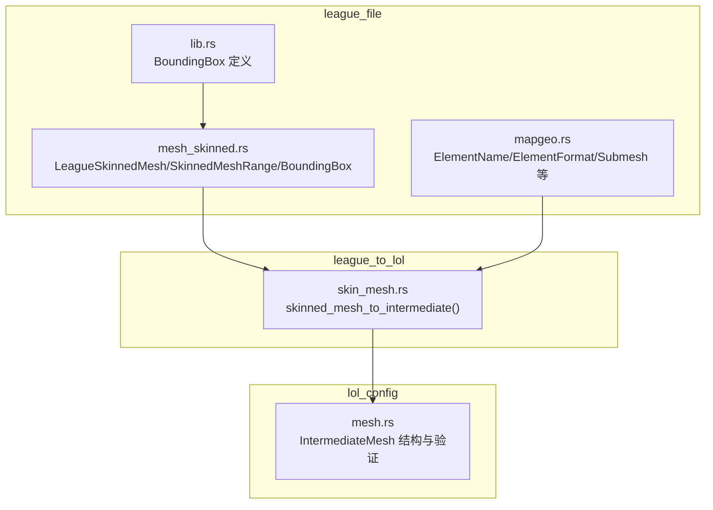
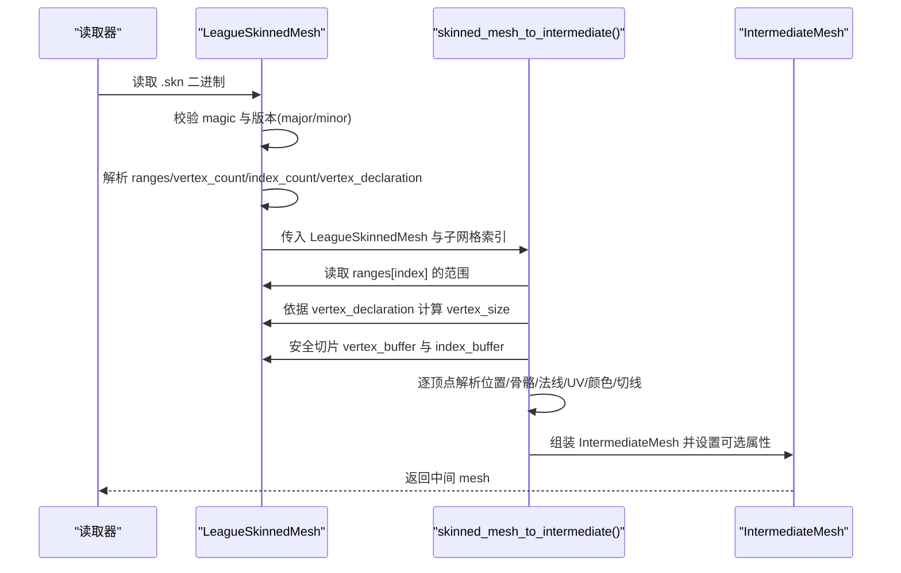
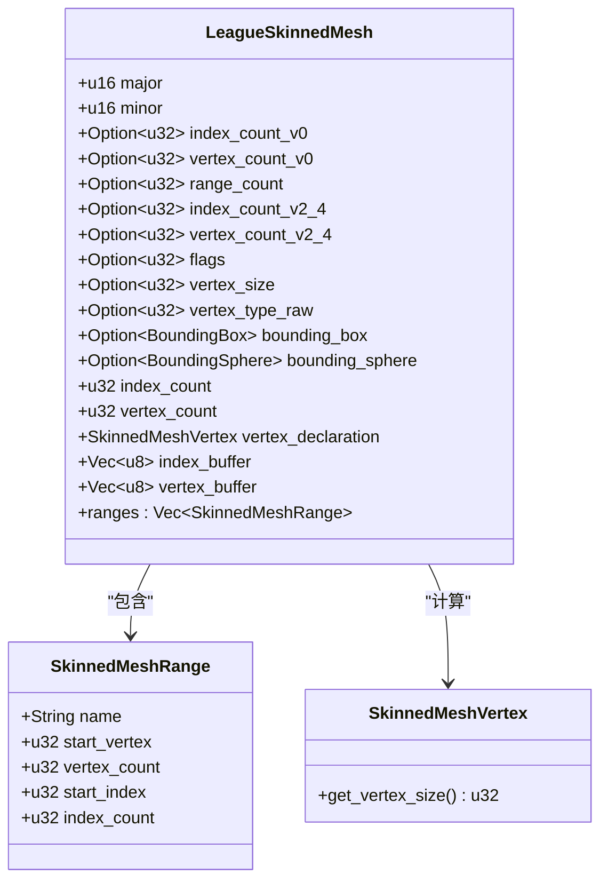
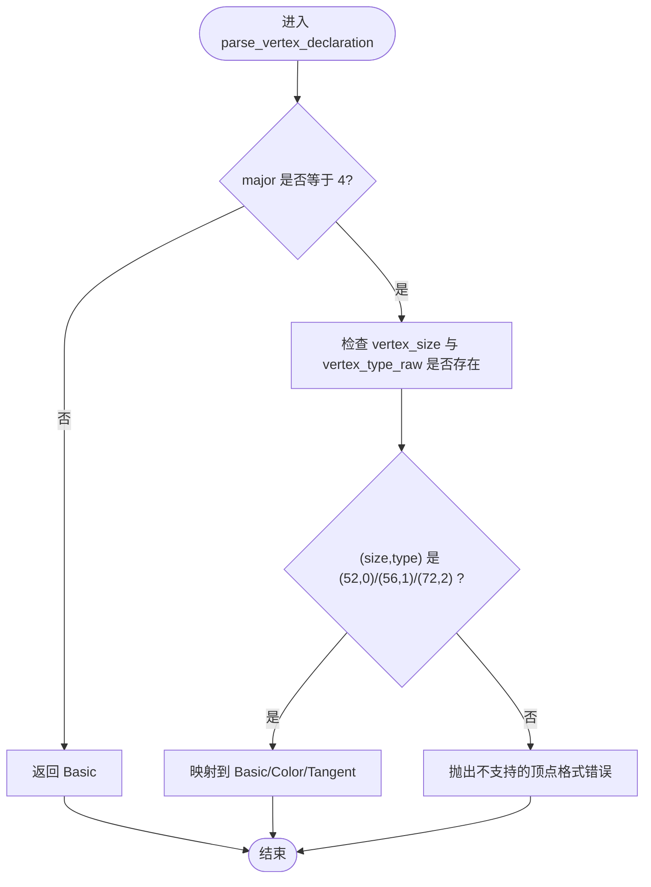
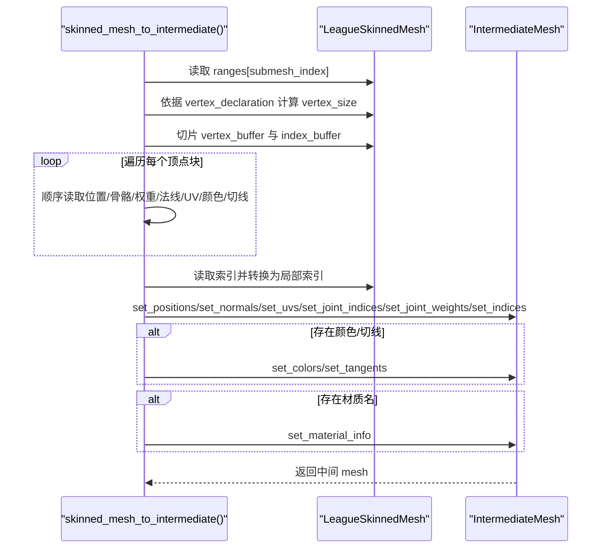
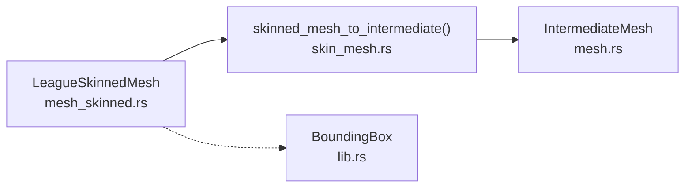

# 蒙皮网格解析

<cite>
**本文引用的文件**
- [mesh_skinned.rs](file://crates/league_file/src/mesh_skinned.rs)
- [skin_mesh.rs](file://crates/league_to_lol/src/skin_mesh.rs)
- [mesh.rs](file://crates/lol_config/src/mesh.rs)
- [lib.rs](file://crates/league_utils/src/lib.rs)
- [mapgeo.rs](file://crates/league_file/src/mapgeo.rs)
</cite>

## 目录
1. [简介](#简介)
2. [项目结构](#项目结构)
3. [核心组件](#核心组件)
4. [架构总览](#架构总览)
5. [详细组件分析](#详细组件分析)
6. [依赖关系分析](#依赖关系分析)
7. [性能考量](#性能考量)
8. [故障排查指南](#故障排查指南)
9. [结论](#结论)
10. [附录](#附录)

## 简介
本文件面向需要深入理解 League 官方“.skn”蒙皮网格二进制格式与 Rust 反序列化流程的开发者。内容覆盖：
- LeagueSkinnedMesh 的二进制结构与版本兼容性（v0/v2/v4），重点解释 major/minor 校验逻辑
- SkinnedMeshRange 如何定义子网格的顶点/索引范围
- vertex_declaration 如何依据 vertex_size 与 vertex_type_raw 动态确定顶点格式（Basic/Color/Tangent）
- vertex_buffer 与 index_buffer 的安全切片与数据布局
- 从原始字节到中间结构 IntermediateMesh 的转换流程，包括位置、法线、UV、骨骼索引/权重、颜色与切线的提取
- binrw 属性（magic/assert/calc/if/temp/count/try_map/map 等）在解析中的作用
- 常见解析失败原因与调试策略

## 项目结构
围绕“蒙皮网格解析”的关键模块分布如下：
- league_file：负责 League 官方二进制格式的读取与结构定义（含 LeagueSkinnedMesh、SkinnedMeshRange、BoundingBox 等）
- league_to_lol：负责将 League 数据转换为中间结构 IntermediateMesh，供渲染管线使用
- lol_config：定义中间 mesh 数据结构与验证逻辑
- league_utils：通用工具（如 BoundingBox）

图表来源
- [mesh_skinned.rs](file://crates/league_file/src/mesh_skinned.rs#L1-L119)
- [skin_mesh.rs](file://crates/league_to_lol/src/skin_mesh.rs#L1-L145)
- [mesh.rs](file://crates/lol_config/src/mesh.rs#L1-L310)
- [lib.rs](file://crates/league_utils/src/lib.rs#L70-L81)
- [mapgeo.rs](file://crates/league_file/src/mapgeo.rs#L200-L318)

章节来源
- [mesh_skinned.rs](file://crates/league_file/src/mesh_skinned.rs#L1-L119)
- [skin_mesh.rs](file://crates/league_to_lol/src/skin_mesh.rs#L1-L145)
- [mesh.rs](file://crates/lol_config/src/mesh.rs#L1-L310)
- [lib.rs](file://crates/league_utils/src/lib.rs#L70-L81)
- [mapgeo.rs](file://crates/league_file/src/mapgeo.rs#L200-L318)

## 核心组件
- LeagueSkinnedMesh：.skn 文件的根结构，包含魔数、版本号、可选字段、顶点/索引计数、顶点声明、以及最终的 vertex_buffer/index_buffer
- SkinnedMeshRange：每个子网格的范围定义（名称、起始顶点/数量、起始索引/数量）
- SkinnedMeshVertex：顶点格式枚举（Basic/Color/Tangent），对应固定大小
- BoundingBox/BoundingSphere：包围盒/球（v4 版本可选）
- IntermediateMesh：中间 mesh 结构，供渲染管线使用，包含位置、法线、UV、颜色、切线、骨骼索引/权重、索引与材质信息

章节来源
- [mesh_skinned.rs](file://crates/league_file/src/mesh_skinned.rs#L1-L119)
- [mesh.rs](file://crates/lol_config/src/mesh.rs#L42-L188)

## 架构总览
下图展示了从二进制到中间结构的端到端流程。

图表来源
- [mesh_skinned.rs](file://crates/league_file/src/mesh_skinned.rs#L46-L118)
- [skin_mesh.rs](file://crates/league_to_lol/src/skin_mesh.rs#L1-L145)
- [mesh.rs](file://crates/lol_config/src/mesh.rs#L94-L188)

## 详细组件分析

### LeagueSkinnedMesh：二进制结构与版本兼容
- 魔数与版本
  - 魔数通过 #[br(magic = ...)] 校验，确保文件头正确
  - 版本号通过 major/minor 校验，仅允许 v0、v2、v4，且 minor 必须为 1
- 版本分支字段
  - v0：直接提供 vertex_count/index_count；v2/v4：通过 range_count 提供多个子网格
  - v4：额外提供 flags、vertex_size、vertex_type_raw、包围盒/球
- 计算字段
  - index_count 与 vertex_count 通过 #[br(calc = ...)] 从各版本字段中选择性合并
  - vertex_declaration 通过 #[br(calc = Self::parse_vertex_declaration(...))] 动态确定
- 缓冲区
  - index_buffer：按 index_count × 2 字节读取（u16 索引）
  - vertex_buffer：按 vertex_count × vertex_declaration.get_vertex_size() 字节读取

图表来源
- [mesh_skinned.rs](file://crates/league_file/src/mesh_skinned.rs#L46-L118)

章节来源
- [mesh_skinned.rs](file://crates/league_file/src/mesh_skinned.rs#L46-L118)

### SkinnedMeshRange：子网格范围定义
- name：以最多 64 字节的字节数组读取，遇到首个 0 截断并转为字符串
- start_vertex/vertex_count/start_index/index_count：u32，用于定位子网格在全局缓冲区中的范围

章节来源
- [mesh_skinned.rs](file://crates/league_file/src/mesh_skinned.rs#L8-L20)

### 顶点声明与格式推断：vertex_declaration
- 当 major != 4 时，强制为 Basic 格式
- 当 major == 4 时，必须提供 vertex_size 与 vertex_type_raw，并按以下规则映射：
  - (52, 0) → Basic
  - (56, 1) → Color
  - (72, 2) → Tangent
- 对应的固定顶点大小：
  - Basic: 52 字节
  - Color: 56 字节
  - Tangent: 72 字节

图表来源
- [mesh_skinned.rs](file://crates/league_file/src/mesh_skinned.rs#L100-L118)

章节来源
- [mesh_skinned.rs](file://crates/league_file/src/mesh_skinned.rs#L21-L36)
- [mesh_skinned.rs](file://crates/league_file/src/mesh_skinned.rs#L100-L118)

### vertex_buffer 与 index_buffer 的安全切片
- 顶点切片
  - 依据 range.start_vertex 与 range.vertex_count，按 vertex_declaration.get_vertex_size() 计算字节偏移
  - 从 vertex_buffer 中安全切片得到该子网格的顶点字节范围
- 索引切片
  - 依据 range.start_index 与 range.index_count，按 2 字节步长切片
  - 将全局索引转换为局部索引：global - start_vertex

章节来源
- [skin_mesh.rs](file://crates/league_to_lol/src/skin_mesh.rs#L1-L118)

### 从原始字节到中间结构：skinned_mesh_to_intermediate
- 步骤概览
  - 选择子网格范围（ranges[submesh_index]）
  - 计算 vertex_size（来自 vertex_declaration）
  - 安全切片 vertex_buffer 得到该子网格的顶点数据
  - 逐顶点解析：
    - 位置：连续 12 字节（f32×3）
    - 骨骼索引：4 字节（u8→u16）
    - 骨骼权重：连续 16 字节（f32×4）
    - 法线：连续 12 字节（f32×3）
    - UV：连续 8 字节（f32×2）
    - 颜色：可选，4 字节（BGRA→RGBA 归一化）
    - 切线：可选，连续 16 字节（f32×4）
  - 安全切片 index_buffer，按 2 字节读取 u16 索引，再转换为局部索引
  - 组装 IntermediateMesh，设置可选属性（颜色、切线、材质名）

图表来源
- [skin_mesh.rs](file://crates/league_to_lol/src/skin_mesh.rs#L1-L145)
- [mesh.rs](file://crates/lol_config/src/mesh.rs#L94-L188)

章节来源
- [skin_mesh.rs](file://crates/league_to_lol/src/skin_mesh.rs#L1-L145)
- [mesh.rs](file://crates/lol_config/src/mesh.rs#L94-L188)

### binrw 属性详解与示例
- magic：校验文件头魔数，失败即抛错
  - 示例路径：[mesh_skinned.rs](file://crates/league_file/src/mesh_skinned.rs#L50-L51)
- assert：版本号校验，仅允许 (major∈{0,2,4} ∧ minor==1)
  - 示例路径：[mesh_skinned.rs](file://crates/league_file/src/mesh_skinned.rs#L52-L55)
- if：条件字段，仅在满足条件时读取
  - 示例路径：v0 的 index_count_v0/vertex_count_v0、v2/v4 的 range_count、v4 的 flags/vertex_size/vertex_type_raw/bounding_box/bounding_sphere
- temp：临时字段，不暴露为公开字段，仅参与后续计算
  - 示例路径：多处 temp 字段
- calc：计算字段，基于其他字段或函数结果
  - 示例路径：index_count、vertex_count、vertex_declaration
- count：按数量读取数组
  - 示例路径：ranges、index_buffer、vertex_buffer
- try_map：对字节数组进行转换（如字符串截断）
  - 示例路径：SkinnedMeshRange.name 的 try_map
- map：对单个值进行转换（如 Vec3 映射）
  - 示例路径：BoundingBox 的 map

章节来源
- [mesh_skinned.rs](file://crates/league_file/src/mesh_skinned.rs#L8-L20)
- [mesh_skinned.rs](file://crates/league_file/src/mesh_skinned.rs#L46-L118)
- [lib.rs](file://crates/league_utils/src/lib.rs#L70-L81)

## 依赖关系分析
- league_file 与 league_to_lol 的耦合点
  - league_to_lol 通过 skinned_mesh_to_intermediate 依赖 league_file 的 LeagueSkinnedMesh 与 SkinnedMeshVertex
  - league_to_lol 输出 lol_config::IntermediateMesh，供渲染管线使用
- 数据流向
  - 二进制 → LeagueSkinnedMesh → IntermediateMesh → 渲染资源

图表来源
- [mesh_skinned.rs](file://crates/league_file/src/mesh_skinned.rs#L46-L118)
- [skin_mesh.rs](file://crates/league_to_lol/src/skin_mesh.rs#L1-L145)
- [mesh.rs](file://crates/lol_config/src/mesh.rs#L42-L188)
- [lib.rs](file://crates/league_utils/src/lib.rs#L70-L81)

章节来源
- [mesh_skinned.rs](file://crates/league_file/src/mesh_skinned.rs#L46-L118)
- [skin_mesh.rs](file://crates/league_to_lol/src/skin_mesh.rs#L1-L145)
- [mesh.rs](file://crates/lol_config/src/mesh.rs#L42-L188)
- [lib.rs](file://crates/league_utils/src/lib.rs#L70-L81)

## 性能考量
- 读取阶段
  - 使用 #[br(count = ...)] 一次性读取大块缓冲区，避免逐项读取的开销
  - 使用 #[br(calc = ...)] 在编译期/解析期完成字段合并，减少运行时判断
- 解析阶段
  - 顶点遍历采用 chunks_exact 与固定偏移，避免重复边界检查
  - 仅在需要时分配颜色/切线向量，降低内存占用
- 内存与缓存
  - 先切片再解析，减少不必要的拷贝
  - 使用 with_capacity 预分配，降低扩容成本

[本节为通用性能建议，不直接分析具体文件]

## 故障排查指南
- 版本不匹配
  - 现象：解析时报“无效的文件版本”
  - 排查：确认 major/minor 是否为 (0,1)、(2,1) 或 (4,1)
  - 参考路径：[mesh_skinned.rs](file://crates/league_file/src/mesh_skinned.rs#L52-L55)
- 魔数错误
  - 现象：解析失败，提示魔数不匹配
  - 排查：确认文件头魔数是否为指定值
  - 参考路径：[mesh_skinned.rs](file://crates/league_file/src/mesh_skinned.rs#L50-L51)
- 顶点格式不支持
  - 现象：解析 vertex_declaration 时抛出“不支持的顶点格式”
  - 排查：确认 v4 的 vertex_size 与 vertex_type_raw 是否符合 (52,0)/(56,1)/(72,2)
  - 参考路径：[mesh_skinned.rs](file://crates/league_file/src/mesh_skinned.rs#L100-L118)
- 索引越界
  - 现象：IntermediateMesh.validate 报告索引越界
  - 排查：检查 index_buffer 是否为 u16，start_vertex 是否正确，转换后索引是否超出 vertex_count
  - 参考路径：[skin_mesh.rs](file://crates/league_to_lol/src/skin_mesh.rs#L105-L118)，[mesh.rs](file://crates/lol_config/src/mesh.rs#L190-L260)
- 顶点数据长度不一致
  - 现象：IntermediateMesh.validate 报告顶点属性长度不匹配
  - 排查：核对 vertex_size 与各属性偏移之和是否等于 get_vertex_size()
  - 参考路径：[mesh.rs](file://crates/lol_config/src/mesh.rs#L190-L260)

章节来源
- [mesh_skinned.rs](file://crates/league_file/src/mesh_skinned.rs#L50-L55)
- [mesh_skinned.rs](file://crates/league_file/src/mesh_skinned.rs#L100-L118)
- [skin_mesh.rs](file://crates/league_to_lol/src/skin_mesh.rs#L105-L118)
- [mesh.rs](file://crates/lol_config/src/mesh.rs#L190-L260)

## 结论
- .skn 蒙皮网格通过 binrw 宏实现了强约束的二进制解析，版本兼容性由 major/minor 与条件字段共同保证
- vertex_declaration 的动态推断确保了 v4 下对 Basic/Color/Tangent 的统一处理
- 通过 ranges 与安全切片，能够高效地从全局缓冲区中提取子网格数据
- 从原始字节到中间结构的转换流程清晰、可验证，便于扩展与维护

[本节为总结性内容，不直接分析具体文件]

## 附录

### 二进制片段与 Rust 结构体映射示例（概念性说明）
- 魔数与版本
  - 魔数字节：固定 4 字节
  - major/minor：各 2 字节
  - 参考路径：[mesh_skinned.rs](file://crates/league_file/src/mesh_skinned.rs#L50-L55)
- 子网格范围
  - name：64 字节，遇到首个 0 截断
  - start_vertex/vertex_count/start_index/index_count：各 4 字节
  - 参考路径：[mesh_skinned.rs](file://crates/league_file/src/mesh_skinned.rs#L8-L20)
- 顶点声明
  - v4：vertex_size（4 字节）、vertex_type_raw（4 字节）
  - 参考路径：[mesh_skinned.rs](file://crates/league_file/src/mesh_skinned.rs#L76-L81)
- 顶点数据布局（按 vertex_declaration）
  - Basic：位置(12) + 骨骼索引(4) + 骨骼权重(16) + 法线(12) + UV(8) = 52
  - Color：在 Basic 基础上追加颜色(4) = 56
  - Tangent：在 Basic 基础上追加切线(16) = 72
  - 参考路径：[mesh_skinned.rs](file://crates/league_file/src/mesh_skinned.rs#L21-L36)，[skin_mesh.rs](file://crates/league_to_lol/src/skin_mesh.rs#L38-L103)
- 索引数据
  - index_buffer：每项 2 字节（u16），按 index_count 读取
  - 参考路径：[mesh_skinned.rs](file://crates/league_file/src/mesh_skinned.rs#L94-L96)，[skin_mesh.rs](file://crates/league_to_lol/src/skin_mesh.rs#L105-L118)

章节来源
- [mesh_skinned.rs](file://crates/league_file/src/mesh_skinned.rs#L8-L20)
- [mesh_skinned.rs](file://crates/league_file/src/mesh_skinned.rs#L21-L36)
- [mesh_skinned.rs](file://crates/league_file/src/mesh_skinned.rs#L76-L96)
- [skin_mesh.rs](file://crates/league_to_lol/src/skin_mesh.rs#L38-L118)