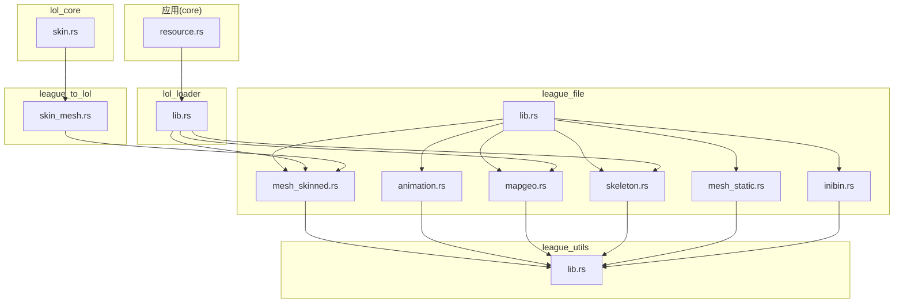
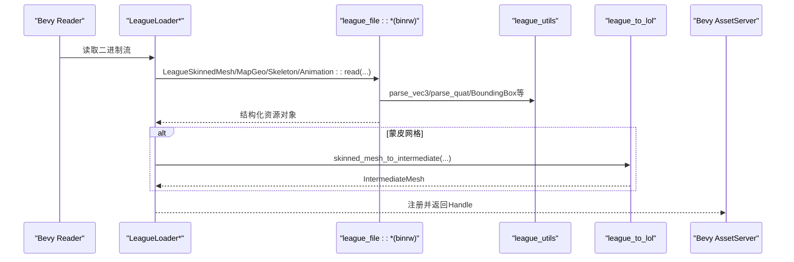
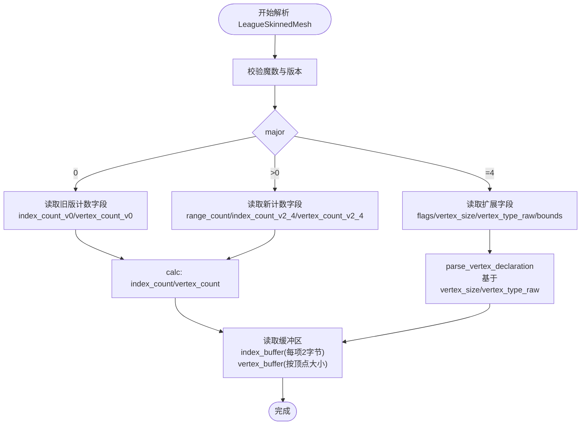
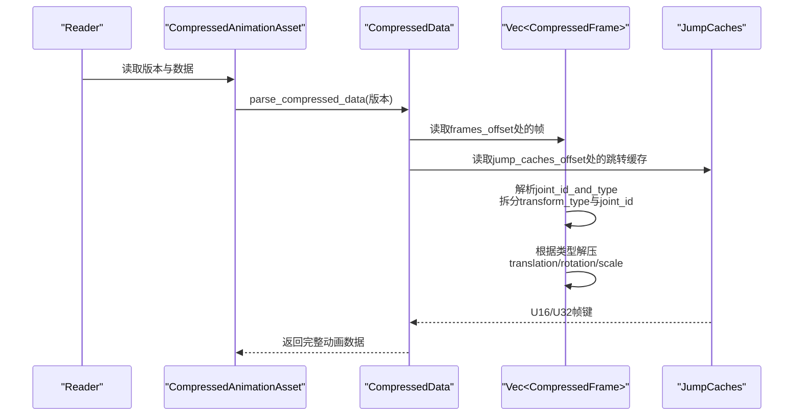
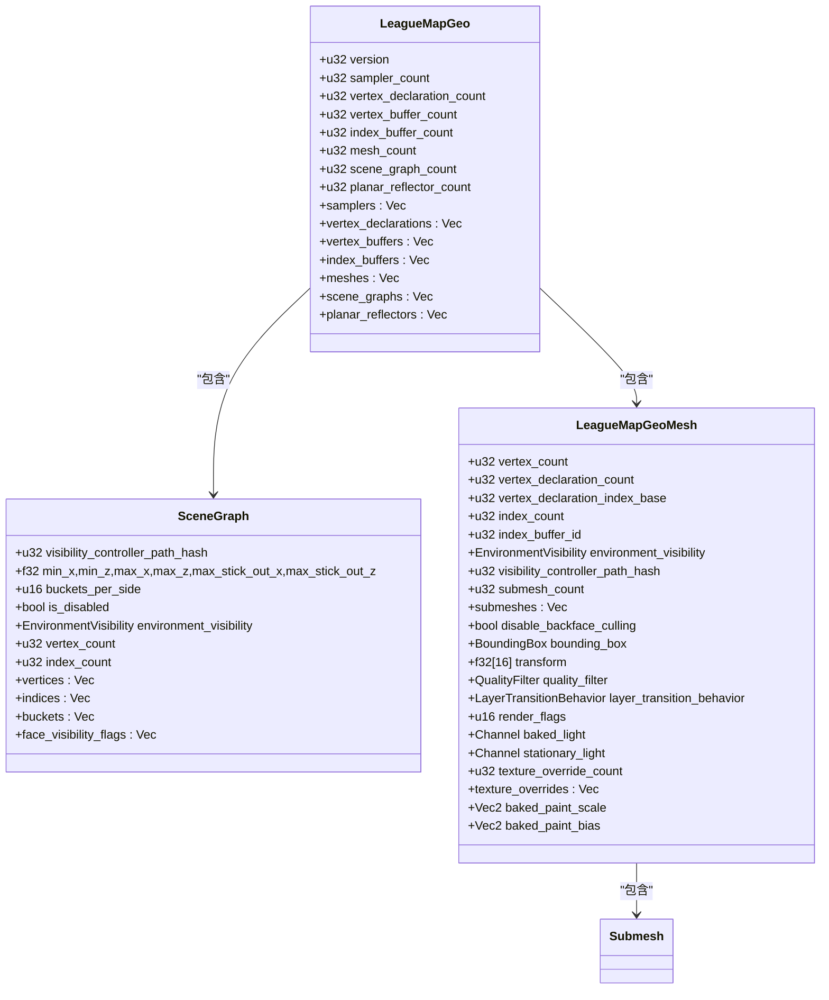
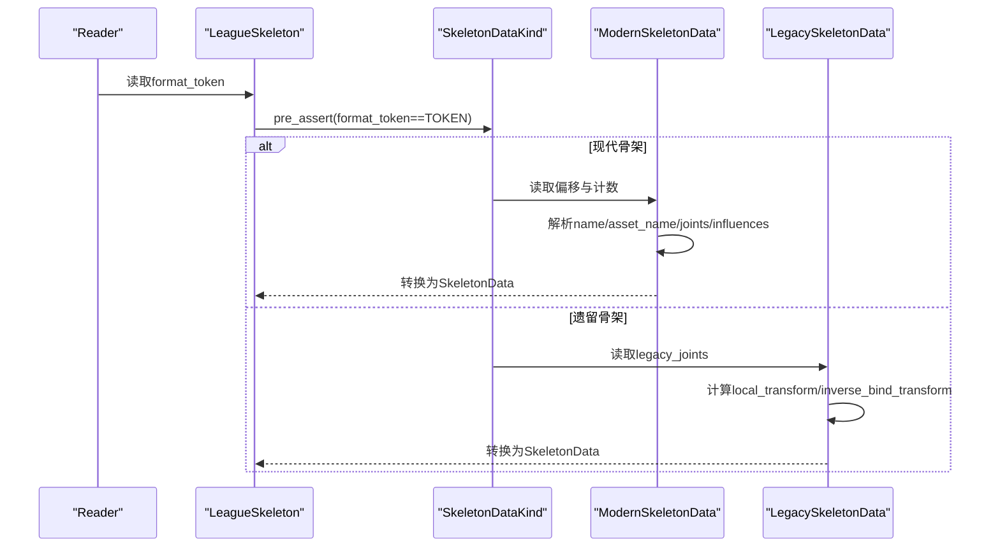
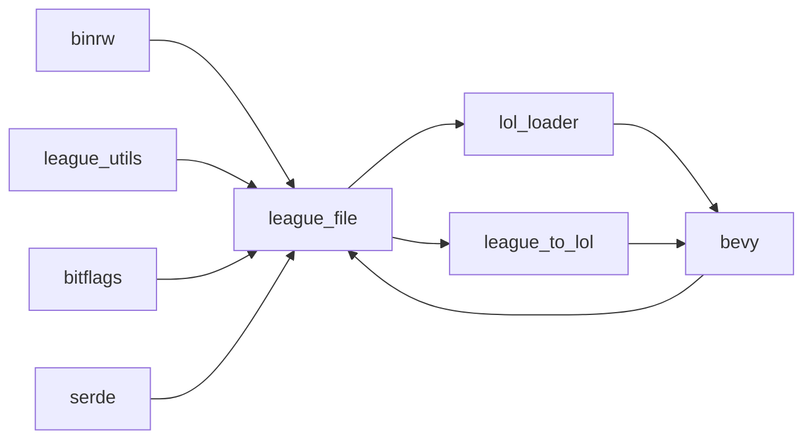

# 资源解析

<cite>
**本文引用的文件**
- [crates/league_file/src/lib.rs](file://crates/league_file/src/lib.rs)
- [crates/league_file/src/mesh_skinned.rs](file://crates/league_file/src/mesh_skinned.rs)
- [crates/league_file/src/animation.rs](file://crates/league_file/src/animation.rs)
- [crates/league_file/src/mapgeo.rs](file://crates/league_file/src/mapgeo.rs)
- [crates/league_file/src/skeleton.rs](file://crates/league_file/src/skeleton.rs)
- [crates/league_file/src/mesh_static.rs](file://crates/league_file/src/mesh_static.rs)
- [crates/league_file/src/inibin.rs](file://crates/league_file/src/inibin.rs)
- [crates/league_file/Cargo.toml](file://crates/league_file/Cargo.toml)
- [crates/league_utils/src/lib.rs](file://crates/league_utils/src/lib.rs)
- [crates/lol_loader/src/lib.rs](file://crates/lol_loader/src/lib.rs)
- [crates/league_to_lol/src/skin_mesh.rs](file://crates/league_to_lol/src/skin_mesh.rs)
- [crates/lol_core/src/skin.rs](file://crates/lol_core/src/skin.rs)
- [src/core/resource.rs](file://src/core/resource.rs)
</cite>

## 目录
1. [简介](#简介)
2. [项目结构](#项目结构)
3. [核心组件](#核心组件)
4. [架构总览](#架构总览)
5. [详细组件分析](#详细组件分析)
6. [依赖关系分析](#依赖关系分析)
7. [性能考量](#性能考量)
8. [故障排查指南](#故障排查指南)
9. [结论](#结论)
10. [附录：二进制结构与Rust映射对照](#附录二进制结构与rust映射对照)

## 简介
本文件面向“league_file”crate的资源解析模块，系统性梳理LoL二进制资源的结构化解析流程，重点覆盖以下三类：
- 骨骼蒙皮网格：顶点缓冲区、索引缓冲区、骨骼权重与调色板的反序列化与组织
- 动画资源：关键帧轨道、插值类型与骨骼变换数据的解析与解压
- 地形网格与碰撞体：地图几何、子网格、纹理覆盖与可见性控制的提取

文档同时说明如何利用binrw宏定义精确的二进制结构体，处理版本差异、条件字段、动态数组长度前缀、字段对齐与魔法数校验等复杂模式，并给出解析失败的调试策略与格式兼容性设计建议。

## 项目结构
- crates/league_file：LoL二进制资源的解析器集合，包含网格、动画、骨架、地形、纹理、配置等模块
- crates/league_utils：通用解析辅助函数（向量/四元数解析、边界盒、哈希等）
- crates/lol_loader：Bevy资产加载器，负责将league_file解析出的资源桥接到Bevy资产系统
- crates/league_to_lol：中间层，将league_file解析结果转换为渲染或运行时可用的数据结构
- src/core/resource.rs：应用侧资源初始化与加载器注册入口

图表来源
- [crates/league_file/src/lib.rs](file://crates/league_file/src/lib.rs#L1-L20)
- [crates/league_file/src/mesh_skinned.rs](file://crates/league_file/src/mesh_skinned.rs#L1-L119)
- [crates/league_file/src/animation.rs](file://crates/league_file/src/animation.rs#L1-L485)
- [crates/league_file/src/mapgeo.rs](file://crates/league_file/src/mapgeo.rs#L1-L342)
- [crates/league_file/src/skeleton.rs](file://crates/league_file/src/skeleton.rs#L1-L341)
- [crates/league_file/src/mesh_static.rs](file://crates/league_file/src/mesh_static.rs#L1-L182)
- [crates/league_file/src/inibin.rs](file://crates/league_file/src/inibin.rs#L1-L196)
- [crates/league_utils/src/lib.rs](file://crates/league_utils/src/lib.rs#L1-L143)
- [crates/lol_loader/src/lib.rs](file://crates/lol_loader/src/lib.rs#L89-L271)
- [crates/league_to_lol/src/skin_mesh.rs](file://crates/league_to_lol/src/skin_mesh.rs#L1-L111)
- [crates/lol_core/src/skin.rs](file://crates/lol_core/src/skin.rs#L1-L6)
- [src/core/resource.rs](file://src/core/resource.rs#L1-L78)

章节来源
- [crates/league_file/src/lib.rs](file://crates/league_file/src/lib.rs#L1-L20)
- [crates/league_file/Cargo.toml](file://crates/league_file/Cargo.toml#L1-L12)

## 核心组件
- LeagueSkinnedMesh：蒙皮网格容器，包含版本、范围表、顶点/索引缓冲区、可选包围盒/球等
- CompressedAnimationAsset/UncompressedAnimationAsset：动画资源容器，支持压缩与非压缩两种格式
- LeagueMapGeo：地图几何容器，包含采样器、顶点/索引缓冲区、网格、场景图、反射器等
- LeagueSkeleton：骨架容器，支持现代与遗留两种骨架格式
- LeagueMeshStatic：静态网格，演示了复杂的字段对齐与条件字段处理
- InibinFile：键值配置文件，展示动态数组长度前缀与多类型集合的解析

章节来源
- [crates/league_file/src/mesh_skinned.rs](file://crates/league_file/src/mesh_skinned.rs#L1-L119)
- [crates/league_file/src/animation.rs](file://crates/league_file/src/animation.rs#L1-L485)
- [crates/league_file/src/mapgeo.rs](file://crates/league_file/src/mapgeo.rs#L1-L342)
- [crates/league_file/src/skeleton.rs](file://crates/league_file/src/skeleton.rs#L1-L341)
- [crates/league_file/src/mesh_static.rs](file://crates/league_file/src/mesh_static.rs#L1-L182)
- [crates/league_file/src/inibin.rs](file://crates/league_file/src/inibin.rs#L1-L196)

## 架构总览
下图展示了从二进制资源到Bevy资产系统的端到端流程，以及与中间层的衔接。

图表来源
- [crates/lol_loader/src/lib.rs](file://crates/lol_loader/src/lib.rs#L89-L271)
- [crates/league_file/src/mesh_skinned.rs](file://crates/league_file/src/mesh_skinned.rs#L1-L119)
- [crates/league_file/src/mapgeo.rs](file://crates/league_file/src/mapgeo.rs#L1-L342)
- [crates/league_file/src/skeleton.rs](file://crates/league_file/src/skeleton.rs#L1-L341)
- [crates/league_file/src/animation.rs](file://crates/league_file/src/animation.rs#L1-L485)
- [crates/league_utils/src/lib.rs](file://crates/league_utils/src/lib.rs#L1-L143)
- [crates/league_to_lol/src/skin_mesh.rs](file://crates/league_to_lol/src/skin_mesh.rs#L1-L111)

## 详细组件分析

### 蒙皮网格：LeagueSkinnedMesh（mesh_skinned.rs）
- 版本与魔数校验：通过binrw的magic与assert进行严格校验，限定major/minor组合
- 条件字段与动态计数：
  - major==0时使用旧版计数字段；major>0时使用range_count
  - major==4时引入flags、vertex_size、vertex_type_raw、包围盒/球等扩展字段
  - index_count/vertex_count通过calc从多个候选字段选择
- 顶点声明与大小：
  - 仅在major==4时解析顶点声明类型，结合vertex_size与vertex_type_raw确定顶点布局
  - 不同顶点类型对应不同的顶点字节数，用于计算缓冲区偏移
- 缓冲区解析：
  - index_buffer按每个索引2字节读取
  - vertex_buffer按vertex_declaration.get_vertex_size()字节读取
- 子网格范围：
  - SkinnedMeshRange包含每个子网格的起止索引与顶点索引，便于拆分渲染

图表来源
- [crates/league_file/src/mesh_skinned.rs](file://crates/league_file/src/mesh_skinned.rs#L50-L119)

章节来源
- [crates/league_file/src/mesh_skinned.rs](file://crates/league_file/src/mesh_skinned.rs#L1-L119)
- [crates/league_to_lol/src/skin_mesh.rs](file://crates/league_to_lol/src/skin_mesh.rs#L1-L111)
- [crates/lol_loader/src/lib.rs](file://crates/lol_loader/src/lib.rs#L89-L127)

### 动画资源：CompressedAnimationAsset/UncompressedAnimationAsset（animation.rs）
- 文件类型识别：
  - 通过枚举AnimationFile的magic区分压缩与非压缩两类
- 压缩动画：
  - CompressedData包含压缩参数、关节数量、帧数量、跳转缓存、误差度量、关节名哈希偏移、帧偏移、跳转缓存偏移等
  - parse_compressed_data对版本进行断言，确保在允许范围内
  - 跳转缓存根据帧总数选择U16/U32存储形式
  - 帧结构包含时间、关节ID与变换类型，按类型分别解压为平移、旋转、缩放
- 非压缩动画：
  - UncompressedData支持V3/V4/V5三个版本，主要差异在于帧组织与调色板存储
  - V3：按轨道顺序读取，生成联合帧与调色板索引
  - V4：帧以“关节哈希+帧”的形式分组，随后按关节聚合
  - V5：引入向量/四元数调色板，帧按轨道×帧数读取
- 插值与解压：
  - 时间解压：将u16映射到[0,duration]
  - 平移/缩放解压：基于min/max区间线性还原
  - 旋转解压：采用特定位打包与最大分量选择策略，恢复单位四元数

图表来源
- [crates/league_file/src/animation.rs](file://crates/league_file/src/animation.rs#L1-L201)
- [crates/league_file/src/animation.rs](file://crates/league_file/src/animation.rs#L203-L485)

章节来源
- [crates/league_file/src/animation.rs](file://crates/league_file/src/animation.rs#L1-L485)
- [crates/league_utils/src/lib.rs](file://crates/league_utils/src/lib.rs#L1-L143)

### 地形网格：LeagueMapGeo（mapgeo.rs）
- 容器结构：
  - 包含采样器、顶点/索引缓冲区、网格、场景图、平面反射器等
- 场景图（SceneGraph）：
  - 支持禁用标志、环境可见性、顶点/索引计数
  - 当未禁用时，按计数读取顶点（Vec3）、索引（u16）与桶（GeometryBucket）
  - 根据环境可见性读取面可见性标志
- 网格（LeagueMapGeoMesh）：
  - 关联顶点声明索引、顶点缓冲区索引、索引缓冲区ID
  - 子网格（Submesh）记录材质名、起始索引、索引数量与顶点范围
  - 变换矩阵、质量过滤、层过渡行为、烘焙光照通道与纹理覆盖等
- 顶点元素与格式：
  - VertexDeclaration/VertexElement定义顶点元素用途与格式
  - ElementFormat提供各格式的字节大小查询，便于缓冲区解析

图表来源
- [crates/league_file/src/mapgeo.rs](file://crates/league_file/src/mapgeo.rs#L1-L342)

章节来源
- [crates/league_file/src/mapgeo.rs](file://crates/league_file/src/mapgeo.rs#L1-L342)
- [crates/lol_loader/src/lib.rs](file://crates/lol_loader/src/lib.rs#L129-L193)

### 骨架：LeagueSkeleton（skeleton.rs）
- 现代骨架（ModernSkeletonData）：
  - 通过format_token断言，读取版本、关节数量、影响计数与偏移
  - 使用seek_before定位字符串与关节数组，解析关节本地/逆绑定变换
- 遗留骨架（LegacySkeletonData）：
  - 支持r3d2sklt魔数与版本断言
  - 从全局变换推导本地变换，并可选择性解析影响列表
- 数据转换：
  - 将LegacyJoint转换为Joint，统一字段命名与类型

图表来源
- [crates/league_file/src/skeleton.rs](file://crates/league_file/src/skeleton.rs#L1-L341)

章节来源
- [crates/league_file/src/skeleton.rs](file://crates/league_file/src/skeleton.rs#L1-L341)

### 静态网格：LeagueMeshStatic（mesh_static.rs）
- 版本断言：major/minor组合校验
- 条件字段：
  - major>=3且minor>=2时才读取顶点颜色标记
  - flags包含HasVcp时读取面颜色数据
- 字段对齐与布局：
  - 面数据采用特殊的UV分离布局（先读UV.X再读UV.Y），随后重组为[[f32;2];3]
  - u32索引转换为u16
- 辅助函数：
  - get_padded_string_64/128用于读取固定长度的零终止字符串

章节来源
- [crates/league_file/src/mesh_static.rs](file://crates/league_file/src/mesh_static.rs#L1-L182)

### 配置文件：InibinFile（inibin.rs）
- 多集合解析：根据版本选择不同集合类型，逐类型读取键值
- 动态长度前缀：版本1/2均使用字符串数据长度前缀，定位字符串区域
- 类型分支：支持整数、浮点、定点、布尔、向量等多类型列表

章节来源
- [crates/league_file/src/inibin.rs](file://crates/league_file/src/inibin.rs#L1-L196)

## 依赖关系分析
- league_file依赖：
  - binrw：二进制解析宏与类型
  - bevy：资产系统与数学类型
  - league_utils：通用解析与工具
  - bitflags/serde：标志位与序列化
- lol_loader：将league_file解析结果注册为Bevy资产
- league_to_lol：将league_file结果转换为渲染中间结构
- 应用层：在资源初始化阶段注册加载器并触发加载

图表来源
- [crates/league_file/Cargo.toml](file://crates/league_file/Cargo.toml#L1-L12)
- [crates/lol_loader/src/lib.rs](file://crates/lol_loader/src/lib.rs#L89-L271)
- [crates/league_to_lol/src/skin_mesh.rs](file://crates/league_to_lol/src/skin_mesh.rs#L1-L111)

章节来源
- [crates/league_file/Cargo.toml](file://crates/league_file/Cargo.toml#L1-L12)
- [src/core/resource.rs](file://src/core/resource.rs#L1-L78)

## 性能考量
- 二进制解析：
  - 使用binrw::BinRead避免手动字节搬运，减少错误与开销
  - 对大缓冲区（索引/顶点）采用一次性读取与切片访问，避免重复seek
- 内存分配：
  - 预估容量（with_capacity）降低扩容成本
  - 对可选字段（如顶点颜色、切线）按需分配
- 解压路径：
  - 压缩动画的跳转缓存按帧总数选择紧凑存储（U16/U32），平衡内存与速度
- 资产加载：
  - Bevy异步加载器按需解码，避免主线程阻塞

[本节为通用指导，无需具体文件分析]

## 故障排查指南
- 版本与魔数错误：
  - 检查magic与assert断言是否满足（如SkinnedMesh的版本组合、Animation的magic、Skeleton的format_token）
- 条件字段缺失：
  - major/minor版本决定字段是否存在，若断言失败，确认文件版本与解析分支
- 偏移与长度前缀：
  - 对于需要seek_before的字段，确保偏移值有效且位于文件范围内
  - Inibin的字符串数据长度前缀需正确计算字符串区域起点
- 解压异常：
  - 压缩动画的跳转缓存类型与帧总数关系需一致
  - 旋转解压依赖最大分量索引与位打包规则，检查输入位串
- 调色板与索引：
  - 非压缩动画的调色板尺寸与帧数量乘积需一致
  - 索引缓冲区按u16读取，注意起始偏移与计数

章节来源
- [crates/league_file/src/mesh_skinned.rs](file://crates/league_file/src/mesh_skinned.rs#L50-L119)
- [crates/league_file/src/animation.rs](file://crates/league_file/src/animation.rs#L1-L201)
- [crates/league_file/src/inibin.rs](file://crates/league_file/src/inibin.rs#L1-L196)

## 结论
league_file通过binrw宏与严格的版本/魔数断言，实现了对LoL二进制资源的高可靠解析。针对蒙皮网格、动画与地图几何，模块化地处理了版本差异、条件字段、动态长度前缀与字段对齐等复杂模式。配合lol_loader与league_to_lol，可将解析结果无缝接入Bevy资产管线，支撑渲染与运行时使用。

[本节为总结，无需具体文件分析]

## 附录：二进制结构与Rust映射对照

- 蒙皮网格（LeagueSkinnedMesh）
  - 关键字段：major/minor、ranges、index_count/vertex_count、vertex_declaration、index_buffer、vertex_buffer
  - 顶点声明类型与大小：Basic(52)、Color(56)、Tangent(72)
  - 子网格范围：SkinnedMeshRange包含每个子网格的起止索引与顶点索引

- 动画（Compressed/Uncompressed）
  - 压缩：CompressedData包含压缩参数、跳转缓存、关节名哈希、帧偏移；帧结构按类型解压
  - 非压缩：V3/V4/V5版本差异主要体现在帧组织与调色板存储；V4按关节聚合，V5使用调色板索引

- 地图几何（LeagueMapGeo）
  - 场景图：按计数读取顶点、索引与桶；根据可见性读取面可见性标志
  - 网格：子网格记录材质名、起始索引、索引数量与顶点范围；支持纹理覆盖与烘焙光照通道

- 骨架（LeagueSkeleton）
  - 现代：通过偏移读取名称、资产名、关节与影响；计算本地与逆绑定变换
  - 遗留：从全局变换推导本地变换；可选择性解析影响列表

- 静态网格（LeagueMeshStatic）
  - 面数据采用UV分离布局与u32索引转换为u16；可选面颜色与局部原点定位

- 配置（InibinFile）
  - 多集合类型：按版本选择集合，逐类型读取键值；字符串数据长度前缀定位字符串区域

章节来源
- [crates/league_file/src/mesh_skinned.rs](file://crates/league_file/src/mesh_skinned.rs#L1-L119)
- [crates/league_file/src/animation.rs](file://crates/league_file/src/animation.rs#L1-L485)
- [crates/league_file/src/mapgeo.rs](file://crates/league_file/src/mapgeo.rs#L1-L342)
- [crates/league_file/src/skeleton.rs](file://crates/league_file/src/skeleton.rs#L1-L341)
- [crates/league_file/src/mesh_static.rs](file://crates/league_file/src/mesh_static.rs#L1-L182)
- [crates/league_file/src/inibin.rs](file://crates/league_file/src/inibin.rs#L1-L196)