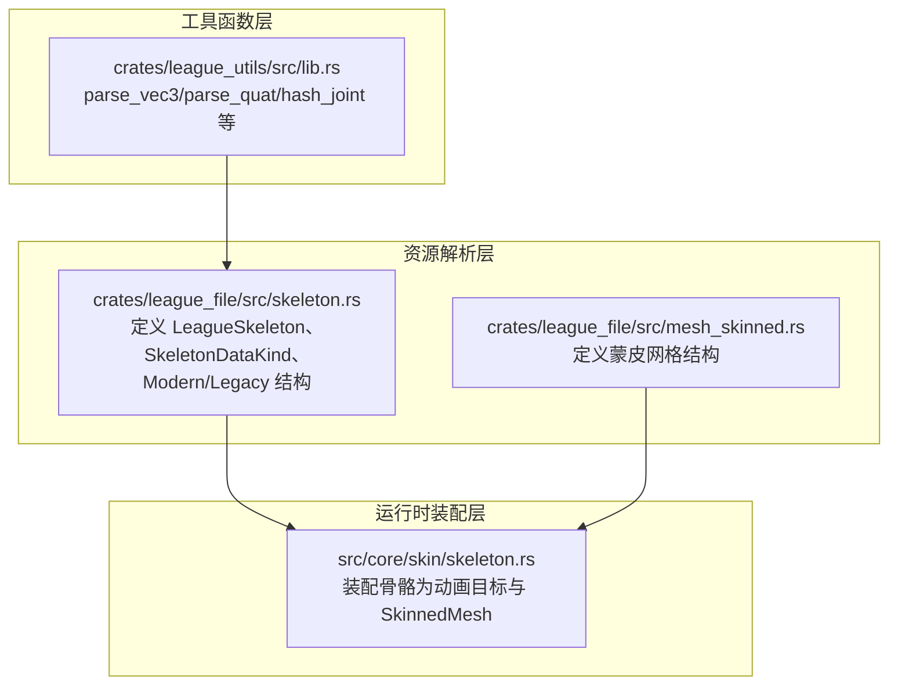
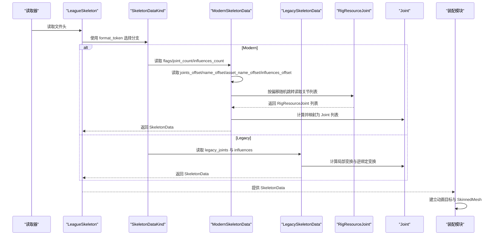
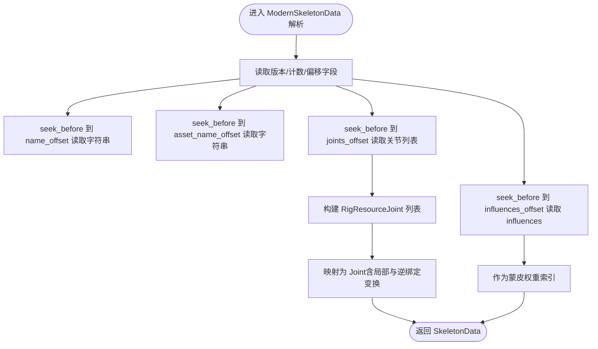
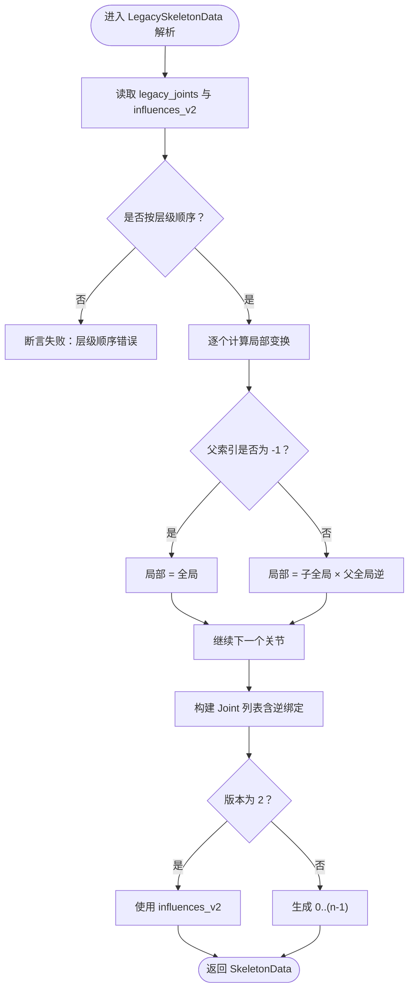
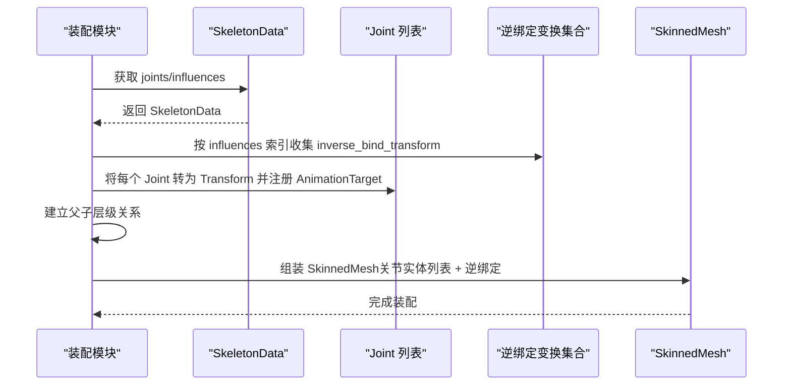
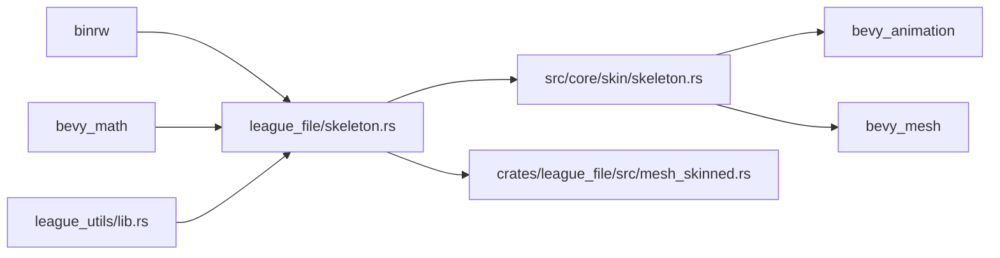

# 骨骼结构解析

<cite>
**本文引用的文件**
- [skeleton.rs](file://crates/league_file/src/skeleton.rs)
- [skeleton.rs（皮肤骨架装配）](file://src/core/skin/skeleton.rs)
- [lib.rs（工具函数）](file://crates/league_utils/src/lib.rs)
- [mesh_skinned.rs](file://crates/league_file/src/mesh_skinned.rs)
</cite>

## 目录
1. [简介](#简介)
2. [项目结构](#项目结构)
3. [核心组件](#核心组件)
4. [架构总览](#架构总览)
5. [详细组件分析](#详细组件分析)
6. [依赖关系分析](#依赖关系分析)
7. [性能考量](#性能考量)
8. [故障排查指南](#故障排查指南)
9. [结论](#结论)
10. [附录：代码示例路径](#附录代码示例路径)

## 简介
本技术文档聚焦于 League 游戏资源中 .skl 文件的骨骼结构解析，系统性阐述以下内容：
- 如何通过 SkeletonDataKind 枚举区分 Modern 与 Legacy 两种骨骼格式；
- Modern 格式中 ModernSkeletonData 的非连续内存布局与偏移量字段（如 joints_offset、influences_offset）如何配合 #[br(seek_before)] 实现高效随机读取；
- RigResourceJoint 的字段含义（名称、父子关系、局部变换、逆绑定变换）及最终映射为 Joint 的流程；
- Legacy 格式如何从全局变换矩阵推导局部变换矩阵以重建骨骼层级；
- influences 数组如何存储顶点受骨骼影响信息，支撑蒙皮网格的权重计算；
- 骨骼层级重建与变换计算的调用链路与关键步骤；
- 两种格式的兼容性处理策略与迁移建议。

## 项目结构
与骨骼解析直接相关的模块分布如下：
- 资源解析层：crates/league_file/src/skeleton.rs 定义了 .skl 文件的二进制结构、Modern/Legacy 解析逻辑与类型映射；
- 工具函数层：crates/league_utils/src/lib.rs 提供向量、四元数解析与哈希等通用工具；
- 运行时装配层：src/core/skin/skeleton.rs 将解析后的骨骼数据装配为运行时的动画目标与 SkinnedMesh 组件；
- 相关资产：crates/league_file/src/mesh_skinned.rs 定义了蒙皮网格的结构，与骨骼 influences 协同用于渲染阶段的骨骼权重索引。

图表来源
- [skeleton.rs](file://crates/league_file/src/skeleton.rs#L1-L341)
- [skeleton.rs（皮肤骨架装配）](file://src/core/skin/skeleton.rs#L1-L114)
- [lib.rs（工具函数）](file://crates/league_utils/src/lib.rs#L1-L61)
- [mesh_skinned.rs](file://crates/league_file/src/mesh_skinned.rs#L1-L119)

章节来源
- [skeleton.rs](file://crates/league_file/src/skeleton.rs#L1-L341)
- [skeleton.rs（皮肤骨架装配）](file://src/core/skin/skeleton.rs#L1-L114)
- [lib.rs（工具函数）](file://crates/league_utils/src/lib.rs#L1-L61)
- [mesh_skinned.rs](file://crates/league_file/src/mesh_skinned.rs#L1-L119)

## 核心组件
- LeagueSkeleton：顶层资产容器，包含格式令牌与骨架数据；通过 SkeletonDataKind 判定 Modern 或 Legacy；
- SkeletonDataKind：枚举，依据格式令牌选择 Modern 或 Legacy 分支；
- ModernSkeletonData：Modern 格式的骨架数据，使用多个偏移量字段定位字符串与关节、权重数据，结合 #[br(seek_before)] 实现随机跳转；
- RigResourceJoint：Modern 格式中的关节条目，包含名称、父子关系、局部与逆绑定变换的分量，最终合成 Mat4；
- LegacySkeletonData：Legacy 格式骨架数据，包含 LegacyJoint 列表与 influences，通过计算将全局变换转换为局部变换；
- Joint：统一的运行时关节结构，包含名称、父子索引、局部变换与逆绑定变换；
- influences：整型数组，记录每个顶点受哪些骨骼影响，用于蒙皮网格权重索引。

章节来源
- [skeleton.rs](file://crates/league_file/src/skeleton.rs#L1-L341)

## 架构总览
下图展示了 .skl 文件解析与装配的关键流程：从 LeagueSkeleton 入口开始，根据格式令牌选择 Modern 或 Legacy，分别读取关节与 influences，再映射为运行时 Joint 并装配到实体上。

图表来源
- [skeleton.rs](file://crates/league_file/src/skeleton.rs#L1-L341)
- [skeleton.rs（皮肤骨架装配）](file://src/core/skin/skeleton.rs#L1-L114)

## 详细组件分析

### SkeletonDataKind 与格式分流
- 通过 LeagueSkeleton 中的 format_token 与 #[br(import)] 机制，选择 Modern 或 Legacy 分支；
- Modern 分支要求版本号为 0，否则断言失败；
- Legacy 分支以固定魔数开头，并校验版本为 1 或 2。

章节来源
- [skeleton.rs](file://crates/league_file/src/skeleton.rs#L1-L120)

### Modern 格式：ModernSkeletonData 与偏移量随机读取
- 关键字段：
  - flags、joint_count、influences_count：头部元数据；
  - joints_offset、influences_offset、name_offset、asset_name_offset：指向字符串与关节数据的相对偏移；
  - reserved：保留字段，确保对齐与兼容性；
- 非连续内存布局与随机跳转：
  - 使用 #[br(seek_before)] 在读取前将文件指针跳转到对应偏移位置；
  - 对 name/asset_name 采用相对偏移 + null-terminated 字符串解析；
  - 对 joints/influences 采用 count + 偏移的方式按需读取，避免一次性全量扫描；
- 优势：
  - 减少不必要的 IO 与内存拷贝；
  - 支持稀疏或压缩布局的数据块；
  - 便于扩展新字段而不破坏既有偏移。

图表来源
- [skeleton.rs](file://crates/league_file/src/skeleton.rs#L92-L147)

章节来源
- [skeleton.rs](file://crates/league_file/src/skeleton.rs#L92-L147)

### RigResourceJoint 字段与变换合成
- 字段含义：
  - 名称：通过 RelativeString 机制按偏移读取；
  - 父子关系：id、parent_id；
  - 局部变换：local_translation/local_scale/local_rotation 合成 Mat4；
  - 逆绑定变换：inverse_bind_translation/inverse_bind_scale/inverse_bind_rotation 合成 Mat4；
  - 其他：flags、radius 等；
- 变换合成：
  - 局部变换：Mat4::from_scale_rotation_translation(local_scale, local_rotation, local_translation)；
  - 逆绑定变换：Mat4::from_scale_rotation_translation(inverse_bind_scale, inverse_bind_rotation, inverse_bind_translation)；
- 映射到运行时 Joint：
  - 名称、flags、index、parent_index、radius、local_transform、inverse_bind_transform；
  - 由 SkeletonDataKind::Modern 分支完成映射。

章节来源
- [skeleton.rs](file://crates/league_file/src/skeleton.rs#L149-L183)
- [skeleton.rs](file://crates/league_file/src/skeleton.rs#L55-L89)

### Legacy 格式：从全局变换重建局部变换
- LegacySkeletonData 包含：
  - legacy_joints：包含名称、父索引、半径与全局变换；
  - influences_v2：版本 2 的额外 influences 数据；
- 局部变换重建：
  - 若父索引为 -1，则局部变换等于全局变换；
  - 否则，局部变换 = 子节点全局变换 × 父节点全局变换的逆；
- influences 处理：
  - 版本 2：直接使用 influences_v2；
  - 版本 1：默认按顺序生成 0..(joint_count-1)；
- 错误约束：
  - 要求关节按层级顺序排列，否则断言失败。

图表来源
- [skeleton.rs](file://crates/league_file/src/skeleton.rs#L185-L258)

章节来源
- [skeleton.rs](file://crates/league_file/src/skeleton.rs#L185-L258)

### influences 数组与蒙皮权重
- influences 是 i16 数组，每个元素代表一个顶点所受影响的骨骼索引；
- 在装配阶段，按 influences 中的索引取出对应 Joint 的逆绑定变换，形成 SkinnedMeshInverseBindposes；
- 运行时渲染阶段，使用这些逆绑定与当前骨骼变换组合，完成顶点变形。

章节来源
- [skeleton.rs](file://crates/league_file/src/skeleton.rs#L1-L341)
- [skeleton.rs（皮肤骨架装配）](file://src/core/skin/skeleton.rs#L50-L112)

### 运行时装配：从 SkeletonData 到动画目标与 SkinnedMesh
- 逆绑定变换装配：遍历 influences，按索引取对应 Joint 的 inverse_bind_transform，写入 SkinnedMeshInverseBindposes；
- 关节装配：将每个 Joint 的 local_transform 转为 Transform，插入动画目标（AnimationTarget），并建立父子层级；
- 蒙皮装配：将装配好的关节实体列表与逆绑定变换组合为 SkinnedMesh，附加到角色实体。

图表来源
- [skeleton.rs（皮肤骨架装配）](file://src/core/skin/skeleton.rs#L50-L112)

章节来源
- [skeleton.rs（皮肤骨架装配）](file://src/core/skin/skeleton.rs#L1-L114)

## 依赖关系分析
- 资源解析层依赖：
  - binrw：#[binread]、#[br(...)] 属性驱动的二进制解析；
  - bevy_math：Mat4/Vec3/Quat 等数学类型；
  - league_utils：parse_vec3、parse_quat、hash_joint 等工具；
- 运行时装配层依赖：
  - bevy_animation：AnimationTarget；
  - bevy_mesh：SkinnedMesh/SkinnedMeshInverseBindposes；
  - bevy_asset：Handle 与资源管理；
- 与蒙皮网格的关系：
  - LeagueSkinnedMesh 描述了顶点布局与索引缓冲，配合 SkeletonData 的 influences 实现权重索引。

图表来源
- [skeleton.rs](file://crates/league_file/src/skeleton.rs#L1-L341)
- [skeleton.rs（皮肤骨架装配）](file://src/core/skin/skeleton.rs#L1-L114)
- [lib.rs（工具函数）](file://crates/league_utils/src/lib.rs#L1-L61)
- [mesh_skinned.rs](file://crates/league_file/src/mesh_skinned.rs#L1-L119)

章节来源
- [skeleton.rs](file://crates/league_file/src/skeleton.rs#L1-L341)
- [skeleton.rs（皮肤骨架装配）](file://src/core/skin/skeleton.rs#L1-L114)
- [lib.rs（工具函数）](file://crates/league_utils/src/lib.rs#L1-L61)
- [mesh_skinned.rs](file://crates/league_file/src/mesh_skinned.rs#L1-L119)

## 性能考量
- Modern 格式通过偏移量与随机跳转减少 IO 与内存占用，适合大体量骨骼数据；
- Legacy 格式在重建局部变换时进行矩阵运算，注意避免重复计算，可缓存父节点全局变换；
- influences 数组应尽量紧凑，避免过大的索引跨度导致查找开销；
- 装配阶段可并行化：逆绑定变换收集与关节实体创建可并行执行。

## 故障排查指南
- 格式令牌不匹配：确认文件头 format_token 是否为预设值；
- 版本断言失败：Modern 必须为 0，Legacy 必须为 1 或 2；
- 层级顺序错误：Legacy 关节必须按层级顺序排列，否则断言失败；
- 偏移越界：检查 joints_offset/influences_offset/name_offset/asset_name_offset 是否有效；
- 字符串解析异常：确认 RelativeString 的偏移与 null-terminated 字符串格式正确；
- 影响索引越界：确保 influences 中的索引不超过关节数量。

章节来源
- [skeleton.rs](file://crates/league_file/src/skeleton.rs#L1-L341)

## 结论
本设计通过 SkeletonDataKind 对 Modern 与 Legacy 两类骨骼格式进行清晰分流，Modern 采用偏移量 + 随机跳转的非连续布局以提升解析效率；Legacy 则通过全局变换反推局部变换并兼容不同版本的 influences 表达。运行时装配将骨骼数据映射为动画目标与 SkinnedMesh，为后续动画与渲染提供基础。整体架构兼顾性能与兼容性，适配不同年代的 .skl 文件。

## 附录：代码示例路径
以下为关键流程的代码片段路径，便于进一步查阅实现细节：
- Modern 格式解析入口与偏移量字段
  - [ModernSkeletonData 定义与偏移读取](file://crates/league_file/src/skeleton.rs#L92-L147)
- Modern 关节条目与变换合成
  - [RigResourceJoint 字段与变换合成](file://crates/league_file/src/skeleton.rs#L149-L183)
- Legacy 格式解析与局部变换重建
  - [LegacySkeletonData 与 calculate_joints](file://crates/league_file/src/skeleton.rs#L185-L258)
- 运行时装配：逆绑定与关节实体
  - [装配逆绑定与关节实体](file://src/core/skin/skeleton.rs#L50-L112)
- 工具函数：向量/四元数解析与哈希
  - [parse_vec3/parse_quat/hash_joint](file://crates/league_utils/src/lib.rs#L1-L61)
- 蒙皮网格结构（与 influences 协作）
  - [蒙皮网格结构定义](file://crates/league_file/src/mesh_skinned.rs#L1-L119)