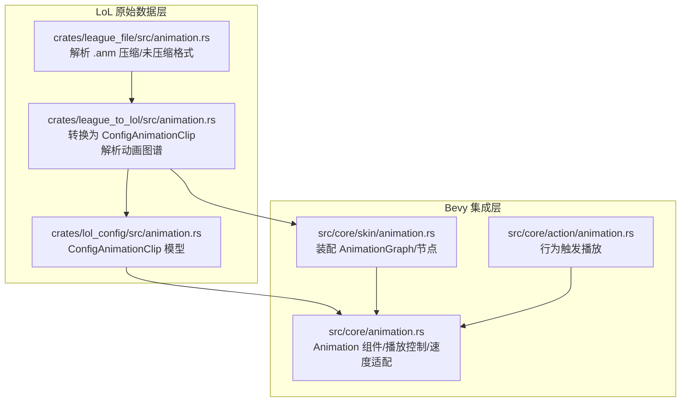
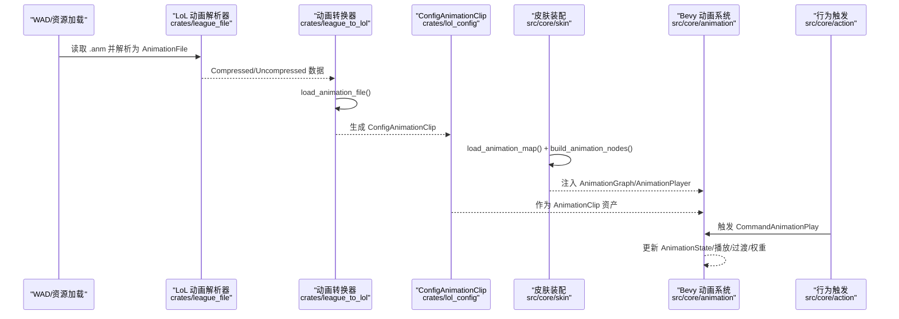
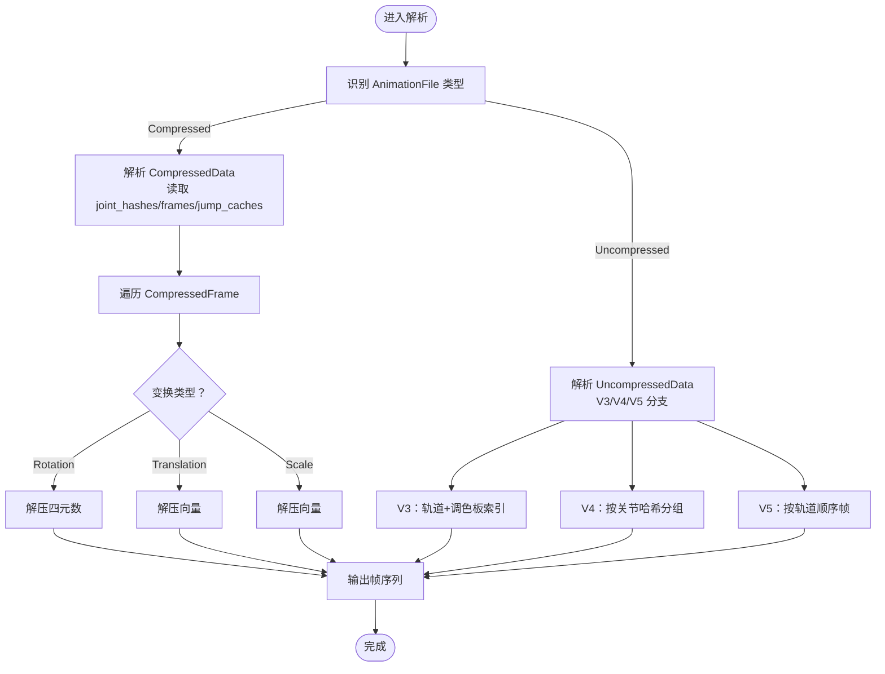
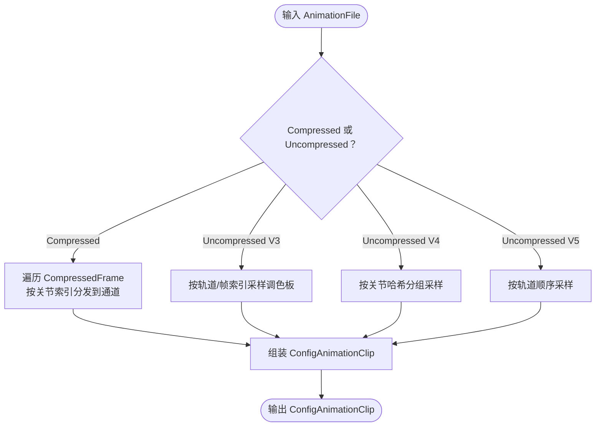
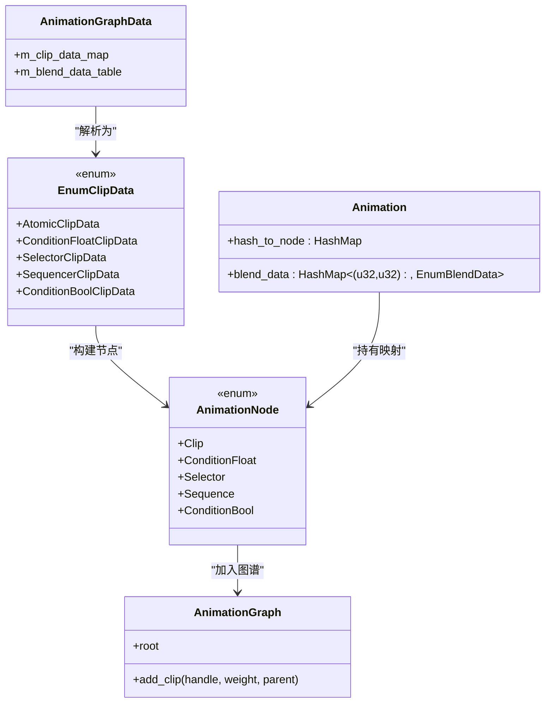
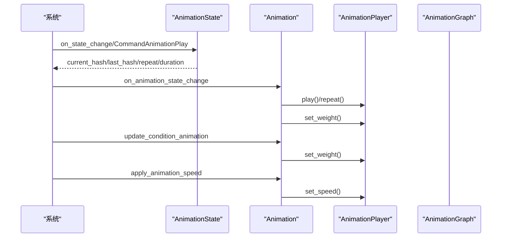
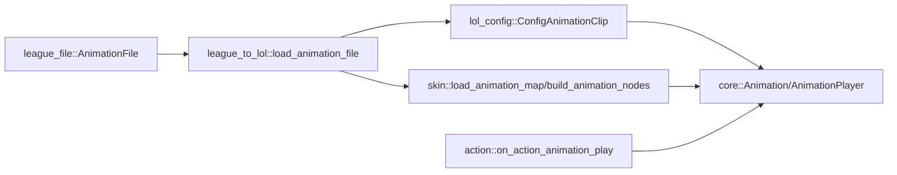
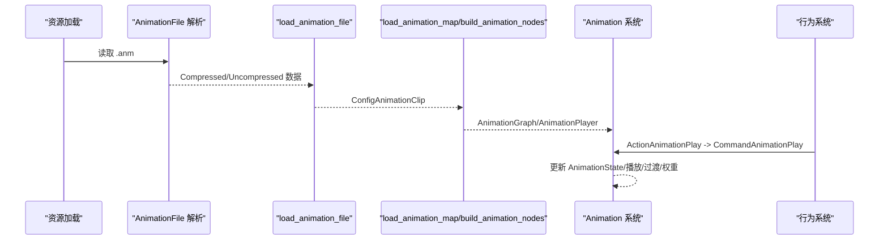

# 动画转换

<cite>
**本文引用的文件**
- [animation.rs](file://crates/league_file/src/animation.rs)
- [animation.rs](file://crates/league_to_lol/src/animation.rs)
- [animation.rs](file://crates/lol_config/src/animation.rs)
- [animation.rs](file://src/core/animation.rs)
- [animation.rs](file://src/core/skin/animation.rs)
- [animation.rs](file://src/core/action/animation.rs)
</cite>

## 目录
1. [简介](#简介)
2. [项目结构](#项目结构)
3. [核心组件](#核心组件)
4. [架构总览](#架构总览)
5. [详细组件分析](#详细组件分析)
6. [依赖关系分析](#依赖关系分析)
7. [性能考量](#性能考量)
8. [故障排查指南](#故障排查指南)
9. [结论](#结论)
10. [附录：端到端示例](#附录端到端示例)

## 简介
本文件围绕 LoL 动画系统的转换与集成进行系统化文档化，重点覆盖以下内容：
- 解析 LoL 的多种动画格式：压缩（Compressed）与未压缩（V3/V4/V5），并说明时间轴采样、关节哈希映射、变换通道（平移、旋转、缩放）的分离与重组过程。
- 详解 ConfigAnimationClip 结构体的构建流程，以及 load_animation_file 如何将原始动画数据转换为 Bevy 可用的时序数据。
- 阐述 load_animation_map 如何解析动画图谱数据，构建动画状态机所需的剪辑与混合数据。
- 结合 src/core/animation.rs，说明转换后的动画数据如何集成到 Bevy 的 AnimationPlayer 系统，并通过 src/core/action/animation.rs 触发播放。
- 提供从 .anm 文件到 Bevy 中可播放动画的端到端示例，讨论动画压缩、混合树实现及性能优化策略。

## 项目结构
该仓库采用多 crate 分层设计，动画相关逻辑分布在多个模块中：
- crates/league_file：LoL 原生动画文件格式解析（binrw 宏定义、解压函数等）
- crates/league_to_lol：将 LoL 动画数据转换为 ConfigAnimationClip，并解析动画图谱为 Bevy 可用的节点与混合数据
- crates/lol_config：定义 ConfigAnimationClip 数据模型
- src/core：Bevy 动画系统集成（Animation 组件、AnimationPlayer 控制、状态机切换、速度适配）
- src/core/skin：皮肤动画装配与动画图谱节点构建
- src/core/action：行为驱动的动画播放事件

图表来源
- [animation.rs](file://crates/league_file/src/animation.rs#L1-L120)
- [animation.rs](file://crates/league_to_lol/src/animation.rs#L1-L120)
- [animation.rs](file://crates/lol_config/src/animation.rs#L1-L13)
- [animation.rs](file://src/core/skin/animation.rs#L45-L167)
- [animation.rs](file://src/core/animation.rs#L1-L120)
- [animation.rs](file://src/core/action/animation.rs#L1-L27)

章节来源
- [animation.rs](file://crates/league_file/src/animation.rs#L1-L120)
- [animation.rs](file://crates/league_to_lol/src/animation.rs#L1-L120)
- [animation.rs](file://crates/lol_config/src/animation.rs#L1-L13)
- [animation.rs](file://src/core/skin/animation.rs#L45-L167)
- [animation.rs](file://src/core/animation.rs#L1-L120)
- [animation.rs](file://src/core/action/animation.rs#L1-L27)

## 核心组件
- LoL 动画文件格式解析器：负责识别压缩/未压缩版本，读取帧与调色板，执行解压与反量化。
- 动画转换器：将原始帧序列转换为 ConfigAnimationClip，按关节分组存储平移/旋转/缩放的时间序列。
- 动画图谱解析器：将 AnimationGraphData 转换为 Bevy 动画图谱节点与混合数据。
- Bevy 动画系统：通过 Animation 组件与 AnimationPlayer 控制播放、权重、重复与速度。
- 行为触发器：通过行为系统触发 CommandAnimationPlay，驱动状态机切换与播放。

章节来源
- [animation.rs](file://crates/league_file/src/animation.rs#L1-L120)
- [animation.rs](file://crates/league_to_lol/src/animation.rs#L1-L120)
- [animation.rs](file://crates/lol_config/src/animation.rs#L1-L13)
- [animation.rs](file://src/core/animation.rs#L1-L120)
- [animation.rs](file://src/core/skin/animation.rs#L45-L167)
- [animation.rs](file://src/core/action/animation.rs#L1-L27)

## 架构总览
下图展示从 .anm 到可播放动画的端到端流程，包括格式解析、数据转换、图谱装配与播放控制。

图表来源
- [animation.rs](file://crates/league_file/src/animation.rs#L1-L120)
- [animation.rs](file://crates/league_to_lol/src/animation.rs#L1-L120)
- [animation.rs](file://crates/lol_config/src/animation.rs#L1-L13)
- [animation.rs](file://src/core/skin/animation.rs#L45-L167)
- [animation.rs](file://src/core/animation.rs#L1-L120)
- [animation.rs](file://src/core/action/animation.rs#L1-L27)

## 详细组件分析

### 组件A：LoL 动画格式解析与解压（crates/league_file/src/animation.rs）
- 支持两种顶层格式：Compressed 与 Uncompressed。
- Compressed：
  - 包含关节哈希表、帧数、时长、FPS、误差度量、跳转缓存等元数据。
  - 帧结构包含时间、关节索引与类型、三元向量值；根据类型分别解压为平移、旋转或缩放。
  - 提供时间、向量与四元数的解压函数。
- Uncompressed：
  - V3：使用轨道+帧序列，直接从调色板索引采样。
  - V4：帧以联合键（关节哈希）分组，按时间步长采样。
  - V5：按轨道顺序存储帧，每帧包含旋转/平移/缩放索引，统一从调色板采样。

图表来源
- [animation.rs](file://crates/league_file/src/animation.rs#L1-L120)
- [animation.rs](file://crates/league_file/src/animation.rs#L120-L220)
- [animation.rs](file://crates/league_file/src/animation.rs#L220-L340)
- [animation.rs](file://crates/league_file/src/animation.rs#L340-L485)

章节来源
- [animation.rs](file://crates/league_file/src/animation.rs#L1-L120)
- [animation.rs](file://crates/league_file/src/animation.rs#L120-L220)
- [animation.rs](file://crates/league_file/src/animation.rs#L220-L340)
- [animation.rs](file://crates/league_file/src/animation.rs#L340-L485)

### 组件B：ConfigAnimationClip 构建（crates/league_to_lol/src/animation.rs）
- load_animation_file 将 AnimationFile 转换为 ConfigAnimationClip：
  - 压缩格式：按关节索引将帧按通道（平移/旋转/缩放）收集，形成时间-值序列。
  - 未压缩 V3/V4/V5：按时间步长与关节索引，从调色板采样并写入对应通道。
- 输出字段：fps、duration、joint_hashes、translates/rotations/scales（每个关节一个时间序列）。

图表来源
- [animation.rs](file://crates/league_to_lol/src/animation.rs#L1-L120)
- [animation.rs](file://crates/league_to_lol/src/animation.rs#L120-L228)
- [animation.rs](file://crates/lol_config/src/animation.rs#L1-L13)

章节来源
- [animation.rs](file://crates/league_to_lol/src/animation.rs#L1-L120)
- [animation.rs](file://crates/league_to_lol/src/animation.rs#L120-L228)
- [animation.rs](file://crates/lol_config/src/animation.rs#L1-L13)

### 组件C：动画图谱解析与节点构建（src/core/skin/animation.rs）
- load_animation_map 将 AnimationGraphData 转换为：
  - animation_map：枚举剪辑数据（原子、条件浮点、选择器、序列、布尔条件）
  - blend_data：混合数据表（键为(u32, u32)，值为混合参数）
- build_animation_nodes：
  - 为每个剪辑创建 AnimationGraph 节点（Clip/ConditionFloat/Selector/Sequence/ConditionBool）
  - 通过 AssetServer 加载对应的 AnimationClip 资产
  - 返回 hash_to_node 映射，用于后续播放控制

图表来源
- [animation.rs](file://src/core/skin/animation.rs#L45-L167)

章节来源
- [animation.rs](file://src/core/skin/animation.rs#L45-L167)

### 组件D：Bevy 动画系统集成与播放控制（src/core/animation.rs）
- Animation 组件：持有 hash_to_node 与 blend_data，支持按键获取当前节点索引、播放、重复、停止、设置速度与权重。
- AnimationState：记录当前/上一状态哈希、是否重复、持续时长。
- 状态变更与播放：
  - on_state_change：根据实体状态（Idle/Run/Attacking）更新 AnimationState
  - on_command_animation_play：接收 CommandAnimationPlay 事件，更新状态与持续时长
  - on_animation_state_change：处理状态变化，触发过渡、播放新动画、重复控制
  - update_transition_out：渐隐上一动画权重
  - update_condition_animation：根据参数（如移动速度）动态设置条件节点权重
  - apply_animation_speed：根据目标持续时长与 Clip 实际时长计算播放速度

图表来源
- [animation.rs](file://src/core/animation.rs#L1-L120)
- [animation.rs](file://src/core/animation.rs#L120-L263)
- [animation.rs](file://src/core/animation.rs#L263-L513)

章节来源
- [animation.rs](file://src/core/animation.rs#L1-L120)
- [animation.rs](file://src/core/animation.rs#L120-L263)
- [animation.rs](file://src/core/animation.rs#L263-L513)

### 组件E：行为触发播放（src/core/action/animation.rs）
- ActionAnimationPlay：行为触发消息
- on_action_animation_play：将行为事件转换为 CommandAnimationPlay，交由 Animation 系统处理

章节来源
- [animation.rs](file://src/core/action/animation.rs#L1-L27)

## 依赖关系分析
- crates/league_file 与 crates/league_to_lol 之间通过 AnimationFile 与 ConfigAnimationClip 进行数据传递。
- crates/league_to_lol 与 src/core/skin 通过 AnimationGraphData 与 EnumClipData 协作，构建 AnimationGraph。
- src/core/skin 与 src/core/animation 通过 Animation 组件与 AnimationPlayer 共同控制播放。
- src/core/action 通过事件驱动 src/core/animation 的播放。

图表来源
- [animation.rs](file://crates/league_file/src/animation.rs#L1-L120)
- [animation.rs](file://crates/league_to_lol/src/animation.rs#L1-L120)
- [animation.rs](file://crates/lol_config/src/animation.rs#L1-L13)
- [animation.rs](file://src/core/skin/animation.rs#L45-L167)
- [animation.rs](file://src/core/animation.rs#L1-L120)
- [animation.rs](file://src/core/action/animation.rs#L1-L27)

章节来源
- [animation.rs](file://crates/league_file/src/animation.rs#L1-L120)
- [animation.rs](file://crates/league_to_lol/src/animation.rs#L1-L120)
- [animation.rs](file://crates/lol_config/src/animation.rs#L1-L13)
- [animation.rs](file://src/core/skin/animation.rs#L45-L167)
- [animation.rs](file://src/core/animation.rs#L1-L120)
- [animation.rs](file://src/core/action/animation.rs#L1-L27)

## 性能考量
- 压缩格式优势：
  - 使用跳转缓存（jump caches）减少重复采样开销，适合大体量关键帧数据。
  - 通过误差度量与最小/最大边界对向量与四元数进行定点压缩，降低存储与传输成本。
- 未压缩格式优势：
  - V5 采用连续帧布局，便于顺序访问与缓存友好。
  - V3/V4 通过调色板索引避免重复存储，降低内存占用。
- 时间轴采样：
  - 压缩帧时间按比例映射至总时长，未压缩按帧计数与帧间隔计算时间。
  - 建议在转换阶段预计算时间序列，避免运行时重复计算。
- 播放控制：
  - 条件节点权重按需更新，避免不必要的播放器操作。
  - 过渡渐隐使用固定时长，确保视觉平滑且 CPU 开销可控。
- 速度适配：
  - 根据目标持续时长与 Clip 实际时长计算速度，保证动作节奏一致。

[本节为通用性能建议，无需特定文件来源]

## 故障排查指南
- 版本校验失败（压缩动画）：
  - 若版本不在允许范围内，解析会报错。请确认 .anm 文件版本与解析器支持范围一致。
- 关节索引越界：
  - 压缩帧中的关节索引超出关节计数会导致异常。检查 joint_count 与 frames 的一致性。
- V5 关节数量不匹配：
  - joint_hashes 数量应等于轨道数量。若断言失败，请检查数据源或导出流程。
- 播放无效果：
  - 确认 AnimationState 已更新且 AnimationGraph 已正确装配节点。
  - 检查条件节点的参数更新器与阈值设置是否合理。
- 过渡异常：
  - 若过渡未生效，检查 TransitionOut 组件是否存在以及权重衰减逻辑是否执行。

章节来源
- [animation.rs](file://crates/league_file/src/animation.rs#L1-L120)
- [animation.rs](file://crates/league_to_lol/src/animation.rs#L120-L228)
- [animation.rs](file://src/core/animation.rs#L263-L513)

## 结论
本项目实现了从 LoL 原生动画格式到 Bevy 动画系统的完整转换链路：通过 league_file 解析不同版本的 .anm，借助 league_to_lol 转换为 ConfigAnimationClip，并在 skin 层构建动画图谱节点，最终由 core 层的 Animation 组件与 AnimationPlayer 控制播放、过渡与速度。行为系统提供事件入口，使动画播放与游戏逻辑解耦。整体设计具备良好的扩展性与性能表现。

[本节为总结性内容，无需特定文件来源]

## 附录：端到端示例
以下示例描述从 .anm 文件到可播放动画的完整流程，帮助理解各组件协作方式。

步骤概览
- 资源加载：从 WAD/资源系统读取 .anm 文件。
- 格式解析：使用 crates/league_file 的 AnimationFile 解析器读取压缩/未压缩数据。
- 数据转换：调用 crates/league_to_lol 的 load_animation_file，生成 ConfigAnimationClip。
- 图谱装配：调用 load_animation_map 与 build_animation_nodes，构建 AnimationGraph 并注入 AnimationGraphHandle 与 Animation 组件。
- 播放控制：通过行为系统触发 ActionAnimationPlay，转换为 CommandAnimationPlay，由 core 层系统更新 AnimationState 并驱动 AnimationPlayer 播放。

图表来源
- [animation.rs](file://crates/league_file/src/animation.rs#L1-L120)
- [animation.rs](file://crates/league_to_lol/src/animation.rs#L1-L120)
- [animation.rs](file://src/core/skin/animation.rs#L45-L167)
- [animation.rs](file://src/core/animation.rs#L1-L120)
- [animation.rs](file://src/core/action/animation.rs#L1-L27)