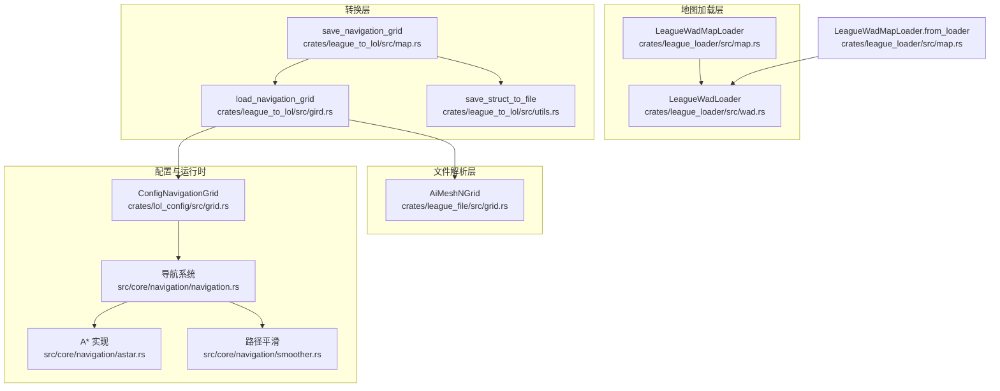
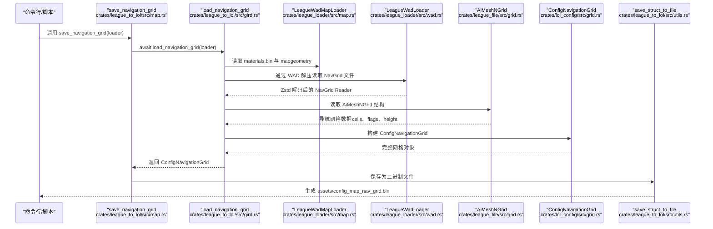
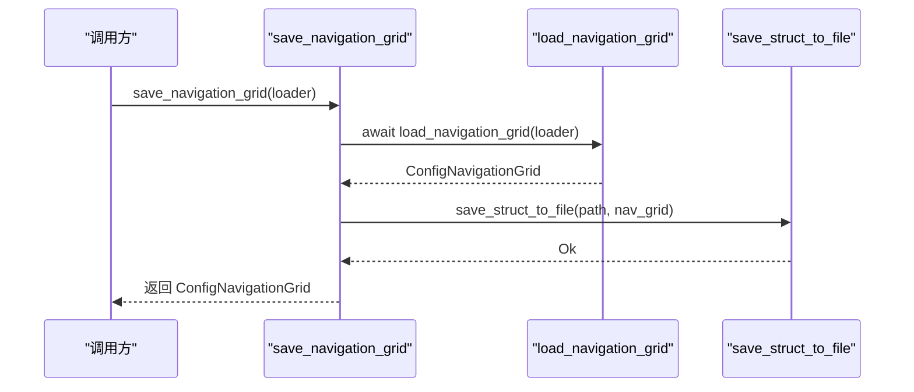
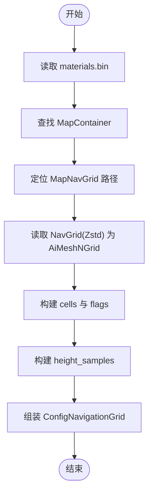
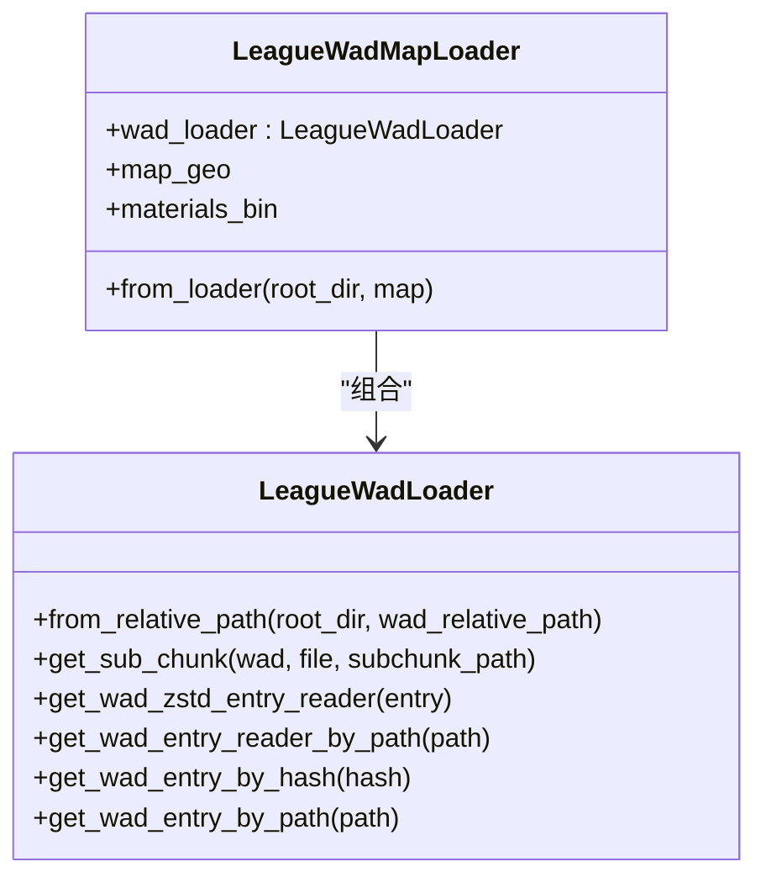
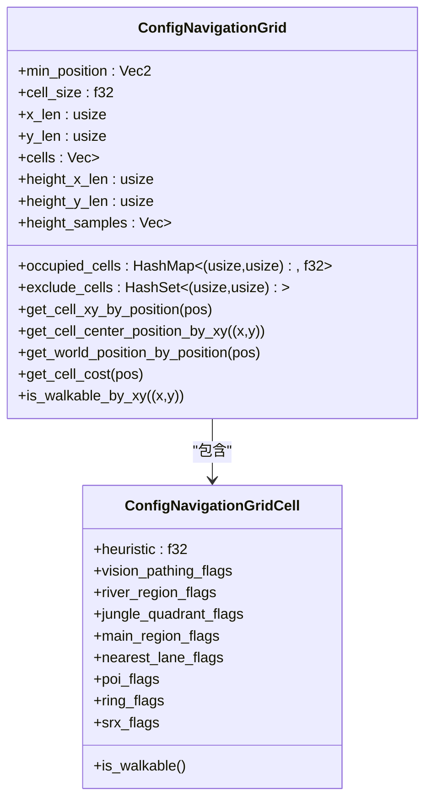
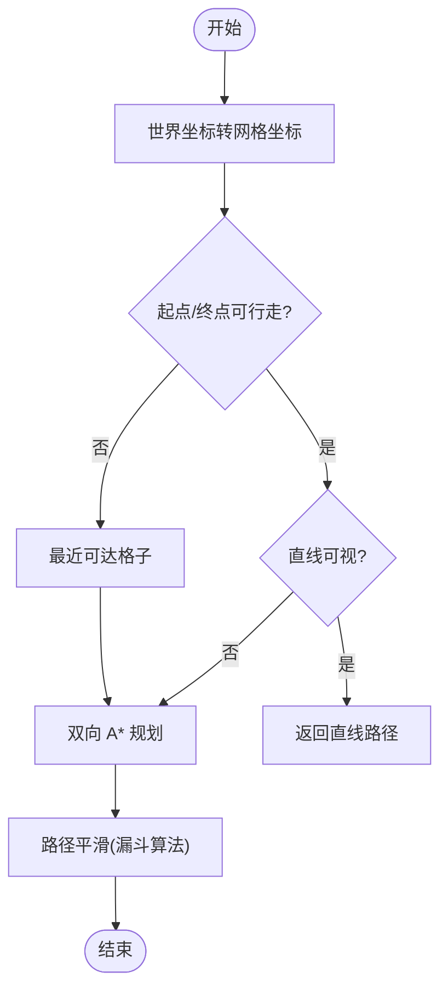
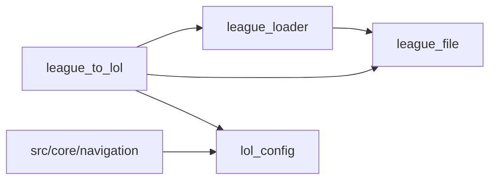

# 地图与导航网格转换

<cite>
**本文引用的文件**
- [crates/league_to_lol/src/map.rs](file://crates/league_to_lol/src/map.rs)
- [crates/league_to_lol/src/gird.rs](file://crates/league_to_lol/src/gird.rs)
- [crates/league_to_lol/src/utils.rs](file://crates/league_to_lol/src/utils.rs)
- [crates/league_loader/src/map.rs](file://crates/league_loader/src/map.rs)
- [crates/league_loader/src/wad.rs](file://crates/league_loader/src/wad.rs)
- [crates/league_file/src/grid.rs](file://crates/league_file/src/grid.rs)
- [crates/lol_config/src/grid.rs](file://crates/lol_config/src/grid.rs)
- [src/core/navigation/navigation.rs](file://src/core/navigation/navigation.rs)
- [src/core/navigation/astar.rs](file://src/core/navigation/astar.rs)
- [src/core/navigation/smoother.rs](file://src/core/navigation/smoother.rs)
- [examples/navigation_grid.rs](file://examples/navigation_grid.rs)
- [examples/research_nav.rs](file://examples/research_nav.rs)
</cite>

## 目录
1. [简介](#简介)
2. [项目结构](#项目结构)
3. [核心组件](#核心组件)
4. [架构总览](#架构总览)
5. [详细组件分析](#详细组件分析)
6. [依赖关系分析](#依赖关系分析)
7. [性能考量](#性能考量)
8. [故障排查指南](#故障排查指南)
9. [结论](#结论)
10. [附录](#附录)

## 简介
本专项文档围绕 LoL 地图到 Bevy 导航网格的转换流程展开，重点解释以下内容：
- 异步函数 save_navigation_grid 如何调用 load_navigation_grid 从 LoL 地图文件中提取导航网格数据；
- load_navigation_grid 的加载流程与数据来源；
- ConfigNavigationGrid 配置结构的序列化与二进制保存；
- 转换后的导航网格如何在 Bevy 的 navigation 模块中被使用；
- 结合 src/core/navigation/ 中的 A* 寻路与路径平滑系统，说明其如何支持游戏内单位的智能移动；
- 从 .wad 地图包到 Bevy 场景中可查询导航网格的完整流程；
- 网格分辨率、动态障碍物处理及性能优化策略。

## 项目结构
本项目采用多 crate 分层设计，涉及地图加载、文件解析、配置序列化与运行时导航等模块。关键路径如下：
- league_loader：负责从 .wad 包中读取并解压地图资源；
- league_file：定义 LoL 导航网格二进制结构（AiMeshNGrid）；
- league_to_lol：将 LoL 原生导航网格转换为 Bevy 可用的 ConfigNavigationGrid，并序列化为二进制；
- lol_config：定义 Bevy 资源 ConfigNavigationGrid 及其序列化；
- src/core/navigation：实现 A*、路径平滑与可视化调试；
- examples：提供导航网格可视化与性能研究示例。

图表来源
- [crates/league_loader/src/map.rs](file://crates/league_loader/src/map.rs#L1-L53)
- [crates/league_loader/src/wad.rs](file://crates/league_loader/src/wad.rs#L1-L147)
- [crates/league_file/src/grid.rs](file://crates/league_file/src/grid.rs#L1-L163)
- [crates/league_to_lol/src/gird.rs](file://crates/league_to_lol/src/gird.rs#L1-L84)
- [crates/league_to_lol/src/map.rs](file://crates/league_to_lol/src/map.rs#L1-L16)
- [crates/league_to_lol/src/utils.rs](file://crates/league_to_lol/src/utils.rs#L1-L75)
- [crates/lol_config/src/grid.rs](file://crates/lol_config/src/grid.rs#L1-L152)
- [src/core/navigation/navigation.rs](file://src/core/navigation/navigation.rs#L1-L695)
- [src/core/navigation/astar.rs](file://src/core/navigation/astar.rs#L1-L299)
- [src/core/navigation/smoother.rs](file://src/core/navigation/smoother.rs#L1-L183)

章节来源
- [crates/league_loader/src/map.rs](file://crates/league_loader/src/map.rs#L1-L53)
- [crates/league_loader/src/wad.rs](file://crates/league_loader/src/wad.rs#L1-L147)
- [crates/league_file/src/grid.rs](file://crates/league_file/src/grid.rs#L1-L163)
- [crates/league_to_lol/src/gird.rs](file://crates/league_to_lol/src/gird.rs#L1-L84)
- [crates/league_to_lol/src/map.rs](file://crates/league_to_lol/src/map.rs#L1-L16)
- [crates/league_to_lol/src/utils.rs](file://crates/league_to_lol/src/utils.rs#L1-L75)
- [crates/lol_config/src/grid.rs](file://crates/lol_config/src/grid.rs#L1-L152)
- [src/core/navigation/navigation.rs](file://src/core/navigation/navigation.rs#L1-L695)
- [src/core/navigation/astar.rs](file://src/core/navigation/astar.rs#L1-L299)
- [src/core/navigation/smoother.rs](file://src/core/navigation/smoother.rs#L1-L183)

## 核心组件
- LeagueWadMapLoader：封装 .wad 加载器与 mapgeo、materials.bin 的读取，提供从根目录与地图名构造加载器的能力。
- load_navigation_grid：从 LeagueWadMapLoader 中解析 MapContainer，定位 MapNavGrid 数据，读取 AiMeshNGrid，构建 ConfigNavigationGrid。
- save_navigation_grid：异步保存 ConfigNavigationGrid 为二进制文件，供 Bevy 运行时加载。
- ConfigNavigationGrid：Bevy 资源，包含网格尺寸、单元大小、高度采样、静态可行走性与动态障碍物成本等。
- 导航系统（navigation/astar/smoother）：提供 A* 双向搜索、路径平滑与可视化调试。

章节来源
- [crates/league_loader/src/map.rs](file://crates/league_loader/src/map.rs#L1-L53)
- [crates/league_to_lol/src/gird.rs](file://crates/league_to_lol/src/gird.rs#L1-L84)
- [crates/league_to_lol/src/map.rs](file://crates/league_to_lol/src/map.rs#L1-L16)
- [crates/lol_config/src/grid.rs](file://crates/lol_config/src/grid.rs#L1-L152)
- [src/core/navigation/navigation.rs](file://src/core/navigation/navigation.rs#L1-L695)
- [src/core/navigation/astar.rs](file://src/core/navigation/astar.rs#L1-L299)
- [src/core/navigation/smoother.rs](file://src/core/navigation/smoother.rs#L1-L183)

## 架构总览
从 .wad 地图包到 Bevy 场景中可查询导航网格的完整流程如下：

图表来源
- [crates/league_to_lol/src/map.rs](file://crates/league_to_lol/src/map.rs#L1-L16)
- [crates/league_to_lol/src/gird.rs](file://crates/league_to_lol/src/gird.rs#L1-L84)
- [crates/league_loader/src/map.rs](file://crates/league_loader/src/map.rs#L1-L53)
- [crates/league_loader/src/wad.rs](file://crates/league_loader/src/wad.rs#L1-L147)
- [crates/league_file/src/grid.rs](file://crates/league_file/src/grid.rs#L1-L163)
- [crates/lol_config/src/grid.rs](file://crates/lol_config/src/grid.rs#L1-L152)
- [crates/league_to_lol/src/utils.rs](file://crates/league_to_lol/src/utils.rs#L1-L75)

## 详细组件分析

### save_navigation_grid 异步函数与调用链
- 入口：save_navigation_grid 接收 LeagueWadMapLoader，异步调用 load_navigation_grid 获取 ConfigNavigationGrid。
- 保存：通过 save_struct_to_file 将 ConfigNavigationGrid 序列化为二进制文件，路径由 get_bin_path 生成。
- 输出：返回转换后的 ConfigNavigationGrid，便于后续直接在 Bevy 中使用。

图表来源
- [crates/league_to_lol/src/map.rs](file://crates/league_to_lol/src/map.rs#L1-L16)
- [crates/league_to_lol/src/utils.rs](file://crates/league_to_lol/src/utils.rs#L1-L75)

章节来源
- [crates/league_to_lol/src/map.rs](file://crates/league_to_lol/src/map.rs#L1-L16)

### load_navigation_grid 加载流程
- 来源：从 LeagueWadMapLoader 中读取 materials.bin，定位 MapContainer，提取 MapNavGrid 的路径。
- 读取：通过 LeagueWadLoader 的 Zstd 解压能力读取 NavGrid 文件，解析为 AiMeshNGrid。
- 转换：将 AiMeshNGrid 的导航网格、标志位与高度采样转换为 ConfigNavigationGrid 的 cells、height_samples 等字段。
- 关键字段映射：
  - min_position：来自 AiMeshNGrid.Header.min_bounds.xz()
  - cell_size：来自 AiMeshNGrid.Header.cell_size
  - x_len/y_len：来自 AiMeshNGrid.Header.x_cell_count/z_cell_count
  - cells：遍历 AiMeshNGrid.navigation_grid，填充 ConfigNavigationGridCell 的 heuristics 与 flags
  - height_samples：AiMeshNGrid.height_samples.samples，按 x_count 分块

图表来源
- [crates/league_to_lol/src/gird.rs](file://crates/league_to_lol/src/gird.rs#L1-L84)
- [crates/league_file/src/grid.rs](file://crates/league_file/src/grid.rs#L1-L163)
- [crates/lol_config/src/grid.rs](file://crates/lol_config/src/grid.rs#L1-L152)

章节来源
- [crates/league_to_lol/src/gird.rs](file://crates/league_to_lol/src/gird.rs#L1-L84)
- [crates/league_file/src/grid.rs](file://crates/league_file/src/grid.rs#L1-L163)

### LeagueWadMapLoader 与 WAD 解压
- LeagueWadMapLoader.from_loader：根据根目录与地图名构造加载器，解析 .wad 与 .subchunktoc，建立文件句柄与索引。
- WAD 解压：get_wad_zstd_entry_reader 内部使用 zstd 解码器，支持 chunked 子块与 zstd 压缩格式。
- map.rs 中的 from_loader：从 DATA/FINAL/Maps/Shipping/Map11.wad.client 读取 mapgeometry 与 materials.bin。

图表来源
- [crates/league_loader/src/wad.rs](file://crates/league_loader/src/wad.rs#L1-L147)
- [crates/league_loader/src/map.rs](file://crates/league_loader/src/map.rs#L1-L53)

章节来源
- [crates/league_loader/src/wad.rs](file://crates/league_loader/src/wad.rs#L1-L147)
- [crates/league_loader/src/map.rs](file://crates/league_loader/src/map.rs#L1-L53)

### ConfigNavigationGrid 配置结构与序列化
- 字段说明：
  - min_position：网格左下角世界坐标
  - cell_size：网格单元大小
  - x_len/y_len：网格行列数
  - cells：二维网格单元，每个单元包含启发式与多种 flags
  - height_x_len/height_y_len/height_samples：高度采样矩阵
  - occupied_cells/exclude_cells：动态障碍物成本与排除集合
- 序列化：通过 serde 的 Serialize/Deserialize 注解，配合 bincode 二进制序列化保存为 .bin 文件。
- 运行时使用：Bevy 资源，提供 get_cell_xy_by_position、get_cell_center_position_by_xy、get_world_position_by_position 等工具方法。

图表来源
- [crates/lol_config/src/grid.rs](file://crates/lol_config/src/grid.rs#L1-L152)

章节来源
- [crates/lol_config/src/grid.rs](file://crates/lol_config/src/grid.rs#L1-L152)
- [crates/league_to_lol/src/utils.rs](file://crates/league_to_lol/src/utils.rs#L1-L75)

### 导航系统：A*、路径平滑与动态障碍物
- A* 双向搜索：find_grid_path_with_result 使用双向 A*，平衡两端开放表规模，惰性删除与早期收敛优化；movement_cost 合并静态可行走性与动态障碍物成本。
- 路径平滑：post_process_path 先将网格路径转为世界坐标，再通过 optimize_path 使用漏斗算法简化路径。
- 动态障碍物：calculate_occupied_grid_cells 基于实体的 Bounding 半径，计算覆盖范围内的格子成本，支持多实体叠加取最大成本；exclude_cells 支持排除特定实体。
- 可视化调试：NavigationDebug 提供 visited_cells/path_cells/unoptimized_path/optimized_path，配合可视化系统展示 A* 访问与路径。

图表来源
- [src/core/navigation/navigation.rs](file://src/core/navigation/navigation.rs#L1-L695)
- [src/core/navigation/astar.rs](file://src/core/navigation/astar.rs#L1-L299)
- [src/core/navigation/smoother.rs](file://src/core/navigation/smoother.rs#L1-L183)

章节来源
- [src/core/navigation/navigation.rs](file://src/core/navigation/navigation.rs#L1-L695)
- [src/core/navigation/astar.rs](file://src/core/navigation/astar.rs#L1-L299)
- [src/core/navigation/smoother.rs](file://src/core/navigation/smoother.rs#L1-L183)

### 从 .wad 到 Bevy 场景的完整流程
- 转换阶段：
  - 使用 save_navigation_grid 读取 .wad 中的导航网格，生成 assets/config_map_nav_grid.bin。
- 运行阶段：
  - Bevy 启动时加载二进制网格资源，初始化 ConfigNavigationGrid；
  - 导航插件注册系统，预计算动态障碍物占用格子；
  - 游戏逻辑调用 get_nav_path/find_path 等接口，返回平滑后的路径；
  - 可选启用 NavigationDebug 进行可视化调试。

章节来源
- [crates/league_to_lol/src/map.rs](file://crates/league_to_lol/src/map.rs#L1-L16)
- [crates/league_to_lol/src/utils.rs](file://crates/league_to_lol/src/utils.rs#L1-L75)
- [src/core/navigation/navigation.rs](file://src/core/navigation/navigation.rs#L1-L695)
- [examples/navigation_grid.rs](file://examples/navigation_grid.rs#L1-L267)

## 依赖关系分析
- league_loader 依赖 zstd 解码与 binrw 解析 .wad/.subchunk；
- league_file 定义 AiMeshNGrid 的二进制结构；
- league_to_lol 依赖 league_loader 与 league_file，完成转换与序列化；
- lol_config 定义 ConfigNavigationGrid，供 Bevy 使用；
- src/core/navigation 依赖 lol_config 的 ConfigNavigationGrid，实现寻路与平滑。

图表来源
- [crates/league_loader/src/wad.rs](file://crates/league_loader/src/wad.rs#L1-L147)
- [crates/league_file/src/grid.rs](file://crates/league_file/src/grid.rs#L1-L163)
- [crates/league_to_lol/src/gird.rs](file://crates/league_to_lol/src/gird.rs#L1-L84)
- [crates/lol_config/src/grid.rs](file://crates/lol_config/src/grid.rs#L1-L152)
- [src/core/navigation/navigation.rs](file://src/core/navigation/navigation.rs#L1-L695)

章节来源
- [crates/league_loader/src/wad.rs](file://crates/league_loader/src/wad.rs#L1-L147)
- [crates/league_file/src/grid.rs](file://crates/league_file/src/grid.rs#L1-L163)
- [crates/league_to_lol/src/gird.rs](file://crates/league_to_lol/src/gird.rs#L1-L84)
- [crates/lol_config/src/grid.rs](file://crates/lol_config/src/grid.rs#L1-L152)
- [src/core/navigation/navigation.rs](file://src/core/navigation/navigation.rs#L1-L695)

## 性能考量
- 网格分辨率与 cell_size：
  - cell_size 越小，网格越精细，寻路精度提高但内存与计算开销增大；
  - x_len/y_len 与 height_samples 的规模直接影响内存占用与访问成本。
- A* 优化：
  - 双向搜索平衡开放表规模，减少搜索空间；
  - 惰性删除避免重复扩展低效节点；
  - heuristic 加权微调以提升收敛速度。
- 动态障碍物成本：
  - calculate_occupied_grid_cells 对重叠区域取最大成本，避免路径穿过密集障碍；
  - exclude_cells 用于排除自身占用，防止自遮挡。
- 路径平滑：
  - 漏斗算法在保证可视性的前提下显著减少路径点数量，降低渲染与物理检测负担。
- I/O 与序列化：
  - 二进制序列化 bincode 快速高效，适合离线转换与运行时快速加载。

[本节为通用性能建议，无需具体文件分析]

## 故障排查指南
- .wad 路径或文件不存在：
  - LeagueWadLoader::from_relative_path 会打开绝对路径，确认根目录与 .wad 路径正确。
- Zstd 解压失败：
  - 检查 WAD 条目格式是否为 Zstd，确认 subchunk 索引是否存在。
- materials.bin 无法解析：
  - 确认 MapContainer 中存在 MapNavGrid，路径有效。
- 导航网格为空或不可行走：
  - 检查 AiMeshNGrid 的 x_cell_count/z_cell_count 与 samples 数组长度；
  - 确认 ConfigNavigationGridCell 的 flags 未误判可行走。
- 运行时路径不可达：
  - 启用 NavigationDebug 查看 visited_cells/path_cells；
  - 检查 occupied_cells 是否过高导致不可通行；
  - 使用 find_nearest_walkable_cell 定位最近可达格子。

章节来源
- [crates/league_loader/src/wad.rs](file://crates/league_loader/src/wad.rs#L1-L147)
- [crates/league_loader/src/map.rs](file://crates/league_loader/src/map.rs#L1-L53)
- [crates/league_to_lol/src/gird.rs](file://crates/league_to_lol/src/gird.rs#L1-L84)
- [src/core/navigation/navigation.rs](file://src/core/navigation/navigation.rs#L1-L695)

## 结论
本专项文档梳理了从 LoL .wad 地图包到 Bevy 导航网格的完整转换链路，明确了 save_navigation_grid 与 load_navigation_grid 的职责边界，解释了 ConfigNavigationGrid 的序列化与运行时使用方式，并结合 A*、路径平滑与动态障碍物处理，给出了网格分辨率、性能优化与故障排查的实践建议。该流程既可用于离线转换，也可集成到运行时加载管线中，支撑游戏内单位的智能移动。

[本节为总结性内容，无需具体文件分析]

## 附录
- 示例程序：
  - examples/navigation_grid.rs：可视化导航网格与 A* 调试；
  - examples/research_nav.rs：演示从 .wad 加载导航网格的耗时统计。

章节来源
- [examples/navigation_grid.rs](file://examples/navigation_grid.rs#L1-L267)
- [examples/research_nav.rs](file://examples/research_nav.rs#L1-L20)