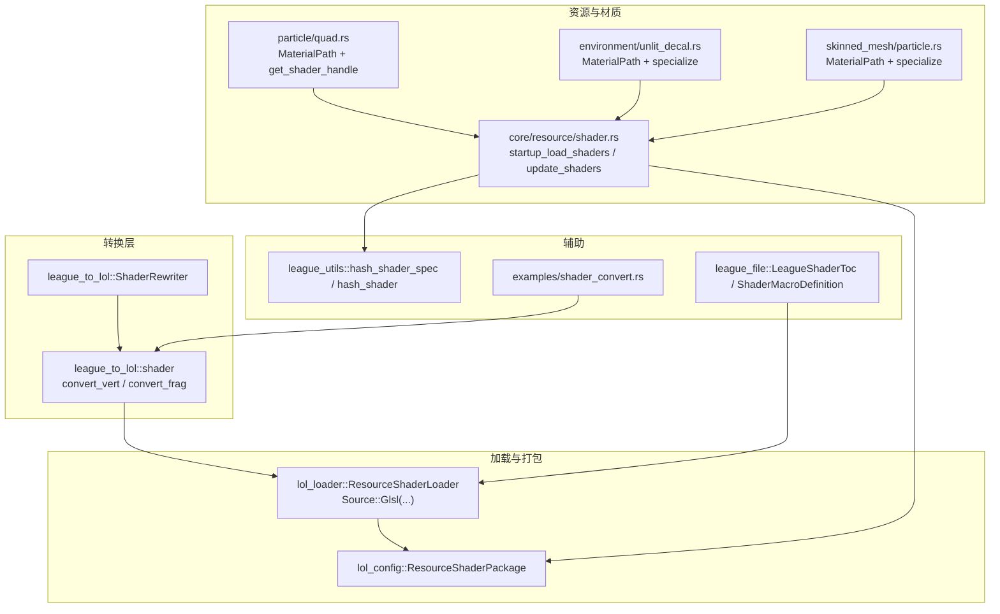
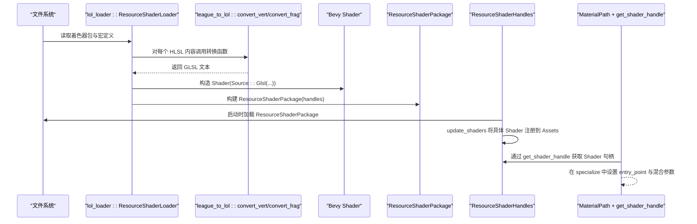
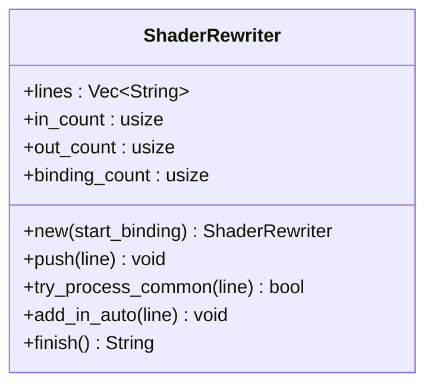
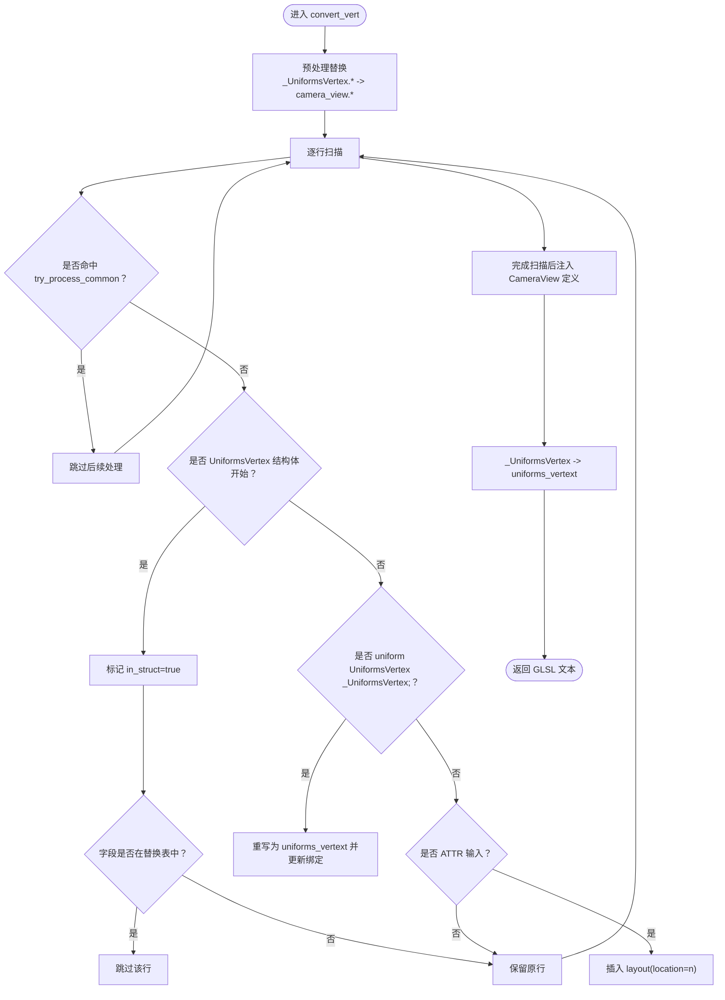
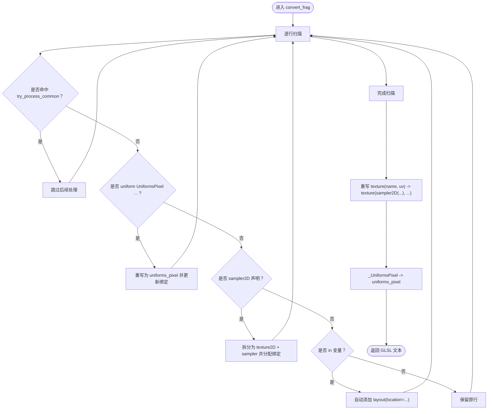
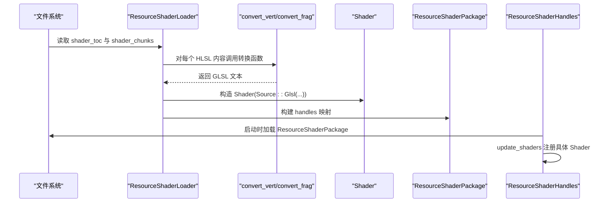
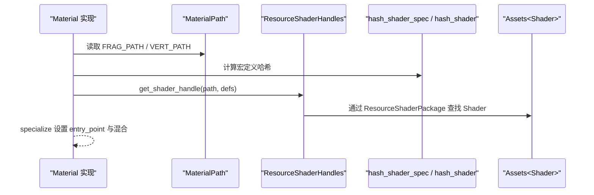
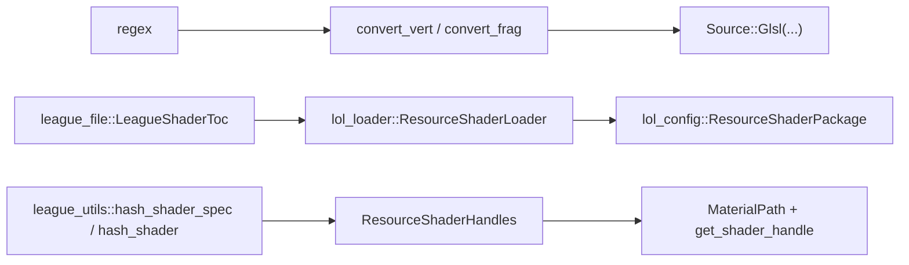

# 着色器转换

<cite>
**本文引用的文件**
- [crates/league_to_lol/src/shader.rs](file://crates/league_to_lol/src/shader.rs)
- [crates/lol_loader/src/lib.rs](file://crates/lol_loader/src/lib.rs)
- [crates/lol_config/src/shader.rs](file://crates/lol_config/src/shader.rs)
- [src/core/resource/shader.rs](file://src/core/resource/shader.rs)
- [src/core/particle/particle/quad.rs](file://src/core/particle/particle/quad.rs)
- [src/core/particle/environment/unlit_decal.rs](file://src/core/particle/environment/unlit_decal.rs)
- [src/core/particle/skinned_mesh/particle.rs](file://src/core/particle/skinned_mesh/particle.rs)
- [crates/league_file/src/shader.rs](file://crates/league_file/src/shader.rs)
- [examples/shader_convert.rs](file://examples/shader_convert.rs)
- [crates/league_utils/src/lib.rs](file://crates/league_utils/src/lib.rs)
</cite>

## 目录
1. [简介](#简介)
2. [项目结构](#项目结构)
3. [核心组件](#核心组件)
4. [架构总览](#架构总览)
5. [详细组件分析](#详细组件分析)
6. [依赖关系分析](#依赖关系分析)
7. [性能考量](#性能考量)
8. [故障排查指南](#故障排查指南)
9. [结论](#结论)
10. [附录](#附录)

## 简介
本文件围绕 LoL HLSL 着色器到 Bevy 可渲染材质的转换链路进行深度技术文档化，重点剖析以下内容：
- 顶点着色器转换函数 convert_vert 如何处理 UniformsVertex 结构体替换、CameraView 统一数据注入、ATTR 输入语义重映射；
- 片段着色器转换函数 convert_frag 如何将 sampler2D 拆分为 texture2D 和 sampler，并对 texture 调用进行重写；
- ShaderRewriter 状态机如何处理 #version、precise、out 等关键字；
- 转换后的着色器如何作为 Bevy 资源注册并应用到材质；
- 从 .hlsl 到 Bevy 可渲染材质的完整转换链示例；
- 常量缓冲区映射、纹理采样器绑定与跨平台着色器兼容性问题。

## 项目结构
本仓库中与着色器转换直接相关的模块分布如下：
- 转换实现：crates/league_to_lol/src/shader.rs
- 加载与打包：crates/lol_loader/src/lib.rs
- 资源类型：crates/lol_config/src/shader.rs
- 材质路径与使用：src/core/particle/particle/quad.rs、src/core/particle/environment/unlit_decal.rs、src/core/particle/skinned_mesh/particle.rs
- 资源加载与注册：src/core/resource/shader.rs
- 示例转换工具：examples/shader_convert.rs
- 辅助哈希与规范：crates/league_utils/src/lib.rs
- LoL 着色器目录与宏定义：crates/league_file/src/shader.rs

图表来源
- [crates/league_to_lol/src/shader.rs](file://crates/league_to_lol/src/shader.rs#L1-L206)
- [crates/lol_loader/src/lib.rs](file://crates/lol_loader/src/lib.rs#L421-L501)
- [crates/lol_config/src/shader.rs](file://crates/lol_config/src/shader.rs#L1-L12)
- [src/core/resource/shader.rs](file://src/core/resource/shader.rs#L1-L56)
- [src/core/particle/particle/quad.rs](file://src/core/particle/particle/quad.rs#L134-L220)
- [src/core/particle/environment/unlit_decal.rs](file://src/core/particle/environment/unlit_decal.rs#L95-L132)
- [src/core/particle/skinned_mesh/particle.rs](file://src/core/particle/skinned_mesh/particle.rs#L92-L121)
- [crates/league_utils/src/lib.rs](file://crates/league_utils/src/lib.rs#L33-L71)
- [crates/league_file/src/shader.rs](file://crates/league_file/src/shader.rs#L1-L58)
- [examples/shader_convert.rs](file://examples/shader_convert.rs#L1-L29)

章节来源
- [crates/league_to_lol/src/shader.rs](file://crates/league_to_lol/src/shader.rs#L1-L206)
- [crates/lol_loader/src/lib.rs](file://crates/lol_loader/src/lib.rs#L421-L501)
- [crates/lol_config/src/shader.rs](file://crates/lol_config/src/shader.rs#L1-L12)
- [src/core/resource/shader.rs](file://src/core/resource/shader.rs#L1-L56)
- [src/core/particle/particle/quad.rs](file://src/core/particle/particle/quad.rs#L134-L220)
- [src/core/particle/environment/unlit_decal.rs](file://src/core/particle/environment/unlit_decal.rs#L95-L132)
- [src/core/particle/skinned_mesh/particle.rs](file://src/core/particle/skinned_mesh/particle.rs#L92-L121)
- [crates/league_utils/src/lib.rs](file://crates/league_utils/src/lib.rs#L33-L71)
- [crates/league_file/src/shader.rs](file://crates/league_file/src/shader.rs#L1-L58)
- [examples/shader_convert.rs](file://examples/shader_convert.rs#L1-L29)

## 核心组件
- ShaderRewriter 状态机：负责逐行处理 HLSL/GLSL 兼容性问题，如 #version、precise、out/in 位置布局等。
- convert_vert：顶点阶段转换，替换 UniformsVertex 字段引用、注入 CameraView 统一数据、重映射 ATTR 输入语义。
- convert_frag：片段阶段转换，拆分 sampler2D 为 texture2D + sampler，重写 texture 调用。
- lol_loader::ResourceShaderLoader：读取 LoL 着色器包，调用转换函数生成 Bevy Shader 并打包为 ResourceShaderPackage。
- ResourceShaderHandles：Bevy 资源，用于启动时加载 ResourceShaderPackage 并在更新阶段将具体 Shader 注册到 Assets 中。
- 材质系统：MaterialPath 定义着色器路径，get_shader_handle 通过宏定义组合计算哈希，选择对应 Shader 实例。

章节来源
- [crates/league_to_lol/src/shader.rs](file://crates/league_to_lol/src/shader.rs#L1-L206)
- [crates/lol_loader/src/lib.rs](file://crates/lol_loader/src/lib.rs#L421-L501)
- [src/core/resource/shader.rs](file://src/core/resource/shader.rs#L1-L56)
- [src/core/particle/particle/quad.rs](file://src/core/particle/particle/quad.rs#L134-L220)

## 架构总览
下图展示了从 LoL HLSL 到 Bevy 渲染管线的关键转换链路。

图表来源
- [crates/lol_loader/src/lib.rs](file://crates/lol_loader/src/lib.rs#L421-L501)
- [crates/league_to_lol/src/shader.rs](file://crates/league_to_lol/src/shader.rs#L66-L206)
- [crates/lol_config/src/shader.rs](file://crates/lol_config/src/shader.rs#L1-L12)
- [src/core/resource/shader.rs](file://src/core/resource/shader.rs#L1-L56)
- [src/core/particle/particle/quad.rs](file://src/core/particle/particle/quad.rs#L134-L220)

## 详细组件分析

### ShaderRewriter 状态机
- 功能职责
  - 处理空行、#version、precise、out/in 语句，自动分配 layout(location=...)。
  - 维护 in/out 计数器与绑定计数器，确保布局连续且唯一。
- 关键行为
  - try_process_common：优先处理通用行，命中则跳过后续逻辑。
  - add_in_auto：为 in 变量自动添加位置布局。
  - finish：拼接最终 GLSL 文本。

图表来源
- [crates/league_to_lol/src/shader.rs](file://crates/league_to_lol/src/shader.rs#L1-L64)

章节来源
- [crates/league_to_lol/src/shader.rs](file://crates/league_to_lol/src/shader.rs#L1-L64)

### convert_vert：顶点着色器转换
- 主要步骤
  - 预处理：将 _UniformsVertex.mProj、_UniformsVertex.vCamera、_UniformsVertex.VIEW_PROJECTION_MATRIX 替换为 camera_view.clip_from_world、camera_view.world_position 等。
  - UniformsVertex 结构体替换：将 uniform UniformsVertex _UniformsVertex; 重写为 layout(set=3,binding=0) uniform UniformsVertex uniforms_vertext;，并跳过被替换字段。
  - ATTR 输入语义重映射：匹配形如 in T ATTRn; 的行，插入 layout(location=n) 前缀。
  - 注入 CameraView：在 #version 450 后插入 CameraView 结构体与 uniform 声明。
  - 最终替换：将 _UniformsVertex 统一替换为 uniforms_vertext。
- 关键正则与匹配
  - ATTR 匹配：r"^\s*in\s+[\w\d]+\s+ATTR(\d+);"
  - 结构体扫描：跟踪 struct UniformsVertex ... }; 的闭合。
- 输出特性
  - 返回 GLSL 文本，供 Source::Glsl 使用。

图表来源
- [crates/league_to_lol/src/shader.rs](file://crates/league_to_lol/src/shader.rs#L66-L148)

章节来源
- [crates/league_to_lol/src/shader.rs](file://crates/league_to_lol/src/shader.rs#L66-L148)

### convert_frag：片段着色器转换
- 主要步骤
  - UniformsPixel 绑定重写：将 uniform UniformsPixel ...; 重写为 layout(set=3,binding=1) uniform UniformsPixel uniforms_pixel;。
  - sampler2D 拆分：匹配 uniform sampler2D name;，拆分为：
    - layout(set=3,binding=...) uniform texture2D name_texture;
    - layout(set=3,binding=...) uniform sampler name_sampler;
    - 绑定计数自增，保证连续唯一。
  - in 语句自动布局：为 in 变量自动添加 layout(location=...)。
  - texture 调用重写：将 texture(name, uv) 重写为 texture(sampler2D(name_texture, name_sampler), uv)。
  - 最终替换：将 _UniformsPixel 统一替换为 uniforms_pixel。
- 关键正则与匹配
  - sampler2D 匹配：r"^\s*uniform\s+sampler2D\s+([a-zA-Z0-9_]+);"
  - texture 调用模式：r"texture\s*\(\s*{}\s*,"
- 输出特性
  - 返回 GLSL 文本，供 Source::Glsl 使用。

图表来源
- [crates/league_to_lol/src/shader.rs](file://crates/league_to_lol/src/shader.rs#L150-L206)

章节来源
- [crates/league_to_lol/src/shader.rs](file://crates/league_to_lol/src/shader.rs#L150-L206)

### LoL 着色器包加载与转换
- 资源加载
  - lol_loader::ResourceShaderLoader 读取 LoL 着色器包，合并结构体定义，避免解析失败。
  - 根据 shader_type 选择 convert_vert 或 convert_frag。
  - 构造 Shader(Source::Glsl(...)) 并加入 labeled 资产。
  - 生成 ResourceShaderPackage，包含按哈希索引的 Shader 句柄映射。
- 资源注册
  - startup_load_shaders：启动时加载 ResourceShaderPackage。
  - update_shaders：遍历 ResourceShaderPackage，将具体 Shader 注册到 Assets，以便 MaterialPath + get_shader_handle 使用。

图表来源
- [crates/lol_loader/src/lib.rs](file://crates/lol_loader/src/lib.rs#L421-L501)
- [crates/lol_config/src/shader.rs](file://crates/lol_config/src/shader.rs#L1-L12)
- [src/core/resource/shader.rs](file://src/core/resource/shader.rs#L1-L56)

章节来源
- [crates/lol_loader/src/lib.rs](file://crates/lol_loader/src/lib.rs#L421-L501)
- [crates/lol_config/src/shader.rs](file://crates/lol_config/src/shader.rs#L1-L12)
- [src/core/resource/shader.rs](file://src/core/resource/shader.rs#L1-L56)

### 材质系统与着色器应用
- MaterialPath：为不同材质定义顶点/片段着色器路径。
- get_shader_handle：根据路径与宏定义组合计算哈希，定位 ResourceShaderPackage 中的 Shader。
- specialize：设置入口点 main，必要时配置混合与剔除策略。
- 应用流程：MaterialPath 提供 ShaderRef，Bevy 渲染管线据此绑定到渲染通道。

图表来源
- [src/core/particle/particle/quad.rs](file://src/core/particle/particle/quad.rs#L134-L220)
- [src/core/particle/environment/unlit_decal.rs](file://src/core/particle/environment/unlit_decal.rs#L95-L132)
- [src/core/particle/skinned_mesh/particle.rs](file://src/core/particle/skinned_mesh/particle.rs#L92-L121)
- [crates/league_utils/src/lib.rs](file://crates/league_utils/src/lib.rs#L33-L71)
- [src/core/resource/shader.rs](file://src/core/resource/shader.rs#L1-L56)

章节来源
- [src/core/particle/particle/quad.rs](file://src/core/particle/particle/quad.rs#L134-L220)
- [src/core/particle/environment/unlit_decal.rs](file://src/core/particle/environment/unlit_decal.rs#L95-L132)
- [src/core/particle/skinned_mesh/particle.rs](file://src/core/particle/skinned_mesh/particle.rs#L92-L121)
- [crates/league_utils/src/lib.rs](file://crates/league_utils/src/lib.rs#L33-L71)
- [src/core/resource/shader.rs](file://src/core/resource/shader.rs#L1-L56)

### 示例转换工具
- examples/shader_convert.rs 展示了如何批量读取 .hlsl 文件，调用 convert_vert/convert_frag 进行转换并输出到目标文件，便于离线验证转换结果。

章节来源
- [examples/shader_convert.rs](file://examples/shader_convert.rs#L1-L29)

## 依赖关系分析
- 转换层依赖
  - regex：用于 ATTR、sampler2D、texture 调用等正则匹配与替换。
  - Bevy Shader API：Source::Glsl(...) 生成 Shader。
- 加载层依赖
  - league_file：解析 LoL 着色器目录与宏定义。
  - lol_config：定义 ResourceShaderPackage 数据结构。
- 资源层依赖
  - league_utils：hash_shader_spec/hash_shader 用于宏定义组合与 Shader 句柄计算。
- 材质层依赖
  - MaterialPath trait：统一着色器路径管理。
  - get_shader_handle：基于宏定义哈希选择 Shader。

图表来源
- [crates/league_to_lol/src/shader.rs](file://crates/league_to_lol/src/shader.rs#L1-L206)
- [crates/lol_loader/src/lib.rs](file://crates/lol_loader/src/lib.rs#L421-L501)
- [crates/lol_config/src/shader.rs](file://crates/lol_config/src/shader.rs#L1-L12)
- [crates/league_utils/src/lib.rs](file://crates/league_utils/src/lib.rs#L33-L71)
- [src/core/resource/shader.rs](file://src/core/resource/shader.rs#L1-L56)

章节来源
- [crates/league_to_lol/src/shader.rs](file://crates/league_to_lol/src/shader.rs#L1-L206)
- [crates/lol_loader/src/lib.rs](file://crates/lol_loader/src/lib.rs#L421-L501)
- [crates/lol_config/src/shader.rs](file://crates/lol_config/src/shader.rs#L1-L12)
- [crates/league_utils/src/lib.rs](file://crates/league_utils/src/lib.rs#L33-L71)
- [src/core/resource/shader.rs](file://src/core/resource/shader.rs#L1-L56)

## 性能考量
- 正则匹配与字符串替换
  - convert_vert/convert_frag 中使用多处正则匹配，建议在批量转换场景中缓存编译后的正则表达式，减少重复开销。
- 结构体扫描
  - lol_loader 中对 struct 进行最大长度替换，避免解析失败；该操作仅在加载阶段执行，对运行时无影响。
- 绑定与布局分配
  - ShaderRewriter 自动分配 layout(location=...) 与 set/binding，避免手动维护带来的错误与冲突。
- 资源注册
  - update_shaders 仅在资源包就绪时进行一次复制注册，避免重复注册导致的内存浪费。

[本节为一般性指导，不直接分析具体文件]

## 故障排查指南
- 转换后片段采样异常
  - 检查 convert_frag 是否正确拆分 sampler2D 为 texture2D 与 sampler，并确认 texture 调用已重写为 texture(sampler2D(...), ...)。
  - 确认 uniform UniformsPixel 的绑定位置与 set/binding 未与其他资源冲突。
- 顶点属性绑定错误
  - 检查 convert_vert 是否为 ATTR 输入添加了正确的 layout(location=n)。
  - 确认材质 specialize 中的 VertexBufferLayout 与 ATTR 位置一致。
- UniformsVertex/CameraView 不生效
  - 确认 convert_vert 已注入 CameraView 结构体与 uniform 声明，并在 #version 450 之后插入。
  - 检查 _UniformsVertex 的替换是否覆盖所有引用。
- 资源未注册或找不到 Shader
  - 确认 startup_load_shaders 已加载 ResourceShaderPackage。
  - 确认 update_shaders 已将具体 Shader 注册到 Assets。
  - 检查 get_shader_handle 的宏定义组合是否与 ResourceShaderPackage 中的哈希一致。

章节来源
- [crates/league_to_lol/src/shader.rs](file://crates/league_to_lol/src/shader.rs#L66-L206)
- [crates/lol_loader/src/lib.rs](file://crates/lol_loader/src/lib.rs#L421-L501)
- [src/core/resource/shader.rs](file://src/core/resource/shader.rs#L1-L56)
- [src/core/particle/particle/quad.rs](file://src/core/particle/particle/quad.rs#L134-L220)

## 结论
本转换链路以 league_to_lol 的转换函数为核心，配合 lol_loader 的加载与打包、league_utils 的哈希机制、以及 Bevy 的 Shader 资源体系，实现了从 LoL HLSL 到 Bevy 可渲染材质的完整闭环。通过 ShaderRewriter 的状态机化处理与结构化的资源注册流程，系统在兼容性与可维护性方面均具备良好表现。实际工程中，建议结合示例转换工具进行离线验证，并在材质层面严格对齐 ATTR 位置与绑定布局，确保跨平台渲染一致性。

[本节为总结性内容，不直接分析具体文件]

## 附录

### 常量缓冲区映射与纹理采样器绑定
- 常量缓冲区映射
  - UniformsVertex：转换后重命名为 uniforms_vertext，绑定至 set=3, binding=0。
  - UniformsPixel：转换后重命名为 uniforms_pixel，绑定至 set=3, binding=1。
- 纹理采样器绑定
  - 每个 sampler2D 被拆分为 texture2D 与 sampler，分别占用连续的 set=3 绑定槽位，避免命名冲突。
- CameraView
  - 注入 CameraView 结构体与 uniform，绑定至 set=0, binding=0，供顶点阶段访问相机矩阵与世界位置。

章节来源
- [crates/league_to_lol/src/shader.rs](file://crates/league_to_lol/src/shader.rs#L66-L206)

### 跨平台着色器兼容性
- 关键字处理
  - #version：统一替换为 450，适配 GLSL/WebGPU。
  - precise：移除 precise 前缀，避免在现代着色器中产生不兼容。
  - out/in：自动添加 layout(location=...)，确保接口布局一致。
- 语义映射
  - ATTR 输入：映射为 layout(location=n)，与 Bevy Mesh 属性对齐。
  - sampler2D：拆分为 texture2D + sampler，满足 Bevy 的资源绑定模型。

章节来源
- [crates/league_to_lol/src/shader.rs](file://crates/league_to_lol/src/shader.rs#L1-L206)