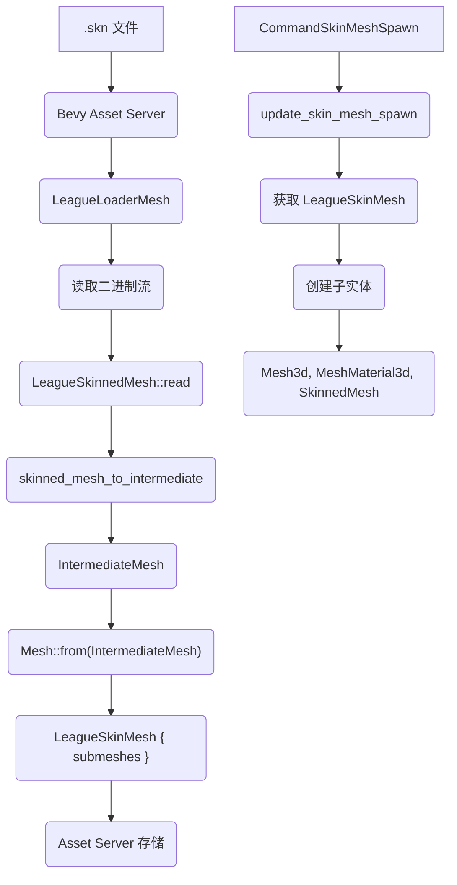
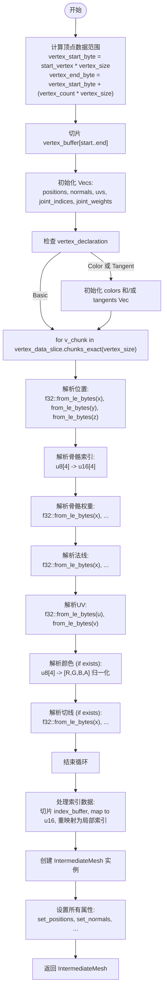
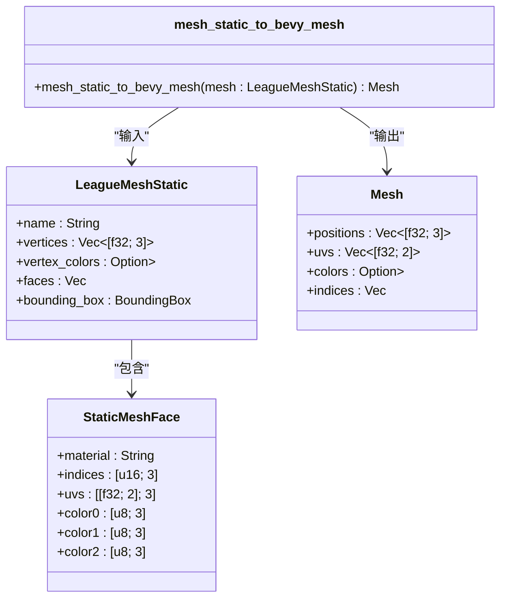
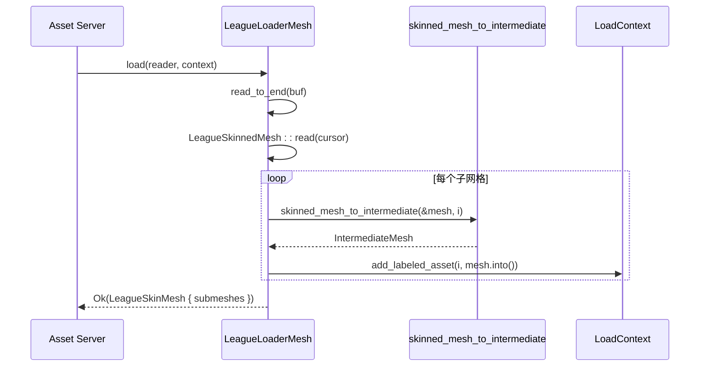
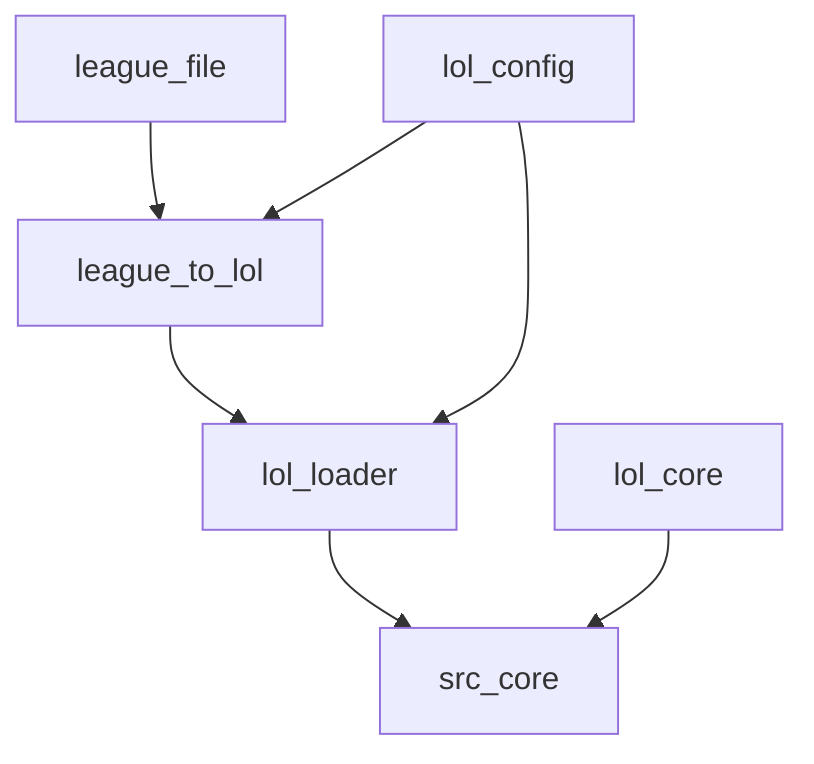

# 网格转换

<cite>
**本文档引用的文件**  
- [skin_mesh.rs](file://crates/league_to_lol/src/skin_mesh.rs)
- [mesh_skinned.rs](file://crates/league_file/src/mesh_skinned.rs)
- [mesh_static.rs](file://crates/league_file/src/mesh_static.rs)
- [mesh_static.rs](file://crates/league_to_lol/src/mesh_static.rs)
- [mesh.rs](file://crates/lol_config/src/mesh.rs)
- [resource.rs](file://src/core/resource.rs)
- [skin.rs](file://src/core/skin.rs)
- [lib.rs](file://crates/lol_loader/src/lib.rs)
</cite>

## 目录
1. [引言](#引言)
2. [项目结构](#项目结构)
3. [核心组件](#核心组件)
4. [架构概述](#架构概述)
5. [详细组件分析](#详细组件分析)
6. [依赖分析](#依赖分析)
7. [性能考虑](#性能考虑)
8. [故障排除指南](#故障排除指南)
9. [结论](#结论)

## 引言
本文档详细阐述了如何将《英雄联盟》（LoL）的`LeagueSkinnedMesh`数据结构转换为Bevy引擎可用的`IntermediateMesh`。重点分析了`skin_mesh.rs`中的`skinned_mesh_to_intermediate`函数，该函数负责解析`.skn`文件中的顶点属性（位置、法线、UV、骨骼索引与权重、颜色、切线），并将其转换为Bevy的中间表示。文档还对比了静态网格与骨骼网格的转换差异，解释了转换后的网格如何通过Bevy的Asset Server加载并绑定到`SkinnedMesh`组件，最终在场景中实现可动画角色。

## 项目结构
项目采用模块化设计，主要功能分散在多个crates中。`league_file` crate负责定义和解析LoL的原始文件格式（如`.skn`, `.scb`）。`league_to_lol` crate提供转换逻辑，将这些原始数据转换为Bevy引擎可用的中间格式。`lol_config`和`lol_loader` crate则负责在Bevy框架内注册资产类型和加载器。`src/core`目录下的模块处理游戏核心逻辑，包括皮肤、动画和资源管理。

## 核心组件
核心组件包括`LeagueSkinnedMesh`（LoL骨骼网格数据结构）、`IntermediateMesh`（Bevy中间网格表示）和`LeagueSkinMesh`（Bevy资产）。转换过程由`skinned_mesh_to_intermediate`函数驱动，该函数从`LeagueSkinnedMesh`中提取子网格数据，解析顶点缓冲区，并填充`IntermediateMesh`。最终，`LeagueLoaderMesh`加载器将`.skn`文件转换为`LeagueSkinMesh`资产，供Bevy场景使用。

**Section sources**
- [skin_mesh.rs](file://crates/league_to_lol/src/skin_mesh.rs#L4-L144)
- [mesh.rs](file://crates/lol_config/src/mesh.rs#L43-L310)
- [lib.rs](file://crates/lol_loader/src/lib.rs#L94-L127)

## 架构概述
整个转换流程是一个从文件加载到场景渲染的管道。首先，Bevy的Asset Server根据文件扩展名调用相应的加载器。对于`.skn`文件，`LeagueLoaderMesh`被调用。该加载器读取二进制数据，创建`LeagueSkinnedMesh`实例，然后调用`league_to_lol`中的`skinned_mesh_to_intermediate`函数进行转换。转换后的`IntermediateMesh`被添加为Bevy的`Mesh`资产，并最终组合成`LeagueSkinMesh`资产。在游戏逻辑中，通过触发`CommandSkinMeshSpawn`事件，系统会加载这些资产并将其与`SkinnedMesh`组件一起添加到实体上，从而在场景中渲染出可动画的角色。

**Diagram sources**
- [lib.rs](file://crates/lol_loader/src/lib.rs#L94-L127)
- [skin_mesh.rs](file://crates/league_to_lol/src/skin_mesh.rs#L4-L144)
- [mesh.rs](file://crates/lol_config/src/mesh.rs#L263-L308)
- [skin.rs](file://src/core/skin/mesh.rs#L52-L77)

## 详细组件分析

### `skinned_mesh_to_intermediate` 函数分析
该函数是骨骼网格转换的核心，负责将`LeagueSkinnedMesh`的特定子网格转换为`IntermediateMesh`。

#### 顶点属性解析流程
函数首先根据子网格索引和顶点声明计算顶点数据的字节范围，然后对顶点缓冲区进行切片。接着，它遍历每个顶点数据块，按照预定义的字节布局逐个解析属性。

**Diagram sources**
- [skin_mesh.rs](file://crates/league_to_lol/src/skin_mesh.rs#L8-L144)

#### 字节序与数据解析
所有浮点数（`f32`）和16位整数（`u16`）都使用小端字节序（Little-Endian）进行解析。这是通过`f32::from_le_bytes()`和`u16::from_le_bytes()`函数实现的。顶点数据块（`v_chunk`）是一个字节数组，函数通过计算偏移量（`offset`）来定位每个属性的起始位置。例如，位置数据位于偏移量0-11，骨骼索引位于12-15，以此类推。

**Section sources**
- [skin_mesh.rs](file://crates/league_to_lol/src/skin_mesh.rs#L43-L46)
- [skin_mesh.rs](file://crates/league_to_lol/src/skin_mesh.rs#L50-L56)
- [skin_mesh.rs](file://crates/league_to_lol/src/skin_mesh.rs#L60-L65)

#### 顶点缓冲区切片与索引重映射
函数通过`start_vertex`和`vertex_count`计算出顶点数据的字节范围，并使用`get()`方法对`vertex_buffer`进行切片，从而只处理当前子网格相关的顶点。对于索引数据，函数同样进行切片，然后将全局索引（`global_index`）减去`start_vertex`，转换为相对于当前子网格的局部索引（`local_index`），这是渲染单个子网格所必需的。

**Section sources**
- [skin_mesh.rs](file://crates/league_to_lol/src/skin_mesh.rs#L13-L18)
- [skin_mesh.rs](file://crates/league_to_lol/src/skin_mesh.rs#L106-L117)

### 静态网格与骨骼网格转换差异
静态网格（`.scb`文件）和骨骼网格（`.skn`文件）的转换逻辑有显著差异。

#### 静态网格转换 (`mesh_static.rs`)
静态网格的顶点数据存储方式不同。它有一个全局的顶点位置列表，而每个“面”（face）存储了指向这些顶点的索引以及该面特有的UV坐标。`mesh_static_to_bevy_mesh`函数需要遍历每个面，然后遍历面的每个顶点，根据索引从全局列表中查找位置，并直接使用面中存储的UV。这导致了顶点的“展开”（unwrapping），即同一个位置可能因为不同的UV而被多次添加到最终的顶点列表中。

**Diagram sources**
- [mesh_static.rs](file://crates/league_file/src/mesh_static.rs#L77-L182)
- [mesh_static.rs](file://crates/league_to_lol/src/mesh_static.rs#L6-L75)

#### 骨骼网格转换 (`skin_mesh.rs`)
骨骼网格的每个顶点都直接包含了其所有属性（位置、法线、UV、骨骼信息等），因此不需要像静态网格那样进行复杂的展开。转换过程主要是对顶点缓冲区的直接解析和属性的重新组织。此外，骨骼网格包含了骨骼索引和权重，这是静态网格所没有的，用于实现蒙皮动画。

**Section sources**
- [mesh_skinned.rs](file://crates/league_file/src/mesh_skinned.rs#L49-L98)
- [skin_mesh.rs](file://crates/league_to_lol/src/skin_mesh.rs#L4-L144)

### 资源加载与组件绑定
转换后的网格通过Bevy的ECS系统和资产系统集成到场景中。

#### 资产加载流程
`LeagueLoaderMesh`实现了Bevy的`AssetLoader` trait。当Asset Server请求一个`.skn`文件时，`load`方法被异步调用。该方法读取文件，解析为`LeagueSkinnedMesh`，然后对每个子网格调用`skinned_mesh_to_intermediate`，并将生成的`IntermediateMesh`转换为Bevy的`Mesh`资产。这些`Mesh`被存储在`LeagueSkinMesh`结构中，并作为一个整体资产返回。

**Diagram sources**
- [lib.rs](file://crates/lol_loader/src/lib.rs#L94-L127)
- [skin_mesh.rs](file://crates/league_to_lol/src/skin_mesh.rs#L4-L144)

#### 组件绑定流程
游戏逻辑通过触发`CommandSkinMeshSpawn`事件来请求加载和绑定皮肤网格。`on_command_skin_mesh_spawn`系统响应此事件，加载`LeagueSkinMesh`和材质，并将`Loading<SkinMeshSpawn>`组件添加到实体上。`update_skin_mesh_spawn`系统在每个更新周期检查`Loading`组件，一旦`LeagueSkinMesh`资产加载完成，它就会遍历其`submeshes`，为每个子网格创建一个子实体，并附加`Mesh3d`、`MeshMaterial3d`和`SkinnedMesh`组件，从而完成角色的构建。

**Section sources**
- [skin.rs](file://src/core/skin/mesh.rs#L17-L77)
- [skin.rs](file://src/core/skin.rs#L19-L34)

## 依赖分析
系统依赖关系清晰。`league_to_lol`依赖`league_file`来获取原始数据结构，并依赖`lol_config`来获取`IntermediateMesh`。`lol_loader`依赖`league_to_lol`的转换函数和`lol_config`的资产类型。`src/core`中的游戏逻辑模块依赖`lol_loader`的资产和`lol_core`的组件。这种分层设计确保了关注点分离，使得文件解析、数据转换和游戏逻辑相互独立。

**Diagram sources**
- [Cargo.toml](file://crates/league_to_lol/Cargo.toml)
- [Cargo.toml](file://crates/lol_loader/Cargo.toml)
- [Cargo.toml](file://crates/lol_core/Cargo.toml)

**Section sources**
- [lib.rs](file://crates/lol_loader/src/lib.rs)
- [skin.rs](file://src/core/skin.rs)

## 性能考虑
顶点数据的解析是CPU密集型操作。当前实现通过预分配`Vec`容量（`with_capacity`）来避免频繁的内存重新分配，这是一个重要的优化。对于GPU实例化，系统目前没有直接支持，但`LeagueSkinMesh`包含多个`Handle<Mesh>`，理论上可以为相同网格的不同实例共享这些`Handle`，从而实现一定程度的实例化。LOD（Level of Detail）生成需要在转换管道中引入额外的逻辑，例如在`skinned_mesh_to_intermediate`之后添加一个简化网格的步骤，或者在资产加载时根据距离选择不同细节级别的`.skn`文件。

## 故障排除指南
常见问题包括模型显示错误、动画不工作或加载失败。如果模型显示扭曲，应检查顶点属性的解析顺序和字节偏移量是否与`.skn`文件的实际布局匹配。如果动画不工作，应确认`joint_indices`和`joint_weights`是否正确解析，并且`SkinnedMesh`组件是否正确绑定。加载失败通常源于文件路径错误或二进制格式解析失败，应检查`LeagueSkinnedMesh::read`的`binread`宏定义是否与文件格式完全一致。

**Section sources**
- [skin_mesh.rs](file://crates/league_to_lol/src/skin_mesh.rs)
- [mesh_skinned.rs](file://crates/league_file/src/mesh_skinned.rs)
- [lib.rs](file://crates/lol_loader/src/lib.rs)

## 结论
本文档详细解析了从LoL的`.skn`文件到Bevy引擎中可动画角色的完整转换流程。核心在于`skinned_mesh_to_intermediate`函数对顶点数据的精确解析，以及Bevy资产系统和ECS系统对转换后数据的高效集成。理解静态网格和骨骼网格在数据布局和转换逻辑上的差异，对于正确处理不同类型的3D模型至关重要。未来的优化方向包括实现LOD和更高级的GPU实例化支持。