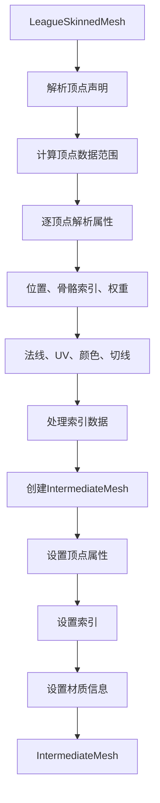
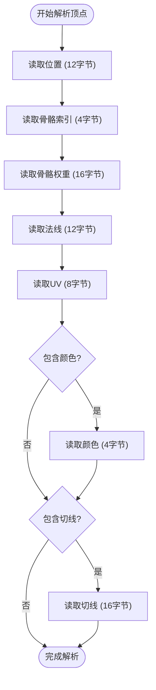
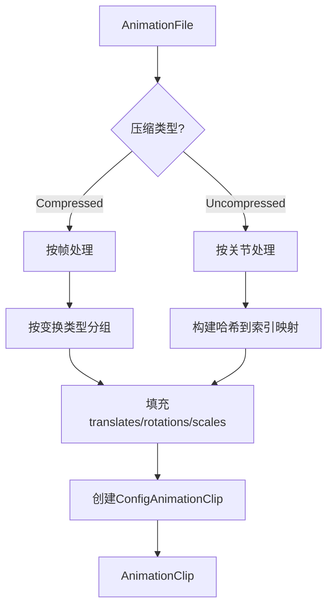
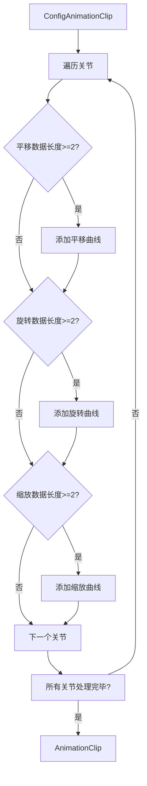
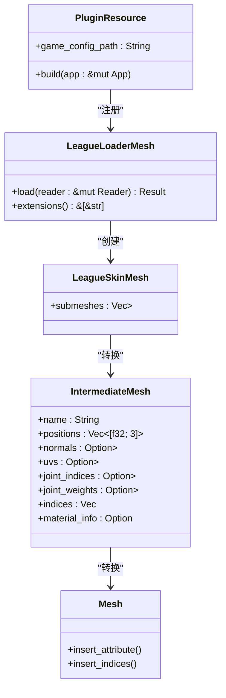
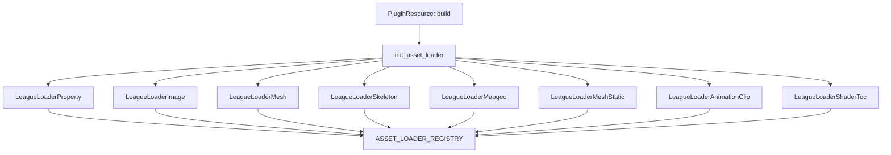
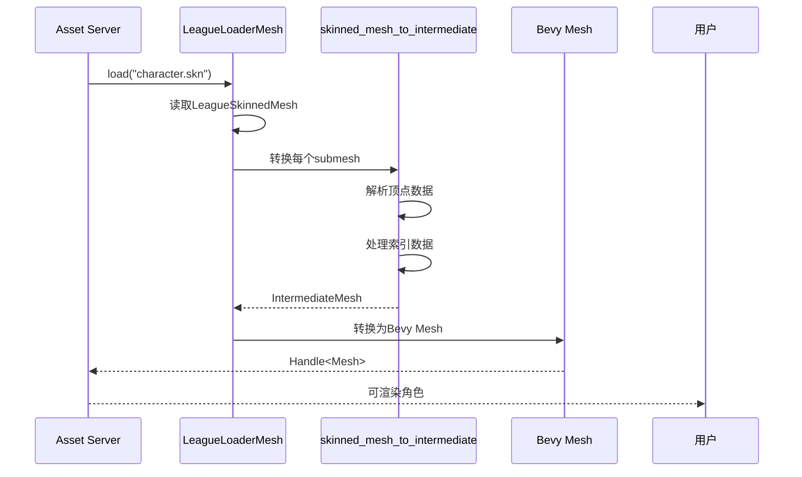

# 资源转换

<cite>
**本文档中引用的文件**  
- [skin_mesh.rs](file://crates/league_to_lol/src/skin_mesh.rs)
- [animation.rs](file://crates/league_to_lol/src/animation.rs)
- [resource.rs](file://src/core/resource.rs)
- [skin.rs](file://crates/lol_core/src/skin.rs)
- [mesh.rs](file://crates/lol_config/src/mesh.rs)
- [league_loader/lib.rs](file://crates/lol_loader/src/lib.rs)
- [register.rs](file://crates/lol_config/src/register.rs)
</cite>

## 目录
1. [简介](#简介)
2. [资源转换管道](#资源转换管道)
3. [骨骼网格转换](#骨骼网格转换)
4. [动画剪辑生成](#动画剪辑生成)
5. [资源注册与管理](#资源注册与管理)
6. [端到端转换示例](#端到端转换示例)
7. [性能优化](#性能优化)
8. [结论](#结论)

## 简介
本文档详细阐述了`league_to_lol` crate中的资源转换模块，该模块负责将解析后的LoL原生数据结构转换为Bevy引擎可消费的运行时资源。文档重点分析了从LoL `.skn` 文件到Bevy场景中可渲染角色的完整转换流程，包括骨骼网格数据映射、动画剪辑生成、资源注册管理等核心环节。

## 资源转换管道
`league_to_lol` crate构成了从LoL原生数据到Bevy可消费资源的转换管道。该管道通过一系列模块化函数，将`league_file` crate解析出的原始数据结构转换为`lol_config` crate定义的中间表示，最终由Bevy的Asset Server加载为运行时资源。

**Section sources**
- [lib.rs](file://crates/league_to_lol/src/lib.rs#L1-L26)

## 骨骼网格转换
`skin_mesh.rs`模块是骨骼网格转换的核心，它实现了将`LeagueSkinnedMesh`转换为`IntermediateMesh`的功能。

**Diagram sources**
- [skin_mesh.rs](file://crates/league_to_lol/src/skin_mesh.rs#L4-L144)

**Section sources**
- [skin_mesh.rs](file://crates/league_to_lol/src/skin_mesh.rs#L4-L144)
- [mesh_skinned.rs](file://crates/league_file/src/mesh_skinned.rs#L46-L98)
- [mesh.rs](file://crates/lol_config/src/mesh.rs#L43-L261)

### 顶点属性重排与处理
在转换过程中，系统会根据`SkinnedMeshVertex`的声明类型动态处理顶点属性。对于包含颜色和切线的顶点，会相应地初始化`colors`和`tangents`向量。颜色数据从BGRA格式转换为RGBA格式，并进行归一化处理。

**Diagram sources**
- [skin_mesh.rs](file://crates/league_to_lol/src/skin_mesh.rs#L38-L103)

### UV坐标翻转与材质绑定
系统在解析UV坐标时直接读取原始数据，不进行翻转操作。材质信息通过`SkinnedMeshRange`中的`name`字段获取，并绑定到`IntermediateMesh`的`material_info`属性上。

**Section sources**
- [skin_mesh.rs](file://crates/league_to_lol/src/skin_mesh.rs#L76-L79)
- [skin_mesh.rs](file://crates/league_to_lol/src/skin_mesh.rs#L138-L141)

## 动画剪辑生成
`animation.rs`模块负责将LoL动画文件转换为Bevy的`AnimationClip`。

**Diagram sources**
- [animation.rs](file://crates/league_to_lol/src/animation.rs#L34-L227)

**Section sources**
- [animation.rs](file://crates/league_to_lol/src/animation.rs#L34-L227)
- [animation.rs](file://crates/lol_config/src/animation.rs#L4-L12)

### 时间轴采样与变换通道重组
系统根据动画文件的版本和压缩类型，采用不同的采样策略。对于压缩动画，直接按帧时间采样；对于未压缩动画，通过帧索引和帧率计算时间。变换通道被重组为平移、旋转和缩放三个独立的向量。

**Section sources**
- [animation.rs](file://crates/league_to_lol/src/animation.rs#L44-L66)
- [animation.rs](file://crates/league_to_lol/src/animation.rs#L100-L112)

### Bevy动画系统集成
`LeagueLoaderAnimationClip`加载器将`ConfigAnimationClip`转换为Bevy的`AnimationClip`，通过`add_curve_to_target`方法为每个关节添加变换曲线。

**Diagram sources**
- [lib.rs](file://crates/lol_loader/src/lib.rs#L343-L392)

## 资源注册与管理
转换后的资源通过Bevy的Asset Server进行注册与管理，这一过程在`src/core/resource.rs`中实现。

**Diagram sources**
- [resource.rs](file://src/core/resource.rs#L30-L68)
- [skin.rs](file://crates/lol_core/src/skin.rs#L3-L6)
- [mesh.rs](file://crates/lol_config/src/mesh.rs#L263-L308)

**Section sources**
- [resource.rs](file://src/core/resource.rs#L30-L68)
- [skin.rs](file://crates/lol_core/src/skin.rs#L3-L6)
- [mesh.rs](file://crates/lol_config/src/mesh.rs#L263-L308)

### Asset Loader注册机制
系统通过`ASSET_LOADER_REGISTRY`全局注册表管理所有资源加载器，确保不同类型的资源能够被正确加载。

**Diagram sources**
- [resource.rs](file://src/core/resource.rs#L46-L53)
- [register.rs](file://crates/lol_config/src/register.rs#L89-L108)

## 端到端转换示例
从LoL `.skn` 文件到Bevy场景中可渲染角色的完整转换流程如下：

**Diagram sources**
- [lib.rs](file://crates/lol_loader/src/lib.rs#L104-L122)
- [skin_mesh.rs](file://crates/league_to_lol/src/skin_mesh.rs#L4-L144)
- [mesh.rs](file://crates/lol_config/src/mesh.rs#L263-L308)

## 性能优化
系统在资源转换和管理方面实现了多项性能优化措施。

### GPU实例化支持
通过将静态网格和材质信息分离，系统为GPU实例化提供了基础支持。`ConfigMapGeo`结构存储了多个子网格的共享几何数据和独立材质信息，便于批量渲染。

**Section sources**
- [lib.rs](file://crates/lol_loader/src/lib.rs#L140-L187)

### LOD生成
虽然当前代码未直接实现LOD（Level of Detail）生成，但`LeagueSkinnedMesh`结构包含了`bounding_box`和`bounding_sphere`等信息，为后续实现LOD提供了必要的数据基础。

**Section sources**
- [mesh_skinned.rs](file://crates/league_file/src/mesh_skinned.rs#L46-L85)

## 结论
`league_to_lol` crate成功实现了从LoL原生数据到Bevy引擎资源的完整转换管道。通过模块化的转换函数和Bevy的Asset系统，系统能够高效地将`.skn`、`.anm`等LoL资源转换为可渲染的3D角色和动画。未来可在此基础上进一步优化性能，实现LOD和更高级的渲染特性。