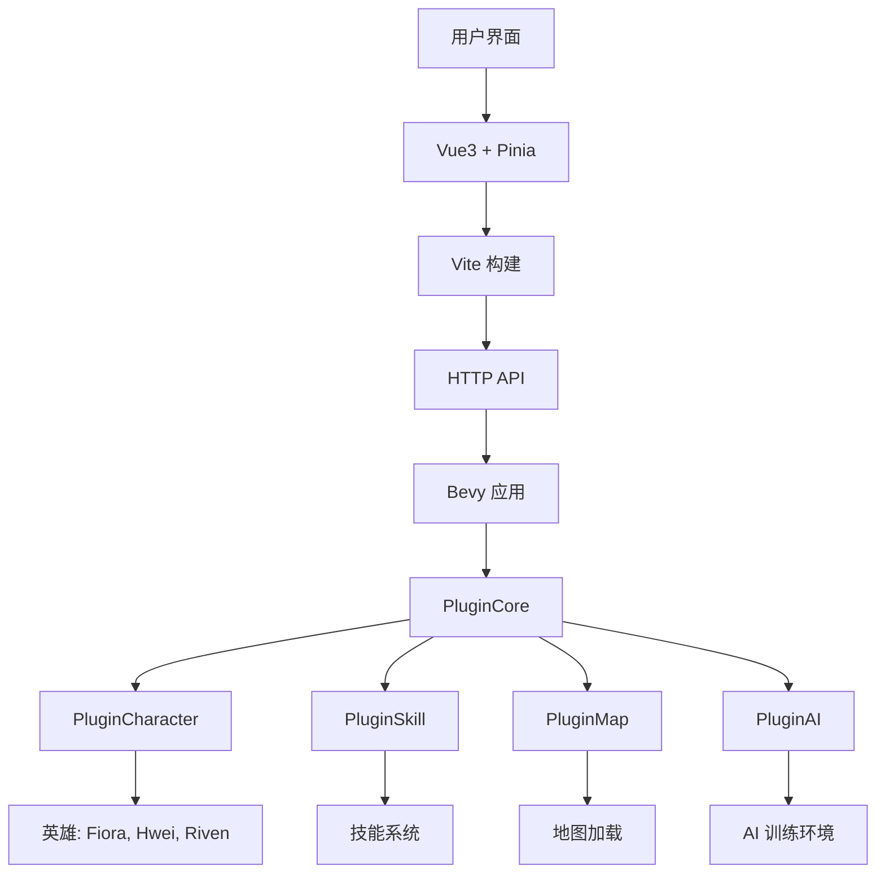
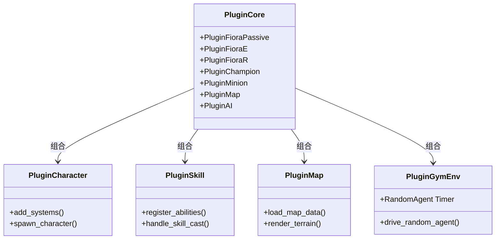
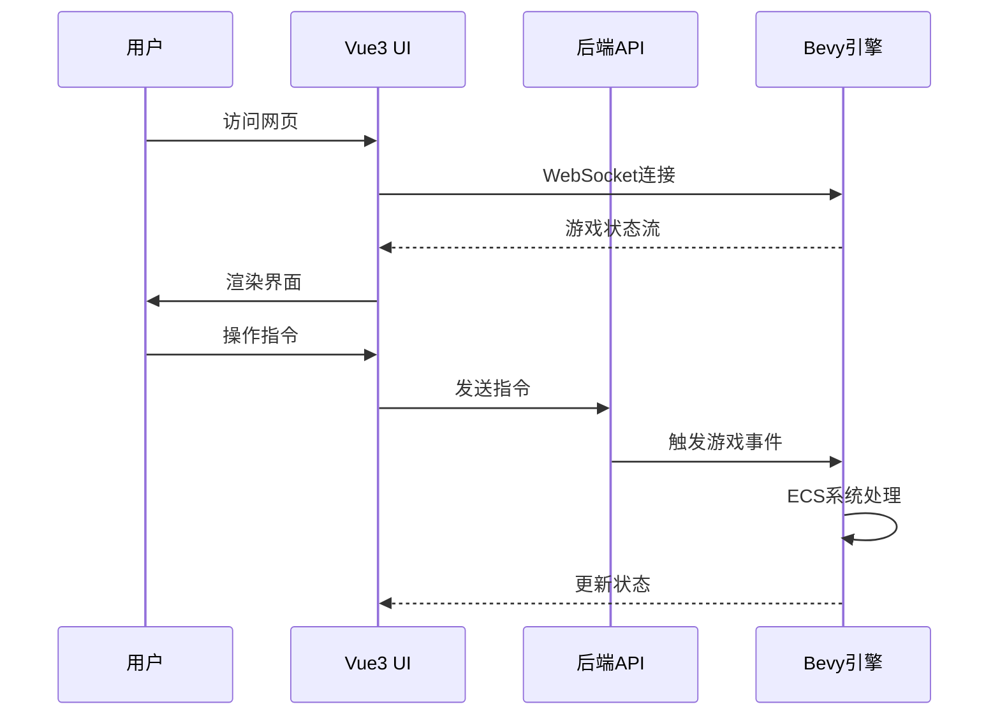
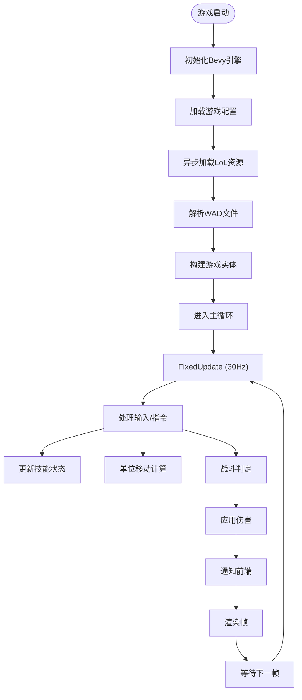
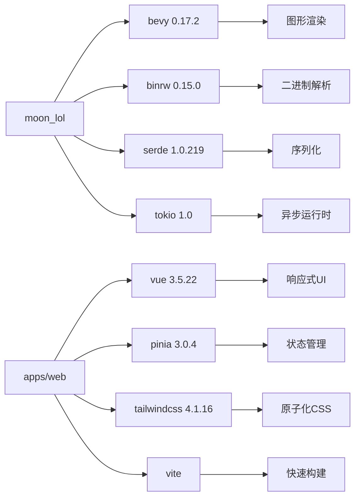

# 项目概述

<cite>
**本文档引用的文件**
- [Cargo.toml](file://Cargo.toml)
- [package.json](file://package.json)
- [pnpm-workspace.yaml](file://pnpm-workspace.yaml)
- [src/main.rs](file://src/main.rs)
- [src/lib.rs](file://src/lib.rs)
- [crates/league_core/Cargo.toml](file://crates/league_core/Cargo.toml)
- [crates/league_file/Cargo.toml](file://crates/league_file/Cargo.toml)
- [crates/lol_core/Cargo.toml](file://crates/lol_core/Cargo.toml)
- [apps/web/package.json](file://apps/web/package.json)
- [apps/web/vite.config.ts](file://apps/web/vite.config.ts)
- [apps/web/src/main.ts](file://apps/web/src/main.ts)
- [examples/rl_env.rs](file://examples/rl_env.rs)
- [examples/extract.rs](file://examples/extract.rs)
- [src/core/config.rs](file://src/core/config.rs)
</cite>

## 目录
1. [简介](#简介)
2. [项目结构](#项目结构)
3. [核心组件](#核心组件)
4. [架构概览](#架构概览)
5. [详细组件分析](#详细组件分析)
6. [依赖分析](#依赖分析)
7. [性能考虑](#性能考虑)
8. [故障排除指南](#故障排除指南)
9. [结论](#结论)

## 简介
moon-lol 是一个基于 Rust 和 Bevy 游戏引擎的高性能游戏框架，旨在解析和渲染《英雄联盟》(League of Legends, LoL) 的游戏资源文件，包括模型、材质、动画、地图等，并构建可扩展的游戏逻辑系统。该项目不仅支持英雄行为、技能和战斗机制的实现，还为 AI 训练环境提供了基础支持。目标用户包括游戏开发研究人员、LoL 资源解析开发者以及 AI 模拟环境构建者。

## 项目结构
项目采用多包工作区结构，分为后端核心模块和前端界面两大部分。后端使用 Rust 语言开发，前端使用 TypeScript 和 Vue3 框架构建。工作区通过 `Cargo.toml` 和 `pnpm-workspace.yaml` 文件管理依赖和包结构，支持前后端协同开发。

```mermaid
graph TB
    subgraph "后端 (Rust)"
        A["moon_lol"] --> B["crates/league_core"]
        A --> C["crates/league_file"]
        A --> D["crates/lol_core"]
        A --> E["crates/*"]
    end
    subgraph "前端 (TypeScript/Vue)"
        F["apps/web"] --> G["Vue3"]
        F --> H["TailwindCSS"]
        F --> I["Pinia"]
        F --> J["Vite"]
    end
    A --> F["apps/web"] : "HTTP API"
```

**Diagram sources**
- [Cargo.toml](file://Cargo.toml#L1-L63)
- [pnpm-workspace.yaml](file://pnpm-workspace.yaml#L1-L3)

**Section sources**
- [Cargo.toml](file://Cargo.toml#L1-L63)
- [pnpm-workspace.yaml](file://pnpm-workspace.yaml#L1-L3)

## 核心组件
项目的核心组件包括资源解析、游戏逻辑、实体系统和 AI 环境支持。`league_file` 模块负责解析 LoL 的二进制资源文件（如 WAD、INIBIN、SKL、SKN 等），`lol_core` 提供游戏基础逻辑，`moon_lol` 主模块集成所有功能并通过 Bevy 的 ECS 架构组织系统。

**Section sources**
- [src/main.rs](file://src/main.rs#L1-L115)
- [src/lib.rs](file://src/lib.rs#L1-L59)
- [crates/league_core/Cargo.toml](file://crates/league_core/Cargo.toml#L1-L12)
- [crates/league_file/Cargo.toml](file://crates/league_file/Cargo.toml#L1-L12)
- [crates/lol_core/Cargo.toml](file://crates/lol_core/Cargo.toml#L1-L8)

## 架构概览
项目采用分层架构，前端与后端分离，后端基于 Bevy 引擎的 ECS（实体-组件-系统）模式组织代码。前端通过 Vite 构建，使用 Vue3 和 Pinia 实现响应式 UI，通过 API 与后端交互。



**Diagram sources**
- [src/main.rs](file://src/main.rs#L16-L53)
- [src/lib.rs](file://src/lib.rs#L15-L57)
- [examples/rl_env.rs](file://examples/rl_env.rs#L1-L102)

## 详细组件分析

### 后端核心模块分析
后端模块通过工作区依赖组织，`Cargo.toml` 中定义了多个本地 crate，每个 crate 负责特定功能，如 `league_file` 处理文件解析，`lol_core` 定义游戏基础数据结构。

#### 对于模块化组件：


**Diagram sources**
- [src/lib.rs](file://src/lib.rs#L15-L57)
- [examples/rl_env.rs](file://examples/rl_env.rs#L9-L16)

### 前端架构分析
前端使用现代 Vue3 生态，基于 Vite 构建，采用 Pinia 进行状态管理，TailwindCSS 实现原子化样式。

#### 对于前端服务组件：


**Diagram sources**
- [apps/web/src/main.ts](file://apps/web/src/main.ts#L1-L17)
- [apps/web/vite.config.ts](file://apps/web/vite.config.ts#L1-L37)

### 复杂逻辑组件分析
游戏核心逻辑基于固定时间步长（30 FPS）运行，确保确定性模拟，适用于 AI 训练。

#### 对于算法实现：


**Diagram sources**
- [src/core/config.rs](file://src/core/config.rs#L1-L3)
- [src/main.rs](file://src/main.rs#L56-L113)
- [examples/rl_env.rs](file://examples/rl_env.rs#L60-L100)

**Section sources**
- [src/core/config.rs](file://src/core/config.rs#L1-L3)
- [examples/rl_env.rs](file://examples/rl_env.rs#L1-L102)

## 依赖分析
项目使用 Cargo 工作区管理 Rust 依赖，通过 `workspace.dependencies` 统一版本。前端使用 pnpm 管理 JavaScript 依赖，支持高效依赖解析。



**Diagram sources**
- [Cargo.toml](file://Cargo.toml#L13-L63)
- [apps/web/package.json](file://apps/web/package.json#L1-L53)

**Section sources**
- [Cargo.toml](file://Cargo.toml#L1-L63)
- [package.json](file://package.json#L1-L25)
- [apps/web/package.json](file://apps/web/package.json#L1-L53)

## 性能考虑
项目通过以下方式优化性能：
- 使用 Bevy 的 ECS 架构实现数据局部性
- 支持无渲染模式（headless）用于 AI 训练
- 固定时间步长确保模拟一致性
- 异步资源加载避免卡顿
- 可选的热重载支持快速开发

## 故障排除指南
常见问题及解决方案：
- **资源加载失败**：检查 `root_dir` 路径是否正确指向 LoL 安装目录
- **渲染卡顿**：尝试降低分辨率或关闭粒子效果
- **AI 训练性能低**：使用 `--no-render` 参数运行示例
- **依赖安装失败**：确保 Rust 和 pnpm 版本符合要求

**Section sources**
- [examples/rl_env.rs](file://examples/rl_env.rs#L60-L68)
- [examples/extract.rs](file://examples/extract.rs#L1-L11)

## 结论
moon-lol 项目成功构建了一个功能完整的 LoL 资源解析与游戏逻辑框架，结合 Rust 的高性能与 Bevy 的现代 ECS 架构，为游戏研究和 AI 训练提供了强大基础。前后端分离的设计支持灵活的开发模式，工作区管理确保依赖一致性。该项目为 LoL 相关研究提供了可扩展、高性能的技术平台。