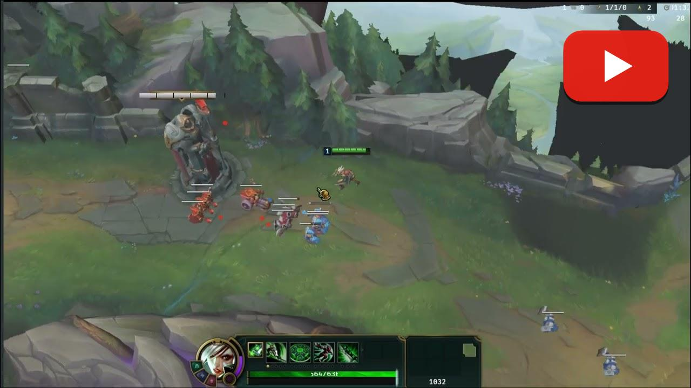

# moon-lol

`moon-lol` is a League of Legends remake project developed using the Bevy engine. Leveraging the high performance of Rust and Bevy's modern ECS architecture, this project implements the parsing and loading of LoL resource files (WAD, PROP, TEX, etc.) and has initially built the combat system, skill system, and UI interface.

  
   
  

## Acknowledgements and References

This project referenced or used the following open-source projects during development. We thank these community contributors for their work:

- **CDragon**: Provides detailed resource data references.
- **LeagueToolkit**: Resource parsing and processing tools.
- **LoL-NGRID-converter**: Technical implementation related to navigation grid conversion.

## Copyright Notice

**Please be sure to read the following statement:**

1. This project is for technical research and learning purposes only. The repository **does not contain** any native art assets from League of Legends.
2. The copyright for all related art assets and configuration structure code belongs to **Riot Games**.
3. Riot Games reserves the right to request the closure or termination of this project at any time.
