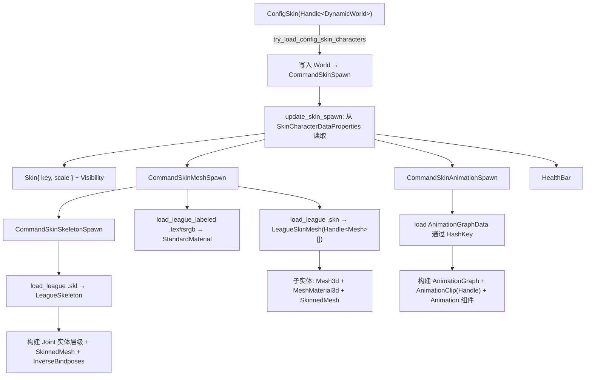
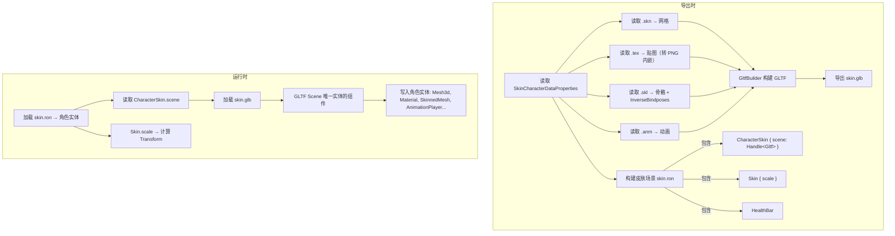

# 重构皮肤渲染：从运行时加载到 GLTF 导出

将 `lol_render` 中的运行时皮肤加载链路重构为导出时预构建。每个皮肤导出为一个 `.glb` 文件（包含网格、材质、贴图、骨骼、动画），皮肤场景文件中只有一个实体，运行时将该实体的所有组件写入到角色实体上。

## 当前运行时加载链路（待废弃）



## 目标架构

在导出时，直接读取 League 原始二进制文件（.skn/.skl/.tex/.anm），参考 [gltf_export.rs](file:///d:/Users/admin/workspace/moon-lol/crates/league_to_lol/src/gltf_export.rs) 中 `GltfBuilder` 的网格、材质、贴图导出实现，将所有数据转换为标准 GLTF 格式（含骨骼和动画），导出为 `.glb` 文件。每个皮肤一个 `.glb`。

皮肤场景文件中只有 **一个实体**，该实体上挂载 `CharacterSkin { scene: Handle<Gltf> }` 等组件。运行时加载后，将 GLTF Scene 中唯一一个实体的组件（Mesh、Material、SkinnedMesh 等 Bevy 原生组件）写入到角色实体上。



## 导出内容与架构

### GLTF 文件（skin.glb）

每个皮肤导出一个 `.glb`，包含以下数据（参考 `GltfBuilder` 的实现方式）：

| 数据类型          | 来源              | GLTF 中的表示                                                             |
| ----------------- | ----------------- | ------------------------------------------------------------------------- |
| 网格（Mesh）      | `.skn` 各 submesh | GLTF Mesh + Primitives，顶点/索引数据内嵌 Buffer                          |
| 材质（Material）  | 材质定义          | GLTF Material（PBR：metallic=0, roughness=1）                             |
| 贴图（Texture）   | `.tex` 文件       | GLTF Image（解码为 PNG 内嵌 Buffer），关联到 Material 的 baseColorTexture |
| 骨骼（Skeleton）  | `.skl` 文件       | GLTF Skin + Joint 节点层级 + InverseBindMatrices                          |
| 动画（Animation） | `.anm` 文件       | GLTF Animation（channel + sampler）                                       |

### 皮肤场景文件（skin.ron）

皮肤场景文件中只有**一个实体**，该实体上的组件将被写入角色实体：

| 组件                                    | 值                        | 说明                                  |
| --------------------------------------- | ------------------------- | ------------------------------------- |
| `CharacterSkin { scene: Handle<Gltf> }` | 指向 `skin.glb`           | **新组件**，GLTF 场景引用             |
| `Skin { scale }`                        | 从 `skin_scale` 读取      | 不存 Transform，运行时根据 scale 计算 |
| `HealthBar { bar_type }`                | 从 `health_bar_data` 读取 | 可选                                  |
| `Visibility`                            | 默认值                    | —                                     |

### 运行时流程

1. 加载 `skin.ron`，将组件写入角色实体（角色拥有 `CharacterSkin`、`Skin`、`HealthBar` 等）
2. 监听 `CharacterSkin` 组件 Added，加载对应的 `skin.glb`
3. GLTF 加载完成后，取 Scene 中唯一一个实体的组件（Mesh3d、MeshMaterial3d、SkinnedMesh、AnimationPlayer 等 Bevy 原生组件）
4. 将这些组件写入角色实体
5. 从 `Skin.scale` 计算 Transform 并写入角色实体

---

## 被废弃的运行时链路

| 废弃项                                                                                                                  | 原因                                  |
| ----------------------------------------------------------------------------------------------------------------------- | ------------------------------------- |
| [CommandSkinSpawn](file:///d:/Users/admin/workspace/moon-lol/crates/lol_core/src/render_cmd.rs#16-20)                   | 不再需要，数据直接从 skin.ron 获取    |
| [update_skin_spawn](file:///d:/Users/admin/workspace/moon-lol/crates/lol_render/src/skin/skin.rs#44-86)                 | 不再需要，Skin 组件直接在 skin.ron 中 |
| [on_command_skin_spawn](file:///d:/Users/admin/workspace/moon-lol/crates/lol_render/src/skin/skin.rs#27-43)             | 不再需要                              |
| [CommandSkinMeshSpawn](file:///d:/Users/admin/workspace/moon-lol/crates/lol_render/src/skin/mesh.rs#15-18)              | GLTF 已包含网格+材质+贴图+骨骼        |
| [CommandSkinAnimationSpawn](file:///d:/Users/admin/workspace/moon-lol/crates/lol_render/src/skin/animation.rs#18-21)    | GLTF 已包含动画                       |
| [CommandSkinSkeletonSpawn](file:///d:/Users/admin/workspace/moon-lol/crates/lol_render/src/skin/skeleton.rs)            | GLTF 已包含骨骼                       |
| `Loading<HashKey<SkinCharacterDataProperties>>`                                                                         | 不再需要                              |
| `Loading<HashKey<AnimationGraphData>>`                                                                                  | 不再需要                              |
| `Loading<(Handle<LeagueSkinMesh>, Handle<StandardMaterial>)>`                                                           | 不再需要                              |
| `Loading<Handle<LeagueSkeleton>>`                                                                                       | 不再需要                              |
| [LeagueLoaderMesh](file:///d:/Users/admin/workspace/moon-lol/crates/lol_render/src/loaders/mesh.rs#10-11)               | GLTF 内嵌网格                         |
| [LeagueLoaderImage](file:///d:/Users/admin/workspace/moon-lol/crates/lol_render/src/loaders/image.rs#12-13)             | GLTF 内嵌贴图                         |
| [LeagueLoaderAnimationClip](file:///d:/Users/admin/workspace/moon-lol/crates/lol_render/src/loaders/animation.rs#11-12) | GLTF 内嵌动画                         |

---

## Proposed Changes

### Component: `lol_base`（新增 CharacterSkin 组件）

#### [MODIFY] [character.rs](file:///d:/Users/admin/workspace/moon-lol/crates/lol_base/src/character.rs)

新增 `CharacterSkin` 组件：

```rust
/// 角色皮肤 GLTF 场景引用
#[derive(Component, Reflect, Debug, Clone)]
#[reflect(Component)]
pub struct CharacterSkin {
    /// 指向皮肤 .glb 文件
    pub scene: Handle<Gltf>,
}
```

---

### Export: GLTF 导出（参考 `gltf_export.rs`）

#### [NEW] 皮肤 GLTF 导出函数

参考 [gltf_export.rs](file:///d:/Users/admin/workspace/moon-lol/crates/league_to_lol/src/gltf_export.rs) 中 `GltfBuilder` 的实现，新增角色皮肤 GLTF 导出：

1. **网格导出**：从 `.skn` 读取顶点（Position/Normal/UV/BoneWeights/BoneIndices）和索引，构建 GLTF Mesh + Primitives
2. **材质导出**：创建 PBR Material（metallic=0, roughness=1），关联 baseColorTexture
3. **贴图导出**：从 `.tex` 解码为 RGBA，编码为 PNG 内嵌 GLTF Buffer（同 `GltfBuilder.load_texture_index` 实现）
4. **骨骼导出**：从 `.skl` 构建 Joint 节点层级，计算 InverseBindMatrices，创建 GLTF Skin
5. **动画导出**：从 `.anm` 读取关键帧，创建 GLTF Animation（channel 关联到 Joint 节点）

---

### Component: `lol_render/skin`（简化运行时）

#### [MODIFY] [skin.rs](file:///d:/Users/admin/workspace/moon-lol/crates/lol_render/src/skin/skin.rs)

- 保留 `Skin` 组件（移除 `key` 字段，只保留 `scale`）
- 废弃 `on_command_skin_spawn` 和 `update_skin_spawn`
- 新增监听 `CharacterSkin` Added 的 system，加载 GLTF 并将 Scene 实体组件写入角色实体

```diff
 #[derive(Component, Debug, Clone, Copy)]
 pub struct Skin {
-    pub key: HashKey<SkinCharacterDataProperties>,
     pub scale: f32,
 }
```

#### [DELETE/SIMPLIFY] mesh.rs / skeleton.rs / animation.rs

这些模块的运行时加载逻辑大部分可以废弃，因为 GLTF 加载后 Bevy 会自动处理 Mesh、Material、SkinnedMesh、AnimationPlayer 等组件。

---

### Export: 皮肤场景文件

#### [MODIFY] [extract_map_data.rs](file:///d:/Users/admin/workspace/moon-lol/examples/extract_map_data.rs)

新增 `export_skin` 函数：

1. 读取 `SkinCharacterDataProperties`
2. 调用皮肤 GLTF 导出，生成 `assets/characters/{name}/skin.glb`
3. 构建皮肤场景 World，spawn 单一实体：
   - `CharacterSkin { scene: "characters/{name}/skin.glb" }`
   - `Skin { scale }`
   - `HealthBar { bar_type }`（如有）
   - `Visibility::default()`
4. 序列化为 `assets/characters/{name}/skin.ron`

---

## Verification Plan

### Automated Tests

```bash
cargo check -p lol_base
cargo check -p lol_render
cargo check -p league_to_lol
cargo check --example extract_map_data
```

### Manual Verification

1. 运行导出工具，生成 `skin.glb`，用 glTF 查看器（如 https://gltf-viewer.donmccurdy.com/）验证模型、材质、骨骼、动画正确
2. 运行游戏主程序，验证角色渲染正常
