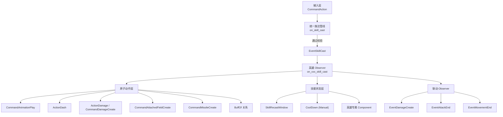
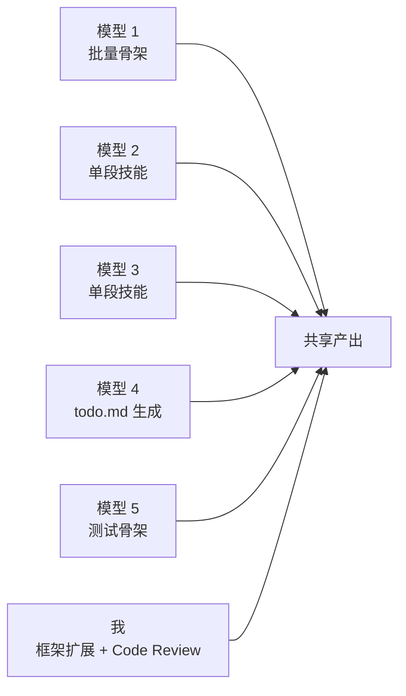

# 英雄技能实现路径与框架

## 背景

当前项目已完成 **纯代码驱动的 ECS + Observer** 技能架构，以 Riven 为标杆实现了完整的分段技能、被动联动、自增益/护盾/位移/控制等机制。`lol_champions` crate 下 **118 个英雄目录**已注册为模块和 Plugin，但大多数仅有骨架 `on_xxx_skill_cast` observer + 基础 `ActionDamage` 调用，尚未实现百科所描述的核心机制。

本文档从 Riven 代码出发，归纳现有实现模式，结合 `docs/champions/*/wiki.md` 中的机制复杂度，为后续英雄技能开发提供 **分层分类的实现路径和可复用框架**。

---

## 一、现有架构层次总览



### 关键分层

| 层                | 职责                                                | 所在 crate                                 |
| ----------------- | --------------------------------------------------- | ------------------------------------------ |
| **统一管线**      | 校验（等级/蓝量/CD/阻塞）→ 派发 `EventSkillCast`    | `lol_core::skill::observers`               |
| **英雄 Observer** | 按 `SkillSlot` 分发 → 调用原子动作 → 管理技能状态   | `lol_champions::<hero>`                    |
| **原子动作**      | 动画、位移、伤害、飞弹、伤害场、Buff 等可复用构建块 | `lol_core::action::*`, `lol_core::missile` |
| **联动 Observer** | 伤害命中回调、攻击结束回调、位移结束回调等          | `lol_champions::<hero>`                    |
| **Buff/状态系统** | 计时 buff、护盾、减速、眩晕、出血等通用 debuff      | `lol_core::buffs::*`                       |
| **测试 Harness**  | `ChampionTestHarness` 支持 Headless/Render 两种模式 | `lol_champions::test_utils`                |

---

## 二、从 Riven 提炼的实现模式

### 模式 A：分段技能（三段 Q）

**核心组件**：`SkillRecastWindow` + `SkillCooldownMode::Manual`

```
Q1 → insert RecastWindow(stage=2, max=3, 4s)
Q2 → insert RecastWindow(stage=3, max=3, 4s)
Q3 → remove RecastWindow + 手动启动 CoolDown
```

**Riven Q 的额外机制**：

- 每段生成 `CommandAttachedFieldCreate`（附着伤害场）
- Q3 标记 `RivenQ3Pending` → 位移结束 `EventMovementEnd` 触发击退
- 每段添加 `BuffRivenPassive`（被动充能）

**可复用于**：剑魔 Q、李青 Q/W/E、阿狸 R、鳄鱼 E

---

### 模式 B：二段技能（李青 Q/W/E）

与分段技能类似，但 **只有 2 段**，且两段行为完全不同：

```
Stage 1 → 发射/冲刺/AOE + insert RecastWindow(stage=2, max=2, 3s)
Stage 2 → 追击/增益/减速 + remove RecastWindow + 手动启动 CoolDown
```

**已有实现**：Lee Sin `cast_leesin_q/w/e` 完整展示了此模式。

---

### 模式 C：自增益 + 重施（R）

**核心流程**：

```
R1 → 增益(+AD, +Range) + 创建 buff 实体(BuffRivenR) + insert RecastWindow(stage=2)
R2 → 释放 Wind Slash(导弹) + remove RecastWindow + 手动启动 CoolDown
```

**Riven R 的特殊点**：

- R1 直接修改 `Damage` 和 `Attack` 组件（增伤 + 加攻击距离）
- Buff 到期系统 `update_riven_buffs` 负责回退属性
- R2 使用 `CommandMissileCreate` 发射 3 枚扇形导弹

---

### 模式 D：被动联动（Passive）

**Riven 被动**：

- 技能施放时 `with_related::<BuffOf>(BuffRivenPassive)` 添加被动层
- `EventAttackEnd` observer 消耗一层 → `CommandDamageCreate` 额外伤害 → `despawn` buff 实体

**Fiora 被动（更复杂）**：

- `FixedUpdate` 系统持续扫描敌方英雄，添加/移除 `Vital` 组件
- `EventDamageCreate` observer 检测攻击方向 → 触发要害伤害
- 依赖 `Direction`、`PassiveSkillOf` 等组件

---

### 模式 E：单段技能 + 伤害事件联动

**Garen/Darius** 模式：

- Observer 直接调用 `ActionDamage` 或 `CommandAttachedFieldCreate`
- 额外效果通过 `EventDamageCreate` observer 实现（如 Darius 叠出血 + 减速）

---

## 三、技能机制分类与实现路径

根据 `docs/champions/*/wiki.md` 百科文档，所有英雄技能可归为以下 **6 大类**：

### 第 1 类：纯单段技能（最简单）

> 一个 observer → 一个原子动作 → 结束

| 原子                                   | 典型代表               |
| -------------------------------------- | ---------------------- |
| `ActionDamage` (Circle/Sector/Nearest) | Garen E/R, Annie Q/W   |
| `ActionDash` + `DashDamage`            | Lucian E               |
| `CommandMissileCreate`                 | Ezreal Q, Ashe W       |
| `CommandAttachedFieldCreate`           | Brand W                |
| `BuffOf` 自增益                        | Garen Q (移速), Olaf R |

**实现成本**：低，10-30 行 observer 代码。

---

### 第 2 类：分段/重施技能

> `SkillRecastWindow` + `Manual` 冷却

| 子类     | 代表                     | stage 数 |
| -------- | ------------------------ | -------- |
| 三段技能 | Riven Q, Aatrox Q        | 3        |
| 二段技能 | Lee Sin Q/W/E, Camille E | 2        |
| 多段冲刺 | Ahri R                   | 3        |

**实现框架**：

```rust
fn cast_xxx_q(commands, entity, skill_entity, recast) {
    let stage = recast.map(|w| w.stage).unwrap_or(1);
    match stage {
        1 => { /* 第一段 */ insert RecastWindow(2, max, duration) }
        2 => { /* 第二段 */ insert RecastWindow(3, max, duration) }
        _ => { /* 终段 */ remove RecastWindow + 手动冷却 }
    }
}
```

**实现成本**：中，50-100 行。

---

### 第 3 类：伤害命中联动

> `EventDamageCreate` / `EventAttackEnd` observer 触发额外效果

| 效果        | 代表              | 实现方式                                   |
| ----------- | ----------------- | ------------------------------------------ |
| 叠层 debuff | Darius 出血       | `on_darius_damage_hit` → `BuffDariusBleed` |
| 命中减速    | Lee Sin E2        | `LeeSinActiveAbility` 标记 → observer 判断 |
| 命中回血    | Aatrox E 被动     | 监听伤害事件 → 回复 HP                     |
| 命中刷新    | Irelia Q 击杀重置 | 监听击杀事件 → 重置冷却                    |
| 被动充能    | Riven Passive     | 技能施放 → 添加 buff → 攻击消耗            |

**实现框架**：

```rust
fn on_xxx_damage_hit(
    trigger: On<EventDamageCreate>,
    commands: Commands,
    q_xxx: Query<(标记组件)>,
) {
    // 验证 source 是否为当前英雄
    // 根据 ActiveAbility 标记决定附加效果
    // 叠 buff / 减速 / 回血 / 刷新冷却
}
```

---

### 第 4 类：自增益/形态切换

> 英雄实体上挂形态状态 + 技能行为根据形态分支

| 子类     | 代表                 | 实现方式                          |
| -------- | -------------------- | --------------------------------- |
| 限时增益 | Riven R, Renekton R  | `BuffOf` 关系 + 计时系统          |
| 永久形态 | Kayn 暗影/暗裔       | 英雄实体上的 `KaynForm` Component |
| 变身     | Gnar, Nidalee, Jayce | 根据形态 Component 替换技能行为   |
| 强化态   | Pantheon 被动        | 叠层组件 → 满层强化下一技能       |

**实现框架**：

```rust
// 形态标记
#[derive(Component)]
enum XxxForm { Normal, Empowered }

// observer 中分支
match (skill.slot, form) {
    (SkillSlot::Q, XxxForm::Normal) => { /* 普通 Q */ }
    (SkillSlot::Q, XxxForm::Empowered) => { /* 强化 Q */ }
}
```

**实现成本**：中高，需要额外的 `FixedUpdate` 系统管理形态计时/切换。

---

### 第 5 类：标记/印记系统

> 目标身上挂标记组件 + 后续技能/攻击根据标记触发效果

| 代表        | 标记组件                      | 触发条件              |
| ----------- | ----------------------------- | --------------------- |
| Fiora Vital | `Vital { direction }`         | 从正确方向攻击        |
| Darius 血怒 | `BuffDariusBleed { stacks }`  | 5 层触发额外效果      |
| Volibear W  | 标记 `VoliWMark`              | 二次 W 命中已标记目标 |
| Braum 被动  | `BraumPassiveMark { stacks }` | 4 层眩晕              |

**已有参考实现**：Fiora Passive 是最完整的标记系统样板。

---

### 第 6 类：特殊/复合机制

> 需要系统级支持才能实现的高复杂度技能

| 机制          | 代表                   | 需要的系统支持                             |
| ------------- | ---------------------- | ------------------------------------------ |
| 技能偷取      | Sylas R                | 读取目标英雄的 R 技能 Component 并临时复制 |
| 陷阱/地面效果 | Teemo R, Caitlyn W     | 持久化地面实体 + 触碰检测                  |
| 宠物/分体     | Orianna 球, Ivern 雏菊 | 独立实体 + AI 行为 + 绑定系统              |
| 召唤物        | Heimerdinger 炮台      | 带 AI 的独立攻击实体                       |
| 连接/牵绊     | Karma W, Morgana R     | 两实体间的持续检测链                       |
| 回溯          | Ekko R                 | 记录历史位置 + 瞬移回溯                    |

---

## 四、推荐实施优先级

### Phase 1：补齐已有英雄的核心机制（近期）

> [!IMPORTANT]
> 建议优先把已有骨架的英雄补齐到 **基础可玩** 状态，而非新增英雄。

| 英雄        | 当前状态    | 缺失核心机制                                    | 分类        |
| ----------- | ----------- | ----------------------------------------------- | ----------- |
| **Riven**   | ✅ 最完整   | Wind Slash per-target、被动层数上限、Q 重置普攻 | 第 2+3+4 类 |
| **Darius**  | ⚠️ 骨架     | 内/外圈伤害区分、血怒 5 层触发、Q 回血          | 第 1+5 类   |
| **Lee Sin** | ⚠️ 骨架     | Q 标记系统、W 跳眼、被动攻速                    | 第 2+3 类   |
| **Garen**   | ⚠️ 骨架     | E 旋转持续伤害、被动回血                        | 第 1+4 类   |
| **Ahri**    | ⚠️ 骨架     | Q 往返飞弹、W 火球跟踪、E 魅惑标记              | 第 1+3 类   |
| **Fiora**   | ✅ 被动完整 | Q 命中要害减 CD、R 四要害治疗                   | 第 3+5 类   |

### Phase 2：扩展原子动作层（中期）

目前缺失但高频需要的原子能力：

1. **标记系统抽象** — 通用 `Mark<T>` 组件 + 标记检测 helper
2. **持续伤害场** — Garen E 式的旋转持续伤害（当前只有瞬间场）
3. **飞弹命中回调** — `CommandMissileCreate` 的 on-hit 回调（Riven R Wind Slash per-target 需要）
4. **攻击增强** — 通用的 "下 N 次普攻增强" buff 框架（Garen Q、Darius W、Nasus Q）
5. **击退/拉扯** — 统一击退 API（当前 Riven Q3 和 Lee Sin R 各自硬编码）

### Phase 3：支撑复杂机制的系统扩展（远期）

1. **形态切换框架** — Gnar/Nidalee/Jayce 的双套技能表
2. **宠物/召唤物系统** — 独立实体 + 简易 AI
3. **技能偷取** — Sylas R 的动态技能复制
4. **地面效果/陷阱** — 持久化地面实体

---

## 五、标准英雄技能实现模板

### 目录结构

```
crates/lol_champions/src/<hero>/
├── mod.rs           # Plugin + 标记 Component + on_xxx_skill_cast observer
├── q.rs             # Q 技能具体逻辑（复杂技能拆分子文件）
├── w.rs             # W 技能
├── e.rs             # E 技能
├── r.rs             # R 技能
├── passive.rs       # 被动技能
├── buffs.rs         # 英雄专属 buff/状态 Component
├── tests.rs         # 跨技能集成测试
├── q_tests.rs       # Q 技能单元测试
└── ...
```

### mod.rs 标准骨架

```rust
pub mod buffs;
// 按需拆分子文件
pub mod q;

#[cfg(test)]
mod tests;
#[cfg(test)]
mod q_tests;

use bevy::prelude::*;
use lol_core::entities::champion::Champion;
use lol_core::skill::{EventSkillCast, Skill, SkillSlot, CoolDown, SkillRecastWindow};

#[derive(Default)]
pub struct PluginXxx;

impl Plugin for PluginXxx {
    fn build(&self, app: &mut App) {
        app.add_observer(on_xxx_skill_cast);
        // 联动 observer
        // FixedUpdate 系统（buff 计时等）
    }
}

#[derive(Component, Reflect)]
#[require(Champion, Name = Name::new("Xxx"))]
#[reflect(Component)]
pub struct Xxx;

fn on_xxx_skill_cast(
    trigger: On<EventSkillCast>,
    mut commands: Commands,
    q_xxx: Query<(), With<Xxx>>,
    q_skill: Query<(&Skill, &CoolDown, Option<&SkillRecastWindow>)>,
) {
    let entity = trigger.event_target();
    if q_xxx.get(entity).is_err() { return; }

    let Ok((skill, cooldown, recast)) = q_skill.get(trigger.skill_entity) else { return; };

    match skill.slot {
        SkillSlot::Q => { /* ... */ }
        SkillSlot::W => { /* ... */ }
        SkillSlot::E => { /* ... */ }
        SkillSlot::R => { /* ... */ }
        _ => {}
    }
}
```

### 测试标准骨架

```rust
#![cfg(test)]
use crate::test_utils::*;

pub fn xxx_config() -> ChampionHarnessConfig {
    ChampionHarnessConfig {
        champion_dir: "xxx",
        config_path: "characters/Xxx/config.ron",
        skin_path: "characters/Xxx/skins/skin0.ron",
        add_champion_plugin: |app| { app.add_plugins(crate::xxx::PluginXxx); },
    }
}

pub fn build_headless(name: &str) -> ChampionTestHarness {
    ChampionTestHarness::build::<crate::xxx::Xxx>(name, HarnessMode::Headless, &xxx_config())
}

#[test]
fn xxx_q_deals_damage() {
    let mut h = build_headless("xxx_q");
    let enemy = h.add_enemy(Vec3::new(200.0, 0.0, 0.0));
    let hp_before = h.health(enemy);
    h.cast_skill(0, Vec2::new(200.0, 0.0)).advance(0.5);
    assert!(h.health(enemy) < hp_before, "Q 应造成伤害");
    h.finish();
}
```

---

## 六、建议下一步具体行动

> [!TIP]
> 每个英雄的 `docs/champions/<hero>/todo.md` 应作为实现进度追踪文件，按优先级列出待办项。当前只有 Riven 和 Darius 有 todo.md。

### 短期（1-2 周）

1. **补齐 Riven 剩余中优先级项**：被动层数上限 3 层、Q 重置普攻、技能升级影响冷却
2. **完善 Darius**：内外圈伤害区分（需要 `effect_tag` 扩展）、血怒 5 层触发、外圈回血
3. **完善 Lee Sin**：Q 标记系统（命中才能 Q2）、被动攻速 buff

### 中期（2-4 周）

4. **提取通用框架**：
   - `Mark<T>` 标记系统
   - `EmpoweredAttack` 增强普攻 buff
   - `Knockback` 统一击退 API
5. **实现 2-3 个新英雄到完整状态**：建议选不同类型以验证框架通用性
   - 单段为主：**Garen**（验证持续 AOE + 被动回血）
   - 标记系统：**Volibear**（验证 W 标记 + 被动叠层）
   - 飞弹为主：**Ezreal**（验证纯飞弹技能 + Q 命中减 CD）

### 远期（1-2 月）

6. **形态切换框架**：以 Nidalee 或 Jayce 为原型
7. **完善飞弹系统**：on-hit 回调、per-target 伤害计算
8. **为所有已有英雄补充 todo.md**：对照百科文档梳理待实现项

---

## Open Questions

> [!IMPORTANT]
> **伤害事件标签**：Darius 内外圈需要区分伤害来源，当前 `EventDamageCreate` 没有 `effect_tag` 字段。是否应在 `EventDamageCreate` 中添加可选的 `tag: Option<u32>` 来标记伤害来源类型？

> [!IMPORTANT]
> **飞弹 on-hit 回调**：Riven Wind Slash 的 per-target 伤害和很多英雄技能需要飞弹命中时的回调。当前 `CommandMissileCreate` 无此能力。是否应该优先扩展飞弹系统以支持 `on_hit` 回调或 `damage_formula` 闭包？

> [!IMPORTANT]
> **todo.md 管理策略**：当前只有 Riven 和 Darius 有 `todo.md`。是否需要为所有 118 个英雄批量生成 `todo.md`？还是按需在实现时创建？

# 小模型任务分配

Viewed App.vue:39-84
Edited App.vue

好问题。基于对项目架构的了解，这套 ECS + Observer 的英雄技能系统 **天然适合并行开发** —— 每个英雄是独立 Plugin，互不依赖。关键是怎么给"笨模型"划边界。

---

## 核心策略：按能力分层 + 按模板约束

小模型最大的问题是 **遇到歧义会瞎编**。所以任务必须满足：

1. **输入输出完全确定** — 不需要设计决策
2. **有可直接复制的参考实现** — 降低创造性要求
3. **有可自动验证的检查点** — `cargo check` 就能判对错

---

## 5 个小模型的分工



### 模型 1 & 2 & 3：英雄技能实现（主力产出）

把英雄按难度分成 3 档，只让小模型做 **第 1 档（纯单段技能）**：

| 模型       | 分配的英雄                                 | 每个英雄的任务                      |
| ---------- | ------------------------------------------ | ----------------------------------- |
| **模型 1** | 20 个最简单的英雄（Annie, Brand, Lux...）  | 补齐 Q/W/E/R 的 `ActionDamage` 调用 |
| **模型 2** | 20 个带位移的英雄（Lucian, Tristana...）   | 补齐 `ActionDash` + `ActionDamage`  |
| **模型 3** | 15 个带 buff 的英雄（Olaf, Tryndamere...） | 补齐 `BuffOf` 自增益                |

**给小模型的 Prompt 模板**：

```
你是一个代码填充工具。
参考 Garen 的实现（附代码），为 {英雄名} 补齐 on_{hero}_skill_cast 中的技能逻辑。

规则：
1. 只使用以下原子动作：ActionDamage、ActionDash、CommandAnimationPlay、BuffOf
2. 从 wiki.md 读取伤害形状和范围参数
3. 不要修改 mod.rs 以外的任何文件（除非需要创建 buffs.rs）
4. 完成后运行 cargo check，确保编译通过
5. 不要写注释，不要写测试

wiki.md 内容：{wiki内容}
Garen 参考代码：{garen代码}
当前骨架代码：{当前mod.rs}
```

### 模型 4：批量生成 todo.md

```
你是一个文档对比工具。
对比 wiki.md（技能百科）和 mod.rs（当前实现），列出尚未实现的机制。

输出格式严格如下：
# {英雄名} 待办
## 高优先级
- [ ] {具体描述}
## 中优先级
- [ ] {具体描述}
## 低优先级
- [ ] {具体描述}

规则：
1. 只对比，不要编代码
2. 一个文件一个文件地处理，不要跳过
3. 已实现的标 [x]
```

这个任务 **零歧义**，小模型也能做好。一次给它 5-10 个英雄的 wiki.md + mod.rs。

### 模型 5：批量生成测试骨架

```
你是一个测试代码生成工具。
参考 Riven 的 tests.rs 和 q_tests.rs，为 {英雄名} 生成测试骨架。

规则：
1. 严格复制 riven/tests.rs 的 config/build_headless/build_render 模式
2. 只生成 "技能是否造成伤害" 这一类最基础的断言
3. 每个技能一个 #[test] 函数
4. 运行 cargo check 确保编译通过
5. 不要运行测试（cargo test），只要编译通过
```

---

## 我自己做什么

小模型做不了的 **全部我来**：

1. **框架扩展**：伤害标签、飞弹回调、通用击退 API — 这些改 `lol_core`，一改全动
2. **复杂英雄**：Riven 剩余项、Lee Sin 标记系统、Fiora R — 需要设计决策
3. **Code Review**：小模型的产出 100% 需要人审

---

## 并行安全保障

```
避免冲突的关键规则：

1. 每个小模型只碰 crates/lol_champions/src/<分配的英雄>/
2. 不碰 lib.rs（Plugin 已注册好）
3. 不碰 lol_core（框架层由我改）
4. 不碰 test_utils.rs（共享工具由我维护）
5. 每个 PR 只含一个英雄的改动
```

因为英雄模块之间 **零依赖**，5 个模型可以同时工作不会产生 merge conflict。唯一的共享文件 `lib.rs` 已经把所有 118 个模块和 Plugin 注册完了，不需要改。

---

## 产出预估

| 周期      | 模型 1-3 产出         | 模型 4-5 产出             | 我的产出                |
| --------- | --------------------- | ------------------------- | ----------------------- |
| 第 1 天   | 55 个英雄基础技能补齐 | 50+ todo.md + 30 测试骨架 | 伤害标签框架            |
| 第 2-3 天 | Review 修复 + 第二批  | 剩余 todo.md + 测试       | 飞弹回调 + 2 个复杂英雄 |
| 第 4-5 天 | 第三批较难的英雄      | —                         | 形态切换框架原型        |

核心原则就一条：**给小模型的任务必须是「填空题」，不能是「论述题」**。
